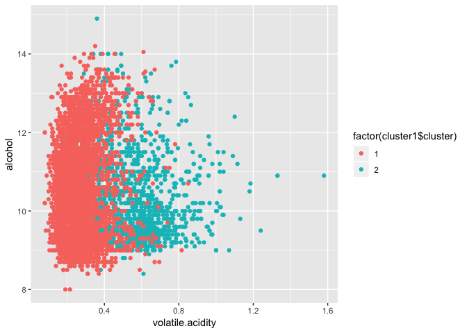
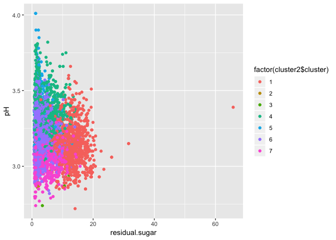

Exercise 4
================

By Hana Krijestorac, David Garrett, and Elliot Chau

# Problem 1

## Clustering and PCA of Wine

*Principal component analysis*

### Determining the color of the wine

*Principal component analysis*

We first approach this problem utilizing principal component analysis.
After scaling and center the data, we arrive at 11 componenets with the
following characteristics.

    ## Importance of components:
    ##                           PC1    PC2    PC3     PC4     PC5     PC6
    ## Standard deviation     1.7407 1.5792 1.2475 0.98517 0.84845 0.77930
    ## Proportion of Variance 0.2754 0.2267 0.1415 0.08823 0.06544 0.05521
    ## Cumulative Proportion  0.2754 0.5021 0.6436 0.73187 0.79732 0.85253
    ##                            PC7     PC8     PC9   PC10    PC11
    ## Standard deviation     0.72330 0.70817 0.58054 0.4772 0.18119
    ## Proportion of Variance 0.04756 0.04559 0.03064 0.0207 0.00298
    ## Cumulative Proportion  0.90009 0.94568 0.97632 0.9970 1.00000

To illustrate this information, we use a biplot of where each individual
wine (identified by a number) is plotted. The vectors indicate the
direction of each chemical characteristic.

<!-- -->

Since the prior plot is somewhat difficult to interpret, we will remove
the vectors and replace wine identification numbers with dots.

<!-- -->

We can see two distinct groups which may indicate differences as a
result of the wine’s color.

<!-- -->

Indeed, when applying “supervised” information to add color, the plot is
separated into two groups based on color.

To further analyze the data, we create a correlation matrix of how
chemical characteristics relate to each other. This may allow us to test
various relationships in the next part.

*k-means clustering*

We then run k-means clustering. The summary characteristics for the two
clusters is as follows:

    ##        fixed.acidity     volatile.acidity          citric.acid 
    ##           6.85167903           0.27458385           0.33524928 
    ##       residual.sugar            chlorides  free.sulfur.dioxide 
    ##           6.39402555           0.04510424          35.52152864 
    ## total.sulfur.dioxide              density                   pH 
    ##         138.45848785           0.99400486           3.18762464 
    ##            sulphates              alcohol 
    ##           0.48880511          10.52235888

    ##        fixed.acidity     volatile.acidity          citric.acid 
    ##            8.2895922            0.5319416            0.2695435 
    ##       residual.sugar            chlorides  free.sulfur.dioxide 
    ##            2.6342666            0.0883238           15.7647596 
    ## total.sulfur.dioxide              density                   pH 
    ##           48.6396835            0.9967404            3.3097200 
    ##            sulphates              alcohol 
    ##            0.6567194           10.4015216

Based on this information, we are able to see differences between the
two clusters. The second cluster has notably higher acidity levels,
lower sulfur levels, and less sugar. The following is an assortment of
plots separated by wine
color.

<!-- --><!-- --><!-- --><!-- --><!-- -->

We then determine the accuracy of k-means clustering. As we can see, it
seems to do an excellent job in clustering wines by their color.

    ##                 wine$color
    ## cluster1$cluster  red white
    ##                1   24  4830
    ##                2 1575    68

Based on the granularity of analysis available with k-means clustering,
we believe it is the technique that makes more sense. We are able to
compute accuracy with the use of supervised information, and we are also
able to break down comparisons by chemical component.

### Wine quality

We begin by taking a look at the summary statistics for the wine quality
column.

    ##    Min. 1st Qu.  Median    Mean 3rd Qu.    Max. 
    ##   3.000   5.000   6.000   5.818   6.000   9.000

As we can see, the category ranges from a low of 3 and a high of 9. This
means there are a total of 7 ratings.

*Principal component analysis*

We start with principal component analysis. The following plot shows a
general ability to create 7 somewhat distinct groups.

<!-- -->

However, when utilizing the supervised information to check our work,
the groups were not grouped by the quality score. Therefore, PCA is not
a technique that can complete this task.

<!-- -->

*k-means clustering*

We then move on to k-means clustering. Clustering by 7 score categories,
the following is a variety of
plots.

<!-- --><!-- --><!-- --><!-- -->

The visual evidence suggests that all the overlapping colors is not so
useful in clustering by score. Let’s take a look at the raw numbers.

    ##                 wine$quality
    ## cluster2$cluster   3   4   5   6   7   8   9
    ##                1   6  63 470 346  43   2   0
    ##                2   2  27 269 475 189  31   0
    ##                3   2   2  27  16   2   0   0
    ##                4   4  15 197 262 140  14   0
    ##                5   4  21  77 548 446  97   4
    ##                6   7  24 652 640 122  22   0
    ##                7   5  64 446 549 137  27   1

The table shows that each of the 7 clusters basically has a random
distribution of wines. The k-means technique is also not able to
determine wine quality. This is more than likely the result of
subjective scores assigned to each wine, with each wine snob assigning
different value to certain notes, flavors, and aromas.
