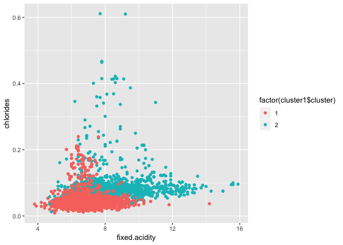
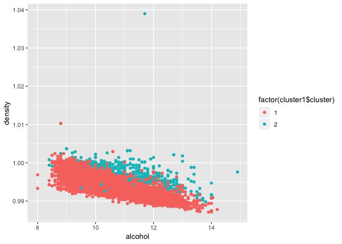
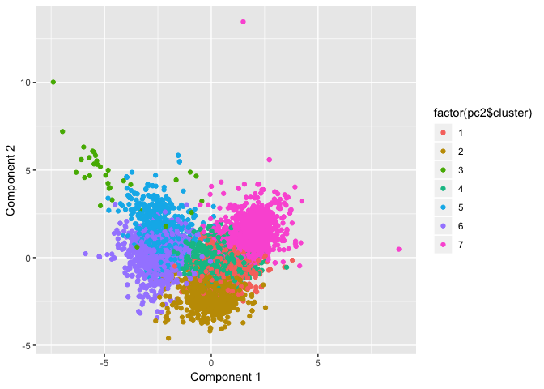
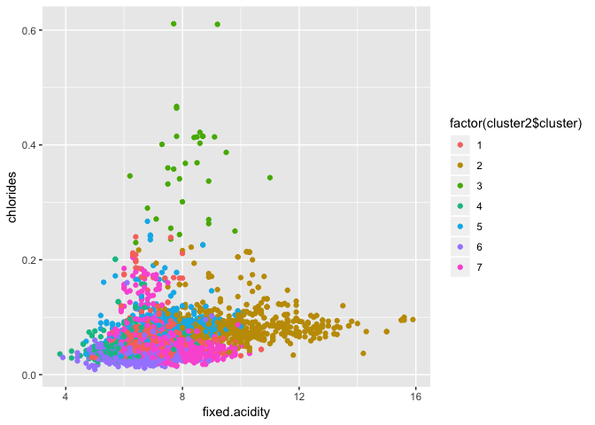

Exercise 4
================

By Hana Krijestorac, David Garrett, and Elliot Chau

# Problem 1

## Clustering and PCA of Wine

### Determining the color of the wine

*Principal component analysis*

We first approach this problem utilizing principal component analysis.
After scaling and centering the data, we arrive at 11 componenets with
the following characteristics.

    ## Importance of components:
    ##                           PC1    PC2    PC3     PC4     PC5     PC6
    ## Standard deviation     1.7407 1.5792 1.2475 0.98517 0.84845 0.77930
    ## Proportion of Variance 0.2754 0.2267 0.1415 0.08823 0.06544 0.05521
    ## Cumulative Proportion  0.2754 0.5021 0.6436 0.73187 0.79732 0.85253
    ##                            PC7     PC8     PC9   PC10    PC11
    ## Standard deviation     0.72330 0.70817 0.58054 0.4772 0.18119
    ## Proportion of Variance 0.04756 0.04559 0.03064 0.0207 0.00298
    ## Cumulative Proportion  0.90009 0.94568 0.97632 0.9970 1.00000

To illustrate this information, we use a biplot to plot each individual
wine (identified by a unique number). The vectors indicate the direction
of each chemical characteristic.

<!-- -->

Since the prior plot is somewhat difficult to interpret, we will remove
the vectors and replace wine identification numbers with dots.

<!-- -->

We can see two distinct groups which may indicate differences as a
result of the wine’s color.

<!-- -->

Indeed, when applying “supervised” information to add color, the plot is
separated into two groups based on color.

To further analyze the data, we create a correlation matrix of how
chemical characteristics relate to each other. This may allow us to test
various relationships in the next part.

*k-means clustering*

We then run k-means clustering. The summary characteristics for the two
clusters is as follows:

    ##        fixed.acidity     volatile.acidity          citric.acid 
    ##            8.2895922            0.5319416            0.2695435 
    ##       residual.sugar            chlorides  free.sulfur.dioxide 
    ##            2.6342666            0.0883238           15.7647596 
    ## total.sulfur.dioxide              density                   pH 
    ##           48.6396835            0.9967404            3.3097200 
    ##            sulphates              alcohol 
    ##            0.6567194           10.4015216

    ##        fixed.acidity     volatile.acidity          citric.acid 
    ##           6.85167903           0.27458385           0.33524928 
    ##       residual.sugar            chlorides  free.sulfur.dioxide 
    ##           6.39402555           0.04510424          35.52152864 
    ## total.sulfur.dioxide              density                   pH 
    ##         138.45848785           0.99400486           3.18762464 
    ##            sulphates              alcohol 
    ##           0.48880511          10.52235888

Based on this information, we are able to see differences between the
two clusters. The second cluster has notably higher acidity levels,
lower sulfur levels, and less sugar. The following is an assortment of
plots separated by wine
color.

<!-- --><!-- --><!-- --><!-- --><!-- -->

We then determine the accuracy of k-means clustering. As we can see, it
seems to do an excellent job in clustering wines by their color.

    ##                 wine$color
    ## cluster1$cluster  red white
    ##                1 1575    68
    ##                2   24  4830

Based on the granularity of analysis available with k-means clustering,
we believe it is the technique that makes more sense. We are able to
compute accuracy with the use of supervised information, and we are also
able to break down comparisons by chemical component.

### Wine quality

We begin by taking a look at the summary statistics for the wine quality
column.

    ##    Min. 1st Qu.  Median    Mean 3rd Qu.    Max. 
    ##   3.000   5.000   6.000   5.818   6.000   9.000

As we can see, the category ranges from a low of 3 and a high of 9. This
means there are a total of 7 ratings.

*Principal component analysis*

We start with principal component analysis. The following plot shows a
general ability to create 7 somewhat distinct groups.

<!-- -->

However, when utilizing the supervised information to check our work,
the groups were not grouped by the quality score. Therefore, PCA is not
a technique that can complete this task.

<!-- -->

*k-means clustering*

We then move on to k-means clustering. Clustering by 7 score categories,
the following is a variety of
plots.

<!-- --><!-- --><!-- --><!-- -->

The visual evidence suggests that all the overlapping colors is not so
useful in clustering by score. Let’s take a look at the raw numbers.

    ##                 wine$quality
    ## cluster2$cluster   3   4   5   6   7   8   9
    ##                1   2  29 298 503 179  30   0
    ##                2   7  61 470 347  42   2   0
    ##                3   1   2  20   9   1   0   0
    ##                4   5  64 414 536 144  30   0
    ##                5   7  24 656 647 122  21   1
    ##                6   4  15 200 266 140  14   0
    ##                7   4  21  80 528 451  96   4

The table shows that each of the 7 clusters basically has a random
distribution of wines. The k-means technique is also not able to
determine wine quality. This is more than likely the result of
subjective scores assigned to each wine, with each wine snob assigning
different value to certain notes, flavors, and aromas.

# Problem 2

## Market segmentation

In order to determine what market segments that NutrientH20 should focus
on, we began by dropping all of the users that have been marked with
spam and then dropping the spam column altogether.

Next, we found which users had more than 25% of their tweets relates to
adult content so that any potential pornography bots that the original
human annotators of the data may not have captured and deleted.

    ## # A tibble: 8 x 3
    ## # Groups:   adult [4]
    ##   X         adult percent
    ##   <fct>     <int>   <dbl>
    ## 1 qbiy4shrl    21   100  
    ## 2 8prc7gshu    16    50  
    ## 3 sbo8lrgy2    16    50  
    ## 4 28ivdunry    15    50  
    ## 5 hze4j5pc3    15    50  
    ## 6 2l5m64iro    13    33.3
    ## 7 3b7h6lpqm    13    33.3
    ## 8 x7tevn5ym    13    33.3

The following a correlation plot of how each group relates to another.

<!-- -->

Due to the multiple dimensions amongst tweets from their followers, we
used principal component analysis to reduce the dimensionality of the
data. The following is the distribution of our cleaned data.

    ## Warning: attributes are not identical across measure variables;
    ## they will be dropped

    ## Warning: Groups with fewer than two data points have been dropped.
    
    ## Warning: Groups with fewer than two data points have been dropped.
    
    ## Warning: Groups with fewer than two data points have been dropped.
    
    ## Warning: Groups with fewer than two data points have been dropped.
    
    ## Warning: Groups with fewer than two data points have been dropped.
    
    ## Warning: Groups with fewer than two data points have been dropped.
    
    ## Warning: Groups with fewer than two data points have been dropped.
    
    ## Warning: Groups with fewer than two data points have been dropped.
    
    ## Warning: Groups with fewer than two data points have been dropped.
    
    ## Warning: Groups with fewer than two data points have been dropped.
    
    ## Warning: Groups with fewer than two data points have been dropped.
    
    ## Warning: Groups with fewer than two data points have been dropped.
    
    ## Warning: Groups with fewer than two data points have been dropped.
    
    ## Warning: Groups with fewer than two data points have been dropped.
    
    ## Warning: Groups with fewer than two data points have been dropped.
    
    ## Warning: Groups with fewer than two data points have been dropped.
    
    ## Warning: Groups with fewer than two data points have been dropped.
    
    ## Warning: Groups with fewer than two data points have been dropped.
    
    ## Warning: Groups with fewer than two data points have been dropped.
    
    ## Warning: Groups with fewer than two data points have been dropped.
    
    ## Warning: Groups with fewer than two data points have been dropped.
    
    ## Warning: Groups with fewer than two data points have been dropped.
    
    ## Warning: Groups with fewer than two data points have been dropped.
    
    ## Warning: Groups with fewer than two data points have been dropped.
    
    ## Warning: Groups with fewer than two data points have been dropped.
    
    ## Warning: Groups with fewer than two data points have been dropped.
    
    ## Warning: Groups with fewer than two data points have been dropped.
    
    ## Warning: Groups with fewer than two data points have been dropped.
    
    ## Warning: Groups with fewer than two data points have been dropped.
    
    ## Warning: Groups with fewer than two data points have been dropped.
    
    ## Warning: Groups with fewer than two data points have been dropped.
    
    ## Warning: Groups with fewer than two data points have been dropped.
    
    ## Warning: Groups with fewer than two data points have been dropped.
    
    ## Warning: Groups with fewer than two data points have been dropped.
    
    ## Warning: Groups with fewer than two data points have been dropped.
    
    ## Warning: Groups with fewer than two data points have been dropped.
    
    ## Warning: Groups with fewer than two data points have been dropped.
    
    ## Warning: Groups with fewer than two data points have been dropped.
    
    ## Warning: Groups with fewer than two data points have been dropped.
    
    ## Warning: Groups with fewer than two data points have been dropped.
    
    ## Warning: Groups with fewer than two data points have been dropped.
    
    ## Warning: Groups with fewer than two data points have been dropped.
    
    ## Warning: Groups with fewer than two data points have been dropped.
    
    ## Warning: Groups with fewer than two data points have been dropped.
    
    ## Warning: Groups with fewer than two data points have been dropped.
    
    ## Warning: Groups with fewer than two data points have been dropped.
    
    ## Warning: Groups with fewer than two data points have been dropped.
    
    ## Warning: Groups with fewer than two data points have been dropped.
    
    ## Warning: Groups with fewer than two data points have been dropped.
    
    ## Warning: Groups with fewer than two data points have been dropped.
    
    ## Warning: Groups with fewer than two data points have been dropped.
    
    ## Warning: Groups with fewer than two data points have been dropped.
    
    ## Warning: Groups with fewer than two data points have been dropped.
    
    ## Warning: Groups with fewer than two data points have been dropped.
    
    ## Warning: Groups with fewer than two data points have been dropped.
    
    ## Warning: Groups with fewer than two data points have been dropped.
    
    ## Warning: Groups with fewer than two data points have been dropped.
    
    ## Warning: Groups with fewer than two data points have been dropped.
    
    ## Warning: Groups with fewer than two data points have been dropped.
    
    ## Warning: Groups with fewer than two data points have been dropped.
    
    ## Warning: Groups with fewer than two data points have been dropped.
    
    ## Warning: Groups with fewer than two data points have been dropped.
    
    ## Warning: Groups with fewer than two data points have been dropped.
    
    ## Warning: Groups with fewer than two data points have been dropped.
    
    ## Warning: Groups with fewer than two data points have been dropped.
    
    ## Warning: Groups with fewer than two data points have been dropped.
    
    ## Warning: Groups with fewer than two data points have been dropped.
    
    ## Warning: Groups with fewer than two data points have been dropped.
    
    ## Warning: Groups with fewer than two data points have been dropped.
    
    ## Warning: Groups with fewer than two data points have been dropped.
    
    ## Warning: Groups with fewer than two data points have been dropped.
    
    ## Warning: Groups with fewer than two data points have been dropped.
    
    ## Warning: Groups with fewer than two data points have been dropped.
    
    ## Warning: Groups with fewer than two data points have been dropped.
    
    ## Warning: Groups with fewer than two data points have been dropped.
    
    ## Warning: Groups with fewer than two data points have been dropped.
    
    ## Warning: Groups with fewer than two data points have been dropped.
    
    ## Warning: Groups with fewer than two data points have been dropped.
    
    ## Warning: Groups with fewer than two data points have been dropped.
    
    ## Warning: Groups with fewer than two data points have been dropped.
    
    ## Warning: Groups with fewer than two data points have been dropped.
    
    ## Warning: Groups with fewer than two data points have been dropped.
    
    ## Warning: Groups with fewer than two data points have been dropped.
    
    ## Warning: Groups with fewer than two data points have been dropped.
    
    ## Warning: Groups with fewer than two data points have been dropped.
    
    ## Warning: Groups with fewer than two data points have been dropped.
    
    ## Warning: Groups with fewer than two data points have been dropped.
    
    ## Warning: Groups with fewer than two data points have been dropped.
    
    ## Warning: Groups with fewer than two data points have been dropped.
    
    ## Warning: Groups with fewer than two data points have been dropped.
    
    ## Warning: Groups with fewer than two data points have been dropped.
    
    ## Warning: Groups with fewer than two data points have been dropped.
    
    ## Warning: Groups with fewer than two data points have been dropped.
    
    ## Warning: Groups with fewer than two data points have been dropped.
    
    ## Warning: Groups with fewer than two data points have been dropped.
    
    ## Warning: Groups with fewer than two data points have been dropped.
    
    ## Warning: Groups with fewer than two data points have been dropped.
    
    ## Warning: Groups with fewer than two data points have been dropped.
    
    ## Warning: Groups with fewer than two data points have been dropped.
    
    ## Warning: Groups with fewer than two data points have been dropped.
    
    ## Warning: Groups with fewer than two data points have been dropped.
    
    ## Warning: Groups with fewer than two data points have been dropped.
    
    ## Warning: Groups with fewer than two data points have been dropped.
    
    ## Warning: Groups with fewer than two data points have been dropped.
    
    ## Warning: Groups with fewer than two data points have been dropped.
    
    ## Warning: Groups with fewer than two data points have been dropped.
    
    ## Warning: Groups with fewer than two data points have been dropped.
    
    ## Warning: Groups with fewer than two data points have been dropped.
    
    ## Warning: Groups with fewer than two data points have been dropped.
    
    ## Warning: Groups with fewer than two data points have been dropped.
    
    ## Warning: Groups with fewer than two data points have been dropped.
    
    ## Warning: Groups with fewer than two data points have been dropped.
    
    ## Warning: Groups with fewer than two data points have been dropped.
    
    ## Warning: Groups with fewer than two data points have been dropped.
    
    ## Warning: Groups with fewer than two data points have been dropped.
    
    ## Warning: Groups with fewer than two data points have been dropped.
    
    ## Warning: Groups with fewer than two data points have been dropped.
    
    ## Warning: Groups with fewer than two data points have been dropped.
    
    ## Warning: Groups with fewer than two data points have been dropped.
    
    ## Warning: Groups with fewer than two data points have been dropped.
    
    ## Warning: Groups with fewer than two data points have been dropped.
    
    ## Warning: Groups with fewer than two data points have been dropped.
    
    ## Warning: Groups with fewer than two data points have been dropped.
    
    ## Warning: Groups with fewer than two data points have been dropped.
    
    ## Warning: Groups with fewer than two data points have been dropped.
    
    ## Warning: Groups with fewer than two data points have been dropped.
    
    ## Warning: Groups with fewer than two data points have been dropped.
    
    ## Warning: Groups with fewer than two data points have been dropped.
    
    ## Warning: Groups with fewer than two data points have been dropped.
    
    ## Warning: Groups with fewer than two data points have been dropped.
    
    ## Warning: Groups with fewer than two data points have been dropped.
    
    ## Warning: Groups with fewer than two data points have been dropped.
    
    ## Warning: Groups with fewer than two data points have been dropped.
    
    ## Warning: Groups with fewer than two data points have been dropped.
    
    ## Warning: Groups with fewer than two data points have been dropped.
    
    ## Warning: Groups with fewer than two data points have been dropped.
    
    ## Warning: Groups with fewer than two data points have been dropped.
    
    ## Warning: Groups with fewer than two data points have been dropped.
    
    ## Warning: Groups with fewer than two data points have been dropped.
    
    ## Warning: Groups with fewer than two data points have been dropped.
    
    ## Warning: Groups with fewer than two data points have been dropped.
    
    ## Warning: Groups with fewer than two data points have been dropped.
    
    ## Warning: Groups with fewer than two data points have been dropped.
    
    ## Warning: Groups with fewer than two data points have been dropped.
    
    ## Warning: Groups with fewer than two data points have been dropped.
    
    ## Warning: Groups with fewer than two data points have been dropped.
    
    ## Warning: Groups with fewer than two data points have been dropped.
    
    ## Warning: Groups with fewer than two data points have been dropped.
    
    ## Warning: Groups with fewer than two data points have been dropped.
    
    ## Warning: Groups with fewer than two data points have been dropped.
    
    ## Warning: Groups with fewer than two data points have been dropped.
    
    ## Warning: Groups with fewer than two data points have been dropped.
    
    ## Warning: Groups with fewer than two data points have been dropped.
    
    ## Warning: Groups with fewer than two data points have been dropped.
    
    ## Warning: Groups with fewer than two data points have been dropped.
    
    ## Warning: Groups with fewer than two data points have been dropped.
    
    ## Warning: Groups with fewer than two data points have been dropped.
    
    ## Warning: Groups with fewer than two data points have been dropped.
    
    ## Warning: Groups with fewer than two data points have been dropped.
    
    ## Warning: Groups with fewer than two data points have been dropped.
    
    ## Warning: Groups with fewer than two data points have been dropped.
    
    ## Warning: Groups with fewer than two data points have been dropped.
    
    ## Warning: Groups with fewer than two data points have been dropped.
    
    ## Warning: Groups with fewer than two data points have been dropped.
    
    ## Warning: Groups with fewer than two data points have been dropped.
    
    ## Warning: Groups with fewer than two data points have been dropped.
    
    ## Warning: Groups with fewer than two data points have been dropped.
    
    ## Warning: Groups with fewer than two data points have been dropped.
    
    ## Warning: Groups with fewer than two data points have been dropped.
    
    ## Warning: Groups with fewer than two data points have been dropped.
    
    ## Warning: Groups with fewer than two data points have been dropped.
    
    ## Warning: Groups with fewer than two data points have been dropped.
    
    ## Warning: Groups with fewer than two data points have been dropped.
    
    ## Warning: Groups with fewer than two data points have been dropped.
    
    ## Warning: Groups with fewer than two data points have been dropped.
    
    ## Warning: Groups with fewer than two data points have been dropped.
    
    ## Warning: Groups with fewer than two data points have been dropped.
    
    ## Warning: Groups with fewer than two data points have been dropped.
    
    ## Warning: Groups with fewer than two data points have been dropped.
    
    ## Warning: Groups with fewer than two data points have been dropped.
    
    ## Warning: Groups with fewer than two data points have been dropped.
    
    ## Warning: Groups with fewer than two data points have been dropped.
    
    ## Warning: Groups with fewer than two data points have been dropped.
    
    ## Warning: Groups with fewer than two data points have been dropped.
    
    ## Warning: Groups with fewer than two data points have been dropped.
    
    ## Warning: Groups with fewer than two data points have been dropped.
    
    ## Warning: Groups with fewer than two data points have been dropped.
    
    ## Warning: Groups with fewer than two data points have been dropped.
    
    ## Warning: Groups with fewer than two data points have been dropped.
    
    ## Warning: Groups with fewer than two data points have been dropped.
    
    ## Warning: Groups with fewer than two data points have been dropped.
    
    ## Warning: Groups with fewer than two data points have been dropped.
    
    ## Warning: Groups with fewer than two data points have been dropped.
    
    ## Warning: Groups with fewer than two data points have been dropped.
    
    ## Warning: Groups with fewer than two data points have been dropped.
    
    ## Warning: Groups with fewer than two data points have been dropped.
    
    ## Warning: Groups with fewer than two data points have been dropped.
    
    ## Warning: Groups with fewer than two data points have been dropped.
    
    ## Warning: Groups with fewer than two data points have been dropped.
    
    ## Warning: Groups with fewer than two data points have been dropped.
    
    ## Warning: Groups with fewer than two data points have been dropped.
    
    ## Warning: Groups with fewer than two data points have been dropped.
    
    ## Warning: Groups with fewer than two data points have been dropped.
    
    ## Warning: Groups with fewer than two data points have been dropped.
    
    ## Warning: Groups with fewer than two data points have been dropped.
    
    ## Warning: Groups with fewer than two data points have been dropped.
    
    ## Warning: Groups with fewer than two data points have been dropped.
    
    ## Warning: Groups with fewer than two data points have been dropped.
    
    ## Warning: Groups with fewer than two data points have been dropped.
    
    ## Warning: Groups with fewer than two data points have been dropped.
    
    ## Warning: Groups with fewer than two data points have been dropped.
    
    ## Warning: Groups with fewer than two data points have been dropped.
    
    ## Warning: Groups with fewer than two data points have been dropped.
    
    ## Warning: Groups with fewer than two data points have been dropped.
    
    ## Warning: Groups with fewer than two data points have been dropped.
    
    ## Warning: Groups with fewer than two data points have been dropped.
    
    ## Warning: Groups with fewer than two data points have been dropped.
    
    ## Warning: Groups with fewer than two data points have been dropped.
    
    ## Warning: Groups with fewer than two data points have been dropped.
    
    ## Warning: Groups with fewer than two data points have been dropped.
    
    ## Warning: Groups with fewer than two data points have been dropped.
    
    ## Warning: Groups with fewer than two data points have been dropped.
    
    ## Warning: Groups with fewer than two data points have been dropped.
    
    ## Warning: Groups with fewer than two data points have been dropped.
    
    ## Warning: Groups with fewer than two data points have been dropped.
    
    ## Warning: Groups with fewer than two data points have been dropped.
    
    ## Warning: Groups with fewer than two data points have been dropped.
    
    ## Warning: Groups with fewer than two data points have been dropped.
    
    ## Warning: Groups with fewer than two data points have been dropped.
    
    ## Warning: Groups with fewer than two data points have been dropped.
    
    ## Warning: Groups with fewer than two data points have been dropped.
    
    ## Warning: Groups with fewer than two data points have been dropped.
    
    ## Warning: Groups with fewer than two data points have been dropped.
    
    ## Warning: Groups with fewer than two data points have been dropped.
    
    ## Warning: Groups with fewer than two data points have been dropped.
    
    ## Warning: Groups with fewer than two data points have been dropped.
    
    ## Warning: Groups with fewer than two data points have been dropped.
    
    ## Warning: Groups with fewer than two data points have been dropped.
    
    ## Warning: Groups with fewer than two data points have been dropped.
    
    ## Warning: Groups with fewer than two data points have been dropped.
    
    ## Warning: Groups with fewer than two data points have been dropped.
    
    ## Warning: Groups with fewer than two data points have been dropped.
    
    ## Warning: Groups with fewer than two data points have been dropped.
    
    ## Warning: Groups with fewer than two data points have been dropped.
    
    ## Warning: Groups with fewer than two data points have been dropped.
    
    ## Warning: Groups with fewer than two data points have been dropped.
    
    ## Warning: Groups with fewer than two data points have been dropped.
    
    ## Warning: Groups with fewer than two data points have been dropped.
    
    ## Warning: Groups with fewer than two data points have been dropped.
    
    ## Warning: Groups with fewer than two data points have been dropped.
    
    ## Warning: Groups with fewer than two data points have been dropped.
    
    ## Warning: Groups with fewer than two data points have been dropped.
    
    ## Warning: Groups with fewer than two data points have been dropped.
    
    ## Warning: Groups with fewer than two data points have been dropped.
    
    ## Warning: Groups with fewer than two data points have been dropped.
    
    ## Warning: Groups with fewer than two data points have been dropped.
    
    ## Warning: Groups with fewer than two data points have been dropped.
    
    ## Warning: Groups with fewer than two data points have been dropped.
    
    ## Warning: Groups with fewer than two data points have been dropped.
    
    ## Warning: Groups with fewer than two data points have been dropped.
    
    ## Warning: Groups with fewer than two data points have been dropped.
    
    ## Warning: Groups with fewer than two data points have been dropped.
    
    ## Warning: Groups with fewer than two data points have been dropped.
    
    ## Warning: Groups with fewer than two data points have been dropped.
    
    ## Warning: Groups with fewer than two data points have been dropped.
    
    ## Warning: Groups with fewer than two data points have been dropped.
    
    ## Warning: Groups with fewer than two data points have been dropped.
    
    ## Warning: Groups with fewer than two data points have been dropped.
    
    ## Warning: Groups with fewer than two data points have been dropped.
    
    ## Warning: Groups with fewer than two data points have been dropped.
    
    ## Warning: Groups with fewer than two data points have been dropped.
    
    ## Warning: Groups with fewer than two data points have been dropped.
    
    ## Warning: Groups with fewer than two data points have been dropped.
    
    ## Warning: Groups with fewer than two data points have been dropped.
    
    ## Warning: Groups with fewer than two data points have been dropped.
    
    ## Warning: Groups with fewer than two data points have been dropped.
    
    ## Warning: Groups with fewer than two data points have been dropped.
    
    ## Warning: Groups with fewer than two data points have been dropped.
    
    ## Warning: Groups with fewer than two data points have been dropped.
    
    ## Warning: Groups with fewer than two data points have been dropped.
    
    ## Warning: Groups with fewer than two data points have been dropped.
    
    ## Warning: Groups with fewer than two data points have been dropped.
    
    ## Warning: Groups with fewer than two data points have been dropped.
    
    ## Warning: Groups with fewer than two data points have been dropped.
    
    ## Warning: Groups with fewer than two data points have been dropped.
    
    ## Warning: Groups with fewer than two data points have been dropped.
    
    ## Warning: Groups with fewer than two data points have been dropped.
    
    ## Warning: Groups with fewer than two data points have been dropped.
    
    ## Warning: Groups with fewer than two data points have been dropped.
    
    ## Warning: Groups with fewer than two data points have been dropped.
    
    ## Warning: Groups with fewer than two data points have been dropped.
    
    ## Warning: Groups with fewer than two data points have been dropped.
    
    ## Warning: Groups with fewer than two data points have been dropped.
    
    ## Warning: Groups with fewer than two data points have been dropped.
    
    ## Warning: Groups with fewer than two data points have been dropped.
    
    ## Warning: Groups with fewer than two data points have been dropped.
    
    ## Warning: Groups with fewer than two data points have been dropped.
    
    ## Warning: Groups with fewer than two data points have been dropped.
    
    ## Warning: Groups with fewer than two data points have been dropped.
    
    ## Warning: Groups with fewer than two data points have been dropped.
    
    ## Warning: Groups with fewer than two data points have been dropped.
    
    ## Warning: Groups with fewer than two data points have been dropped.
    
    ## Warning: Groups with fewer than two data points have been dropped.
    
    ## Warning: Groups with fewer than two data points have been dropped.
    
    ## Warning: Groups with fewer than two data points have been dropped.
    
    ## Warning: Groups with fewer than two data points have been dropped.
    
    ## Warning: Groups with fewer than two data points have been dropped.
    
    ## Warning: Groups with fewer than two data points have been dropped.
    
    ## Warning: Groups with fewer than two data points have been dropped.
    
    ## Warning: Groups with fewer than two data points have been dropped.
    
    ## Warning: Groups with fewer than two data points have been dropped.
    
    ## Warning: Groups with fewer than two data points have been dropped.
    
    ## Warning: Groups with fewer than two data points have been dropped.
    
    ## Warning: Groups with fewer than two data points have been dropped.
    
    ## Warning: Groups with fewer than two data points have been dropped.
    
    ## Warning: Groups with fewer than two data points have been dropped.
    
    ## Warning: Groups with fewer than two data points have been dropped.
    
    ## Warning: Groups with fewer than two data points have been dropped.
    
    ## Warning: Groups with fewer than two data points have been dropped.
    
    ## Warning: Groups with fewer than two data points have been dropped.
    
    ## Warning: Groups with fewer than two data points have been dropped.
    
    ## Warning: Groups with fewer than two data points have been dropped.
    
    ## Warning: Groups with fewer than two data points have been dropped.
    
    ## Warning: Groups with fewer than two data points have been dropped.
    
    ## Warning: Groups with fewer than two data points have been dropped.
    
    ## Warning: Groups with fewer than two data points have been dropped.
    
    ## Warning: Groups with fewer than two data points have been dropped.
    
    ## Warning: Groups with fewer than two data points have been dropped.
    
    ## Warning: Groups with fewer than two data points have been dropped.
    
    ## Warning: Groups with fewer than two data points have been dropped.
    
    ## Warning: Groups with fewer than two data points have been dropped.
    
    ## Warning: Groups with fewer than two data points have been dropped.
    
    ## Warning: Groups with fewer than two data points have been dropped.
    
    ## Warning: Groups with fewer than two data points have been dropped.
    
    ## Warning: Groups with fewer than two data points have been dropped.
    
    ## Warning: Groups with fewer than two data points have been dropped.
    
    ## Warning: Groups with fewer than two data points have been dropped.
    
    ## Warning: Groups with fewer than two data points have been dropped.
    
    ## Warning: Groups with fewer than two data points have been dropped.
    
    ## Warning: Groups with fewer than two data points have been dropped.
    
    ## Warning: Groups with fewer than two data points have been dropped.
    
    ## Warning: Groups with fewer than two data points have been dropped.
    
    ## Warning: Groups with fewer than two data points have been dropped.
    
    ## Warning: Groups with fewer than two data points have been dropped.
    
    ## Warning: Groups with fewer than two data points have been dropped.
    
    ## Warning: Groups with fewer than two data points have been dropped.
    
    ## Warning: Groups with fewer than two data points have been dropped.
    
    ## Warning: Groups with fewer than two data points have been dropped.
    
    ## Warning: Groups with fewer than two data points have been dropped.
    
    ## Warning: Groups with fewer than two data points have been dropped.
    
    ## Warning: Groups with fewer than two data points have been dropped.
    
    ## Warning: Groups with fewer than two data points have been dropped.
    
    ## Warning: Groups with fewer than two data points have been dropped.
    
    ## Warning: Groups with fewer than two data points have been dropped.
    
    ## Warning: Groups with fewer than two data points have been dropped.
    
    ## Warning: Groups with fewer than two data points have been dropped.
    
    ## Warning: Groups with fewer than two data points have been dropped.
    
    ## Warning: Groups with fewer than two data points have been dropped.
    
    ## Warning: Groups with fewer than two data points have been dropped.
    
    ## Warning: Groups with fewer than two data points have been dropped.
    
    ## Warning: Groups with fewer than two data points have been dropped.
    
    ## Warning: Groups with fewer than two data points have been dropped.
    
    ## Warning: Groups with fewer than two data points have been dropped.
    
    ## Warning: Groups with fewer than two data points have been dropped.
    
    ## Warning: Groups with fewer than two data points have been dropped.
    
    ## Warning: Groups with fewer than two data points have been dropped.
    
    ## Warning: Groups with fewer than two data points have been dropped.
    
    ## Warning: Groups with fewer than two data points have been dropped.
    
    ## Warning: Groups with fewer than two data points have been dropped.
    
    ## Warning: Groups with fewer than two data points have been dropped.
    
    ## Warning: Groups with fewer than two data points have been dropped.
    
    ## Warning: Groups with fewer than two data points have been dropped.
    
    ## Warning: Groups with fewer than two data points have been dropped.
    
    ## Warning: Groups with fewer than two data points have been dropped.
    
    ## Warning: Groups with fewer than two data points have been dropped.
    
    ## Warning: Groups with fewer than two data points have been dropped.
    
    ## Warning: Groups with fewer than two data points have been dropped.
    
    ## Warning: Groups with fewer than two data points have been dropped.
    
    ## Warning: Groups with fewer than two data points have been dropped.
    
    ## Warning: Groups with fewer than two data points have been dropped.
    
    ## Warning: Groups with fewer than two data points have been dropped.
    
    ## Warning: Groups with fewer than two data points have been dropped.
    
    ## Warning: Groups with fewer than two data points have been dropped.
    
    ## Warning: Groups with fewer than two data points have been dropped.
    
    ## Warning: Groups with fewer than two data points have been dropped.
    
    ## Warning: Groups with fewer than two data points have been dropped.
    
    ## Warning: Groups with fewer than two data points have been dropped.
    
    ## Warning: Groups with fewer than two data points have been dropped.
    
    ## Warning: Groups with fewer than two data points have been dropped.
    
    ## Warning: Groups with fewer than two data points have been dropped.
    
    ## Warning: Groups with fewer than two data points have been dropped.
    
    ## Warning: Groups with fewer than two data points have been dropped.
    
    ## Warning: Groups with fewer than two data points have been dropped.
    
    ## Warning: Groups with fewer than two data points have been dropped.
    
    ## Warning: Groups with fewer than two data points have been dropped.
    
    ## Warning: Groups with fewer than two data points have been dropped.
    
    ## Warning: Groups with fewer than two data points have been dropped.
    
    ## Warning: Groups with fewer than two data points have been dropped.
    
    ## Warning: Groups with fewer than two data points have been dropped.
    
    ## Warning: Groups with fewer than two data points have been dropped.
    
    ## Warning: Groups with fewer than two data points have been dropped.
    
    ## Warning: Groups with fewer than two data points have been dropped.
    
    ## Warning: Groups with fewer than two data points have been dropped.
    
    ## Warning: Groups with fewer than two data points have been dropped.
    
    ## Warning: Groups with fewer than two data points have been dropped.
    
    ## Warning: Groups with fewer than two data points have been dropped.
    
    ## Warning: Groups with fewer than two data points have been dropped.
    
    ## Warning: Groups with fewer than two data points have been dropped.
    
    ## Warning: Groups with fewer than two data points have been dropped.
    
    ## Warning: Groups with fewer than two data points have been dropped.
    
    ## Warning: Groups with fewer than two data points have been dropped.
    
    ## Warning: Groups with fewer than two data points have been dropped.
    
    ## Warning: Groups with fewer than two data points have been dropped.
    
    ## Warning: Groups with fewer than two data points have been dropped.
    
    ## Warning: Groups with fewer than two data points have been dropped.
    
    ## Warning: Groups with fewer than two data points have been dropped.
    
    ## Warning: Groups with fewer than two data points have been dropped.
    
    ## Warning: Groups with fewer than two data points have been dropped.
    
    ## Warning: Groups with fewer than two data points have been dropped.
    
    ## Warning: Groups with fewer than two data points have been dropped.
    
    ## Warning: Groups with fewer than two data points have been dropped.
    
    ## Warning: Groups with fewer than two data points have been dropped.
    
    ## Warning: Groups with fewer than two data points have been dropped.
    
    ## Warning: Groups with fewer than two data points have been dropped.
    
    ## Warning: Groups with fewer than two data points have been dropped.
    
    ## Warning: Groups with fewer than two data points have been dropped.
    
    ## Warning: Groups with fewer than two data points have been dropped.
    
    ## Warning: Groups with fewer than two data points have been dropped.
    
    ## Warning: Groups with fewer than two data points have been dropped.
    
    ## Warning: Groups with fewer than two data points have been dropped.
    
    ## Warning: Groups with fewer than two data points have been dropped.
    
    ## Warning: Groups with fewer than two data points have been dropped.
    
    ## Warning: Groups with fewer than two data points have been dropped.
    
    ## Warning: Groups with fewer than two data points have been dropped.
    
    ## Warning: Groups with fewer than two data points have been dropped.
    
    ## Warning: Groups with fewer than two data points have been dropped.
    
    ## Warning: Groups with fewer than two data points have been dropped.
    
    ## Warning: Groups with fewer than two data points have been dropped.
    
    ## Warning: Groups with fewer than two data points have been dropped.
    
    ## Warning: Groups with fewer than two data points have been dropped.
    
    ## Warning: Groups with fewer than two data points have been dropped.
    
    ## Warning: Groups with fewer than two data points have been dropped.
    
    ## Warning: Groups with fewer than two data points have been dropped.
    
    ## Warning: Groups with fewer than two data points have been dropped.
    
    ## Warning: Groups with fewer than two data points have been dropped.
    
    ## Warning: Groups with fewer than two data points have been dropped.
    
    ## Warning: Groups with fewer than two data points have been dropped.
    
    ## Warning: Groups with fewer than two data points have been dropped.
    
    ## Warning: Groups with fewer than two data points have been dropped.
    
    ## Warning: Groups with fewer than two data points have been dropped.
    
    ## Warning: Groups with fewer than two data points have been dropped.
    
    ## Warning: Groups with fewer than two data points have been dropped.
    
    ## Warning: Groups with fewer than two data points have been dropped.
    
    ## Warning: Groups with fewer than two data points have been dropped.
    
    ## Warning: Groups with fewer than two data points have been dropped.
    
    ## Warning: Groups with fewer than two data points have been dropped.
    
    ## Warning: Groups with fewer than two data points have been dropped.
    
    ## Warning: Groups with fewer than two data points have been dropped.
    
    ## Warning: Groups with fewer than two data points have been dropped.
    
    ## Warning: Groups with fewer than two data points have been dropped.
    
    ## Warning: Groups with fewer than two data points have been dropped.
    
    ## Warning: Groups with fewer than two data points have been dropped.
    
    ## Warning: Groups with fewer than two data points have been dropped.
    
    ## Warning: Groups with fewer than two data points have been dropped.
    
    ## Warning: Groups with fewer than two data points have been dropped.
    
    ## Warning: Groups with fewer than two data points have been dropped.
    
    ## Warning: Groups with fewer than two data points have been dropped.
    
    ## Warning: Groups with fewer than two data points have been dropped.
    
    ## Warning: Groups with fewer than two data points have been dropped.
    
    ## Warning: Groups with fewer than two data points have been dropped.
    
    ## Warning: Groups with fewer than two data points have been dropped.
    
    ## Warning: Groups with fewer than two data points have been dropped.
    
    ## Warning: Groups with fewer than two data points have been dropped.
    
    ## Warning: Groups with fewer than two data points have been dropped.
    
    ## Warning: Groups with fewer than two data points have been dropped.
    
    ## Warning: Groups with fewer than two data points have been dropped.
    
    ## Warning: Groups with fewer than two data points have been dropped.
    
    ## Warning: Groups with fewer than two data points have been dropped.
    
    ## Warning: Groups with fewer than two data points have been dropped.
    
    ## Warning: Groups with fewer than two data points have been dropped.
    
    ## Warning: Groups with fewer than two data points have been dropped.
    
    ## Warning: Groups with fewer than two data points have been dropped.
    
    ## Warning: Groups with fewer than two data points have been dropped.
    
    ## Warning: Groups with fewer than two data points have been dropped.
    
    ## Warning: Groups with fewer than two data points have been dropped.
    
    ## Warning: Groups with fewer than two data points have been dropped.
    
    ## Warning: Groups with fewer than two data points have been dropped.
    
    ## Warning: Groups with fewer than two data points have been dropped.
    
    ## Warning: Groups with fewer than two data points have been dropped.
    
    ## Warning: Groups with fewer than two data points have been dropped.
    
    ## Warning: Groups with fewer than two data points have been dropped.
    
    ## Warning: Groups with fewer than two data points have been dropped.
    
    ## Warning: Groups with fewer than two data points have been dropped.
    
    ## Warning: Groups with fewer than two data points have been dropped.
    
    ## Warning: Groups with fewer than two data points have been dropped.
    
    ## Warning: Groups with fewer than two data points have been dropped.
    
    ## Warning: Groups with fewer than two data points have been dropped.
    
    ## Warning: Groups with fewer than two data points have been dropped.
    
    ## Warning: Groups with fewer than two data points have been dropped.
    
    ## Warning: Groups with fewer than two data points have been dropped.
    
    ## Warning: Groups with fewer than two data points have been dropped.
    
    ## Warning: Groups with fewer than two data points have been dropped.
    
    ## Warning: Groups with fewer than two data points have been dropped.
    
    ## Warning: Groups with fewer than two data points have been dropped.
    
    ## Warning: Groups with fewer than two data points have been dropped.
    
    ## Warning: Groups with fewer than two data points have been dropped.
    
    ## Warning: Groups with fewer than two data points have been dropped.
    
    ## Warning: Groups with fewer than two data points have been dropped.
    
    ## Warning: Groups with fewer than two data points have been dropped.
    
    ## Warning: Groups with fewer than two data points have been dropped.
    
    ## Warning: Groups with fewer than two data points have been dropped.
    
    ## Warning: Groups with fewer than two data points have been dropped.
    
    ## Warning: Groups with fewer than two data points have been dropped.
    
    ## Warning: Groups with fewer than two data points have been dropped.
    
    ## Warning: Groups with fewer than two data points have been dropped.
    
    ## Warning: Groups with fewer than two data points have been dropped.
    
    ## Warning: Groups with fewer than two data points have been dropped.
    
    ## Warning: Groups with fewer than two data points have been dropped.
    
    ## Warning: Groups with fewer than two data points have been dropped.
    
    ## Warning: Groups with fewer than two data points have been dropped.
    
    ## Warning: Groups with fewer than two data points have been dropped.
    
    ## Warning: Groups with fewer than two data points have been dropped.
    
    ## Warning: Groups with fewer than two data points have been dropped.
    
    ## Warning: Groups with fewer than two data points have been dropped.
    
    ## Warning: Groups with fewer than two data points have been dropped.
    
    ## Warning: Groups with fewer than two data points have been dropped.
    
    ## Warning: Groups with fewer than two data points have been dropped.
    
    ## Warning: Groups with fewer than two data points have been dropped.
    
    ## Warning: Groups with fewer than two data points have been dropped.
    
    ## Warning: Groups with fewer than two data points have been dropped.
    
    ## Warning: Groups with fewer than two data points have been dropped.
    
    ## Warning: Groups with fewer than two data points have been dropped.
    
    ## Warning: Groups with fewer than two data points have been dropped.
    
    ## Warning: Groups with fewer than two data points have been dropped.
    
    ## Warning: Groups with fewer than two data points have been dropped.
    
    ## Warning: Groups with fewer than two data points have been dropped.
    
    ## Warning: Groups with fewer than two data points have been dropped.
    
    ## Warning: Groups with fewer than two data points have been dropped.
    
    ## Warning: Groups with fewer than two data points have been dropped.
    
    ## Warning: Groups with fewer than two data points have been dropped.
    
    ## Warning: Groups with fewer than two data points have been dropped.
    
    ## Warning: Groups with fewer than two data points have been dropped.
    
    ## Warning: Groups with fewer than two data points have been dropped.
    
    ## Warning: Groups with fewer than two data points have been dropped.
    
    ## Warning: Groups with fewer than two data points have been dropped.
    
    ## Warning: Groups with fewer than two data points have been dropped.
    
    ## Warning: Groups with fewer than two data points have been dropped.
    
    ## Warning: Groups with fewer than two data points have been dropped.
    
    ## Warning: Groups with fewer than two data points have been dropped.
    
    ## Warning: Groups with fewer than two data points have been dropped.
    
    ## Warning: Groups with fewer than two data points have been dropped.
    
    ## Warning: Groups with fewer than two data points have been dropped.
    
    ## Warning: Groups with fewer than two data points have been dropped.
    
    ## Warning: Groups with fewer than two data points have been dropped.
    
    ## Warning: Groups with fewer than two data points have been dropped.
    
    ## Warning: Groups with fewer than two data points have been dropped.
    
    ## Warning: Groups with fewer than two data points have been dropped.
    
    ## Warning: Groups with fewer than two data points have been dropped.
    
    ## Warning: Groups with fewer than two data points have been dropped.
    
    ## Warning: Groups with fewer than two data points have been dropped.
    
    ## Warning: Groups with fewer than two data points have been dropped.
    
    ## Warning: Groups with fewer than two data points have been dropped.
    
    ## Warning: Groups with fewer than two data points have been dropped.
    
    ## Warning: Groups with fewer than two data points have been dropped.
    
    ## Warning: Groups with fewer than two data points have been dropped.
    
    ## Warning: Groups with fewer than two data points have been dropped.
    
    ## Warning: Groups with fewer than two data points have been dropped.
    
    ## Warning: Groups with fewer than two data points have been dropped.
    
    ## Warning: Groups with fewer than two data points have been dropped.
    
    ## Warning: Groups with fewer than two data points have been dropped.
    
    ## Warning: Groups with fewer than two data points have been dropped.
    
    ## Warning: Groups with fewer than two data points have been dropped.
    
    ## Warning: Groups with fewer than two data points have been dropped.
    
    ## Warning: Groups with fewer than two data points have been dropped.
    
    ## Warning: Groups with fewer than two data points have been dropped.
    
    ## Warning: Groups with fewer than two data points have been dropped.
    
    ## Warning: Groups with fewer than two data points have been dropped.
    
    ## Warning: Groups with fewer than two data points have been dropped.
    
    ## Warning: Groups with fewer than two data points have been dropped.
    
    ## Warning: Groups with fewer than two data points have been dropped.
    
    ## Warning: Groups with fewer than two data points have been dropped.
    
    ## Warning: Groups with fewer than two data points have been dropped.
    
    ## Warning: Groups with fewer than two data points have been dropped.
    
    ## Warning: Groups with fewer than two data points have been dropped.
    
    ## Warning: Groups with fewer than two data points have been dropped.
    
    ## Warning: Groups with fewer than two data points have been dropped.
    
    ## Warning: Groups with fewer than two data points have been dropped.
    
    ## Warning: Groups with fewer than two data points have been dropped.
    
    ## Warning: Groups with fewer than two data points have been dropped.
    
    ## Warning: Groups with fewer than two data points have been dropped.
    
    ## Warning: Groups with fewer than two data points have been dropped.
    
    ## Warning: Groups with fewer than two data points have been dropped.
    
    ## Warning: Groups with fewer than two data points have been dropped.
    
    ## Warning: Groups with fewer than two data points have been dropped.
    
    ## Warning: Groups with fewer than two data points have been dropped.
    
    ## Warning: Groups with fewer than two data points have been dropped.
    
    ## Warning: Groups with fewer than two data points have been dropped.
    
    ## Warning: Groups with fewer than two data points have been dropped.
    
    ## Warning: Groups with fewer than two data points have been dropped.
    
    ## Warning: Groups with fewer than two data points have been dropped.
    
    ## Warning: Groups with fewer than two data points have been dropped.
    
    ## Warning: Groups with fewer than two data points have been dropped.
    
    ## Warning: Groups with fewer than two data points have been dropped.
    
    ## Warning: Groups with fewer than two data points have been dropped.
    
    ## Warning: Groups with fewer than two data points have been dropped.
    
    ## Warning: Groups with fewer than two data points have been dropped.
    
    ## Warning: Groups with fewer than two data points have been dropped.
    
    ## Warning: Groups with fewer than two data points have been dropped.
    
    ## Warning: Groups with fewer than two data points have been dropped.
    
    ## Warning: Groups with fewer than two data points have been dropped.
    
    ## Warning: Groups with fewer than two data points have been dropped.
    
    ## Warning: Groups with fewer than two data points have been dropped.
    
    ## Warning: Groups with fewer than two data points have been dropped.
    
    ## Warning: Groups with fewer than two data points have been dropped.
    
    ## Warning: Groups with fewer than two data points have been dropped.
    
    ## Warning: Groups with fewer than two data points have been dropped.
    
    ## Warning: Groups with fewer than two data points have been dropped.
    
    ## Warning: Groups with fewer than two data points have been dropped.
    
    ## Warning: Groups with fewer than two data points have been dropped.
    
    ## Warning: Groups with fewer than two data points have been dropped.
    
    ## Warning: Groups with fewer than two data points have been dropped.
    
    ## Warning: Groups with fewer than two data points have been dropped.
    
    ## Warning: Groups with fewer than two data points have been dropped.
    
    ## Warning: Groups with fewer than two data points have been dropped.
    
    ## Warning: Groups with fewer than two data points have been dropped.
    
    ## Warning: Groups with fewer than two data points have been dropped.
    
    ## Warning: Groups with fewer than two data points have been dropped.
    
    ## Warning: Groups with fewer than two data points have been dropped.
    
    ## Warning: Groups with fewer than two data points have been dropped.
    
    ## Warning: Groups with fewer than two data points have been dropped.
    
    ## Warning: Groups with fewer than two data points have been dropped.
    
    ## Warning: Groups with fewer than two data points have been dropped.
    
    ## Warning: Groups with fewer than two data points have been dropped.
    
    ## Warning: Groups with fewer than two data points have been dropped.
    
    ## Warning: Groups with fewer than two data points have been dropped.
    
    ## Warning: Groups with fewer than two data points have been dropped.
    
    ## Warning: Groups with fewer than two data points have been dropped.
    
    ## Warning: Groups with fewer than two data points have been dropped.
    
    ## Warning: Groups with fewer than two data points have been dropped.
    
    ## Warning: Groups with fewer than two data points have been dropped.
    
    ## Warning: Groups with fewer than two data points have been dropped.
    
    ## Warning: Groups with fewer than two data points have been dropped.
    
    ## Warning: Groups with fewer than two data points have been dropped.
    
    ## Warning: Groups with fewer than two data points have been dropped.
    
    ## Warning: Groups with fewer than two data points have been dropped.
    
    ## Warning: Groups with fewer than two data points have been dropped.
    
    ## Warning: Groups with fewer than two data points have been dropped.
    
    ## Warning: Groups with fewer than two data points have been dropped.
    
    ## Warning: Groups with fewer than two data points have been dropped.
    
    ## Warning: Groups with fewer than two data points have been dropped.
    
    ## Warning: Groups with fewer than two data points have been dropped.
    
    ## Warning: Groups with fewer than two data points have been dropped.
    
    ## Warning: Groups with fewer than two data points have been dropped.
    
    ## Warning: Groups with fewer than two data points have been dropped.
    
    ## Warning: Groups with fewer than two data points have been dropped.
    
    ## Warning: Groups with fewer than two data points have been dropped.
    
    ## Warning: Groups with fewer than two data points have been dropped.
    
    ## Warning: Groups with fewer than two data points have been dropped.
    
    ## Warning: Groups with fewer than two data points have been dropped.
    
    ## Warning: Groups with fewer than two data points have been dropped.
    
    ## Warning: Groups with fewer than two data points have been dropped.
    
    ## Warning: Groups with fewer than two data points have been dropped.
    
    ## Warning: Groups with fewer than two data points have been dropped.
    
    ## Warning: Groups with fewer than two data points have been dropped.
    
    ## Warning: Groups with fewer than two data points have been dropped.
    
    ## Warning: Groups with fewer than two data points have been dropped.
    
    ## Warning: Groups with fewer than two data points have been dropped.
    
    ## Warning: Groups with fewer than two data points have been dropped.
    
    ## Warning: Groups with fewer than two data points have been dropped.
    
    ## Warning: Groups with fewer than two data points have been dropped.
    
    ## Warning: Groups with fewer than two data points have been dropped.
    
    ## Warning: Groups with fewer than two data points have been dropped.
    
    ## Warning: Groups with fewer than two data points have been dropped.
    
    ## Warning: Groups with fewer than two data points have been dropped.
    
    ## Warning: Groups with fewer than two data points have been dropped.
    
    ## Warning: Groups with fewer than two data points have been dropped.
    
    ## Warning: Groups with fewer than two data points have been dropped.
    
    ## Warning: Groups with fewer than two data points have been dropped.
    
    ## Warning: Groups with fewer than two data points have been dropped.
    
    ## Warning: Groups with fewer than two data points have been dropped.
    
    ## Warning: Groups with fewer than two data points have been dropped.
    
    ## Warning: Groups with fewer than two data points have been dropped.
    
    ## Warning: Groups with fewer than two data points have been dropped.
    
    ## Warning: Groups with fewer than two data points have been dropped.
    
    ## Warning: Groups with fewer than two data points have been dropped.
    
    ## Warning: Groups with fewer than two data points have been dropped.
    
    ## Warning: Groups with fewer than two data points have been dropped.
    
    ## Warning: Groups with fewer than two data points have been dropped.
    
    ## Warning: Groups with fewer than two data points have been dropped.
    
    ## Warning: Groups with fewer than two data points have been dropped.
    
    ## Warning: Groups with fewer than two data points have been dropped.
    
    ## Warning: Groups with fewer than two data points have been dropped.
    
    ## Warning: Groups with fewer than two data points have been dropped.
    
    ## Warning: Groups with fewer than two data points have been dropped.
    
    ## Warning: Groups with fewer than two data points have been dropped.
    
    ## Warning: Groups with fewer than two data points have been dropped.
    
    ## Warning: Groups with fewer than two data points have been dropped.
    
    ## Warning: Groups with fewer than two data points have been dropped.
    
    ## Warning: Groups with fewer than two data points have been dropped.
    
    ## Warning: Groups with fewer than two data points have been dropped.
    
    ## Warning: Groups with fewer than two data points have been dropped.
    
    ## Warning: Groups with fewer than two data points have been dropped.
    
    ## Warning: Groups with fewer than two data points have been dropped.
    
    ## Warning: Groups with fewer than two data points have been dropped.
    
    ## Warning: Groups with fewer than two data points have been dropped.
    
    ## Warning: Groups with fewer than two data points have been dropped.
    
    ## Warning: Groups with fewer than two data points have been dropped.
    
    ## Warning: Groups with fewer than two data points have been dropped.
    
    ## Warning: Groups with fewer than two data points have been dropped.
    
    ## Warning: Groups with fewer than two data points have been dropped.
    
    ## Warning: Groups with fewer than two data points have been dropped.
    
    ## Warning: Groups with fewer than two data points have been dropped.
    
    ## Warning: Groups with fewer than two data points have been dropped.
    
    ## Warning: Groups with fewer than two data points have been dropped.
    
    ## Warning: Groups with fewer than two data points have been dropped.
    
    ## Warning: Groups with fewer than two data points have been dropped.
    
    ## Warning: Groups with fewer than two data points have been dropped.
    
    ## Warning: Groups with fewer than two data points have been dropped.
    
    ## Warning: Groups with fewer than two data points have been dropped.
    
    ## Warning: Groups with fewer than two data points have been dropped.
    
    ## Warning: Groups with fewer than two data points have been dropped.
    
    ## Warning: Groups with fewer than two data points have been dropped.
    
    ## Warning: Groups with fewer than two data points have been dropped.
    
    ## Warning: Groups with fewer than two data points have been dropped.
    
    ## Warning: Groups with fewer than two data points have been dropped.
    
    ## Warning: Groups with fewer than two data points have been dropped.
    
    ## Warning: Groups with fewer than two data points have been dropped.
    
    ## Warning: Groups with fewer than two data points have been dropped.
    
    ## Warning: Groups with fewer than two data points have been dropped.
    
    ## Warning: Groups with fewer than two data points have been dropped.
    
    ## Warning: Groups with fewer than two data points have been dropped.
    
    ## Warning: Groups with fewer than two data points have been dropped.
    
    ## Warning: Groups with fewer than two data points have been dropped.
    
    ## Warning: Groups with fewer than two data points have been dropped.
    
    ## Warning: Groups with fewer than two data points have been dropped.
    
    ## Warning: Groups with fewer than two data points have been dropped.
    
    ## Warning: Groups with fewer than two data points have been dropped.
    
    ## Warning: Groups with fewer than two data points have been dropped.
    
    ## Warning: Groups with fewer than two data points have been dropped.
    
    ## Warning: Groups with fewer than two data points have been dropped.
    
    ## Warning: Groups with fewer than two data points have been dropped.
    
    ## Warning: Groups with fewer than two data points have been dropped.
    
    ## Warning: Groups with fewer than two data points have been dropped.
    
    ## Warning: Groups with fewer than two data points have been dropped.
    
    ## Warning: Groups with fewer than two data points have been dropped.
    
    ## Warning: Groups with fewer than two data points have been dropped.
    
    ## Warning: Groups with fewer than two data points have been dropped.
    
    ## Warning: Groups with fewer than two data points have been dropped.
    
    ## Warning: Groups with fewer than two data points have been dropped.
    
    ## Warning: Groups with fewer than two data points have been dropped.
    
    ## Warning: Groups with fewer than two data points have been dropped.
    
    ## Warning: Groups with fewer than two data points have been dropped.
    
    ## Warning: Groups with fewer than two data points have been dropped.
    
    ## Warning: Groups with fewer than two data points have been dropped.
    
    ## Warning: Groups with fewer than two data points have been dropped.
    
    ## Warning: Groups with fewer than two data points have been dropped.
    
    ## Warning: Groups with fewer than two data points have been dropped.
    
    ## Warning: Groups with fewer than two data points have been dropped.
    
    ## Warning: Groups with fewer than two data points have been dropped.
    
    ## Warning: Groups with fewer than two data points have been dropped.
    
    ## Warning: Groups with fewer than two data points have been dropped.
    
    ## Warning: Groups with fewer than two data points have been dropped.
    
    ## Warning: Groups with fewer than two data points have been dropped.
    
    ## Warning: Groups with fewer than two data points have been dropped.
    
    ## Warning: Groups with fewer than two data points have been dropped.
    
    ## Warning: Groups with fewer than two data points have been dropped.
    
    ## Warning: Groups with fewer than two data points have been dropped.
    
    ## Warning: Groups with fewer than two data points have been dropped.
    
    ## Warning: Groups with fewer than two data points have been dropped.
    
    ## Warning: Groups with fewer than two data points have been dropped.
    
    ## Warning: Groups with fewer than two data points have been dropped.
    
    ## Warning: Groups with fewer than two data points have been dropped.
    
    ## Warning: Groups with fewer than two data points have been dropped.
    
    ## Warning: Groups with fewer than two data points have been dropped.
    
    ## Warning: Groups with fewer than two data points have been dropped.
    
    ## Warning: Groups with fewer than two data points have been dropped.
    
    ## Warning: Groups with fewer than two data points have been dropped.
    
    ## Warning: Groups with fewer than two data points have been dropped.
    
    ## Warning: Groups with fewer than two data points have been dropped.
    
    ## Warning: Groups with fewer than two data points have been dropped.
    
    ## Warning: Groups with fewer than two data points have been dropped.
    
    ## Warning: Groups with fewer than two data points have been dropped.
    
    ## Warning: Groups with fewer than two data points have been dropped.
    
    ## Warning: Groups with fewer than two data points have been dropped.
    
    ## Warning: Groups with fewer than two data points have been dropped.
    
    ## Warning: Groups with fewer than two data points have been dropped.
    
    ## Warning: Groups with fewer than two data points have been dropped.
    
    ## Warning: Groups with fewer than two data points have been dropped.
    
    ## Warning: Groups with fewer than two data points have been dropped.
    
    ## Warning: Groups with fewer than two data points have been dropped.
    
    ## Warning: Groups with fewer than two data points have been dropped.
    
    ## Warning: Groups with fewer than two data points have been dropped.
    
    ## Warning: Groups with fewer than two data points have been dropped.
    
    ## Warning: Groups with fewer than two data points have been dropped.
    
    ## Warning: Groups with fewer than two data points have been dropped.
    
    ## Warning: Groups with fewer than two data points have been dropped.
    
    ## Warning: Groups with fewer than two data points have been dropped.
    
    ## Warning: Groups with fewer than two data points have been dropped.
    
    ## Warning: Groups with fewer than two data points have been dropped.
    
    ## Warning: Groups with fewer than two data points have been dropped.
    
    ## Warning: Groups with fewer than two data points have been dropped.
    
    ## Warning: Groups with fewer than two data points have been dropped.
    
    ## Warning: Groups with fewer than two data points have been dropped.
    
    ## Warning: Groups with fewer than two data points have been dropped.
    
    ## Warning: Groups with fewer than two data points have been dropped.
    
    ## Warning: Groups with fewer than two data points have been dropped.
    
    ## Warning: Groups with fewer than two data points have been dropped.
    
    ## Warning: Groups with fewer than two data points have been dropped.
    
    ## Warning: Groups with fewer than two data points have been dropped.
    
    ## Warning: Groups with fewer than two data points have been dropped.
    
    ## Warning: Groups with fewer than two data points have been dropped.
    
    ## Warning: Groups with fewer than two data points have been dropped.
    
    ## Warning: Groups with fewer than two data points have been dropped.
    
    ## Warning: Groups with fewer than two data points have been dropped.
    
    ## Warning: Groups with fewer than two data points have been dropped.
    
    ## Warning: Groups with fewer than two data points have been dropped.
    
    ## Warning: Groups with fewer than two data points have been dropped.
    
    ## Warning: Groups with fewer than two data points have been dropped.
    
    ## Warning: Groups with fewer than two data points have been dropped.
    
    ## Warning: Groups with fewer than two data points have been dropped.
    
    ## Warning: Groups with fewer than two data points have been dropped.
    
    ## Warning: Groups with fewer than two data points have been dropped.
    
    ## Warning: Groups with fewer than two data points have been dropped.
    
    ## Warning: Groups with fewer than two data points have been dropped.
    
    ## Warning: Groups with fewer than two data points have been dropped.
    
    ## Warning: Groups with fewer than two data points have been dropped.
    
    ## Warning: Groups with fewer than two data points have been dropped.
    
    ## Warning: Groups with fewer than two data points have been dropped.
    
    ## Warning: Groups with fewer than two data points have been dropped.
    
    ## Warning: Groups with fewer than two data points have been dropped.
    
    ## Warning: Groups with fewer than two data points have been dropped.
    
    ## Warning: Groups with fewer than two data points have been dropped.
    
    ## Warning: Groups with fewer than two data points have been dropped.
    
    ## Warning: Groups with fewer than two data points have been dropped.
    
    ## Warning: Groups with fewer than two data points have been dropped.
    
    ## Warning: Groups with fewer than two data points have been dropped.
    
    ## Warning: Groups with fewer than two data points have been dropped.
    
    ## Warning: Groups with fewer than two data points have been dropped.
    
    ## Warning: Groups with fewer than two data points have been dropped.
    
    ## Warning: Groups with fewer than two data points have been dropped.
    
    ## Warning: Groups with fewer than two data points have been dropped.
    
    ## Warning: Groups with fewer than two data points have been dropped.
    
    ## Warning: Groups with fewer than two data points have been dropped.
    
    ## Warning: Groups with fewer than two data points have been dropped.
    
    ## Warning: Groups with fewer than two data points have been dropped.
    
    ## Warning: Groups with fewer than two data points have been dropped.
    
    ## Warning: Groups with fewer than two data points have been dropped.
    
    ## Warning: Groups with fewer than two data points have been dropped.
    
    ## Warning: Groups with fewer than two data points have been dropped.
    
    ## Warning: Groups with fewer than two data points have been dropped.
    
    ## Warning: Groups with fewer than two data points have been dropped.
    
    ## Warning: Groups with fewer than two data points have been dropped.
    
    ## Warning: Groups with fewer than two data points have been dropped.
    
    ## Warning: Groups with fewer than two data points have been dropped.
    
    ## Warning: Groups with fewer than two data points have been dropped.
    
    ## Warning: Groups with fewer than two data points have been dropped.
    
    ## Warning: Groups with fewer than two data points have been dropped.
    
    ## Warning: Groups with fewer than two data points have been dropped.
    
    ## Warning: Groups with fewer than two data points have been dropped.
    
    ## Warning: Groups with fewer than two data points have been dropped.
    
    ## Warning: Groups with fewer than two data points have been dropped.
    
    ## Warning: Groups with fewer than two data points have been dropped.
    
    ## Warning: Groups with fewer than two data points have been dropped.
    
    ## Warning: Groups with fewer than two data points have been dropped.
    
    ## Warning: Groups with fewer than two data points have been dropped.
    
    ## Warning: Groups with fewer than two data points have been dropped.
    
    ## Warning: Groups with fewer than two data points have been dropped.
    
    ## Warning: Groups with fewer than two data points have been dropped.
    
    ## Warning: Groups with fewer than two data points have been dropped.
    
    ## Warning: Groups with fewer than two data points have been dropped.
    
    ## Warning: Groups with fewer than two data points have been dropped.
    
    ## Warning: Groups with fewer than two data points have been dropped.
    
    ## Warning: Groups with fewer than two data points have been dropped.
    
    ## Warning: Groups with fewer than two data points have been dropped.
    
    ## Warning: Groups with fewer than two data points have been dropped.
    
    ## Warning: Groups with fewer than two data points have been dropped.
    
    ## Warning: Groups with fewer than two data points have been dropped.
    
    ## Warning: Groups with fewer than two data points have been dropped.
    
    ## Warning: Groups with fewer than two data points have been dropped.
    
    ## Warning: Groups with fewer than two data points have been dropped.
    
    ## Warning: Groups with fewer than two data points have been dropped.
    
    ## Warning: Groups with fewer than two data points have been dropped.
    
    ## Warning: Groups with fewer than two data points have been dropped.
    
    ## Warning: Groups with fewer than two data points have been dropped.
    
    ## Warning: Groups with fewer than two data points have been dropped.
    
    ## Warning: Groups with fewer than two data points have been dropped.
    
    ## Warning: Groups with fewer than two data points have been dropped.
    
    ## Warning: Groups with fewer than two data points have been dropped.
    
    ## Warning: Groups with fewer than two data points have been dropped.
    
    ## Warning: Groups with fewer than two data points have been dropped.
    
    ## Warning: Groups with fewer than two data points have been dropped.
    
    ## Warning: Groups with fewer than two data points have been dropped.
    
    ## Warning: Groups with fewer than two data points have been dropped.
    
    ## Warning: Groups with fewer than two data points have been dropped.
    
    ## Warning: Groups with fewer than two data points have been dropped.
    
    ## Warning: Groups with fewer than two data points have been dropped.
    
    ## Warning: Groups with fewer than two data points have been dropped.
    
    ## Warning: Groups with fewer than two data points have been dropped.
    
    ## Warning: Groups with fewer than two data points have been dropped.
    
    ## Warning: Groups with fewer than two data points have been dropped.
    
    ## Warning: Groups with fewer than two data points have been dropped.
    
    ## Warning: Groups with fewer than two data points have been dropped.
    
    ## Warning: Groups with fewer than two data points have been dropped.
    
    ## Warning: Groups with fewer than two data points have been dropped.
    
    ## Warning: Groups with fewer than two data points have been dropped.
    
    ## Warning: Groups with fewer than two data points have been dropped.
    
    ## Warning: Groups with fewer than two data points have been dropped.
    
    ## Warning: Groups with fewer than two data points have been dropped.
    
    ## Warning: Groups with fewer than two data points have been dropped.
    
    ## Warning: Groups with fewer than two data points have been dropped.
    
    ## Warning: Groups with fewer than two data points have been dropped.
    
    ## Warning: Groups with fewer than two data points have been dropped.
    
    ## Warning: Groups with fewer than two data points have been dropped.
    
    ## Warning: Groups with fewer than two data points have been dropped.
    
    ## Warning: Groups with fewer than two data points have been dropped.
    
    ## Warning: Groups with fewer than two data points have been dropped.
    
    ## Warning: Groups with fewer than two data points have been dropped.
    
    ## Warning: Groups with fewer than two data points have been dropped.
    
    ## Warning: Groups with fewer than two data points have been dropped.
    
    ## Warning: Groups with fewer than two data points have been dropped.
    
    ## Warning: Groups with fewer than two data points have been dropped.
    
    ## Warning: Groups with fewer than two data points have been dropped.
    
    ## Warning: Groups with fewer than two data points have been dropped.
    
    ## Warning: Groups with fewer than two data points have been dropped.
    
    ## Warning: Groups with fewer than two data points have been dropped.
    
    ## Warning: Groups with fewer than two data points have been dropped.
    
    ## Warning: Groups with fewer than two data points have been dropped.
    
    ## Warning: Groups with fewer than two data points have been dropped.
    
    ## Warning: Groups with fewer than two data points have been dropped.
    
    ## Warning: Groups with fewer than two data points have been dropped.
    
    ## Warning: Groups with fewer than two data points have been dropped.
    
    ## Warning: Groups with fewer than two data points have been dropped.
    
    ## Warning: Groups with fewer than two data points have been dropped.
    
    ## Warning: Groups with fewer than two data points have been dropped.
    
    ## Warning: Groups with fewer than two data points have been dropped.
    
    ## Warning: Groups with fewer than two data points have been dropped.
    
    ## Warning: Groups with fewer than two data points have been dropped.
    
    ## Warning: Groups with fewer than two data points have been dropped.
    
    ## Warning: Groups with fewer than two data points have been dropped.
    
    ## Warning: Groups with fewer than two data points have been dropped.
    
    ## Warning: Groups with fewer than two data points have been dropped.
    
    ## Warning: Groups with fewer than two data points have been dropped.
    
    ## Warning: Groups with fewer than two data points have been dropped.
    
    ## Warning: Groups with fewer than two data points have been dropped.
    
    ## Warning: Groups with fewer than two data points have been dropped.
    
    ## Warning: Groups with fewer than two data points have been dropped.
    
    ## Warning: Groups with fewer than two data points have been dropped.
    
    ## Warning: Groups with fewer than two data points have been dropped.
    
    ## Warning: Groups with fewer than two data points have been dropped.
    
    ## Warning: Groups with fewer than two data points have been dropped.
    
    ## Warning: Groups with fewer than two data points have been dropped.
    
    ## Warning: Groups with fewer than two data points have been dropped.
    
    ## Warning: Groups with fewer than two data points have been dropped.
    
    ## Warning: Groups with fewer than two data points have been dropped.
    
    ## Warning: Groups with fewer than two data points have been dropped.
    
    ## Warning: Groups with fewer than two data points have been dropped.
    
    ## Warning: Groups with fewer than two data points have been dropped.
    
    ## Warning: Groups with fewer than two data points have been dropped.
    
    ## Warning: Groups with fewer than two data points have been dropped.
    
    ## Warning: Groups with fewer than two data points have been dropped.
    
    ## Warning: Groups with fewer than two data points have been dropped.
    
    ## Warning: Groups with fewer than two data points have been dropped.
    
    ## Warning: Groups with fewer than two data points have been dropped.
    
    ## Warning: Groups with fewer than two data points have been dropped.
    
    ## Warning: Groups with fewer than two data points have been dropped.
    
    ## Warning: Groups with fewer than two data points have been dropped.
    
    ## Warning: Groups with fewer than two data points have been dropped.
    
    ## Warning: Groups with fewer than two data points have been dropped.
    
    ## Warning: Groups with fewer than two data points have been dropped.
    
    ## Warning: Groups with fewer than two data points have been dropped.
    
    ## Warning: Groups with fewer than two data points have been dropped.
    
    ## Warning: Groups with fewer than two data points have been dropped.
    
    ## Warning: Groups with fewer than two data points have been dropped.
    
    ## Warning: Groups with fewer than two data points have been dropped.
    
    ## Warning: Groups with fewer than two data points have been dropped.
    
    ## Warning: Groups with fewer than two data points have been dropped.
    
    ## Warning: Groups with fewer than two data points have been dropped.
    
    ## Warning: Groups with fewer than two data points have been dropped.
    
    ## Warning: Groups with fewer than two data points have been dropped.
    
    ## Warning: Groups with fewer than two data points have been dropped.
    
    ## Warning: Groups with fewer than two data points have been dropped.
    
    ## Warning: Groups with fewer than two data points have been dropped.
    
    ## Warning: Groups with fewer than two data points have been dropped.
    
    ## Warning: Groups with fewer than two data points have been dropped.
    
    ## Warning: Groups with fewer than two data points have been dropped.
    
    ## Warning: Groups with fewer than two data points have been dropped.
    
    ## Warning: Groups with fewer than two data points have been dropped.
    
    ## Warning: Groups with fewer than two data points have been dropped.
    
    ## Warning: Groups with fewer than two data points have been dropped.
    
    ## Warning: Groups with fewer than two data points have been dropped.
    
    ## Warning: Groups with fewer than two data points have been dropped.
    
    ## Warning: Groups with fewer than two data points have been dropped.
    
    ## Warning: Groups with fewer than two data points have been dropped.
    
    ## Warning: Groups with fewer than two data points have been dropped.
    
    ## Warning: Groups with fewer than two data points have been dropped.
    
    ## Warning: Groups with fewer than two data points have been dropped.
    
    ## Warning: Groups with fewer than two data points have been dropped.
    
    ## Warning: Groups with fewer than two data points have been dropped.
    
    ## Warning: Groups with fewer than two data points have been dropped.
    
    ## Warning: Groups with fewer than two data points have been dropped.
    
    ## Warning: Groups with fewer than two data points have been dropped.
    
    ## Warning: Groups with fewer than two data points have been dropped.
    
    ## Warning: Groups with fewer than two data points have been dropped.
    
    ## Warning: Groups with fewer than two data points have been dropped.
    
    ## Warning: Groups with fewer than two data points have been dropped.
    
    ## Warning: Groups with fewer than two data points have been dropped.
    
    ## Warning: Groups with fewer than two data points have been dropped.
    
    ## Warning: Groups with fewer than two data points have been dropped.
    
    ## Warning: Groups with fewer than two data points have been dropped.
    
    ## Warning: Groups with fewer than two data points have been dropped.
    
    ## Warning: Groups with fewer than two data points have been dropped.
    
    ## Warning: Groups with fewer than two data points have been dropped.
    
    ## Warning: Groups with fewer than two data points have been dropped.
    
    ## Warning: Groups with fewer than two data points have been dropped.
    
    ## Warning: Groups with fewer than two data points have been dropped.
    
    ## Warning: Groups with fewer than two data points have been dropped.
    
    ## Warning: Groups with fewer than two data points have been dropped.
    
    ## Warning: Groups with fewer than two data points have been dropped.
    
    ## Warning: Groups with fewer than two data points have been dropped.
    
    ## Warning: Groups with fewer than two data points have been dropped.
    
    ## Warning: Groups with fewer than two data points have been dropped.
    
    ## Warning: Groups with fewer than two data points have been dropped.
    
    ## Warning: Groups with fewer than two data points have been dropped.
    
    ## Warning: Groups with fewer than two data points have been dropped.
    
    ## Warning: Groups with fewer than two data points have been dropped.
    
    ## Warning: Groups with fewer than two data points have been dropped.
    
    ## Warning: Groups with fewer than two data points have been dropped.
    
    ## Warning: Groups with fewer than two data points have been dropped.
    
    ## Warning: Groups with fewer than two data points have been dropped.
    
    ## Warning: Groups with fewer than two data points have been dropped.
    
    ## Warning: Groups with fewer than two data points have been dropped.
    
    ## Warning: Groups with fewer than two data points have been dropped.
    
    ## Warning: Groups with fewer than two data points have been dropped.
    
    ## Warning: Groups with fewer than two data points have been dropped.
    
    ## Warning: Groups with fewer than two data points have been dropped.
    
    ## Warning: Groups with fewer than two data points have been dropped.
    
    ## Warning: Groups with fewer than two data points have been dropped.
    
    ## Warning: Groups with fewer than two data points have been dropped.
    
    ## Warning: Groups with fewer than two data points have been dropped.
    
    ## Warning: Groups with fewer than two data points have been dropped.
    
    ## Warning: Groups with fewer than two data points have been dropped.
    
    ## Warning: Groups with fewer than two data points have been dropped.
    
    ## Warning: Groups with fewer than two data points have been dropped.
    
    ## Warning: Groups with fewer than two data points have been dropped.
    
    ## Warning: Groups with fewer than two data points have been dropped.
    
    ## Warning: Groups with fewer than two data points have been dropped.
    
    ## Warning: Groups with fewer than two data points have been dropped.
    
    ## Warning: Groups with fewer than two data points have been dropped.
    
    ## Warning: Groups with fewer than two data points have been dropped.
    
    ## Warning: Groups with fewer than two data points have been dropped.
    
    ## Warning: Groups with fewer than two data points have been dropped.
    
    ## Warning: Groups with fewer than two data points have been dropped.
    
    ## Warning: Groups with fewer than two data points have been dropped.
    
    ## Warning: Groups with fewer than two data points have been dropped.
    
    ## Warning: Groups with fewer than two data points have been dropped.
    
    ## Warning: Groups with fewer than two data points have been dropped.
    
    ## Warning: Groups with fewer than two data points have been dropped.
    
    ## Warning: Groups with fewer than two data points have been dropped.
    
    ## Warning: Groups with fewer than two data points have been dropped.
    
    ## Warning: Groups with fewer than two data points have been dropped.
    
    ## Warning: Groups with fewer than two data points have been dropped.
    
    ## Warning: Groups with fewer than two data points have been dropped.
    
    ## Warning: Groups with fewer than two data points have been dropped.
    
    ## Warning: Groups with fewer than two data points have been dropped.
    
    ## Warning: Groups with fewer than two data points have been dropped.
    
    ## Warning: Groups with fewer than two data points have been dropped.
    
    ## Warning: Groups with fewer than two data points have been dropped.
    
    ## Warning: Groups with fewer than two data points have been dropped.
    
    ## Warning: Groups with fewer than two data points have been dropped.
    
    ## Warning: Groups with fewer than two data points have been dropped.
    
    ## Warning: Groups with fewer than two data points have been dropped.
    
    ## Warning: Groups with fewer than two data points have been dropped.
    
    ## Warning: Groups with fewer than two data points have been dropped.
    
    ## Warning: Groups with fewer than two data points have been dropped.
    
    ## Warning: Groups with fewer than two data points have been dropped.
    
    ## Warning: Groups with fewer than two data points have been dropped.
    
    ## Warning: Groups with fewer than two data points have been dropped.
    
    ## Warning: Groups with fewer than two data points have been dropped.
    
    ## Warning: Groups with fewer than two data points have been dropped.
    
    ## Warning: Groups with fewer than two data points have been dropped.
    
    ## Warning: Groups with fewer than two data points have been dropped.
    
    ## Warning: Groups with fewer than two data points have been dropped.
    
    ## Warning: Groups with fewer than two data points have been dropped.
    
    ## Warning: Groups with fewer than two data points have been dropped.
    
    ## Warning: Groups with fewer than two data points have been dropped.
    
    ## Warning: Groups with fewer than two data points have been dropped.
    
    ## Warning: Groups with fewer than two data points have been dropped.
    
    ## Warning: Groups with fewer than two data points have been dropped.
    
    ## Warning: Groups with fewer than two data points have been dropped.
    
    ## Warning: Groups with fewer than two data points have been dropped.
    
    ## Warning: Groups with fewer than two data points have been dropped.
    
    ## Warning: Groups with fewer than two data points have been dropped.
    
    ## Warning: Groups with fewer than two data points have been dropped.
    
    ## Warning: Groups with fewer than two data points have been dropped.
    
    ## Warning: Groups with fewer than two data points have been dropped.
    
    ## Warning: Groups with fewer than two data points have been dropped.
    
    ## Warning: Groups with fewer than two data points have been dropped.
    
    ## Warning: Groups with fewer than two data points have been dropped.
    
    ## Warning: Groups with fewer than two data points have been dropped.
    
    ## Warning: Groups with fewer than two data points have been dropped.
    
    ## Warning: Groups with fewer than two data points have been dropped.
    
    ## Warning: Groups with fewer than two data points have been dropped.
    
    ## Warning: Groups with fewer than two data points have been dropped.
    
    ## Warning: Groups with fewer than two data points have been dropped.
    
    ## Warning: Groups with fewer than two data points have been dropped.
    
    ## Warning: Groups with fewer than two data points have been dropped.
    
    ## Warning: Groups with fewer than two data points have been dropped.
    
    ## Warning: Groups with fewer than two data points have been dropped.
    
    ## Warning: Groups with fewer than two data points have been dropped.
    
    ## Warning: Groups with fewer than two data points have been dropped.
    
    ## Warning: Groups with fewer than two data points have been dropped.
    
    ## Warning: Groups with fewer than two data points have been dropped.
    
    ## Warning: Groups with fewer than two data points have been dropped.
    
    ## Warning: Groups with fewer than two data points have been dropped.
    
    ## Warning: Groups with fewer than two data points have been dropped.
    
    ## Warning: Groups with fewer than two data points have been dropped.
    
    ## Warning: Groups with fewer than two data points have been dropped.
    
    ## Warning: Groups with fewer than two data points have been dropped.
    
    ## Warning: Groups with fewer than two data points have been dropped.
    
    ## Warning: Groups with fewer than two data points have been dropped.
    
    ## Warning: Groups with fewer than two data points have been dropped.
    
    ## Warning: Groups with fewer than two data points have been dropped.
    
    ## Warning: Groups with fewer than two data points have been dropped.
    
    ## Warning: Groups with fewer than two data points have been dropped.
    
    ## Warning: Groups with fewer than two data points have been dropped.
    
    ## Warning: Groups with fewer than two data points have been dropped.
    
    ## Warning: Groups with fewer than two data points have been dropped.
    
    ## Warning: Groups with fewer than two data points have been dropped.
    
    ## Warning: Groups with fewer than two data points have been dropped.
    
    ## Warning: Groups with fewer than two data points have been dropped.
    
    ## Warning: Groups with fewer than two data points have been dropped.
    
    ## Warning: Groups with fewer than two data points have been dropped.
    
    ## Warning: Groups with fewer than two data points have been dropped.
    
    ## Warning: Groups with fewer than two data points have been dropped.
    
    ## Warning: Groups with fewer than two data points have been dropped.
    
    ## Warning: Groups with fewer than two data points have been dropped.
    
    ## Warning: Groups with fewer than two data points have been dropped.
    
    ## Warning: Groups with fewer than two data points have been dropped.
    
    ## Warning: Groups with fewer than two data points have been dropped.
    
    ## Warning: Groups with fewer than two data points have been dropped.
    
    ## Warning: Groups with fewer than two data points have been dropped.
    
    ## Warning: Groups with fewer than two data points have been dropped.
    
    ## Warning: Groups with fewer than two data points have been dropped.
    
    ## Warning: Groups with fewer than two data points have been dropped.
    
    ## Warning: Groups with fewer than two data points have been dropped.
    
    ## Warning: Groups with fewer than two data points have been dropped.
    
    ## Warning: Groups with fewer than two data points have been dropped.
    
    ## Warning: Groups with fewer than two data points have been dropped.
    
    ## Warning: Groups with fewer than two data points have been dropped.
    
    ## Warning: Groups with fewer than two data points have been dropped.
    
    ## Warning: Groups with fewer than two data points have been dropped.
    
    ## Warning: Groups with fewer than two data points have been dropped.
    
    ## Warning: Groups with fewer than two data points have been dropped.
    
    ## Warning: Groups with fewer than two data points have been dropped.
    
    ## Warning: Groups with fewer than two data points have been dropped.
    
    ## Warning: Groups with fewer than two data points have been dropped.
    
    ## Warning: Groups with fewer than two data points have been dropped.
    
    ## Warning: Groups with fewer than two data points have been dropped.
    
    ## Warning: Groups with fewer than two data points have been dropped.
    
    ## Warning: Groups with fewer than two data points have been dropped.
    
    ## Warning: Groups with fewer than two data points have been dropped.
    
    ## Warning: Groups with fewer than two data points have been dropped.
    
    ## Warning: Groups with fewer than two data points have been dropped.
    
    ## Warning: Groups with fewer than two data points have been dropped.
    
    ## Warning: Groups with fewer than two data points have been dropped.
    
    ## Warning: Groups with fewer than two data points have been dropped.
    
    ## Warning: Groups with fewer than two data points have been dropped.
    
    ## Warning: Groups with fewer than two data points have been dropped.
    
    ## Warning: Groups with fewer than two data points have been dropped.
    
    ## Warning: Groups with fewer than two data points have been dropped.
    
    ## Warning: Groups with fewer than two data points have been dropped.
    
    ## Warning: Groups with fewer than two data points have been dropped.
    
    ## Warning: Groups with fewer than two data points have been dropped.
    
    ## Warning: Groups with fewer than two data points have been dropped.
    
    ## Warning: Groups with fewer than two data points have been dropped.
    
    ## Warning: Groups with fewer than two data points have been dropped.
    
    ## Warning: Groups with fewer than two data points have been dropped.
    
    ## Warning: Groups with fewer than two data points have been dropped.
    
    ## Warning: Groups with fewer than two data points have been dropped.
    
    ## Warning: Groups with fewer than two data points have been dropped.
    
    ## Warning: Groups with fewer than two data points have been dropped.
    
    ## Warning: Groups with fewer than two data points have been dropped.
    
    ## Warning: Groups with fewer than two data points have been dropped.
    
    ## Warning: Groups with fewer than two data points have been dropped.
    
    ## Warning: Groups with fewer than two data points have been dropped.
    
    ## Warning: Groups with fewer than two data points have been dropped.
    
    ## Warning: Groups with fewer than two data points have been dropped.
    
    ## Warning: Groups with fewer than two data points have been dropped.
    
    ## Warning: Groups with fewer than two data points have been dropped.
    
    ## Warning: Groups with fewer than two data points have been dropped.
    
    ## Warning: Groups with fewer than two data points have been dropped.
    
    ## Warning: Groups with fewer than two data points have been dropped.
    
    ## Warning: Groups with fewer than two data points have been dropped.
    
    ## Warning: Groups with fewer than two data points have been dropped.
    
    ## Warning: Groups with fewer than two data points have been dropped.
    
    ## Warning: Groups with fewer than two data points have been dropped.
    
    ## Warning: Groups with fewer than two data points have been dropped.
    
    ## Warning: Groups with fewer than two data points have been dropped.
    
    ## Warning: Groups with fewer than two data points have been dropped.
    
    ## Warning: Groups with fewer than two data points have been dropped.
    
    ## Warning: Groups with fewer than two data points have been dropped.
    
    ## Warning: Groups with fewer than two data points have been dropped.
    
    ## Warning: Groups with fewer than two data points have been dropped.
    
    ## Warning: Groups with fewer than two data points have been dropped.
    
    ## Warning: Groups with fewer than two data points have been dropped.
    
    ## Warning: Groups with fewer than two data points have been dropped.
    
    ## Warning: Groups with fewer than two data points have been dropped.
    
    ## Warning: Groups with fewer than two data points have been dropped.
    
    ## Warning: Groups with fewer than two data points have been dropped.
    
    ## Warning: Groups with fewer than two data points have been dropped.
    
    ## Warning: Groups with fewer than two data points have been dropped.
    
    ## Warning: Groups with fewer than two data points have been dropped.
    
    ## Warning: Groups with fewer than two data points have been dropped.
    
    ## Warning: Groups with fewer than two data points have been dropped.
    
    ## Warning: Groups with fewer than two data points have been dropped.
    
    ## Warning: Groups with fewer than two data points have been dropped.
    
    ## Warning: Groups with fewer than two data points have been dropped.
    
    ## Warning: Groups with fewer than two data points have been dropped.
    
    ## Warning: Groups with fewer than two data points have been dropped.
    
    ## Warning: Groups with fewer than two data points have been dropped.
    
    ## Warning: Groups with fewer than two data points have been dropped.
    
    ## Warning: Groups with fewer than two data points have been dropped.
    
    ## Warning: Groups with fewer than two data points have been dropped.
    
    ## Warning: Groups with fewer than two data points have been dropped.
    
    ## Warning: Groups with fewer than two data points have been dropped.
    
    ## Warning: Groups with fewer than two data points have been dropped.
    
    ## Warning: Groups with fewer than two data points have been dropped.
    
    ## Warning: Groups with fewer than two data points have been dropped.
    
    ## Warning: Groups with fewer than two data points have been dropped.
    
    ## Warning: Groups with fewer than two data points have been dropped.
    
    ## Warning: Groups with fewer than two data points have been dropped.
    
    ## Warning: Groups with fewer than two data points have been dropped.
    
    ## Warning: Groups with fewer than two data points have been dropped.
    
    ## Warning: Groups with fewer than two data points have been dropped.
    
    ## Warning: Groups with fewer than two data points have been dropped.
    
    ## Warning: Groups with fewer than two data points have been dropped.
    
    ## Warning: Groups with fewer than two data points have been dropped.
    
    ## Warning: Groups with fewer than two data points have been dropped.
    
    ## Warning: Groups with fewer than two data points have been dropped.
    
    ## Warning: Groups with fewer than two data points have been dropped.
    
    ## Warning: Groups with fewer than two data points have been dropped.
    
    ## Warning: Groups with fewer than two data points have been dropped.
    
    ## Warning: Groups with fewer than two data points have been dropped.
    
    ## Warning: Groups with fewer than two data points have been dropped.
    
    ## Warning: Groups with fewer than two data points have been dropped.
    
    ## Warning: Groups with fewer than two data points have been dropped.
    
    ## Warning: Groups with fewer than two data points have been dropped.
    
    ## Warning: Groups with fewer than two data points have been dropped.
    
    ## Warning: Groups with fewer than two data points have been dropped.
    
    ## Warning: Groups with fewer than two data points have been dropped.
    
    ## Warning: Groups with fewer than two data points have been dropped.
    
    ## Warning: Groups with fewer than two data points have been dropped.
    
    ## Warning: Groups with fewer than two data points have been dropped.
    
    ## Warning: Groups with fewer than two data points have been dropped.
    
    ## Warning: Groups with fewer than two data points have been dropped.
    
    ## Warning: Groups with fewer than two data points have been dropped.
    
    ## Warning: Groups with fewer than two data points have been dropped.
    
    ## Warning: Groups with fewer than two data points have been dropped.
    
    ## Warning: Groups with fewer than two data points have been dropped.
    
    ## Warning: Groups with fewer than two data points have been dropped.
    
    ## Warning: Groups with fewer than two data points have been dropped.
    
    ## Warning: Groups with fewer than two data points have been dropped.
    
    ## Warning: Groups with fewer than two data points have been dropped.
    
    ## Warning: Groups with fewer than two data points have been dropped.
    
    ## Warning: Groups with fewer than two data points have been dropped.
    
    ## Warning: Groups with fewer than two data points have been dropped.
    
    ## Warning: Groups with fewer than two data points have been dropped.
    
    ## Warning: Groups with fewer than two data points have been dropped.
    
    ## Warning: Groups with fewer than two data points have been dropped.
    
    ## Warning: Groups with fewer than two data points have been dropped.
    
    ## Warning: Groups with fewer than two data points have been dropped.
    
    ## Warning: Groups with fewer than two data points have been dropped.
    
    ## Warning: Groups with fewer than two data points have been dropped.
    
    ## Warning: Groups with fewer than two data points have been dropped.
    
    ## Warning: Groups with fewer than two data points have been dropped.
    
    ## Warning: Groups with fewer than two data points have been dropped.
    
    ## Warning: Groups with fewer than two data points have been dropped.
    
    ## Warning: Groups with fewer than two data points have been dropped.
    
    ## Warning: Groups with fewer than two data points have been dropped.
    
    ## Warning: Groups with fewer than two data points have been dropped.
    
    ## Warning: Groups with fewer than two data points have been dropped.
    
    ## Warning: Groups with fewer than two data points have been dropped.
    
    ## Warning: Groups with fewer than two data points have been dropped.
    
    ## Warning: Groups with fewer than two data points have been dropped.
    
    ## Warning: Groups with fewer than two data points have been dropped.
    
    ## Warning: Groups with fewer than two data points have been dropped.
    
    ## Warning: Groups with fewer than two data points have been dropped.
    
    ## Warning: Groups with fewer than two data points have been dropped.
    
    ## Warning: Groups with fewer than two data points have been dropped.
    
    ## Warning: Groups with fewer than two data points have been dropped.
    
    ## Warning: Groups with fewer than two data points have been dropped.
    
    ## Warning: Groups with fewer than two data points have been dropped.
    
    ## Warning: Groups with fewer than two data points have been dropped.
    
    ## Warning: Groups with fewer than two data points have been dropped.
    
    ## Warning: Groups with fewer than two data points have been dropped.
    
    ## Warning: Groups with fewer than two data points have been dropped.
    
    ## Warning: Groups with fewer than two data points have been dropped.
    
    ## Warning: Groups with fewer than two data points have been dropped.
    
    ## Warning: Groups with fewer than two data points have been dropped.
    
    ## Warning: Groups with fewer than two data points have been dropped.
    
    ## Warning: Groups with fewer than two data points have been dropped.
    
    ## Warning: Groups with fewer than two data points have been dropped.
    
    ## Warning: Groups with fewer than two data points have been dropped.
    
    ## Warning: Groups with fewer than two data points have been dropped.
    
    ## Warning: Groups with fewer than two data points have been dropped.
    
    ## Warning: Groups with fewer than two data points have been dropped.
    
    ## Warning: Groups with fewer than two data points have been dropped.
    
    ## Warning: Groups with fewer than two data points have been dropped.
    
    ## Warning: Groups with fewer than two data points have been dropped.
    
    ## Warning: Groups with fewer than two data points have been dropped.
    
    ## Warning: Groups with fewer than two data points have been dropped.
    
    ## Warning: Groups with fewer than two data points have been dropped.
    
    ## Warning: Groups with fewer than two data points have been dropped.
    
    ## Warning: Groups with fewer than two data points have been dropped.
    
    ## Warning: Groups with fewer than two data points have been dropped.
    
    ## Warning: Groups with fewer than two data points have been dropped.
    
    ## Warning: Groups with fewer than two data points have been dropped.
    
    ## Warning: Groups with fewer than two data points have been dropped.
    
    ## Warning: Groups with fewer than two data points have been dropped.
    
    ## Warning: Groups with fewer than two data points have been dropped.
    
    ## Warning: Groups with fewer than two data points have been dropped.
    
    ## Warning: Groups with fewer than two data points have been dropped.
    
    ## Warning: Groups with fewer than two data points have been dropped.
    
    ## Warning: Groups with fewer than two data points have been dropped.
    
    ## Warning: Groups with fewer than two data points have been dropped.
    
    ## Warning: Groups with fewer than two data points have been dropped.
    
    ## Warning: Groups with fewer than two data points have been dropped.
    
    ## Warning: Groups with fewer than two data points have been dropped.
    
    ## Warning: Groups with fewer than two data points have been dropped.
    
    ## Warning: Groups with fewer than two data points have been dropped.
    
    ## Warning: Groups with fewer than two data points have been dropped.
    
    ## Warning: Groups with fewer than two data points have been dropped.
    
    ## Warning: Groups with fewer than two data points have been dropped.
    
    ## Warning: Groups with fewer than two data points have been dropped.
    
    ## Warning: Groups with fewer than two data points have been dropped.
    
    ## Warning: Groups with fewer than two data points have been dropped.
    
    ## Warning: Groups with fewer than two data points have been dropped.
    
    ## Warning: Groups with fewer than two data points have been dropped.
    
    ## Warning: Groups with fewer than two data points have been dropped.
    
    ## Warning: Groups with fewer than two data points have been dropped.
    
    ## Warning: Groups with fewer than two data points have been dropped.
    
    ## Warning: Groups with fewer than two data points have been dropped.
    
    ## Warning: Groups with fewer than two data points have been dropped.
    
    ## Warning: Groups with fewer than two data points have been dropped.
    
    ## Warning: Groups with fewer than two data points have been dropped.
    
    ## Warning: Groups with fewer than two data points have been dropped.
    
    ## Warning: Groups with fewer than two data points have been dropped.
    
    ## Warning: Groups with fewer than two data points have been dropped.
    
    ## Warning: Groups with fewer than two data points have been dropped.
    
    ## Warning: Groups with fewer than two data points have been dropped.
    
    ## Warning: Groups with fewer than two data points have been dropped.
    
    ## Warning: Groups with fewer than two data points have been dropped.
    
    ## Warning: Groups with fewer than two data points have been dropped.
    
    ## Warning: Groups with fewer than two data points have been dropped.
    
    ## Warning: Groups with fewer than two data points have been dropped.
    
    ## Warning: Groups with fewer than two data points have been dropped.
    
    ## Warning: Groups with fewer than two data points have been dropped.
    
    ## Warning: Groups with fewer than two data points have been dropped.
    
    ## Warning: Groups with fewer than two data points have been dropped.
    
    ## Warning: Groups with fewer than two data points have been dropped.
    
    ## Warning: Groups with fewer than two data points have been dropped.
    
    ## Warning: Groups with fewer than two data points have been dropped.
    
    ## Warning: Groups with fewer than two data points have been dropped.
    
    ## Warning: Groups with fewer than two data points have been dropped.
    
    ## Warning: Groups with fewer than two data points have been dropped.
    
    ## Warning: Groups with fewer than two data points have been dropped.
    
    ## Warning: Groups with fewer than two data points have been dropped.
    
    ## Warning: Groups with fewer than two data points have been dropped.
    
    ## Warning: Groups with fewer than two data points have been dropped.
    
    ## Warning: Groups with fewer than two data points have been dropped.
    
    ## Warning: Groups with fewer than two data points have been dropped.
    
    ## Warning: Groups with fewer than two data points have been dropped.
    
    ## Warning: Groups with fewer than two data points have been dropped.
    
    ## Warning: Groups with fewer than two data points have been dropped.
    
    ## Warning: Groups with fewer than two data points have been dropped.
    
    ## Warning: Groups with fewer than two data points have been dropped.
    
    ## Warning: Groups with fewer than two data points have been dropped.
    
    ## Warning: Groups with fewer than two data points have been dropped.
    
    ## Warning: Groups with fewer than two data points have been dropped.
    
    ## Warning: Groups with fewer than two data points have been dropped.
    
    ## Warning: Groups with fewer than two data points have been dropped.
    
    ## Warning: Groups with fewer than two data points have been dropped.
    
    ## Warning: Groups with fewer than two data points have been dropped.
    
    ## Warning: Groups with fewer than two data points have been dropped.
    
    ## Warning: Groups with fewer than two data points have been dropped.
    
    ## Warning: Groups with fewer than two data points have been dropped.
    
    ## Warning: Groups with fewer than two data points have been dropped.
    
    ## Warning: Groups with fewer than two data points have been dropped.
    
    ## Warning: Groups with fewer than two data points have been dropped.
    
    ## Warning: Groups with fewer than two data points have been dropped.
    
    ## Warning: Groups with fewer than two data points have been dropped.
    
    ## Warning: Groups with fewer than two data points have been dropped.
    
    ## Warning: Groups with fewer than two data points have been dropped.
    
    ## Warning: Groups with fewer than two data points have been dropped.
    
    ## Warning: Groups with fewer than two data points have been dropped.
    
    ## Warning: Groups with fewer than two data points have been dropped.
    
    ## Warning: Groups with fewer than two data points have been dropped.
    
    ## Warning: Groups with fewer than two data points have been dropped.
    
    ## Warning: Groups with fewer than two data points have been dropped.
    
    ## Warning: Groups with fewer than two data points have been dropped.
    
    ## Warning: Groups with fewer than two data points have been dropped.
    
    ## Warning: Groups with fewer than two data points have been dropped.
    
    ## Warning: Groups with fewer than two data points have been dropped.
    
    ## Warning: Groups with fewer than two data points have been dropped.
    
    ## Warning: Groups with fewer than two data points have been dropped.
    
    ## Warning: Groups with fewer than two data points have been dropped.
    
    ## Warning: Groups with fewer than two data points have been dropped.
    
    ## Warning: Groups with fewer than two data points have been dropped.
    
    ## Warning: Groups with fewer than two data points have been dropped.
    
    ## Warning: Groups with fewer than two data points have been dropped.
    
    ## Warning: Groups with fewer than two data points have been dropped.
    
    ## Warning: Groups with fewer than two data points have been dropped.
    
    ## Warning: Groups with fewer than two data points have been dropped.
    
    ## Warning: Groups with fewer than two data points have been dropped.
    
    ## Warning: Groups with fewer than two data points have been dropped.
    
    ## Warning: Groups with fewer than two data points have been dropped.
    
    ## Warning: Groups with fewer than two data points have been dropped.
    
    ## Warning: Groups with fewer than two data points have been dropped.
    
    ## Warning: Groups with fewer than two data points have been dropped.
    
    ## Warning: Groups with fewer than two data points have been dropped.
    
    ## Warning: Groups with fewer than two data points have been dropped.
    
    ## Warning: Groups with fewer than two data points have been dropped.
    
    ## Warning: Groups with fewer than two data points have been dropped.
    
    ## Warning: Groups with fewer than two data points have been dropped.
    
    ## Warning: Groups with fewer than two data points have been dropped.
    
    ## Warning: Groups with fewer than two data points have been dropped.
    
    ## Warning: Groups with fewer than two data points have been dropped.
    
    ## Warning: Groups with fewer than two data points have been dropped.
    
    ## Warning: Groups with fewer than two data points have been dropped.
    
    ## Warning: Groups with fewer than two data points have been dropped.
    
    ## Warning: Groups with fewer than two data points have been dropped.
    
    ## Warning: Groups with fewer than two data points have been dropped.
    
    ## Warning: Groups with fewer than two data points have been dropped.
    
    ## Warning: Groups with fewer than two data points have been dropped.
    
    ## Warning: Groups with fewer than two data points have been dropped.
    
    ## Warning: Groups with fewer than two data points have been dropped.
    
    ## Warning: Groups with fewer than two data points have been dropped.
    
    ## Warning: Groups with fewer than two data points have been dropped.
    
    ## Warning: Groups with fewer than two data points have been dropped.
    
    ## Warning: Groups with fewer than two data points have been dropped.
    
    ## Warning: Groups with fewer than two data points have been dropped.
    
    ## Warning: Groups with fewer than two data points have been dropped.
    
    ## Warning: Groups with fewer than two data points have been dropped.
    
    ## Warning: Groups with fewer than two data points have been dropped.
    
    ## Warning: Groups with fewer than two data points have been dropped.
    
    ## Warning: Groups with fewer than two data points have been dropped.
    
    ## Warning: Groups with fewer than two data points have been dropped.
    
    ## Warning: Groups with fewer than two data points have been dropped.
    
    ## Warning: Groups with fewer than two data points have been dropped.
    
    ## Warning: Groups with fewer than two data points have been dropped.
    
    ## Warning: Groups with fewer than two data points have been dropped.
    
    ## Warning: Groups with fewer than two data points have been dropped.
    
    ## Warning: Groups with fewer than two data points have been dropped.
    
    ## Warning: Groups with fewer than two data points have been dropped.
    
    ## Warning: Groups with fewer than two data points have been dropped.
    
    ## Warning: Groups with fewer than two data points have been dropped.
    
    ## Warning: Groups with fewer than two data points have been dropped.
    
    ## Warning: Groups with fewer than two data points have been dropped.
    
    ## Warning: Groups with fewer than two data points have been dropped.
    
    ## Warning: Groups with fewer than two data points have been dropped.
    
    ## Warning: Groups with fewer than two data points have been dropped.
    
    ## Warning: Groups with fewer than two data points have been dropped.
    
    ## Warning: Groups with fewer than two data points have been dropped.
    
    ## Warning: Groups with fewer than two data points have been dropped.
    
    ## Warning: Groups with fewer than two data points have been dropped.
    
    ## Warning: Groups with fewer than two data points have been dropped.
    
    ## Warning: Groups with fewer than two data points have been dropped.
    
    ## Warning: Groups with fewer than two data points have been dropped.
    
    ## Warning: Groups with fewer than two data points have been dropped.
    
    ## Warning: Groups with fewer than two data points have been dropped.
    
    ## Warning: Groups with fewer than two data points have been dropped.
    
    ## Warning: Groups with fewer than two data points have been dropped.
    
    ## Warning: Groups with fewer than two data points have been dropped.
    
    ## Warning: Groups with fewer than two data points have been dropped.
    
    ## Warning: Groups with fewer than two data points have been dropped.
    
    ## Warning: Groups with fewer than two data points have been dropped.
    
    ## Warning: Groups with fewer than two data points have been dropped.
    
    ## Warning: Groups with fewer than two data points have been dropped.
    
    ## Warning: Groups with fewer than two data points have been dropped.
    
    ## Warning: Groups with fewer than two data points have been dropped.
    
    ## Warning: Groups with fewer than two data points have been dropped.
    
    ## Warning: Groups with fewer than two data points have been dropped.
    
    ## Warning: Groups with fewer than two data points have been dropped.
    
    ## Warning: Groups with fewer than two data points have been dropped.
    
    ## Warning: Groups with fewer than two data points have been dropped.
    
    ## Warning: Groups with fewer than two data points have been dropped.
    
    ## Warning: Groups with fewer than two data points have been dropped.
    
    ## Warning: Groups with fewer than two data points have been dropped.
    
    ## Warning: Groups with fewer than two data points have been dropped.
    
    ## Warning: Groups with fewer than two data points have been dropped.
    
    ## Warning: Groups with fewer than two data points have been dropped.
    
    ## Warning: Groups with fewer than two data points have been dropped.
    
    ## Warning: Groups with fewer than two data points have been dropped.
    
    ## Warning: Groups with fewer than two data points have been dropped.
    
    ## Warning: Groups with fewer than two data points have been dropped.
    
    ## Warning: Groups with fewer than two data points have been dropped.
    
    ## Warning: Groups with fewer than two data points have been dropped.
    
    ## Warning: Groups with fewer than two data points have been dropped.
    
    ## Warning: Groups with fewer than two data points have been dropped.
    
    ## Warning: Groups with fewer than two data points have been dropped.
    
    ## Warning: Groups with fewer than two data points have been dropped.
    
    ## Warning: Groups with fewer than two data points have been dropped.
    
    ## Warning: Groups with fewer than two data points have been dropped.
    
    ## Warning: Groups with fewer than two data points have been dropped.
    
    ## Warning: Groups with fewer than two data points have been dropped.
    
    ## Warning: Groups with fewer than two data points have been dropped.
    
    ## Warning: Groups with fewer than two data points have been dropped.
    
    ## Warning: Groups with fewer than two data points have been dropped.
    
    ## Warning: Groups with fewer than two data points have been dropped.
    
    ## Warning: Groups with fewer than two data points have been dropped.
    
    ## Warning: Groups with fewer than two data points have been dropped.
    
    ## Warning: Groups with fewer than two data points have been dropped.
    
    ## Warning: Groups with fewer than two data points have been dropped.
    
    ## Warning: Groups with fewer than two data points have been dropped.
    
    ## Warning: Groups with fewer than two data points have been dropped.
    
    ## Warning: Groups with fewer than two data points have been dropped.
    
    ## Warning: Groups with fewer than two data points have been dropped.
    
    ## Warning: Groups with fewer than two data points have been dropped.
    
    ## Warning: Groups with fewer than two data points have been dropped.
    
    ## Warning: Groups with fewer than two data points have been dropped.
    
    ## Warning: Groups with fewer than two data points have been dropped.
    
    ## Warning: Groups with fewer than two data points have been dropped.
    
    ## Warning: Groups with fewer than two data points have been dropped.
    
    ## Warning: Groups with fewer than two data points have been dropped.
    
    ## Warning: Groups with fewer than two data points have been dropped.
    
    ## Warning: Groups with fewer than two data points have been dropped.
    
    ## Warning: Groups with fewer than two data points have been dropped.
    
    ## Warning: Groups with fewer than two data points have been dropped.
    
    ## Warning: Groups with fewer than two data points have been dropped.
    
    ## Warning: Groups with fewer than two data points have been dropped.
    
    ## Warning: Groups with fewer than two data points have been dropped.
    
    ## Warning: Groups with fewer than two data points have been dropped.
    
    ## Warning: Groups with fewer than two data points have been dropped.
    
    ## Warning: Groups with fewer than two data points have been dropped.
    
    ## Warning: Groups with fewer than two data points have been dropped.
    
    ## Warning: Groups with fewer than two data points have been dropped.
    
    ## Warning: Groups with fewer than two data points have been dropped.
    
    ## Warning: Groups with fewer than two data points have been dropped.
    
    ## Warning: Groups with fewer than two data points have been dropped.
    
    ## Warning: Groups with fewer than two data points have been dropped.
    
    ## Warning: Groups with fewer than two data points have been dropped.
    
    ## Warning: Groups with fewer than two data points have been dropped.
    
    ## Warning: Groups with fewer than two data points have been dropped.
    
    ## Warning: Groups with fewer than two data points have been dropped.
    
    ## Warning: Groups with fewer than two data points have been dropped.
    
    ## Warning: Groups with fewer than two data points have been dropped.
    
    ## Warning: Groups with fewer than two data points have been dropped.
    
    ## Warning: Groups with fewer than two data points have been dropped.
    
    ## Warning: Groups with fewer than two data points have been dropped.
    
    ## Warning: Groups with fewer than two data points have been dropped.
    
    ## Warning: Groups with fewer than two data points have been dropped.
    
    ## Warning: Groups with fewer than two data points have been dropped.
    
    ## Warning: Groups with fewer than two data points have been dropped.
    
    ## Warning: Groups with fewer than two data points have been dropped.
    
    ## Warning: Groups with fewer than two data points have been dropped.
    
    ## Warning: Groups with fewer than two data points have been dropped.
    
    ## Warning: Groups with fewer than two data points have been dropped.
    
    ## Warning: Groups with fewer than two data points have been dropped.
    
    ## Warning: Groups with fewer than two data points have been dropped.
    
    ## Warning: Groups with fewer than two data points have been dropped.
    
    ## Warning: Groups with fewer than two data points have been dropped.
    
    ## Warning: Groups with fewer than two data points have been dropped.
    
    ## Warning: Groups with fewer than two data points have been dropped.
    
    ## Warning: Groups with fewer than two data points have been dropped.
    
    ## Warning: Groups with fewer than two data points have been dropped.
    
    ## Warning: Groups with fewer than two data points have been dropped.
    
    ## Warning: Groups with fewer than two data points have been dropped.
    
    ## Warning: Groups with fewer than two data points have been dropped.
    
    ## Warning: Groups with fewer than two data points have been dropped.
    
    ## Warning: Groups with fewer than two data points have been dropped.
    
    ## Warning: Groups with fewer than two data points have been dropped.
    
    ## Warning: Groups with fewer than two data points have been dropped.
    
    ## Warning: Groups with fewer than two data points have been dropped.
    
    ## Warning: Groups with fewer than two data points have been dropped.
    
    ## Warning: Groups with fewer than two data points have been dropped.
    
    ## Warning: Groups with fewer than two data points have been dropped.
    
    ## Warning: Groups with fewer than two data points have been dropped.
    
    ## Warning: Groups with fewer than two data points have been dropped.
    
    ## Warning: Groups with fewer than two data points have been dropped.
    
    ## Warning: Groups with fewer than two data points have been dropped.
    
    ## Warning: Groups with fewer than two data points have been dropped.
    
    ## Warning: Groups with fewer than two data points have been dropped.
    
    ## Warning: Groups with fewer than two data points have been dropped.
    
    ## Warning: Groups with fewer than two data points have been dropped.
    
    ## Warning: Groups with fewer than two data points have been dropped.
    
    ## Warning: Groups with fewer than two data points have been dropped.
    
    ## Warning: Groups with fewer than two data points have been dropped.
    
    ## Warning: Groups with fewer than two data points have been dropped.
    
    ## Warning: Groups with fewer than two data points have been dropped.
    
    ## Warning: Groups with fewer than two data points have been dropped.
    
    ## Warning: Groups with fewer than two data points have been dropped.
    
    ## Warning: Groups with fewer than two data points have been dropped.
    
    ## Warning: Groups with fewer than two data points have been dropped.
    
    ## Warning: Groups with fewer than two data points have been dropped.
    
    ## Warning: Groups with fewer than two data points have been dropped.
    
    ## Warning: Groups with fewer than two data points have been dropped.
    
    ## Warning: Groups with fewer than two data points have been dropped.
    
    ## Warning: Groups with fewer than two data points have been dropped.
    
    ## Warning: Groups with fewer than two data points have been dropped.
    
    ## Warning: Groups with fewer than two data points have been dropped.
    
    ## Warning: Groups with fewer than two data points have been dropped.
    
    ## Warning: Groups with fewer than two data points have been dropped.
    
    ## Warning: Groups with fewer than two data points have been dropped.
    
    ## Warning: Groups with fewer than two data points have been dropped.
    
    ## Warning: Groups with fewer than two data points have been dropped.
    
    ## Warning: Groups with fewer than two data points have been dropped.
    
    ## Warning: Groups with fewer than two data points have been dropped.
    
    ## Warning: Groups with fewer than two data points have been dropped.
    
    ## Warning: Groups with fewer than two data points have been dropped.
    
    ## Warning: Groups with fewer than two data points have been dropped.
    
    ## Warning: Groups with fewer than two data points have been dropped.
    
    ## Warning: Groups with fewer than two data points have been dropped.
    
    ## Warning: Groups with fewer than two data points have been dropped.
    
    ## Warning: Groups with fewer than two data points have been dropped.
    
    ## Warning: Groups with fewer than two data points have been dropped.
    
    ## Warning: Groups with fewer than two data points have been dropped.
    
    ## Warning: Groups with fewer than two data points have been dropped.
    
    ## Warning: Groups with fewer than two data points have been dropped.
    
    ## Warning: Groups with fewer than two data points have been dropped.
    
    ## Warning: Groups with fewer than two data points have been dropped.
    
    ## Warning: Groups with fewer than two data points have been dropped.
    
    ## Warning: Groups with fewer than two data points have been dropped.
    
    ## Warning: Groups with fewer than two data points have been dropped.
    
    ## Warning: Groups with fewer than two data points have been dropped.
    
    ## Warning: Groups with fewer than two data points have been dropped.
    
    ## Warning: Groups with fewer than two data points have been dropped.
    
    ## Warning: Groups with fewer than two data points have been dropped.
    
    ## Warning: Groups with fewer than two data points have been dropped.
    
    ## Warning: Groups with fewer than two data points have been dropped.
    
    ## Warning: Groups with fewer than two data points have been dropped.
    
    ## Warning: Groups with fewer than two data points have been dropped.
    
    ## Warning: Groups with fewer than two data points have been dropped.
    
    ## Warning: Groups with fewer than two data points have been dropped.
    
    ## Warning: Groups with fewer than two data points have been dropped.
    
    ## Warning: Groups with fewer than two data points have been dropped.
    
    ## Warning: Groups with fewer than two data points have been dropped.
    
    ## Warning: Groups with fewer than two data points have been dropped.
    
    ## Warning: Groups with fewer than two data points have been dropped.
    
    ## Warning: Groups with fewer than two data points have been dropped.
    
    ## Warning: Groups with fewer than two data points have been dropped.
    
    ## Warning: Groups with fewer than two data points have been dropped.
    
    ## Warning: Groups with fewer than two data points have been dropped.
    
    ## Warning: Groups with fewer than two data points have been dropped.
    
    ## Warning: Groups with fewer than two data points have been dropped.
    
    ## Warning: Groups with fewer than two data points have been dropped.
    
    ## Warning: Groups with fewer than two data points have been dropped.
    
    ## Warning: Groups with fewer than two data points have been dropped.
    
    ## Warning: Groups with fewer than two data points have been dropped.
    
    ## Warning: Groups with fewer than two data points have been dropped.
    
    ## Warning: Groups with fewer than two data points have been dropped.
    
    ## Warning: Groups with fewer than two data points have been dropped.
    
    ## Warning: Groups with fewer than two data points have been dropped.
    
    ## Warning: Groups with fewer than two data points have been dropped.
    
    ## Warning: Groups with fewer than two data points have been dropped.
    
    ## Warning: Groups with fewer than two data points have been dropped.
    
    ## Warning: Groups with fewer than two data points have been dropped.
    
    ## Warning: Groups with fewer than two data points have been dropped.
    
    ## Warning: Groups with fewer than two data points have been dropped.
    
    ## Warning: Groups with fewer than two data points have been dropped.
    
    ## Warning: Groups with fewer than two data points have been dropped.
    
    ## Warning: Groups with fewer than two data points have been dropped.
    
    ## Warning: Groups with fewer than two data points have been dropped.
    
    ## Warning: Groups with fewer than two data points have been dropped.
    
    ## Warning: Groups with fewer than two data points have been dropped.
    
    ## Warning: Groups with fewer than two data points have been dropped.
    
    ## Warning: Groups with fewer than two data points have been dropped.
    
    ## Warning: Groups with fewer than two data points have been dropped.
    
    ## Warning: Groups with fewer than two data points have been dropped.
    
    ## Warning: Groups with fewer than two data points have been dropped.
    
    ## Warning: Groups with fewer than two data points have been dropped.
    
    ## Warning: Groups with fewer than two data points have been dropped.
    
    ## Warning: Groups with fewer than two data points have been dropped.
    
    ## Warning: Groups with fewer than two data points have been dropped.
    
    ## Warning: Groups with fewer than two data points have been dropped.
    
    ## Warning: Groups with fewer than two data points have been dropped.
    
    ## Warning: Groups with fewer than two data points have been dropped.
    
    ## Warning: Groups with fewer than two data points have been dropped.
    
    ## Warning: Groups with fewer than two data points have been dropped.
    
    ## Warning: Groups with fewer than two data points have been dropped.
    
    ## Warning: Groups with fewer than two data points have been dropped.
    
    ## Warning: Groups with fewer than two data points have been dropped.
    
    ## Warning: Groups with fewer than two data points have been dropped.
    
    ## Warning: Groups with fewer than two data points have been dropped.
    
    ## Warning: Groups with fewer than two data points have been dropped.
    
    ## Warning: Groups with fewer than two data points have been dropped.
    
    ## Warning: Groups with fewer than two data points have been dropped.
    
    ## Warning: Groups with fewer than two data points have been dropped.
    
    ## Warning: Groups with fewer than two data points have been dropped.
    
    ## Warning: Groups with fewer than two data points have been dropped.
    
    ## Warning: Groups with fewer than two data points have been dropped.
    
    ## Warning: Groups with fewer than two data points have been dropped.
    
    ## Warning: Groups with fewer than two data points have been dropped.
    
    ## Warning: Groups with fewer than two data points have been dropped.
    
    ## Warning: Groups with fewer than two data points have been dropped.
    
    ## Warning: Groups with fewer than two data points have been dropped.
    
    ## Warning: Groups with fewer than two data points have been dropped.
    
    ## Warning: Groups with fewer than two data points have been dropped.
    
    ## Warning: Groups with fewer than two data points have been dropped.
    
    ## Warning: Groups with fewer than two data points have been dropped.
    
    ## Warning: Groups with fewer than two data points have been dropped.
    
    ## Warning: Groups with fewer than two data points have been dropped.
    
    ## Warning: Groups with fewer than two data points have been dropped.
    
    ## Warning: Groups with fewer than two data points have been dropped.
    
    ## Warning: Groups with fewer than two data points have been dropped.
    
    ## Warning: Groups with fewer than two data points have been dropped.
    
    ## Warning: Groups with fewer than two data points have been dropped.
    
    ## Warning: Groups with fewer than two data points have been dropped.
    
    ## Warning: Groups with fewer than two data points have been dropped.
    
    ## Warning: Groups with fewer than two data points have been dropped.
    
    ## Warning: Groups with fewer than two data points have been dropped.
    
    ## Warning: Groups with fewer than two data points have been dropped.
    
    ## Warning: Groups with fewer than two data points have been dropped.
    
    ## Warning: Groups with fewer than two data points have been dropped.
    
    ## Warning: Groups with fewer than two data points have been dropped.
    
    ## Warning: Groups with fewer than two data points have been dropped.
    
    ## Warning: Groups with fewer than two data points have been dropped.
    
    ## Warning: Groups with fewer than two data points have been dropped.
    
    ## Warning: Groups with fewer than two data points have been dropped.
    
    ## Warning: Groups with fewer than two data points have been dropped.
    
    ## Warning: Groups with fewer than two data points have been dropped.
    
    ## Warning: Groups with fewer than two data points have been dropped.
    
    ## Warning: Groups with fewer than two data points have been dropped.
    
    ## Warning: Groups with fewer than two data points have been dropped.
    
    ## Warning: Groups with fewer than two data points have been dropped.
    
    ## Warning: Groups with fewer than two data points have been dropped.
    
    ## Warning: Groups with fewer than two data points have been dropped.
    
    ## Warning: Groups with fewer than two data points have been dropped.
    
    ## Warning: Groups with fewer than two data points have been dropped.
    
    ## Warning: Groups with fewer than two data points have been dropped.
    
    ## Warning: Groups with fewer than two data points have been dropped.
    
    ## Warning: Groups with fewer than two data points have been dropped.
    
    ## Warning: Groups with fewer than two data points have been dropped.
    
    ## Warning: Groups with fewer than two data points have been dropped.
    
    ## Warning: Groups with fewer than two data points have been dropped.
    
    ## Warning: Groups with fewer than two data points have been dropped.
    
    ## Warning: Groups with fewer than two data points have been dropped.
    
    ## Warning: Groups with fewer than two data points have been dropped.
    
    ## Warning: Groups with fewer than two data points have been dropped.
    
    ## Warning: Groups with fewer than two data points have been dropped.
    
    ## Warning: Groups with fewer than two data points have been dropped.
    
    ## Warning: Groups with fewer than two data points have been dropped.
    
    ## Warning: Groups with fewer than two data points have been dropped.
    
    ## Warning: Groups with fewer than two data points have been dropped.
    
    ## Warning: Groups with fewer than two data points have been dropped.
    
    ## Warning: Groups with fewer than two data points have been dropped.
    
    ## Warning: Groups with fewer than two data points have been dropped.
    
    ## Warning: Groups with fewer than two data points have been dropped.
    
    ## Warning: Groups with fewer than two data points have been dropped.
    
    ## Warning: Groups with fewer than two data points have been dropped.
    
    ## Warning: Groups with fewer than two data points have been dropped.
    
    ## Warning: Groups with fewer than two data points have been dropped.
    
    ## Warning: Groups with fewer than two data points have been dropped.
    
    ## Warning: Groups with fewer than two data points have been dropped.
    
    ## Warning: Groups with fewer than two data points have been dropped.
    
    ## Warning: Groups with fewer than two data points have been dropped.
    
    ## Warning: Groups with fewer than two data points have been dropped.
    
    ## Warning: Groups with fewer than two data points have been dropped.
    
    ## Warning: Groups with fewer than two data points have been dropped.
    
    ## Warning: Groups with fewer than two data points have been dropped.
    
    ## Warning: Groups with fewer than two data points have been dropped.
    
    ## Warning: Groups with fewer than two data points have been dropped.
    
    ## Warning: Groups with fewer than two data points have been dropped.
    
    ## Warning: Groups with fewer than two data points have been dropped.
    
    ## Warning: Groups with fewer than two data points have been dropped.
    
    ## Warning: Groups with fewer than two data points have been dropped.
    
    ## Warning: Groups with fewer than two data points have been dropped.
    
    ## Warning: Groups with fewer than two data points have been dropped.
    
    ## Warning: Groups with fewer than two data points have been dropped.
    
    ## Warning: Groups with fewer than two data points have been dropped.
    
    ## Warning: Groups with fewer than two data points have been dropped.
    
    ## Warning: Groups with fewer than two data points have been dropped.
    
    ## Warning: Groups with fewer than two data points have been dropped.
    
    ## Warning: Groups with fewer than two data points have been dropped.
    
    ## Warning: Groups with fewer than two data points have been dropped.
    
    ## Warning: Groups with fewer than two data points have been dropped.
    
    ## Warning: Groups with fewer than two data points have been dropped.
    
    ## Warning: Groups with fewer than two data points have been dropped.
    
    ## Warning: Groups with fewer than two data points have been dropped.
    
    ## Warning: Groups with fewer than two data points have been dropped.
    
    ## Warning: Groups with fewer than two data points have been dropped.
    
    ## Warning: Groups with fewer than two data points have been dropped.
    
    ## Warning: Groups with fewer than two data points have been dropped.
    
    ## Warning: Groups with fewer than two data points have been dropped.
    
    ## Warning: Groups with fewer than two data points have been dropped.
    
    ## Warning: Groups with fewer than two data points have been dropped.
    
    ## Warning: Groups with fewer than two data points have been dropped.
    
    ## Warning: Groups with fewer than two data points have been dropped.
    
    ## Warning: Groups with fewer than two data points have been dropped.
    
    ## Warning: Groups with fewer than two data points have been dropped.
    
    ## Warning: Groups with fewer than two data points have been dropped.
    
    ## Warning: Groups with fewer than two data points have been dropped.
    
    ## Warning: Groups with fewer than two data points have been dropped.
    
    ## Warning: Groups with fewer than two data points have been dropped.
    
    ## Warning: Groups with fewer than two data points have been dropped.
    
    ## Warning: Groups with fewer than two data points have been dropped.
    
    ## Warning: Groups with fewer than two data points have been dropped.
    
    ## Warning: Groups with fewer than two data points have been dropped.
    
    ## Warning: Groups with fewer than two data points have been dropped.
    
    ## Warning: Groups with fewer than two data points have been dropped.
    
    ## Warning: Groups with fewer than two data points have been dropped.
    
    ## Warning: Groups with fewer than two data points have been dropped.
    
    ## Warning: Groups with fewer than two data points have been dropped.
    
    ## Warning: Groups with fewer than two data points have been dropped.
    
    ## Warning: Groups with fewer than two data points have been dropped.
    
    ## Warning: Groups with fewer than two data points have been dropped.
    
    ## Warning: Groups with fewer than two data points have been dropped.
    
    ## Warning: Groups with fewer than two data points have been dropped.
    
    ## Warning: Groups with fewer than two data points have been dropped.
    
    ## Warning: Groups with fewer than two data points have been dropped.
    
    ## Warning: Groups with fewer than two data points have been dropped.
    
    ## Warning: Groups with fewer than two data points have been dropped.
    
    ## Warning: Groups with fewer than two data points have been dropped.
    
    ## Warning: Groups with fewer than two data points have been dropped.
    
    ## Warning: Groups with fewer than two data points have been dropped.
    
    ## Warning: Groups with fewer than two data points have been dropped.
    
    ## Warning: Groups with fewer than two data points have been dropped.
    
    ## Warning: Groups with fewer than two data points have been dropped.
    
    ## Warning: Groups with fewer than two data points have been dropped.
    
    ## Warning: Groups with fewer than two data points have been dropped.
    
    ## Warning: Groups with fewer than two data points have been dropped.
    
    ## Warning: Groups with fewer than two data points have been dropped.
    
    ## Warning: Groups with fewer than two data points have been dropped.
    
    ## Warning: Groups with fewer than two data points have been dropped.
    
    ## Warning: Groups with fewer than two data points have been dropped.
    
    ## Warning: Groups with fewer than two data points have been dropped.
    
    ## Warning: Groups with fewer than two data points have been dropped.
    
    ## Warning: Groups with fewer than two data points have been dropped.
    
    ## Warning: Groups with fewer than two data points have been dropped.
    
    ## Warning: Groups with fewer than two data points have been dropped.
    
    ## Warning: Groups with fewer than two data points have been dropped.
    
    ## Warning: Groups with fewer than two data points have been dropped.
    
    ## Warning: Groups with fewer than two data points have been dropped.
    
    ## Warning: Groups with fewer than two data points have been dropped.
    
    ## Warning: Groups with fewer than two data points have been dropped.
    
    ## Warning: Groups with fewer than two data points have been dropped.
    
    ## Warning: Groups with fewer than two data points have been dropped.
    
    ## Warning: Groups with fewer than two data points have been dropped.
    
    ## Warning: Groups with fewer than two data points have been dropped.
    
    ## Warning: Groups with fewer than two data points have been dropped.
    
    ## Warning: Groups with fewer than two data points have been dropped.
    
    ## Warning: Groups with fewer than two data points have been dropped.
    
    ## Warning: Groups with fewer than two data points have been dropped.
    
    ## Warning: Groups with fewer than two data points have been dropped.
    
    ## Warning: Groups with fewer than two data points have been dropped.
    
    ## Warning: Groups with fewer than two data points have been dropped.
    
    ## Warning: Groups with fewer than two data points have been dropped.
    
    ## Warning: Groups with fewer than two data points have been dropped.
    
    ## Warning: Groups with fewer than two data points have been dropped.
    
    ## Warning: Groups with fewer than two data points have been dropped.
    
    ## Warning: Groups with fewer than two data points have been dropped.
    
    ## Warning: Groups with fewer than two data points have been dropped.
    
    ## Warning: Groups with fewer than two data points have been dropped.
    
    ## Warning: Groups with fewer than two data points have been dropped.
    
    ## Warning: Groups with fewer than two data points have been dropped.
    
    ## Warning: Groups with fewer than two data points have been dropped.
    
    ## Warning: Groups with fewer than two data points have been dropped.
    
    ## Warning: Groups with fewer than two data points have been dropped.
    
    ## Warning: Groups with fewer than two data points have been dropped.
    
    ## Warning: Groups with fewer than two data points have been dropped.
    
    ## Warning: Groups with fewer than two data points have been dropped.
    
    ## Warning: Groups with fewer than two data points have been dropped.
    
    ## Warning: Groups with fewer than two data points have been dropped.
    
    ## Warning: Groups with fewer than two data points have been dropped.
    
    ## Warning: Groups with fewer than two data points have been dropped.
    
    ## Warning: Groups with fewer than two data points have been dropped.
    
    ## Warning: Groups with fewer than two data points have been dropped.
    
    ## Warning: Groups with fewer than two data points have been dropped.
    
    ## Warning: Groups with fewer than two data points have been dropped.
    
    ## Warning: Groups with fewer than two data points have been dropped.
    
    ## Warning: Groups with fewer than two data points have been dropped.
    
    ## Warning: Groups with fewer than two data points have been dropped.
    
    ## Warning: Groups with fewer than two data points have been dropped.
    
    ## Warning: Groups with fewer than two data points have been dropped.
    
    ## Warning: Groups with fewer than two data points have been dropped.
    
    ## Warning: Groups with fewer than two data points have been dropped.
    
    ## Warning: Groups with fewer than two data points have been dropped.
    
    ## Warning: Groups with fewer than two data points have been dropped.
    
    ## Warning: Groups with fewer than two data points have been dropped.
    
    ## Warning: Groups with fewer than two data points have been dropped.
    
    ## Warning: Groups with fewer than two data points have been dropped.
    
    ## Warning: Groups with fewer than two data points have been dropped.
    
    ## Warning: Groups with fewer than two data points have been dropped.
    
    ## Warning: Groups with fewer than two data points have been dropped.
    
    ## Warning: Groups with fewer than two data points have been dropped.
    
    ## Warning: Groups with fewer than two data points have been dropped.
    
    ## Warning: Groups with fewer than two data points have been dropped.
    
    ## Warning: Groups with fewer than two data points have been dropped.
    
    ## Warning: Groups with fewer than two data points have been dropped.
    
    ## Warning: Groups with fewer than two data points have been dropped.
    
    ## Warning: Groups with fewer than two data points have been dropped.
    
    ## Warning: Groups with fewer than two data points have been dropped.
    
    ## Warning: Groups with fewer than two data points have been dropped.
    
    ## Warning: Groups with fewer than two data points have been dropped.
    
    ## Warning: Groups with fewer than two data points have been dropped.
    
    ## Warning: Groups with fewer than two data points have been dropped.
    
    ## Warning: Groups with fewer than two data points have been dropped.
    
    ## Warning: Groups with fewer than two data points have been dropped.
    
    ## Warning: Groups with fewer than two data points have been dropped.
    
    ## Warning: Groups with fewer than two data points have been dropped.
    
    ## Warning: Groups with fewer than two data points have been dropped.
    
    ## Warning: Groups with fewer than two data points have been dropped.
    
    ## Warning: Groups with fewer than two data points have been dropped.
    
    ## Warning: Groups with fewer than two data points have been dropped.
    
    ## Warning: Groups with fewer than two data points have been dropped.
    
    ## Warning: Groups with fewer than two data points have been dropped.
    
    ## Warning: Groups with fewer than two data points have been dropped.
    
    ## Warning: Groups with fewer than two data points have been dropped.
    
    ## Warning: Groups with fewer than two data points have been dropped.
    
    ## Warning: Groups with fewer than two data points have been dropped.
    
    ## Warning: Groups with fewer than two data points have been dropped.
    
    ## Warning: Groups with fewer than two data points have been dropped.
    
    ## Warning: Groups with fewer than two data points have been dropped.
    
    ## Warning: Groups with fewer than two data points have been dropped.
    
    ## Warning: Groups with fewer than two data points have been dropped.
    
    ## Warning: Groups with fewer than two data points have been dropped.
    
    ## Warning: Groups with fewer than two data points have been dropped.
    
    ## Warning: Groups with fewer than two data points have been dropped.
    
    ## Warning: Groups with fewer than two data points have been dropped.
    
    ## Warning: Groups with fewer than two data points have been dropped.
    
    ## Warning: Groups with fewer than two data points have been dropped.
    
    ## Warning: Groups with fewer than two data points have been dropped.
    
    ## Warning: Groups with fewer than two data points have been dropped.
    
    ## Warning: Groups with fewer than two data points have been dropped.
    
    ## Warning: Groups with fewer than two data points have been dropped.
    
    ## Warning: Groups with fewer than two data points have been dropped.
    
    ## Warning: Groups with fewer than two data points have been dropped.
    
    ## Warning: Groups with fewer than two data points have been dropped.
    
    ## Warning: Groups with fewer than two data points have been dropped.
    
    ## Warning: Groups with fewer than two data points have been dropped.
    
    ## Warning: Groups with fewer than two data points have been dropped.
    
    ## Warning: Groups with fewer than two data points have been dropped.
    
    ## Warning: Groups with fewer than two data points have been dropped.
    
    ## Warning: Groups with fewer than two data points have been dropped.
    
    ## Warning: Groups with fewer than two data points have been dropped.
    
    ## Warning: Groups with fewer than two data points have been dropped.
    
    ## Warning: Groups with fewer than two data points have been dropped.
    
    ## Warning: Groups with fewer than two data points have been dropped.
    
    ## Warning: Groups with fewer than two data points have been dropped.
    
    ## Warning: Groups with fewer than two data points have been dropped.
    
    ## Warning: Groups with fewer than two data points have been dropped.
    
    ## Warning: Groups with fewer than two data points have been dropped.
    
    ## Warning: Groups with fewer than two data points have been dropped.
    
    ## Warning: Groups with fewer than two data points have been dropped.
    
    ## Warning: Groups with fewer than two data points have been dropped.
    
    ## Warning: Groups with fewer than two data points have been dropped.
    
    ## Warning: Groups with fewer than two data points have been dropped.
    
    ## Warning: Groups with fewer than two data points have been dropped.
    
    ## Warning: Groups with fewer than two data points have been dropped.
    
    ## Warning: Groups with fewer than two data points have been dropped.
    
    ## Warning: Groups with fewer than two data points have been dropped.
    
    ## Warning: Groups with fewer than two data points have been dropped.
    
    ## Warning: Groups with fewer than two data points have been dropped.
    
    ## Warning: Groups with fewer than two data points have been dropped.
    
    ## Warning: Groups with fewer than two data points have been dropped.
    
    ## Warning: Groups with fewer than two data points have been dropped.
    
    ## Warning: Groups with fewer than two data points have been dropped.
    
    ## Warning: Groups with fewer than two data points have been dropped.
    
    ## Warning: Groups with fewer than two data points have been dropped.
    
    ## Warning: Groups with fewer than two data points have been dropped.
    
    ## Warning: Groups with fewer than two data points have been dropped.
    
    ## Warning: Groups with fewer than two data points have been dropped.
    
    ## Warning: Groups with fewer than two data points have been dropped.
    
    ## Warning: Groups with fewer than two data points have been dropped.
    
    ## Warning: Groups with fewer than two data points have been dropped.
    
    ## Warning: Groups with fewer than two data points have been dropped.
    
    ## Warning: Groups with fewer than two data points have been dropped.
    
    ## Warning: Groups with fewer than two data points have been dropped.
    
    ## Warning: Groups with fewer than two data points have been dropped.
    
    ## Warning: Groups with fewer than two data points have been dropped.
    
    ## Warning: Groups with fewer than two data points have been dropped.
    
    ## Warning: Groups with fewer than two data points have been dropped.
    
    ## Warning: Groups with fewer than two data points have been dropped.
    
    ## Warning: Groups with fewer than two data points have been dropped.
    
    ## Warning: Groups with fewer than two data points have been dropped.
    
    ## Warning: Groups with fewer than two data points have been dropped.
    
    ## Warning: Groups with fewer than two data points have been dropped.
    
    ## Warning: Groups with fewer than two data points have been dropped.
    
    ## Warning: Groups with fewer than two data points have been dropped.
    
    ## Warning: Groups with fewer than two data points have been dropped.
    
    ## Warning: Groups with fewer than two data points have been dropped.
    
    ## Warning: Groups with fewer than two data points have been dropped.
    
    ## Warning: Groups with fewer than two data points have been dropped.
    
    ## Warning: Groups with fewer than two data points have been dropped.
    
    ## Warning: Groups with fewer than two data points have been dropped.
    
    ## Warning: Groups with fewer than two data points have been dropped.
    
    ## Warning: Groups with fewer than two data points have been dropped.
    
    ## Warning: Groups with fewer than two data points have been dropped.
    
    ## Warning: Groups with fewer than two data points have been dropped.
    
    ## Warning: Groups with fewer than two data points have been dropped.
    
    ## Warning: Groups with fewer than two data points have been dropped.
    
    ## Warning: Groups with fewer than two data points have been dropped.
    
    ## Warning: Groups with fewer than two data points have been dropped.
    
    ## Warning: Groups with fewer than two data points have been dropped.
    
    ## Warning: Groups with fewer than two data points have been dropped.
    
    ## Warning: Groups with fewer than two data points have been dropped.
    
    ## Warning: Groups with fewer than two data points have been dropped.
    
    ## Warning: Groups with fewer than two data points have been dropped.
    
    ## Warning: Groups with fewer than two data points have been dropped.
    
    ## Warning: Groups with fewer than two data points have been dropped.
    
    ## Warning: Groups with fewer than two data points have been dropped.
    
    ## Warning: Groups with fewer than two data points have been dropped.
    
    ## Warning: Groups with fewer than two data points have been dropped.
    
    ## Warning: Groups with fewer than two data points have been dropped.
    
    ## Warning: Groups with fewer than two data points have been dropped.
    
    ## Warning: Groups with fewer than two data points have been dropped.
    
    ## Warning: Groups with fewer than two data points have been dropped.
    
    ## Warning: Groups with fewer than two data points have been dropped.
    
    ## Warning: Groups with fewer than two data points have been dropped.
    
    ## Warning: Groups with fewer than two data points have been dropped.
    
    ## Warning: Groups with fewer than two data points have been dropped.
    
    ## Warning: Groups with fewer than two data points have been dropped.
    
    ## Warning: Groups with fewer than two data points have been dropped.
    
    ## Warning: Groups with fewer than two data points have been dropped.
    
    ## Warning: Groups with fewer than two data points have been dropped.
    
    ## Warning: Groups with fewer than two data points have been dropped.
    
    ## Warning: Groups with fewer than two data points have been dropped.
    
    ## Warning: Groups with fewer than two data points have been dropped.
    
    ## Warning: Groups with fewer than two data points have been dropped.
    
    ## Warning: Groups with fewer than two data points have been dropped.
    
    ## Warning: Groups with fewer than two data points have been dropped.
    
    ## Warning: Groups with fewer than two data points have been dropped.
    
    ## Warning: Groups with fewer than two data points have been dropped.
    
    ## Warning: Groups with fewer than two data points have been dropped.
    
    ## Warning: Groups with fewer than two data points have been dropped.
    
    ## Warning: Groups with fewer than two data points have been dropped.
    
    ## Warning: Groups with fewer than two data points have been dropped.
    
    ## Warning: Groups with fewer than two data points have been dropped.
    
    ## Warning: Groups with fewer than two data points have been dropped.
    
    ## Warning: Groups with fewer than two data points have been dropped.
    
    ## Warning: Groups with fewer than two data points have been dropped.
    
    ## Warning: Groups with fewer than two data points have been dropped.
    
    ## Warning: Groups with fewer than two data points have been dropped.
    
    ## Warning: Groups with fewer than two data points have been dropped.
    
    ## Warning: Groups with fewer than two data points have been dropped.
    
    ## Warning: Groups with fewer than two data points have been dropped.
    
    ## Warning: Groups with fewer than two data points have been dropped.
    
    ## Warning: Groups with fewer than two data points have been dropped.
    
    ## Warning: Groups with fewer than two data points have been dropped.
    
    ## Warning: Groups with fewer than two data points have been dropped.
    
    ## Warning: Groups with fewer than two data points have been dropped.
    
    ## Warning: Groups with fewer than two data points have been dropped.
    
    ## Warning: Groups with fewer than two data points have been dropped.
    
    ## Warning: Groups with fewer than two data points have been dropped.
    
    ## Warning: Groups with fewer than two data points have been dropped.
    
    ## Warning: Groups with fewer than two data points have been dropped.
    
    ## Warning: Groups with fewer than two data points have been dropped.
    
    ## Warning: Groups with fewer than two data points have been dropped.
    
    ## Warning: Groups with fewer than two data points have been dropped.
    
    ## Warning: Groups with fewer than two data points have been dropped.
    
    ## Warning: Groups with fewer than two data points have been dropped.
    
    ## Warning: Groups with fewer than two data points have been dropped.
    
    ## Warning: Groups with fewer than two data points have been dropped.
    
    ## Warning: Groups with fewer than two data points have been dropped.
    
    ## Warning: Groups with fewer than two data points have been dropped.
    
    ## Warning: Groups with fewer than two data points have been dropped.
    
    ## Warning: Groups with fewer than two data points have been dropped.
    
    ## Warning: Groups with fewer than two data points have been dropped.
    
    ## Warning: Groups with fewer than two data points have been dropped.
    
    ## Warning: Groups with fewer than two data points have been dropped.
    
    ## Warning: Groups with fewer than two data points have been dropped.
    
    ## Warning: Groups with fewer than two data points have been dropped.
    
    ## Warning: Groups with fewer than two data points have been dropped.
    
    ## Warning: Groups with fewer than two data points have been dropped.
    
    ## Warning: Groups with fewer than two data points have been dropped.
    
    ## Warning: Groups with fewer than two data points have been dropped.
    
    ## Warning: Groups with fewer than two data points have been dropped.
    
    ## Warning: Groups with fewer than two data points have been dropped.
    
    ## Warning: Groups with fewer than two data points have been dropped.
    
    ## Warning: Groups with fewer than two data points have been dropped.
    
    ## Warning: Groups with fewer than two data points have been dropped.
    
    ## Warning: Groups with fewer than two data points have been dropped.
    
    ## Warning: Groups with fewer than two data points have been dropped.
    
    ## Warning: Groups with fewer than two data points have been dropped.
    
    ## Warning: Groups with fewer than two data points have been dropped.
    
    ## Warning: Groups with fewer than two data points have been dropped.
    
    ## Warning: Groups with fewer than two data points have been dropped.
    
    ## Warning: Groups with fewer than two data points have been dropped.
    
    ## Warning: Groups with fewer than two data points have been dropped.
    
    ## Warning: Groups with fewer than two data points have been dropped.
    
    ## Warning: Groups with fewer than two data points have been dropped.
    
    ## Warning: Groups with fewer than two data points have been dropped.
    
    ## Warning: Groups with fewer than two data points have been dropped.
    
    ## Warning: Groups with fewer than two data points have been dropped.
    
    ## Warning: Groups with fewer than two data points have been dropped.
    
    ## Warning: Groups with fewer than two data points have been dropped.
    
    ## Warning: Groups with fewer than two data points have been dropped.
    
    ## Warning: Groups with fewer than two data points have been dropped.
    
    ## Warning: Groups with fewer than two data points have been dropped.
    
    ## Warning: Groups with fewer than two data points have been dropped.
    
    ## Warning: Groups with fewer than two data points have been dropped.
    
    ## Warning: Groups with fewer than two data points have been dropped.
    
    ## Warning: Groups with fewer than two data points have been dropped.
    
    ## Warning: Groups with fewer than two data points have been dropped.
    
    ## Warning: Groups with fewer than two data points have been dropped.
    
    ## Warning: Groups with fewer than two data points have been dropped.
    
    ## Warning: Groups with fewer than two data points have been dropped.
    
    ## Warning: Groups with fewer than two data points have been dropped.
    
    ## Warning: Groups with fewer than two data points have been dropped.
    
    ## Warning: Groups with fewer than two data points have been dropped.
    
    ## Warning: Groups with fewer than two data points have been dropped.
    
    ## Warning: Groups with fewer than two data points have been dropped.
    
    ## Warning: Groups with fewer than two data points have been dropped.
    
    ## Warning: Groups with fewer than two data points have been dropped.
    
    ## Warning: Groups with fewer than two data points have been dropped.
    
    ## Warning: Groups with fewer than two data points have been dropped.
    
    ## Warning: Groups with fewer than two data points have been dropped.
    
    ## Warning: Groups with fewer than two data points have been dropped.
    
    ## Warning: Groups with fewer than two data points have been dropped.
    
    ## Warning: Groups with fewer than two data points have been dropped.
    
    ## Warning: Groups with fewer than two data points have been dropped.
    
    ## Warning: Groups with fewer than two data points have been dropped.
    
    ## Warning: Groups with fewer than two data points have been dropped.
    
    ## Warning: Groups with fewer than two data points have been dropped.
    
    ## Warning: Groups with fewer than two data points have been dropped.
    
    ## Warning: Groups with fewer than two data points have been dropped.
    
    ## Warning: Groups with fewer than two data points have been dropped.
    
    ## Warning: Groups with fewer than two data points have been dropped.
    
    ## Warning: Groups with fewer than two data points have been dropped.
    
    ## Warning: Groups with fewer than two data points have been dropped.
    
    ## Warning: Groups with fewer than two data points have been dropped.
    
    ## Warning: Groups with fewer than two data points have been dropped.
    
    ## Warning: Groups with fewer than two data points have been dropped.
    
    ## Warning: Groups with fewer than two data points have been dropped.
    
    ## Warning: Groups with fewer than two data points have been dropped.
    
    ## Warning: Groups with fewer than two data points have been dropped.
    
    ## Warning: Groups with fewer than two data points have been dropped.
    
    ## Warning: Groups with fewer than two data points have been dropped.
    
    ## Warning: Groups with fewer than two data points have been dropped.
    
    ## Warning: Groups with fewer than two data points have been dropped.
    
    ## Warning: Groups with fewer than two data points have been dropped.
    
    ## Warning: Groups with fewer than two data points have been dropped.
    
    ## Warning: Groups with fewer than two data points have been dropped.
    
    ## Warning: Groups with fewer than two data points have been dropped.
    
    ## Warning: Groups with fewer than two data points have been dropped.
    
    ## Warning: Groups with fewer than two data points have been dropped.
    
    ## Warning: Groups with fewer than two data points have been dropped.
    
    ## Warning: Groups with fewer than two data points have been dropped.
    
    ## Warning: Groups with fewer than two data points have been dropped.
    
    ## Warning: Groups with fewer than two data points have been dropped.
    
    ## Warning: Groups with fewer than two data points have been dropped.
    
    ## Warning: Groups with fewer than two data points have been dropped.
    
    ## Warning: Groups with fewer than two data points have been dropped.
    
    ## Warning: Groups with fewer than two data points have been dropped.
    
    ## Warning: Groups with fewer than two data points have been dropped.
    
    ## Warning: Groups with fewer than two data points have been dropped.
    
    ## Warning: Groups with fewer than two data points have been dropped.
    
    ## Warning: Groups with fewer than two data points have been dropped.
    
    ## Warning: Groups with fewer than two data points have been dropped.
    
    ## Warning: Groups with fewer than two data points have been dropped.
    
    ## Warning: Groups with fewer than two data points have been dropped.
    
    ## Warning: Groups with fewer than two data points have been dropped.
    
    ## Warning: Groups with fewer than two data points have been dropped.
    
    ## Warning: Groups with fewer than two data points have been dropped.
    
    ## Warning: Groups with fewer than two data points have been dropped.
    
    ## Warning: Groups with fewer than two data points have been dropped.
    
    ## Warning: Groups with fewer than two data points have been dropped.
    
    ## Warning: Groups with fewer than two data points have been dropped.
    
    ## Warning: Groups with fewer than two data points have been dropped.
    
    ## Warning: Groups with fewer than two data points have been dropped.
    
    ## Warning: Groups with fewer than two data points have been dropped.
    
    ## Warning: Groups with fewer than two data points have been dropped.
    
    ## Warning: Groups with fewer than two data points have been dropped.
    
    ## Warning: Groups with fewer than two data points have been dropped.
    
    ## Warning: Groups with fewer than two data points have been dropped.
    
    ## Warning: Groups with fewer than two data points have been dropped.
    
    ## Warning: Groups with fewer than two data points have been dropped.
    
    ## Warning: Groups with fewer than two data points have been dropped.
    
    ## Warning: Groups with fewer than two data points have been dropped.
    
    ## Warning: Groups with fewer than two data points have been dropped.
    
    ## Warning: Groups with fewer than two data points have been dropped.
    
    ## Warning: Groups with fewer than two data points have been dropped.
    
    ## Warning: Groups with fewer than two data points have been dropped.
    
    ## Warning: Groups with fewer than two data points have been dropped.
    
    ## Warning: Groups with fewer than two data points have been dropped.
    
    ## Warning: Groups with fewer than two data points have been dropped.
    
    ## Warning: Groups with fewer than two data points have been dropped.
    
    ## Warning: Groups with fewer than two data points have been dropped.
    
    ## Warning: Groups with fewer than two data points have been dropped.
    
    ## Warning: Groups with fewer than two data points have been dropped.
    
    ## Warning: Groups with fewer than two data points have been dropped.
    
    ## Warning: Groups with fewer than two data points have been dropped.
    
    ## Warning: Groups with fewer than two data points have been dropped.
    
    ## Warning: Groups with fewer than two data points have been dropped.
    
    ## Warning: Groups with fewer than two data points have been dropped.
    
    ## Warning: Groups with fewer than two data points have been dropped.
    
    ## Warning: Groups with fewer than two data points have been dropped.
    
    ## Warning: Groups with fewer than two data points have been dropped.
    
    ## Warning: Groups with fewer than two data points have been dropped.
    
    ## Warning: Groups with fewer than two data points have been dropped.
    
    ## Warning: Groups with fewer than two data points have been dropped.
    
    ## Warning: Groups with fewer than two data points have been dropped.
    
    ## Warning: Groups with fewer than two data points have been dropped.
    
    ## Warning: Groups with fewer than two data points have been dropped.
    
    ## Warning: Groups with fewer than two data points have been dropped.
    
    ## Warning: Groups with fewer than two data points have been dropped.
    
    ## Warning: Groups with fewer than two data points have been dropped.
    
    ## Warning: Groups with fewer than two data points have been dropped.
    
    ## Warning: Groups with fewer than two data points have been dropped.
    
    ## Warning: Groups with fewer than two data points have been dropped.
    
    ## Warning: Groups with fewer than two data points have been dropped.
    
    ## Warning: Groups with fewer than two data points have been dropped.
    
    ## Warning: Groups with fewer than two data points have been dropped.
    
    ## Warning: Groups with fewer than two data points have been dropped.
    
    ## Warning: Groups with fewer than two data points have been dropped.
    
    ## Warning: Groups with fewer than two data points have been dropped.
    
    ## Warning: Groups with fewer than two data points have been dropped.
    
    ## Warning: Groups with fewer than two data points have been dropped.
    
    ## Warning: Groups with fewer than two data points have been dropped.
    
    ## Warning: Groups with fewer than two data points have been dropped.
    
    ## Warning: Groups with fewer than two data points have been dropped.
    
    ## Warning: Groups with fewer than two data points have been dropped.
    
    ## Warning: Groups with fewer than two data points have been dropped.
    
    ## Warning: Groups with fewer than two data points have been dropped.
    
    ## Warning: Groups with fewer than two data points have been dropped.
    
    ## Warning: Groups with fewer than two data points have been dropped.
    
    ## Warning: Groups with fewer than two data points have been dropped.
    
    ## Warning: Groups with fewer than two data points have been dropped.
    
    ## Warning: Groups with fewer than two data points have been dropped.
    
    ## Warning: Groups with fewer than two data points have been dropped.
    
    ## Warning: Groups with fewer than two data points have been dropped.
    
    ## Warning: Groups with fewer than two data points have been dropped.
    
    ## Warning: Groups with fewer than two data points have been dropped.
    
    ## Warning: Groups with fewer than two data points have been dropped.
    
    ## Warning: Groups with fewer than two data points have been dropped.
    
    ## Warning: Groups with fewer than two data points have been dropped.
    
    ## Warning: Groups with fewer than two data points have been dropped.
    
    ## Warning: Groups with fewer than two data points have been dropped.
    
    ## Warning: Groups with fewer than two data points have been dropped.
    
    ## Warning: Groups with fewer than two data points have been dropped.
    
    ## Warning: Groups with fewer than two data points have been dropped.
    
    ## Warning: Groups with fewer than two data points have been dropped.
    
    ## Warning: Groups with fewer than two data points have been dropped.
    
    ## Warning: Groups with fewer than two data points have been dropped.
    
    ## Warning: Groups with fewer than two data points have been dropped.
    
    ## Warning: Groups with fewer than two data points have been dropped.
    
    ## Warning: Groups with fewer than two data points have been dropped.
    
    ## Warning: Groups with fewer than two data points have been dropped.
    
    ## Warning: Groups with fewer than two data points have been dropped.
    
    ## Warning: Groups with fewer than two data points have been dropped.
    
    ## Warning: Groups with fewer than two data points have been dropped.
    
    ## Warning: Groups with fewer than two data points have been dropped.
    
    ## Warning: Groups with fewer than two data points have been dropped.
    
    ## Warning: Groups with fewer than two data points have been dropped.
    
    ## Warning: Groups with fewer than two data points have been dropped.
    
    ## Warning: Groups with fewer than two data points have been dropped.
    
    ## Warning: Groups with fewer than two data points have been dropped.
    
    ## Warning: Groups with fewer than two data points have been dropped.
    
    ## Warning: Groups with fewer than two data points have been dropped.
    
    ## Warning: Groups with fewer than two data points have been dropped.
    
    ## Warning: Groups with fewer than two data points have been dropped.
    
    ## Warning: Groups with fewer than two data points have been dropped.
    
    ## Warning: Groups with fewer than two data points have been dropped.
    
    ## Warning: Groups with fewer than two data points have been dropped.
    
    ## Warning: Groups with fewer than two data points have been dropped.
    
    ## Warning: Groups with fewer than two data points have been dropped.
    
    ## Warning: Groups with fewer than two data points have been dropped.
    
    ## Warning: Groups with fewer than two data points have been dropped.
    
    ## Warning: Groups with fewer than two data points have been dropped.
    
    ## Warning: Groups with fewer than two data points have been dropped.
    
    ## Warning: Groups with fewer than two data points have been dropped.
    
    ## Warning: Groups with fewer than two data points have been dropped.
    
    ## Warning: Groups with fewer than two data points have been dropped.
    
    ## Warning: Groups with fewer than two data points have been dropped.
    
    ## Warning: Groups with fewer than two data points have been dropped.
    
    ## Warning: Groups with fewer than two data points have been dropped.
    
    ## Warning: Groups with fewer than two data points have been dropped.
    
    ## Warning: Groups with fewer than two data points have been dropped.
    
    ## Warning: Groups with fewer than two data points have been dropped.
    
    ## Warning: Groups with fewer than two data points have been dropped.
    
    ## Warning: Groups with fewer than two data points have been dropped.
    
    ## Warning: Groups with fewer than two data points have been dropped.
    
    ## Warning: Groups with fewer than two data points have been dropped.
    
    ## Warning: Groups with fewer than two data points have been dropped.
    
    ## Warning: Groups with fewer than two data points have been dropped.
    
    ## Warning: Groups with fewer than two data points have been dropped.
    
    ## Warning: Groups with fewer than two data points have been dropped.
    
    ## Warning: Groups with fewer than two data points have been dropped.
    
    ## Warning: Groups with fewer than two data points have been dropped.
    
    ## Warning: Groups with fewer than two data points have been dropped.
    
    ## Warning: Groups with fewer than two data points have been dropped.
    
    ## Warning: Groups with fewer than two data points have been dropped.
    
    ## Warning: Groups with fewer than two data points have been dropped.
    
    ## Warning: Groups with fewer than two data points have been dropped.
    
    ## Warning: Groups with fewer than two data points have been dropped.
    
    ## Warning: Groups with fewer than two data points have been dropped.
    
    ## Warning: Groups with fewer than two data points have been dropped.
    
    ## Warning: Groups with fewer than two data points have been dropped.
    
    ## Warning: Groups with fewer than two data points have been dropped.
    
    ## Warning: Groups with fewer than two data points have been dropped.
    
    ## Warning: Groups with fewer than two data points have been dropped.
    
    ## Warning: Groups with fewer than two data points have been dropped.
    
    ## Warning: Groups with fewer than two data points have been dropped.
    
    ## Warning: Groups with fewer than two data points have been dropped.
    
    ## Warning: Groups with fewer than two data points have been dropped.
    
    ## Warning: Groups with fewer than two data points have been dropped.
    
    ## Warning: Groups with fewer than two data points have been dropped.
    
    ## Warning: Groups with fewer than two data points have been dropped.
    
    ## Warning: Groups with fewer than two data points have been dropped.
    
    ## Warning: Groups with fewer than two data points have been dropped.
    
    ## Warning: Groups with fewer than two data points have been dropped.
    
    ## Warning: Groups with fewer than two data points have been dropped.
    
    ## Warning: Groups with fewer than two data points have been dropped.
    
    ## Warning: Groups with fewer than two data points have been dropped.
    
    ## Warning: Groups with fewer than two data points have been dropped.
    
    ## Warning: Groups with fewer than two data points have been dropped.
    
    ## Warning: Groups with fewer than two data points have been dropped.
    
    ## Warning: Groups with fewer than two data points have been dropped.
    
    ## Warning: Groups with fewer than two data points have been dropped.
    
    ## Warning: Groups with fewer than two data points have been dropped.
    
    ## Warning: Groups with fewer than two data points have been dropped.
    
    ## Warning: Groups with fewer than two data points have been dropped.
    
    ## Warning: Groups with fewer than two data points have been dropped.
    
    ## Warning: Groups with fewer than two data points have been dropped.
    
    ## Warning: Groups with fewer than two data points have been dropped.
    
    ## Warning: Groups with fewer than two data points have been dropped.
    
    ## Warning: Groups with fewer than two data points have been dropped.
    
    ## Warning: Groups with fewer than two data points have been dropped.
    
    ## Warning: Groups with fewer than two data points have been dropped.
    
    ## Warning: Groups with fewer than two data points have been dropped.
    
    ## Warning: Groups with fewer than two data points have been dropped.
    
    ## Warning: Groups with fewer than two data points have been dropped.
    
    ## Warning: Groups with fewer than two data points have been dropped.
    
    ## Warning: Groups with fewer than two data points have been dropped.
    
    ## Warning: Groups with fewer than two data points have been dropped.
    
    ## Warning: Groups with fewer than two data points have been dropped.
    
    ## Warning: Groups with fewer than two data points have been dropped.
    
    ## Warning: Groups with fewer than two data points have been dropped.
    
    ## Warning: Groups with fewer than two data points have been dropped.
    
    ## Warning: Groups with fewer than two data points have been dropped.
    
    ## Warning: Groups with fewer than two data points have been dropped.
    
    ## Warning: Groups with fewer than two data points have been dropped.
    
    ## Warning: Groups with fewer than two data points have been dropped.
    
    ## Warning: Groups with fewer than two data points have been dropped.
    
    ## Warning: Groups with fewer than two data points have been dropped.
    
    ## Warning: Groups with fewer than two data points have been dropped.
    
    ## Warning: Groups with fewer than two data points have been dropped.
    
    ## Warning: Groups with fewer than two data points have been dropped.
    
    ## Warning: Groups with fewer than two data points have been dropped.
    
    ## Warning: Groups with fewer than two data points have been dropped.
    
    ## Warning: Groups with fewer than two data points have been dropped.
    
    ## Warning: Groups with fewer than two data points have been dropped.
    
    ## Warning: Groups with fewer than two data points have been dropped.
    
    ## Warning: Groups with fewer than two data points have been dropped.
    
    ## Warning: Groups with fewer than two data points have been dropped.
    
    ## Warning: Groups with fewer than two data points have been dropped.
    
    ## Warning: Groups with fewer than two data points have been dropped.
    
    ## Warning: Groups with fewer than two data points have been dropped.
    
    ## Warning: Groups with fewer than two data points have been dropped.
    
    ## Warning: Groups with fewer than two data points have been dropped.
    
    ## Warning: Groups with fewer than two data points have been dropped.
    
    ## Warning: Groups with fewer than two data points have been dropped.
    
    ## Warning: Groups with fewer than two data points have been dropped.
    
    ## Warning: Groups with fewer than two data points have been dropped.
    
    ## Warning: Groups with fewer than two data points have been dropped.
    
    ## Warning: Groups with fewer than two data points have been dropped.
    
    ## Warning: Groups with fewer than two data points have been dropped.
    
    ## Warning: Groups with fewer than two data points have been dropped.
    
    ## Warning: Groups with fewer than two data points have been dropped.
    
    ## Warning: Groups with fewer than two data points have been dropped.
    
    ## Warning: Groups with fewer than two data points have been dropped.
    
    ## Warning: Groups with fewer than two data points have been dropped.
    
    ## Warning: Groups with fewer than two data points have been dropped.
    
    ## Warning: Groups with fewer than two data points have been dropped.
    
    ## Warning: Groups with fewer than two data points have been dropped.
    
    ## Warning: Groups with fewer than two data points have been dropped.
    
    ## Warning: Groups with fewer than two data points have been dropped.
    
    ## Warning: Groups with fewer than two data points have been dropped.
    
    ## Warning: Groups with fewer than two data points have been dropped.
    
    ## Warning: Groups with fewer than two data points have been dropped.
    
    ## Warning: Groups with fewer than two data points have been dropped.
    
    ## Warning: Groups with fewer than two data points have been dropped.
    
    ## Warning: Groups with fewer than two data points have been dropped.
    
    ## Warning: Groups with fewer than two data points have been dropped.
    
    ## Warning: Groups with fewer than two data points have been dropped.
    
    ## Warning: Groups with fewer than two data points have been dropped.
    
    ## Warning: Groups with fewer than two data points have been dropped.
    
    ## Warning: Groups with fewer than two data points have been dropped.
    
    ## Warning: Groups with fewer than two data points have been dropped.
    
    ## Warning: Groups with fewer than two data points have been dropped.
    
    ## Warning: Groups with fewer than two data points have been dropped.
    
    ## Warning: Groups with fewer than two data points have been dropped.
    
    ## Warning: Groups with fewer than two data points have been dropped.
    
    ## Warning: Groups with fewer than two data points have been dropped.
    
    ## Warning: Groups with fewer than two data points have been dropped.
    
    ## Warning: Groups with fewer than two data points have been dropped.
    
    ## Warning: Groups with fewer than two data points have been dropped.
    
    ## Warning: Groups with fewer than two data points have been dropped.
    
    ## Warning: Groups with fewer than two data points have been dropped.
    
    ## Warning: Groups with fewer than two data points have been dropped.
    
    ## Warning: Groups with fewer than two data points have been dropped.
    
    ## Warning: Groups with fewer than two data points have been dropped.
    
    ## Warning: Groups with fewer than two data points have been dropped.
    
    ## Warning: Groups with fewer than two data points have been dropped.
    
    ## Warning: Groups with fewer than two data points have been dropped.
    
    ## Warning: Groups with fewer than two data points have been dropped.
    
    ## Warning: Groups with fewer than two data points have been dropped.
    
    ## Warning: Groups with fewer than two data points have been dropped.
    
    ## Warning: Groups with fewer than two data points have been dropped.
    
    ## Warning: Groups with fewer than two data points have been dropped.
    
    ## Warning: Groups with fewer than two data points have been dropped.
    
    ## Warning: Groups with fewer than two data points have been dropped.
    
    ## Warning: Groups with fewer than two data points have been dropped.
    
    ## Warning: Groups with fewer than two data points have been dropped.
    
    ## Warning: Groups with fewer than two data points have been dropped.
    
    ## Warning: Groups with fewer than two data points have been dropped.
    
    ## Warning: Groups with fewer than two data points have been dropped.
    
    ## Warning: Groups with fewer than two data points have been dropped.
    
    ## Warning: Groups with fewer than two data points have been dropped.
    
    ## Warning: Groups with fewer than two data points have been dropped.
    
    ## Warning: Groups with fewer than two data points have been dropped.
    
    ## Warning: Groups with fewer than two data points have been dropped.
    
    ## Warning: Groups with fewer than two data points have been dropped.
    
    ## Warning: Groups with fewer than two data points have been dropped.
    
    ## Warning: Groups with fewer than two data points have been dropped.
    
    ## Warning: Groups with fewer than two data points have been dropped.
    
    ## Warning: Groups with fewer than two data points have been dropped.
    
    ## Warning: Groups with fewer than two data points have been dropped.
    
    ## Warning: Groups with fewer than two data points have been dropped.
    
    ## Warning: Groups with fewer than two data points have been dropped.
    
    ## Warning: Groups with fewer than two data points have been dropped.
    
    ## Warning: Groups with fewer than two data points have been dropped.
    
    ## Warning: Groups with fewer than two data points have been dropped.
    
    ## Warning: Groups with fewer than two data points have been dropped.
    
    ## Warning: Groups with fewer than two data points have been dropped.
    
    ## Warning: Groups with fewer than two data points have been dropped.
    
    ## Warning: Groups with fewer than two data points have been dropped.
    
    ## Warning: Groups with fewer than two data points have been dropped.
    
    ## Warning: Groups with fewer than two data points have been dropped.
    
    ## Warning: Groups with fewer than two data points have been dropped.
    
    ## Warning: Groups with fewer than two data points have been dropped.
    
    ## Warning: Groups with fewer than two data points have been dropped.
    
    ## Warning: Groups with fewer than two data points have been dropped.
    
    ## Warning: Groups with fewer than two data points have been dropped.
    
    ## Warning: Groups with fewer than two data points have been dropped.
    
    ## Warning: Groups with fewer than two data points have been dropped.
    
    ## Warning: Groups with fewer than two data points have been dropped.
    
    ## Warning: Groups with fewer than two data points have been dropped.
    
    ## Warning: Groups with fewer than two data points have been dropped.
    
    ## Warning: Groups with fewer than two data points have been dropped.
    
    ## Warning: Groups with fewer than two data points have been dropped.
    
    ## Warning: Groups with fewer than two data points have been dropped.
    
    ## Warning: Groups with fewer than two data points have been dropped.
    
    ## Warning: Groups with fewer than two data points have been dropped.
    
    ## Warning: Groups with fewer than two data points have been dropped.
    
    ## Warning: Groups with fewer than two data points have been dropped.
    
    ## Warning: Groups with fewer than two data points have been dropped.
    
    ## Warning: Groups with fewer than two data points have been dropped.
    
    ## Warning: Groups with fewer than two data points have been dropped.
    
    ## Warning: Groups with fewer than two data points have been dropped.
    
    ## Warning: Groups with fewer than two data points have been dropped.
    
    ## Warning: Groups with fewer than two data points have been dropped.
    
    ## Warning: Groups with fewer than two data points have been dropped.
    
    ## Warning: Groups with fewer than two data points have been dropped.
    
    ## Warning: Groups with fewer than two data points have been dropped.
    
    ## Warning: Groups with fewer than two data points have been dropped.
    
    ## Warning: Groups with fewer than two data points have been dropped.
    
    ## Warning: Groups with fewer than two data points have been dropped.
    
    ## Warning: Groups with fewer than two data points have been dropped.
    
    ## Warning: Groups with fewer than two data points have been dropped.
    
    ## Warning: Groups with fewer than two data points have been dropped.
    
    ## Warning: Groups with fewer than two data points have been dropped.
    
    ## Warning: Groups with fewer than two data points have been dropped.
    
    ## Warning: Groups with fewer than two data points have been dropped.
    
    ## Warning: Groups with fewer than two data points have been dropped.
    
    ## Warning: Groups with fewer than two data points have been dropped.
    
    ## Warning: Groups with fewer than two data points have been dropped.
    
    ## Warning: Groups with fewer than two data points have been dropped.
    
    ## Warning: Groups with fewer than two data points have been dropped.
    
    ## Warning: Groups with fewer than two data points have been dropped.
    
    ## Warning: Groups with fewer than two data points have been dropped.
    
    ## Warning: Groups with fewer than two data points have been dropped.
    
    ## Warning: Groups with fewer than two data points have been dropped.
    
    ## Warning: Groups with fewer than two data points have been dropped.
    
    ## Warning: Groups with fewer than two data points have been dropped.
    
    ## Warning: Groups with fewer than two data points have been dropped.
    
    ## Warning: Groups with fewer than two data points have been dropped.
    
    ## Warning: Groups with fewer than two data points have been dropped.
    
    ## Warning: Groups with fewer than two data points have been dropped.
    
    ## Warning: Groups with fewer than two data points have been dropped.
    
    ## Warning: Groups with fewer than two data points have been dropped.
    
    ## Warning: Groups with fewer than two data points have been dropped.
    
    ## Warning: Groups with fewer than two data points have been dropped.
    
    ## Warning: Groups with fewer than two data points have been dropped.
    
    ## Warning: Groups with fewer than two data points have been dropped.
    
    ## Warning: Groups with fewer than two data points have been dropped.
    
    ## Warning: Groups with fewer than two data points have been dropped.
    
    ## Warning: Groups with fewer than two data points have been dropped.
    
    ## Warning: Groups with fewer than two data points have been dropped.
    
    ## Warning: Groups with fewer than two data points have been dropped.
    
    ## Warning: Groups with fewer than two data points have been dropped.
    
    ## Warning: Groups with fewer than two data points have been dropped.
    
    ## Warning: Groups with fewer than two data points have been dropped.
    
    ## Warning: Groups with fewer than two data points have been dropped.
    
    ## Warning: Groups with fewer than two data points have been dropped.
    
    ## Warning: Groups with fewer than two data points have been dropped.
    
    ## Warning: Groups with fewer than two data points have been dropped.
    
    ## Warning: Groups with fewer than two data points have been dropped.
    
    ## Warning: Groups with fewer than two data points have been dropped.
    
    ## Warning: Groups with fewer than two data points have been dropped.
    
    ## Warning: Groups with fewer than two data points have been dropped.
    
    ## Warning: Groups with fewer than two data points have been dropped.
    
    ## Warning: Groups with fewer than two data points have been dropped.
    
    ## Warning: Groups with fewer than two data points have been dropped.
    
    ## Warning: Groups with fewer than two data points have been dropped.
    
    ## Warning: Groups with fewer than two data points have been dropped.
    
    ## Warning: Groups with fewer than two data points have been dropped.
    
    ## Warning: Groups with fewer than two data points have been dropped.
    
    ## Warning: Groups with fewer than two data points have been dropped.
    
    ## Warning: Groups with fewer than two data points have been dropped.
    
    ## Warning: Groups with fewer than two data points have been dropped.
    
    ## Warning: Groups with fewer than two data points have been dropped.
    
    ## Warning: Groups with fewer than two data points have been dropped.
    
    ## Warning: Groups with fewer than two data points have been dropped.
    
    ## Warning: Groups with fewer than two data points have been dropped.
    
    ## Warning: Groups with fewer than two data points have been dropped.
    
    ## Warning: Groups with fewer than two data points have been dropped.
    
    ## Warning: Groups with fewer than two data points have been dropped.
    
    ## Warning: Groups with fewer than two data points have been dropped.
    
    ## Warning: Groups with fewer than two data points have been dropped.
    
    ## Warning: Groups with fewer than two data points have been dropped.
    
    ## Warning: Groups with fewer than two data points have been dropped.
    
    ## Warning: Groups with fewer than two data points have been dropped.
    
    ## Warning: Groups with fewer than two data points have been dropped.
    
    ## Warning: Groups with fewer than two data points have been dropped.
    
    ## Warning: Groups with fewer than two data points have been dropped.
    
    ## Warning: Groups with fewer than two data points have been dropped.
    
    ## Warning: Groups with fewer than two data points have been dropped.
    
    ## Warning: Groups with fewer than two data points have been dropped.
    
    ## Warning: Groups with fewer than two data points have been dropped.
    
    ## Warning: Groups with fewer than two data points have been dropped.
    
    ## Warning: Groups with fewer than two data points have been dropped.
    
    ## Warning: Groups with fewer than two data points have been dropped.
    
    ## Warning: Groups with fewer than two data points have been dropped.
    
    ## Warning: Groups with fewer than two data points have been dropped.
    
    ## Warning: Groups with fewer than two data points have been dropped.
    
    ## Warning: Groups with fewer than two data points have been dropped.
    
    ## Warning: Groups with fewer than two data points have been dropped.
    
    ## Warning: Groups with fewer than two data points have been dropped.
    
    ## Warning: Groups with fewer than two data points have been dropped.
    
    ## Warning: Groups with fewer than two data points have been dropped.
    
    ## Warning: Groups with fewer than two data points have been dropped.
    
    ## Warning: Groups with fewer than two data points have been dropped.
    
    ## Warning: Groups with fewer than two data points have been dropped.
    
    ## Warning: Groups with fewer than two data points have been dropped.
    
    ## Warning: Groups with fewer than two data points have been dropped.
    
    ## Warning: Groups with fewer than two data points have been dropped.
    
    ## Warning: Groups with fewer than two data points have been dropped.
    
    ## Warning: Groups with fewer than two data points have been dropped.
    
    ## Warning: Groups with fewer than two data points have been dropped.
    
    ## Warning: Groups with fewer than two data points have been dropped.
    
    ## Warning: Groups with fewer than two data points have been dropped.
    
    ## Warning: Groups with fewer than two data points have been dropped.
    
    ## Warning: Groups with fewer than two data points have been dropped.
    
    ## Warning: Groups with fewer than two data points have been dropped.
    
    ## Warning: Groups with fewer than two data points have been dropped.
    
    ## Warning: Groups with fewer than two data points have been dropped.
    
    ## Warning: Groups with fewer than two data points have been dropped.
    
    ## Warning: Groups with fewer than two data points have been dropped.
    
    ## Warning: Groups with fewer than two data points have been dropped.
    
    ## Warning: Groups with fewer than two data points have been dropped.
    
    ## Warning: Groups with fewer than two data points have been dropped.
    
    ## Warning: Groups with fewer than two data points have been dropped.
    
    ## Warning: Groups with fewer than two data points have been dropped.
    
    ## Warning: Groups with fewer than two data points have been dropped.
    
    ## Warning: Groups with fewer than two data points have been dropped.
    
    ## Warning: Groups with fewer than two data points have been dropped.
    
    ## Warning: Groups with fewer than two data points have been dropped.
    
    ## Warning: Groups with fewer than two data points have been dropped.
    
    ## Warning: Groups with fewer than two data points have been dropped.
    
    ## Warning: Groups with fewer than two data points have been dropped.
    
    ## Warning: Groups with fewer than two data points have been dropped.
    
    ## Warning: Groups with fewer than two data points have been dropped.
    
    ## Warning: Groups with fewer than two data points have been dropped.
    
    ## Warning: Groups with fewer than two data points have been dropped.
    
    ## Warning: Groups with fewer than two data points have been dropped.
    
    ## Warning: Groups with fewer than two data points have been dropped.
    
    ## Warning: Groups with fewer than two data points have been dropped.
    
    ## Warning: Groups with fewer than two data points have been dropped.
    
    ## Warning: Groups with fewer than two data points have been dropped.
    
    ## Warning: Groups with fewer than two data points have been dropped.
    
    ## Warning: Groups with fewer than two data points have been dropped.
    
    ## Warning: Groups with fewer than two data points have been dropped.
    
    ## Warning: Groups with fewer than two data points have been dropped.
    
    ## Warning: Groups with fewer than two data points have been dropped.
    
    ## Warning: Groups with fewer than two data points have been dropped.
    
    ## Warning: Groups with fewer than two data points have been dropped.
    
    ## Warning: Groups with fewer than two data points have been dropped.
    
    ## Warning: Groups with fewer than two data points have been dropped.
    
    ## Warning: Groups with fewer than two data points have been dropped.
    
    ## Warning: Groups with fewer than two data points have been dropped.
    
    ## Warning: Groups with fewer than two data points have been dropped.
    
    ## Warning: Groups with fewer than two data points have been dropped.
    
    ## Warning: Groups with fewer than two data points have been dropped.
    
    ## Warning: Groups with fewer than two data points have been dropped.
    
    ## Warning: Groups with fewer than two data points have been dropped.
    
    ## Warning: Groups with fewer than two data points have been dropped.
    
    ## Warning: Groups with fewer than two data points have been dropped.
    
    ## Warning: Groups with fewer than two data points have been dropped.
    
    ## Warning: Groups with fewer than two data points have been dropped.
    
    ## Warning: Groups with fewer than two data points have been dropped.
    
    ## Warning: Groups with fewer than two data points have been dropped.
    
    ## Warning: Groups with fewer than two data points have been dropped.
    
    ## Warning: Groups with fewer than two data points have been dropped.
    
    ## Warning: Groups with fewer than two data points have been dropped.
    
    ## Warning: Groups with fewer than two data points have been dropped.
    
    ## Warning: Groups with fewer than two data points have been dropped.
    
    ## Warning: Groups with fewer than two data points have been dropped.
    
    ## Warning: Groups with fewer than two data points have been dropped.
    
    ## Warning: Groups with fewer than two data points have been dropped.
    
    ## Warning: Groups with fewer than two data points have been dropped.
    
    ## Warning: Groups with fewer than two data points have been dropped.
    
    ## Warning: Groups with fewer than two data points have been dropped.
    
    ## Warning: Groups with fewer than two data points have been dropped.
    
    ## Warning: Groups with fewer than two data points have been dropped.
    
    ## Warning: Groups with fewer than two data points have been dropped.
    
    ## Warning: Groups with fewer than two data points have been dropped.
    
    ## Warning: Groups with fewer than two data points have been dropped.
    
    ## Warning: Groups with fewer than two data points have been dropped.
    
    ## Warning: Groups with fewer than two data points have been dropped.
    
    ## Warning: Groups with fewer than two data points have been dropped.
    
    ## Warning: Groups with fewer than two data points have been dropped.
    
    ## Warning: Groups with fewer than two data points have been dropped.
    
    ## Warning: Groups with fewer than two data points have been dropped.
    
    ## Warning: Groups with fewer than two data points have been dropped.
    
    ## Warning: Groups with fewer than two data points have been dropped.
    
    ## Warning: Groups with fewer than two data points have been dropped.
    
    ## Warning: Groups with fewer than two data points have been dropped.
    
    ## Warning: Groups with fewer than two data points have been dropped.
    
    ## Warning: Groups with fewer than two data points have been dropped.
    
    ## Warning: Groups with fewer than two data points have been dropped.
    
    ## Warning: Groups with fewer than two data points have been dropped.
    
    ## Warning: Groups with fewer than two data points have been dropped.
    
    ## Warning: Groups with fewer than two data points have been dropped.
    
    ## Warning: Groups with fewer than two data points have been dropped.
    
    ## Warning: Groups with fewer than two data points have been dropped.
    
    ## Warning: Groups with fewer than two data points have been dropped.
    
    ## Warning: Groups with fewer than two data points have been dropped.
    
    ## Warning: Groups with fewer than two data points have been dropped.
    
    ## Warning: Groups with fewer than two data points have been dropped.
    
    ## Warning: Groups with fewer than two data points have been dropped.
    
    ## Warning: Groups with fewer than two data points have been dropped.
    
    ## Warning: Groups with fewer than two data points have been dropped.
    
    ## Warning: Groups with fewer than two data points have been dropped.
    
    ## Warning: Groups with fewer than two data points have been dropped.
    
    ## Warning: Groups with fewer than two data points have been dropped.
    
    ## Warning: Groups with fewer than two data points have been dropped.
    
    ## Warning: Groups with fewer than two data points have been dropped.
    
    ## Warning: Groups with fewer than two data points have been dropped.
    
    ## Warning: Groups with fewer than two data points have been dropped.
    
    ## Warning: Groups with fewer than two data points have been dropped.
    
    ## Warning: Groups with fewer than two data points have been dropped.
    
    ## Warning: Groups with fewer than two data points have been dropped.
    
    ## Warning: Groups with fewer than two data points have been dropped.
    
    ## Warning: Groups with fewer than two data points have been dropped.
    
    ## Warning: Groups with fewer than two data points have been dropped.
    
    ## Warning: Groups with fewer than two data points have been dropped.
    
    ## Warning: Groups with fewer than two data points have been dropped.
    
    ## Warning: Groups with fewer than two data points have been dropped.
    
    ## Warning: Groups with fewer than two data points have been dropped.
    
    ## Warning: Groups with fewer than two data points have been dropped.
    
    ## Warning: Groups with fewer than two data points have been dropped.
    
    ## Warning: Groups with fewer than two data points have been dropped.
    
    ## Warning: Groups with fewer than two data points have been dropped.
    
    ## Warning: Groups with fewer than two data points have been dropped.
    
    ## Warning: Groups with fewer than two data points have been dropped.
    
    ## Warning: Groups with fewer than two data points have been dropped.
    
    ## Warning: Groups with fewer than two data points have been dropped.
    
    ## Warning: Groups with fewer than two data points have been dropped.
    
    ## Warning: Groups with fewer than two data points have been dropped.
    
    ## Warning: Groups with fewer than two data points have been dropped.
    
    ## Warning: Groups with fewer than two data points have been dropped.
    
    ## Warning: Groups with fewer than two data points have been dropped.
    
    ## Warning: Groups with fewer than two data points have been dropped.
    
    ## Warning: Groups with fewer than two data points have been dropped.
    
    ## Warning: Groups with fewer than two data points have been dropped.
    
    ## Warning: Groups with fewer than two data points have been dropped.
    
    ## Warning: Groups with fewer than two data points have been dropped.
    
    ## Warning: Groups with fewer than two data points have been dropped.
    
    ## Warning: Groups with fewer than two data points have been dropped.
    
    ## Warning: Groups with fewer than two data points have been dropped.
    
    ## Warning: Groups with fewer than two data points have been dropped.
    
    ## Warning: Groups with fewer than two data points have been dropped.
    
    ## Warning: Groups with fewer than two data points have been dropped.
    
    ## Warning: Groups with fewer than two data points have been dropped.
    
    ## Warning: Groups with fewer than two data points have been dropped.
    
    ## Warning: Groups with fewer than two data points have been dropped.
    
    ## Warning: Groups with fewer than two data points have been dropped.
    
    ## Warning: Groups with fewer than two data points have been dropped.
    
    ## Warning: Groups with fewer than two data points have been dropped.
    
    ## Warning: Groups with fewer than two data points have been dropped.
    
    ## Warning: Groups with fewer than two data points have been dropped.
    
    ## Warning: Groups with fewer than two data points have been dropped.
    
    ## Warning: Groups with fewer than two data points have been dropped.
    
    ## Warning: Groups with fewer than two data points have been dropped.
    
    ## Warning: Groups with fewer than two data points have been dropped.
    
    ## Warning: Groups with fewer than two data points have been dropped.
    
    ## Warning: Groups with fewer than two data points have been dropped.
    
    ## Warning: Groups with fewer than two data points have been dropped.
    
    ## Warning: Groups with fewer than two data points have been dropped.
    
    ## Warning: Groups with fewer than two data points have been dropped.
    
    ## Warning: Groups with fewer than two data points have been dropped.
    
    ## Warning: Groups with fewer than two data points have been dropped.
    
    ## Warning: Groups with fewer than two data points have been dropped.
    
    ## Warning: Groups with fewer than two data points have been dropped.
    
    ## Warning: Groups with fewer than two data points have been dropped.
    
    ## Warning: Groups with fewer than two data points have been dropped.
    
    ## Warning: Groups with fewer than two data points have been dropped.
    
    ## Warning: Groups with fewer than two data points have been dropped.
    
    ## Warning: Groups with fewer than two data points have been dropped.
    
    ## Warning: Groups with fewer than two data points have been dropped.
    
    ## Warning: Groups with fewer than two data points have been dropped.
    
    ## Warning: Groups with fewer than two data points have been dropped.
    
    ## Warning: Groups with fewer than two data points have been dropped.
    
    ## Warning: Groups with fewer than two data points have been dropped.
    
    ## Warning: Groups with fewer than two data points have been dropped.
    
    ## Warning: Groups with fewer than two data points have been dropped.
    
    ## Warning: Groups with fewer than two data points have been dropped.
    
    ## Warning: Groups with fewer than two data points have been dropped.
    
    ## Warning: Groups with fewer than two data points have been dropped.
    
    ## Warning: Groups with fewer than two data points have been dropped.
    
    ## Warning: Groups with fewer than two data points have been dropped.
    
    ## Warning: Groups with fewer than two data points have been dropped.
    
    ## Warning: Groups with fewer than two data points have been dropped.
    
    ## Warning: Groups with fewer than two data points have been dropped.
    
    ## Warning: Groups with fewer than two data points have been dropped.
    
    ## Warning: Groups with fewer than two data points have been dropped.
    
    ## Warning: Groups with fewer than two data points have been dropped.
    
    ## Warning: Groups with fewer than two data points have been dropped.
    
    ## Warning: Groups with fewer than two data points have been dropped.
    
    ## Warning: Groups with fewer than two data points have been dropped.
    
    ## Warning: Groups with fewer than two data points have been dropped.
    
    ## Warning: Groups with fewer than two data points have been dropped.
    
    ## Warning: Groups with fewer than two data points have been dropped.
    
    ## Warning: Groups with fewer than two data points have been dropped.
    
    ## Warning: Groups with fewer than two data points have been dropped.
    
    ## Warning: Groups with fewer than two data points have been dropped.
    
    ## Warning: Groups with fewer than two data points have been dropped.
    
    ## Warning: Groups with fewer than two data points have been dropped.
    
    ## Warning: Groups with fewer than two data points have been dropped.
    
    ## Warning: Groups with fewer than two data points have been dropped.
    
    ## Warning: Groups with fewer than two data points have been dropped.
    
    ## Warning: Groups with fewer than two data points have been dropped.
    
    ## Warning: Groups with fewer than two data points have been dropped.
    
    ## Warning: Groups with fewer than two data points have been dropped.
    
    ## Warning: Groups with fewer than two data points have been dropped.
    
    ## Warning: Groups with fewer than two data points have been dropped.
    
    ## Warning: Groups with fewer than two data points have been dropped.
    
    ## Warning: Groups with fewer than two data points have been dropped.
    
    ## Warning: Groups with fewer than two data points have been dropped.
    
    ## Warning: Groups with fewer than two data points have been dropped.
    
    ## Warning: Groups with fewer than two data points have been dropped.
    
    ## Warning: Groups with fewer than two data points have been dropped.
    
    ## Warning: Groups with fewer than two data points have been dropped.
    
    ## Warning: Groups with fewer than two data points have been dropped.
    
    ## Warning: Groups with fewer than two data points have been dropped.
    
    ## Warning: Groups with fewer than two data points have been dropped.
    
    ## Warning: Groups with fewer than two data points have been dropped.
    
    ## Warning: Groups with fewer than two data points have been dropped.
    
    ## Warning: Groups with fewer than two data points have been dropped.
    
    ## Warning: Groups with fewer than two data points have been dropped.
    
    ## Warning: Groups with fewer than two data points have been dropped.
    
    ## Warning: Groups with fewer than two data points have been dropped.
    
    ## Warning: Groups with fewer than two data points have been dropped.
    
    ## Warning: Groups with fewer than two data points have been dropped.
    
    ## Warning: Groups with fewer than two data points have been dropped.
    
    ## Warning: Groups with fewer than two data points have been dropped.
    
    ## Warning: Groups with fewer than two data points have been dropped.
    
    ## Warning: Groups with fewer than two data points have been dropped.
    
    ## Warning: Groups with fewer than two data points have been dropped.
    
    ## Warning: Groups with fewer than two data points have been dropped.
    
    ## Warning: Groups with fewer than two data points have been dropped.
    
    ## Warning: Groups with fewer than two data points have been dropped.
    
    ## Warning: Groups with fewer than two data points have been dropped.
    
    ## Warning: Groups with fewer than two data points have been dropped.
    
    ## Warning: Groups with fewer than two data points have been dropped.
    
    ## Warning: Groups with fewer than two data points have been dropped.
    
    ## Warning: Groups with fewer than two data points have been dropped.
    
    ## Warning: Groups with fewer than two data points have been dropped.
    
    ## Warning: Groups with fewer than two data points have been dropped.
    
    ## Warning: Groups with fewer than two data points have been dropped.
    
    ## Warning: Groups with fewer than two data points have been dropped.
    
    ## Warning: Groups with fewer than two data points have been dropped.
    
    ## Warning: Groups with fewer than two data points have been dropped.
    
    ## Warning: Groups with fewer than two data points have been dropped.
    
    ## Warning: Groups with fewer than two data points have been dropped.
    
    ## Warning: Groups with fewer than two data points have been dropped.
    
    ## Warning: Groups with fewer than two data points have been dropped.
    
    ## Warning: Groups with fewer than two data points have been dropped.
    
    ## Warning: Groups with fewer than two data points have been dropped.
    
    ## Warning: Groups with fewer than two data points have been dropped.
    
    ## Warning: Groups with fewer than two data points have been dropped.
    
    ## Warning: Groups with fewer than two data points have been dropped.
    
    ## Warning: Groups with fewer than two data points have been dropped.
    
    ## Warning: Groups with fewer than two data points have been dropped.
    
    ## Warning: Groups with fewer than two data points have been dropped.
    
    ## Warning: Groups with fewer than two data points have been dropped.
    
    ## Warning: Groups with fewer than two data points have been dropped.
    
    ## Warning: Groups with fewer than two data points have been dropped.
    
    ## Warning: Groups with fewer than two data points have been dropped.
    
    ## Warning: Groups with fewer than two data points have been dropped.
    
    ## Warning: Groups with fewer than two data points have been dropped.
    
    ## Warning: Groups with fewer than two data points have been dropped.
    
    ## Warning: Groups with fewer than two data points have been dropped.
    
    ## Warning: Groups with fewer than two data points have been dropped.
    
    ## Warning: Groups with fewer than two data points have been dropped.
    
    ## Warning: Groups with fewer than two data points have been dropped.
    
    ## Warning: Groups with fewer than two data points have been dropped.
    
    ## Warning: Groups with fewer than two data points have been dropped.
    
    ## Warning: Groups with fewer than two data points have been dropped.
    
    ## Warning: Groups with fewer than two data points have been dropped.
    
    ## Warning: Groups with fewer than two data points have been dropped.
    
    ## Warning: Groups with fewer than two data points have been dropped.
    
    ## Warning: Groups with fewer than two data points have been dropped.
    
    ## Warning: Groups with fewer than two data points have been dropped.
    
    ## Warning: Groups with fewer than two data points have been dropped.
    
    ## Warning: Groups with fewer than two data points have been dropped.
    
    ## Warning: Groups with fewer than two data points have been dropped.
    
    ## Warning: Groups with fewer than two data points have been dropped.
    
    ## Warning: Groups with fewer than two data points have been dropped.
    
    ## Warning: Groups with fewer than two data points have been dropped.
    
    ## Warning: Groups with fewer than two data points have been dropped.
    
    ## Warning: Groups with fewer than two data points have been dropped.
    
    ## Warning: Groups with fewer than two data points have been dropped.
    
    ## Warning: Groups with fewer than two data points have been dropped.
    
    ## Warning: Groups with fewer than two data points have been dropped.
    
    ## Warning: Groups with fewer than two data points have been dropped.
    
    ## Warning: Groups with fewer than two data points have been dropped.
    
    ## Warning: Groups with fewer than two data points have been dropped.
    
    ## Warning: Groups with fewer than two data points have been dropped.
    
    ## Warning: Groups with fewer than two data points have been dropped.
    
    ## Warning: Groups with fewer than two data points have been dropped.
    
    ## Warning: Groups with fewer than two data points have been dropped.
    
    ## Warning: Groups with fewer than two data points have been dropped.
    
    ## Warning: Groups with fewer than two data points have been dropped.
    
    ## Warning: Groups with fewer than two data points have been dropped.
    
    ## Warning: Groups with fewer than two data points have been dropped.
    
    ## Warning: Groups with fewer than two data points have been dropped.
    
    ## Warning: Groups with fewer than two data points have been dropped.
    
    ## Warning: Groups with fewer than two data points have been dropped.
    
    ## Warning: Groups with fewer than two data points have been dropped.
    
    ## Warning: Groups with fewer than two data points have been dropped.
    
    ## Warning: Groups with fewer than two data points have been dropped.
    
    ## Warning: Groups with fewer than two data points have been dropped.
    
    ## Warning: Groups with fewer than two data points have been dropped.
    
    ## Warning: Groups with fewer than two data points have been dropped.
    
    ## Warning: Groups with fewer than two data points have been dropped.
    
    ## Warning: Groups with fewer than two data points have been dropped.
    
    ## Warning: Groups with fewer than two data points have been dropped.
    
    ## Warning: Groups with fewer than two data points have been dropped.
    
    ## Warning: Groups with fewer than two data points have been dropped.
    
    ## Warning: Groups with fewer than two data points have been dropped.
    
    ## Warning: Groups with fewer than two data points have been dropped.
    
    ## Warning: Groups with fewer than two data points have been dropped.
    
    ## Warning: Groups with fewer than two data points have been dropped.
    
    ## Warning: Groups with fewer than two data points have been dropped.
    
    ## Warning: Groups with fewer than two data points have been dropped.
    
    ## Warning: Groups with fewer than two data points have been dropped.
    
    ## Warning: Groups with fewer than two data points have been dropped.
    
    ## Warning: Groups with fewer than two data points have been dropped.
    
    ## Warning: Groups with fewer than two data points have been dropped.
    
    ## Warning: Groups with fewer than two data points have been dropped.
    
    ## Warning: Groups with fewer than two data points have been dropped.
    
    ## Warning: Groups with fewer than two data points have been dropped.
    
    ## Warning: Groups with fewer than two data points have been dropped.
    
    ## Warning: Groups with fewer than two data points have been dropped.
    
    ## Warning: Groups with fewer than two data points have been dropped.
    
    ## Warning: Groups with fewer than two data points have been dropped.
    
    ## Warning: Groups with fewer than two data points have been dropped.
    
    ## Warning: Groups with fewer than two data points have been dropped.
    
    ## Warning: Groups with fewer than two data points have been dropped.
    
    ## Warning: Groups with fewer than two data points have been dropped.
    
    ## Warning: Groups with fewer than two data points have been dropped.
    
    ## Warning: Groups with fewer than two data points have been dropped.
    
    ## Warning: Groups with fewer than two data points have been dropped.
    
    ## Warning: Groups with fewer than two data points have been dropped.
    
    ## Warning: Groups with fewer than two data points have been dropped.
    
    ## Warning: Groups with fewer than two data points have been dropped.
    
    ## Warning: Groups with fewer than two data points have been dropped.
    
    ## Warning: Groups with fewer than two data points have been dropped.
    
    ## Warning: Groups with fewer than two data points have been dropped.
    
    ## Warning: Groups with fewer than two data points have been dropped.
    
    ## Warning: Groups with fewer than two data points have been dropped.
    
    ## Warning: Groups with fewer than two data points have been dropped.
    
    ## Warning: Groups with fewer than two data points have been dropped.
    
    ## Warning: Groups with fewer than two data points have been dropped.
    
    ## Warning: Groups with fewer than two data points have been dropped.
    
    ## Warning: Groups with fewer than two data points have been dropped.
    
    ## Warning: Groups with fewer than two data points have been dropped.
    
    ## Warning: Groups with fewer than two data points have been dropped.
    
    ## Warning: Groups with fewer than two data points have been dropped.
    
    ## Warning: Groups with fewer than two data points have been dropped.
    
    ## Warning: Groups with fewer than two data points have been dropped.
    
    ## Warning: Groups with fewer than two data points have been dropped.
    
    ## Warning: Groups with fewer than two data points have been dropped.
    
    ## Warning: Groups with fewer than two data points have been dropped.
    
    ## Warning: Groups with fewer than two data points have been dropped.
    
    ## Warning: Groups with fewer than two data points have been dropped.
    
    ## Warning: Groups with fewer than two data points have been dropped.
    
    ## Warning: Groups with fewer than two data points have been dropped.
    
    ## Warning: Groups with fewer than two data points have been dropped.
    
    ## Warning: Groups with fewer than two data points have been dropped.
    
    ## Warning: Groups with fewer than two data points have been dropped.
    
    ## Warning: Groups with fewer than two data points have been dropped.
    
    ## Warning: Groups with fewer than two data points have been dropped.
    
    ## Warning: Groups with fewer than two data points have been dropped.
    
    ## Warning: Groups with fewer than two data points have been dropped.
    
    ## Warning: Groups with fewer than two data points have been dropped.
    
    ## Warning: Groups with fewer than two data points have been dropped.
    
    ## Warning: Groups with fewer than two data points have been dropped.
    
    ## Warning: Groups with fewer than two data points have been dropped.
    
    ## Warning: Groups with fewer than two data points have been dropped.
    
    ## Warning: Groups with fewer than two data points have been dropped.
    
    ## Warning: Groups with fewer than two data points have been dropped.
    
    ## Warning: Groups with fewer than two data points have been dropped.
    
    ## Warning: Groups with fewer than two data points have been dropped.
    
    ## Warning: Groups with fewer than two data points have been dropped.
    
    ## Warning: Groups with fewer than two data points have been dropped.
    
    ## Warning: Groups with fewer than two data points have been dropped.
    
    ## Warning: Groups with fewer than two data points have been dropped.
    
    ## Warning: Groups with fewer than two data points have been dropped.
    
    ## Warning: Groups with fewer than two data points have been dropped.
    
    ## Warning: Groups with fewer than two data points have been dropped.
    
    ## Warning: Groups with fewer than two data points have been dropped.
    
    ## Warning: Groups with fewer than two data points have been dropped.
    
    ## Warning: Groups with fewer than two data points have been dropped.
    
    ## Warning: Groups with fewer than two data points have been dropped.
    
    ## Warning: Groups with fewer than two data points have been dropped.
    
    ## Warning: Groups with fewer than two data points have been dropped.
    
    ## Warning: Groups with fewer than two data points have been dropped.
    
    ## Warning: Groups with fewer than two data points have been dropped.
    
    ## Warning: Groups with fewer than two data points have been dropped.
    
    ## Warning: Groups with fewer than two data points have been dropped.
    
    ## Warning: Groups with fewer than two data points have been dropped.
    
    ## Warning: Groups with fewer than two data points have been dropped.
    
    ## Warning: Groups with fewer than two data points have been dropped.
    
    ## Warning: Groups with fewer than two data points have been dropped.
    
    ## Warning: Groups with fewer than two data points have been dropped.
    
    ## Warning: Groups with fewer than two data points have been dropped.
    
    ## Warning: Groups with fewer than two data points have been dropped.
    
    ## Warning: Groups with fewer than two data points have been dropped.
    
    ## Warning: Groups with fewer than two data points have been dropped.
    
    ## Warning: Groups with fewer than two data points have been dropped.
    
    ## Warning: Groups with fewer than two data points have been dropped.
    
    ## Warning: Groups with fewer than two data points have been dropped.
    
    ## Warning: Groups with fewer than two data points have been dropped.
    
    ## Warning: Groups with fewer than two data points have been dropped.
    
    ## Warning: Groups with fewer than two data points have been dropped.
    
    ## Warning: Groups with fewer than two data points have been dropped.
    
    ## Warning: Groups with fewer than two data points have been dropped.
    
    ## Warning: Groups with fewer than two data points have been dropped.
    
    ## Warning: Groups with fewer than two data points have been dropped.
    
    ## Warning: Groups with fewer than two data points have been dropped.
    
    ## Warning: Groups with fewer than two data points have been dropped.
    
    ## Warning: Groups with fewer than two data points have been dropped.
    
    ## Warning: Groups with fewer than two data points have been dropped.
    
    ## Warning: Groups with fewer than two data points have been dropped.
    
    ## Warning: Groups with fewer than two data points have been dropped.
    
    ## Warning: Groups with fewer than two data points have been dropped.
    
    ## Warning: Groups with fewer than two data points have been dropped.
    
    ## Warning: Groups with fewer than two data points have been dropped.
    
    ## Warning: Groups with fewer than two data points have been dropped.
    
    ## Warning: Groups with fewer than two data points have been dropped.
    
    ## Warning: Groups with fewer than two data points have been dropped.
    
    ## Warning: Groups with fewer than two data points have been dropped.
    
    ## Warning: Groups with fewer than two data points have been dropped.
    
    ## Warning: Groups with fewer than two data points have been dropped.
    
    ## Warning: Groups with fewer than two data points have been dropped.
    
    ## Warning: Groups with fewer than two data points have been dropped.
    
    ## Warning: Groups with fewer than two data points have been dropped.
    
    ## Warning: Groups with fewer than two data points have been dropped.
    
    ## Warning: Groups with fewer than two data points have been dropped.
    
    ## Warning: Groups with fewer than two data points have been dropped.
    
    ## Warning: Groups with fewer than two data points have been dropped.
    
    ## Warning: Groups with fewer than two data points have been dropped.
    
    ## Warning: Groups with fewer than two data points have been dropped.
    
    ## Warning: Groups with fewer than two data points have been dropped.
    
    ## Warning: Groups with fewer than two data points have been dropped.
    
    ## Warning: Groups with fewer than two data points have been dropped.
    
    ## Warning: Groups with fewer than two data points have been dropped.
    
    ## Warning: Groups with fewer than two data points have been dropped.
    
    ## Warning: Groups with fewer than two data points have been dropped.
    
    ## Warning: Groups with fewer than two data points have been dropped.
    
    ## Warning: Groups with fewer than two data points have been dropped.
    
    ## Warning: Groups with fewer than two data points have been dropped.
    
    ## Warning: Groups with fewer than two data points have been dropped.
    
    ## Warning: Groups with fewer than two data points have been dropped.
    
    ## Warning: Groups with fewer than two data points have been dropped.
    
    ## Warning: Groups with fewer than two data points have been dropped.
    
    ## Warning: Groups with fewer than two data points have been dropped.
    
    ## Warning: Groups with fewer than two data points have been dropped.
    
    ## Warning: Groups with fewer than two data points have been dropped.
    
    ## Warning: Groups with fewer than two data points have been dropped.
    
    ## Warning: Groups with fewer than two data points have been dropped.
    
    ## Warning: Groups with fewer than two data points have been dropped.
    
    ## Warning: Groups with fewer than two data points have been dropped.
    
    ## Warning: Groups with fewer than two data points have been dropped.
    
    ## Warning: Groups with fewer than two data points have been dropped.
    
    ## Warning: Groups with fewer than two data points have been dropped.
    
    ## Warning: Groups with fewer than two data points have been dropped.
    
    ## Warning: Groups with fewer than two data points have been dropped.
    
    ## Warning: Groups with fewer than two data points have been dropped.
    
    ## Warning: Groups with fewer than two data points have been dropped.
    
    ## Warning: Groups with fewer than two data points have been dropped.
    
    ## Warning: Groups with fewer than two data points have been dropped.
    
    ## Warning: Groups with fewer than two data points have been dropped.
    
    ## Warning: Groups with fewer than two data points have been dropped.
    
    ## Warning: Groups with fewer than two data points have been dropped.
    
    ## Warning: Groups with fewer than two data points have been dropped.
    
    ## Warning: Groups with fewer than two data points have been dropped.
    
    ## Warning: Groups with fewer than two data points have been dropped.
    
    ## Warning: Groups with fewer than two data points have been dropped.
    
    ## Warning: Groups with fewer than two data points have been dropped.
    
    ## Warning: Groups with fewer than two data points have been dropped.
    
    ## Warning: Groups with fewer than two data points have been dropped.
    
    ## Warning: Groups with fewer than two data points have been dropped.
    
    ## Warning: Groups with fewer than two data points have been dropped.
    
    ## Warning: Groups with fewer than two data points have been dropped.
    
    ## Warning: Groups with fewer than two data points have been dropped.
    
    ## Warning: Groups with fewer than two data points have been dropped.
    
    ## Warning: Groups with fewer than two data points have been dropped.
    
    ## Warning: Groups with fewer than two data points have been dropped.
    
    ## Warning: Groups with fewer than two data points have been dropped.
    
    ## Warning: Groups with fewer than two data points have been dropped.
    
    ## Warning: Groups with fewer than two data points have been dropped.
    
    ## Warning: Groups with fewer than two data points have been dropped.
    
    ## Warning: Groups with fewer than two data points have been dropped.
    
    ## Warning: Groups with fewer than two data points have been dropped.
    
    ## Warning: Groups with fewer than two data points have been dropped.
    
    ## Warning: Groups with fewer than two data points have been dropped.
    
    ## Warning: Groups with fewer than two data points have been dropped.
    
    ## Warning: Groups with fewer than two data points have been dropped.
    
    ## Warning: Groups with fewer than two data points have been dropped.
    
    ## Warning: Groups with fewer than two data points have been dropped.
    
    ## Warning: Groups with fewer than two data points have been dropped.
    
    ## Warning: Groups with fewer than two data points have been dropped.
    
    ## Warning: Groups with fewer than two data points have been dropped.
    
    ## Warning: Groups with fewer than two data points have been dropped.
    
    ## Warning: Groups with fewer than two data points have been dropped.
    
    ## Warning: Groups with fewer than two data points have been dropped.
    
    ## Warning: Groups with fewer than two data points have been dropped.
    
    ## Warning: Groups with fewer than two data points have been dropped.
    
    ## Warning: Groups with fewer than two data points have been dropped.
    
    ## Warning: Groups with fewer than two data points have been dropped.
    
    ## Warning: Groups with fewer than two data points have been dropped.
    
    ## Warning: Groups with fewer than two data points have been dropped.
    
    ## Warning: Groups with fewer than two data points have been dropped.
    
    ## Warning: Groups with fewer than two data points have been dropped.
    
    ## Warning: Groups with fewer than two data points have been dropped.
    
    ## Warning: Groups with fewer than two data points have been dropped.
    
    ## Warning: Groups with fewer than two data points have been dropped.
    
    ## Warning: Groups with fewer than two data points have been dropped.
    
    ## Warning: Groups with fewer than two data points have been dropped.
    
    ## Warning: Groups with fewer than two data points have been dropped.
    
    ## Warning: Groups with fewer than two data points have been dropped.
    
    ## Warning: Groups with fewer than two data points have been dropped.
    
    ## Warning: Groups with fewer than two data points have been dropped.
    
    ## Warning: Groups with fewer than two data points have been dropped.
    
    ## Warning: Groups with fewer than two data points have been dropped.
    
    ## Warning: Groups with fewer than two data points have been dropped.
    
    ## Warning: Groups with fewer than two data points have been dropped.
    
    ## Warning: Groups with fewer than two data points have been dropped.
    
    ## Warning: Groups with fewer than two data points have been dropped.
    
    ## Warning: Groups with fewer than two data points have been dropped.
    
    ## Warning: Groups with fewer than two data points have been dropped.
    
    ## Warning: Groups with fewer than two data points have been dropped.
    
    ## Warning: Groups with fewer than two data points have been dropped.
    
    ## Warning: Groups with fewer than two data points have been dropped.
    
    ## Warning: Groups with fewer than two data points have been dropped.
    
    ## Warning: Groups with fewer than two data points have been dropped.
    
    ## Warning: Groups with fewer than two data points have been dropped.
    
    ## Warning: Groups with fewer than two data points have been dropped.
    
    ## Warning: Groups with fewer than two data points have been dropped.
    
    ## Warning: Groups with fewer than two data points have been dropped.
    
    ## Warning: Groups with fewer than two data points have been dropped.
    
    ## Warning: Groups with fewer than two data points have been dropped.
    
    ## Warning: Groups with fewer than two data points have been dropped.
    
    ## Warning: Groups with fewer than two data points have been dropped.
    
    ## Warning: Groups with fewer than two data points have been dropped.
    
    ## Warning: Groups with fewer than two data points have been dropped.
    
    ## Warning: Groups with fewer than two data points have been dropped.
    
    ## Warning: Groups with fewer than two data points have been dropped.
    
    ## Warning: Groups with fewer than two data points have been dropped.
    
    ## Warning: Groups with fewer than two data points have been dropped.
    
    ## Warning: Groups with fewer than two data points have been dropped.
    
    ## Warning: Groups with fewer than two data points have been dropped.
    
    ## Warning: Groups with fewer than two data points have been dropped.
    
    ## Warning: Groups with fewer than two data points have been dropped.
    
    ## Warning: Groups with fewer than two data points have been dropped.
    
    ## Warning: Groups with fewer than two data points have been dropped.
    
    ## Warning: Groups with fewer than two data points have been dropped.
    
    ## Warning: Groups with fewer than two data points have been dropped.
    
    ## Warning: Groups with fewer than two data points have been dropped.
    
    ## Warning: Groups with fewer than two data points have been dropped.
    
    ## Warning: Groups with fewer than two data points have been dropped.
    
    ## Warning: Groups with fewer than two data points have been dropped.
    
    ## Warning: Groups with fewer than two data points have been dropped.
    
    ## Warning: Groups with fewer than two data points have been dropped.
    
    ## Warning: Groups with fewer than two data points have been dropped.
    
    ## Warning: Groups with fewer than two data points have been dropped.
    
    ## Warning: Groups with fewer than two data points have been dropped.
    
    ## Warning: Groups with fewer than two data points have been dropped.
    
    ## Warning: Groups with fewer than two data points have been dropped.
    
    ## Warning: Groups with fewer than two data points have been dropped.
    
    ## Warning: Groups with fewer than two data points have been dropped.
    
    ## Warning: Groups with fewer than two data points have been dropped.
    
    ## Warning: Groups with fewer than two data points have been dropped.
    
    ## Warning: Groups with fewer than two data points have been dropped.
    
    ## Warning: Groups with fewer than two data points have been dropped.
    
    ## Warning: Groups with fewer than two data points have been dropped.
    
    ## Warning: Groups with fewer than two data points have been dropped.
    
    ## Warning: Groups with fewer than two data points have been dropped.
    
    ## Warning: Groups with fewer than two data points have been dropped.
    
    ## Warning: Groups with fewer than two data points have been dropped.
    
    ## Warning: Groups with fewer than two data points have been dropped.
    
    ## Warning: Groups with fewer than two data points have been dropped.
    
    ## Warning: Groups with fewer than two data points have been dropped.
    
    ## Warning: Groups with fewer than two data points have been dropped.
    
    ## Warning: Groups with fewer than two data points have been dropped.
    
    ## Warning: Groups with fewer than two data points have been dropped.
    
    ## Warning: Groups with fewer than two data points have been dropped.
    
    ## Warning: Groups with fewer than two data points have been dropped.
    
    ## Warning: Groups with fewer than two data points have been dropped.
    
    ## Warning: Groups with fewer than two data points have been dropped.
    
    ## Warning: Groups with fewer than two data points have been dropped.
    
    ## Warning: Groups with fewer than two data points have been dropped.
    
    ## Warning: Groups with fewer than two data points have been dropped.
    
    ## Warning: Groups with fewer than two data points have been dropped.
    
    ## Warning: Groups with fewer than two data points have been dropped.
    
    ## Warning: Groups with fewer than two data points have been dropped.
    
    ## Warning: Groups with fewer than two data points have been dropped.
    
    ## Warning: Groups with fewer than two data points have been dropped.
    
    ## Warning: Groups with fewer than two data points have been dropped.
    
    ## Warning: Groups with fewer than two data points have been dropped.
    
    ## Warning: Groups with fewer than two data points have been dropped.
    
    ## Warning: Groups with fewer than two data points have been dropped.
    
    ## Warning: Groups with fewer than two data points have been dropped.
    
    ## Warning: Groups with fewer than two data points have been dropped.
    
    ## Warning: Groups with fewer than two data points have been dropped.
    
    ## Warning: Groups with fewer than two data points have been dropped.
    
    ## Warning: Groups with fewer than two data points have been dropped.
    
    ## Warning: Groups with fewer than two data points have been dropped.
    
    ## Warning: Groups with fewer than two data points have been dropped.
    
    ## Warning: Groups with fewer than two data points have been dropped.
    
    ## Warning: Groups with fewer than two data points have been dropped.
    
    ## Warning: Groups with fewer than two data points have been dropped.
    
    ## Warning: Groups with fewer than two data points have been dropped.
    
    ## Warning: Groups with fewer than two data points have been dropped.
    
    ## Warning: Groups with fewer than two data points have been dropped.
    
    ## Warning: Groups with fewer than two data points have been dropped.
    
    ## Warning: Groups with fewer than two data points have been dropped.
    
    ## Warning: Groups with fewer than two data points have been dropped.
    
    ## Warning: Groups with fewer than two data points have been dropped.
    
    ## Warning: Groups with fewer than two data points have been dropped.
    
    ## Warning: Groups with fewer than two data points have been dropped.
    
    ## Warning: Groups with fewer than two data points have been dropped.
    
    ## Warning: Groups with fewer than two data points have been dropped.
    
    ## Warning: Groups with fewer than two data points have been dropped.
    
    ## Warning: Groups with fewer than two data points have been dropped.
    
    ## Warning: Groups with fewer than two data points have been dropped.
    
    ## Warning: Groups with fewer than two data points have been dropped.
    
    ## Warning: Groups with fewer than two data points have been dropped.
    
    ## Warning: Groups with fewer than two data points have been dropped.
    
    ## Warning: Groups with fewer than two data points have been dropped.
    
    ## Warning: Groups with fewer than two data points have been dropped.
    
    ## Warning: Groups with fewer than two data points have been dropped.
    
    ## Warning: Groups with fewer than two data points have been dropped.
    
    ## Warning: Groups with fewer than two data points have been dropped.
    
    ## Warning: Groups with fewer than two data points have been dropped.
    
    ## Warning: Groups with fewer than two data points have been dropped.
    
    ## Warning: Groups with fewer than two data points have been dropped.
    
    ## Warning: Groups with fewer than two data points have been dropped.
    
    ## Warning: Groups with fewer than two data points have been dropped.
    
    ## Warning: Groups with fewer than two data points have been dropped.
    
    ## Warning: Groups with fewer than two data points have been dropped.
    
    ## Warning: Groups with fewer than two data points have been dropped.
    
    ## Warning: Groups with fewer than two data points have been dropped.
    
    ## Warning: Groups with fewer than two data points have been dropped.
    
    ## Warning: Groups with fewer than two data points have been dropped.
    
    ## Warning: Groups with fewer than two data points have been dropped.
    
    ## Warning: Groups with fewer than two data points have been dropped.
    
    ## Warning: Groups with fewer than two data points have been dropped.
    
    ## Warning: Groups with fewer than two data points have been dropped.
    
    ## Warning: Groups with fewer than two data points have been dropped.
    
    ## Warning: Groups with fewer than two data points have been dropped.
    
    ## Warning: Groups with fewer than two data points have been dropped.
    
    ## Warning: Groups with fewer than two data points have been dropped.
    
    ## Warning: Groups with fewer than two data points have been dropped.
    
    ## Warning: Groups with fewer than two data points have been dropped.
    
    ## Warning: Groups with fewer than two data points have been dropped.
    
    ## Warning: Groups with fewer than two data points have been dropped.
    
    ## Warning: Groups with fewer than two data points have been dropped.
    
    ## Warning: Groups with fewer than two data points have been dropped.
    
    ## Warning: Groups with fewer than two data points have been dropped.
    
    ## Warning: Groups with fewer than two data points have been dropped.
    
    ## Warning: Groups with fewer than two data points have been dropped.
    
    ## Warning: Groups with fewer than two data points have been dropped.
    
    ## Warning: Groups with fewer than two data points have been dropped.
    
    ## Warning: Groups with fewer than two data points have been dropped.
    
    ## Warning: Groups with fewer than two data points have been dropped.
    
    ## Warning: Groups with fewer than two data points have been dropped.
    
    ## Warning: Groups with fewer than two data points have been dropped.
    
    ## Warning: Groups with fewer than two data points have been dropped.
    
    ## Warning: Groups with fewer than two data points have been dropped.
    
    ## Warning: Groups with fewer than two data points have been dropped.
    
    ## Warning: Groups with fewer than two data points have been dropped.
    
    ## Warning: Groups with fewer than two data points have been dropped.
    
    ## Warning: Groups with fewer than two data points have been dropped.
    
    ## Warning: Groups with fewer than two data points have been dropped.
    
    ## Warning: Groups with fewer than two data points have been dropped.
    
    ## Warning: Groups with fewer than two data points have been dropped.
    
    ## Warning: Groups with fewer than two data points have been dropped.
    
    ## Warning: Groups with fewer than two data points have been dropped.
    
    ## Warning: Groups with fewer than two data points have been dropped.
    
    ## Warning: Groups with fewer than two data points have been dropped.
    
    ## Warning: Groups with fewer than two data points have been dropped.
    
    ## Warning: Groups with fewer than two data points have been dropped.
    
    ## Warning: Groups with fewer than two data points have been dropped.
    
    ## Warning: Groups with fewer than two data points have been dropped.
    
    ## Warning: Groups with fewer than two data points have been dropped.
    
    ## Warning: Groups with fewer than two data points have been dropped.
    
    ## Warning: Groups with fewer than two data points have been dropped.
    
    ## Warning: Groups with fewer than two data points have been dropped.
    
    ## Warning: Groups with fewer than two data points have been dropped.
    
    ## Warning: Groups with fewer than two data points have been dropped.
    
    ## Warning: Groups with fewer than two data points have been dropped.
    
    ## Warning: Groups with fewer than two data points have been dropped.
    
    ## Warning: Groups with fewer than two data points have been dropped.
    
    ## Warning: Groups with fewer than two data points have been dropped.
    
    ## Warning: Groups with fewer than two data points have been dropped.
    
    ## Warning: Groups with fewer than two data points have been dropped.
    
    ## Warning: Groups with fewer than two data points have been dropped.
    
    ## Warning: Groups with fewer than two data points have been dropped.
    
    ## Warning: Groups with fewer than two data points have been dropped.
    
    ## Warning: Groups with fewer than two data points have been dropped.
    
    ## Warning: Groups with fewer than two data points have been dropped.
    
    ## Warning: Groups with fewer than two data points have been dropped.
    
    ## Warning: Groups with fewer than two data points have been dropped.
    
    ## Warning: Groups with fewer than two data points have been dropped.
    
    ## Warning: Groups with fewer than two data points have been dropped.
    
    ## Warning: Groups with fewer than two data points have been dropped.
    
    ## Warning: Groups with fewer than two data points have been dropped.
    
    ## Warning: Groups with fewer than two data points have been dropped.
    
    ## Warning: Groups with fewer than two data points have been dropped.
    
    ## Warning: Groups with fewer than two data points have been dropped.
    
    ## Warning: Groups with fewer than two data points have been dropped.
    
    ## Warning: Groups with fewer than two data points have been dropped.
    
    ## Warning: Groups with fewer than two data points have been dropped.
    
    ## Warning: Groups with fewer than two data points have been dropped.
    
    ## Warning: Groups with fewer than two data points have been dropped.
    
    ## Warning: Groups with fewer than two data points have been dropped.
    
    ## Warning: Groups with fewer than two data points have been dropped.
    
    ## Warning: Groups with fewer than two data points have been dropped.
    
    ## Warning: Groups with fewer than two data points have been dropped.
    
    ## Warning: Groups with fewer than two data points have been dropped.
    
    ## Warning: Groups with fewer than two data points have been dropped.
    
    ## Warning: Groups with fewer than two data points have been dropped.
    
    ## Warning: Groups with fewer than two data points have been dropped.
    
    ## Warning: Groups with fewer than two data points have been dropped.
    
    ## Warning: Groups with fewer than two data points have been dropped.
    
    ## Warning: Groups with fewer than two data points have been dropped.
    
    ## Warning: Groups with fewer than two data points have been dropped.
    
    ## Warning: Groups with fewer than two data points have been dropped.
    
    ## Warning: Groups with fewer than two data points have been dropped.
    
    ## Warning: Groups with fewer than two data points have been dropped.
    
    ## Warning: Groups with fewer than two data points have been dropped.
    
    ## Warning: Groups with fewer than two data points have been dropped.
    
    ## Warning: Groups with fewer than two data points have been dropped.
    
    ## Warning: Groups with fewer than two data points have been dropped.
    
    ## Warning: Groups with fewer than two data points have been dropped.
    
    ## Warning: Groups with fewer than two data points have been dropped.
    
    ## Warning: Groups with fewer than two data points have been dropped.
    
    ## Warning: Groups with fewer than two data points have been dropped.
    
    ## Warning: Groups with fewer than two data points have been dropped.
    
    ## Warning: Groups with fewer than two data points have been dropped.
    
    ## Warning: Groups with fewer than two data points have been dropped.
    
    ## Warning: Groups with fewer than two data points have been dropped.
    
    ## Warning: Groups with fewer than two data points have been dropped.
    
    ## Warning: Groups with fewer than two data points have been dropped.
    
    ## Warning: Groups with fewer than two data points have been dropped.
    
    ## Warning: Groups with fewer than two data points have been dropped.
    
    ## Warning: Groups with fewer than two data points have been dropped.
    
    ## Warning: Groups with fewer than two data points have been dropped.
    
    ## Warning: Groups with fewer than two data points have been dropped.
    
    ## Warning: Groups with fewer than two data points have been dropped.
    
    ## Warning: Groups with fewer than two data points have been dropped.
    
    ## Warning: Groups with fewer than two data points have been dropped.
    
    ## Warning: Groups with fewer than two data points have been dropped.
    
    ## Warning: Groups with fewer than two data points have been dropped.
    
    ## Warning: Groups with fewer than two data points have been dropped.
    
    ## Warning: Groups with fewer than two data points have been dropped.
    
    ## Warning: Groups with fewer than two data points have been dropped.
    
    ## Warning: Groups with fewer than two data points have been dropped.
    
    ## Warning: Groups with fewer than two data points have been dropped.
    
    ## Warning: Groups with fewer than two data points have been dropped.
    
    ## Warning: Groups with fewer than two data points have been dropped.
    
    ## Warning: Groups with fewer than two data points have been dropped.
    
    ## Warning: Groups with fewer than two data points have been dropped.
    
    ## Warning: Groups with fewer than two data points have been dropped.
    
    ## Warning: Groups with fewer than two data points have been dropped.
    
    ## Warning: Groups with fewer than two data points have been dropped.
    
    ## Warning: Groups with fewer than two data points have been dropped.
    
    ## Warning: Groups with fewer than two data points have been dropped.
    
    ## Warning: Groups with fewer than two data points have been dropped.
    
    ## Warning: Groups with fewer than two data points have been dropped.
    
    ## Warning: Groups with fewer than two data points have been dropped.
    
    ## Warning: Groups with fewer than two data points have been dropped.
    
    ## Warning: Groups with fewer than two data points have been dropped.
    
    ## Warning: Groups with fewer than two data points have been dropped.
    
    ## Warning: Groups with fewer than two data points have been dropped.
    
    ## Warning: Groups with fewer than two data points have been dropped.
    
    ## Warning: Groups with fewer than two data points have been dropped.
    
    ## Warning: Groups with fewer than two data points have been dropped.
    
    ## Warning: Groups with fewer than two data points have been dropped.
    
    ## Warning: Groups with fewer than two data points have been dropped.
    
    ## Warning: Groups with fewer than two data points have been dropped.
    
    ## Warning: Groups with fewer than two data points have been dropped.
    
    ## Warning: Groups with fewer than two data points have been dropped.
    
    ## Warning: Groups with fewer than two data points have been dropped.
    
    ## Warning: Groups with fewer than two data points have been dropped.
    
    ## Warning: Groups with fewer than two data points have been dropped.
    
    ## Warning: Groups with fewer than two data points have been dropped.
    
    ## Warning: Groups with fewer than two data points have been dropped.
    
    ## Warning: Groups with fewer than two data points have been dropped.
    
    ## Warning: Groups with fewer than two data points have been dropped.
    
    ## Warning: Groups with fewer than two data points have been dropped.
    
    ## Warning: Groups with fewer than two data points have been dropped.
    
    ## Warning: Groups with fewer than two data points have been dropped.
    
    ## Warning: Groups with fewer than two data points have been dropped.
    
    ## Warning: Groups with fewer than two data points have been dropped.
    
    ## Warning: Groups with fewer than two data points have been dropped.
    
    ## Warning: Groups with fewer than two data points have been dropped.
    
    ## Warning: Groups with fewer than two data points have been dropped.
    
    ## Warning: Groups with fewer than two data points have been dropped.
    
    ## Warning: Groups with fewer than two data points have been dropped.
    
    ## Warning: Groups with fewer than two data points have been dropped.
    
    ## Warning: Groups with fewer than two data points have been dropped.
    
    ## Warning: Groups with fewer than two data points have been dropped.
    
    ## Warning: Groups with fewer than two data points have been dropped.
    
    ## Warning: Groups with fewer than two data points have been dropped.
    
    ## Warning: Groups with fewer than two data points have been dropped.
    
    ## Warning: Groups with fewer than two data points have been dropped.
    
    ## Warning: Groups with fewer than two data points have been dropped.
    
    ## Warning: Groups with fewer than two data points have been dropped.
    
    ## Warning: Groups with fewer than two data points have been dropped.
    
    ## Warning: Groups with fewer than two data points have been dropped.
    
    ## Warning: Groups with fewer than two data points have been dropped.
    
    ## Warning: Groups with fewer than two data points have been dropped.
    
    ## Warning: Groups with fewer than two data points have been dropped.
    
    ## Warning: Groups with fewer than two data points have been dropped.
    
    ## Warning: Groups with fewer than two data points have been dropped.
    
    ## Warning: Groups with fewer than two data points have been dropped.
    
    ## Warning: Groups with fewer than two data points have been dropped.
    
    ## Warning: Groups with fewer than two data points have been dropped.
    
    ## Warning: Groups with fewer than two data points have been dropped.
    
    ## Warning: Groups with fewer than two data points have been dropped.
    
    ## Warning: Groups with fewer than two data points have been dropped.
    
    ## Warning: Groups with fewer than two data points have been dropped.
    
    ## Warning: Groups with fewer than two data points have been dropped.
    
    ## Warning: Groups with fewer than two data points have been dropped.
    
    ## Warning: Groups with fewer than two data points have been dropped.
    
    ## Warning: Groups with fewer than two data points have been dropped.
    
    ## Warning: Groups with fewer than two data points have been dropped.
    
    ## Warning: Groups with fewer than two data points have been dropped.
    
    ## Warning: Groups with fewer than two data points have been dropped.
    
    ## Warning: Groups with fewer than two data points have been dropped.
    
    ## Warning: Groups with fewer than two data points have been dropped.
    
    ## Warning: Groups with fewer than two data points have been dropped.
    
    ## Warning: Groups with fewer than two data points have been dropped.
    
    ## Warning: Groups with fewer than two data points have been dropped.
    
    ## Warning: Groups with fewer than two data points have been dropped.
    
    ## Warning: Groups with fewer than two data points have been dropped.
    
    ## Warning: Groups with fewer than two data points have been dropped.
    
    ## Warning: Groups with fewer than two data points have been dropped.
    
    ## Warning: Groups with fewer than two data points have been dropped.
    
    ## Warning: Groups with fewer than two data points have been dropped.
    
    ## Warning: Groups with fewer than two data points have been dropped.
    
    ## Warning: Groups with fewer than two data points have been dropped.
    
    ## Warning: Groups with fewer than two data points have been dropped.
    
    ## Warning: Groups with fewer than two data points have been dropped.
    
    ## Warning: Groups with fewer than two data points have been dropped.
    
    ## Warning: Groups with fewer than two data points have been dropped.
    
    ## Warning: Groups with fewer than two data points have been dropped.
    
    ## Warning: Groups with fewer than two data points have been dropped.
    
    ## Warning: Groups with fewer than two data points have been dropped.
    
    ## Warning: Groups with fewer than two data points have been dropped.
    
    ## Warning: Groups with fewer than two data points have been dropped.
    
    ## Warning: Groups with fewer than two data points have been dropped.
    
    ## Warning: Groups with fewer than two data points have been dropped.
    
    ## Warning: Groups with fewer than two data points have been dropped.
    
    ## Warning: Groups with fewer than two data points have been dropped.
    
    ## Warning: Groups with fewer than two data points have been dropped.
    
    ## Warning: Groups with fewer than two data points have been dropped.
    
    ## Warning: Groups with fewer than two data points have been dropped.
    
    ## Warning: Groups with fewer than two data points have been dropped.
    
    ## Warning: Groups with fewer than two data points have been dropped.
    
    ## Warning: Groups with fewer than two data points have been dropped.
    
    ## Warning: Groups with fewer than two data points have been dropped.
    
    ## Warning: Groups with fewer than two data points have been dropped.
    
    ## Warning: Groups with fewer than two data points have been dropped.
    
    ## Warning: Groups with fewer than two data points have been dropped.
    
    ## Warning: Groups with fewer than two data points have been dropped.
    
    ## Warning: Groups with fewer than two data points have been dropped.
    
    ## Warning: Groups with fewer than two data points have been dropped.
    
    ## Warning: Groups with fewer than two data points have been dropped.
    
    ## Warning: Groups with fewer than two data points have been dropped.
    
    ## Warning: Groups with fewer than two data points have been dropped.
    
    ## Warning: Groups with fewer than two data points have been dropped.
    
    ## Warning: Groups with fewer than two data points have been dropped.
    
    ## Warning: Groups with fewer than two data points have been dropped.
    
    ## Warning: Groups with fewer than two data points have been dropped.
    
    ## Warning: Groups with fewer than two data points have been dropped.
    
    ## Warning: Groups with fewer than two data points have been dropped.
    
    ## Warning: Groups with fewer than two data points have been dropped.
    
    ## Warning: Groups with fewer than two data points have been dropped.
    
    ## Warning: Groups with fewer than two data points have been dropped.
    
    ## Warning: Groups with fewer than two data points have been dropped.
    
    ## Warning: Groups with fewer than two data points have been dropped.
    
    ## Warning: Groups with fewer than two data points have been dropped.
    
    ## Warning: Groups with fewer than two data points have been dropped.
    
    ## Warning: Groups with fewer than two data points have been dropped.
    
    ## Warning: Groups with fewer than two data points have been dropped.
    
    ## Warning: Groups with fewer than two data points have been dropped.
    
    ## Warning: Groups with fewer than two data points have been dropped.
    
    ## Warning: Groups with fewer than two data points have been dropped.
    
    ## Warning: Groups with fewer than two data points have been dropped.
    
    ## Warning: Groups with fewer than two data points have been dropped.
    
    ## Warning: Groups with fewer than two data points have been dropped.
    
    ## Warning: Groups with fewer than two data points have been dropped.
    
    ## Warning: Groups with fewer than two data points have been dropped.
    
    ## Warning: Groups with fewer than two data points have been dropped.
    
    ## Warning: Groups with fewer than two data points have been dropped.
    
    ## Warning: Groups with fewer than two data points have been dropped.
    
    ## Warning: Groups with fewer than two data points have been dropped.
    
    ## Warning: Groups with fewer than two data points have been dropped.
    
    ## Warning: Groups with fewer than two data points have been dropped.
    
    ## Warning: Groups with fewer than two data points have been dropped.
    
    ## Warning: Groups with fewer than two data points have been dropped.
    
    ## Warning: Groups with fewer than two data points have been dropped.
    
    ## Warning: Groups with fewer than two data points have been dropped.
    
    ## Warning: Groups with fewer than two data points have been dropped.
    
    ## Warning: Groups with fewer than two data points have been dropped.
    
    ## Warning: Groups with fewer than two data points have been dropped.
    
    ## Warning: Groups with fewer than two data points have been dropped.
    
    ## Warning: Groups with fewer than two data points have been dropped.
    
    ## Warning: Groups with fewer than two data points have been dropped.
    
    ## Warning: Groups with fewer than two data points have been dropped.
    
    ## Warning: Groups with fewer than two data points have been dropped.
    
    ## Warning: Groups with fewer than two data points have been dropped.
    
    ## Warning: Groups with fewer than two data points have been dropped.
    
    ## Warning: Groups with fewer than two data points have been dropped.
    
    ## Warning: Groups with fewer than two data points have been dropped.
    
    ## Warning: Groups with fewer than two data points have been dropped.
    
    ## Warning: Groups with fewer than two data points have been dropped.
    
    ## Warning: Groups with fewer than two data points have been dropped.
    
    ## Warning: Groups with fewer than two data points have been dropped.
    
    ## Warning: Groups with fewer than two data points have been dropped.
    
    ## Warning: Groups with fewer than two data points have been dropped.
    
    ## Warning: Groups with fewer than two data points have been dropped.
    
    ## Warning: Groups with fewer than two data points have been dropped.
    
    ## Warning: Groups with fewer than two data points have been dropped.
    
    ## Warning: Groups with fewer than two data points have been dropped.
    
    ## Warning: Groups with fewer than two data points have been dropped.
    
    ## Warning: Groups with fewer than two data points have been dropped.
    
    ## Warning: Groups with fewer than two data points have been dropped.
    
    ## Warning: Groups with fewer than two data points have been dropped.
    
    ## Warning: Groups with fewer than two data points have been dropped.
    
    ## Warning: Groups with fewer than two data points have been dropped.
    
    ## Warning: Groups with fewer than two data points have been dropped.
    
    ## Warning: Groups with fewer than two data points have been dropped.
    
    ## Warning: Groups with fewer than two data points have been dropped.
    
    ## Warning: Groups with fewer than two data points have been dropped.
    
    ## Warning: Groups with fewer than two data points have been dropped.
    
    ## Warning: Groups with fewer than two data points have been dropped.
    
    ## Warning: Groups with fewer than two data points have been dropped.
    
    ## Warning: Groups with fewer than two data points have been dropped.
    
    ## Warning: Groups with fewer than two data points have been dropped.
    
    ## Warning: Groups with fewer than two data points have been dropped.
    
    ## Warning: Groups with fewer than two data points have been dropped.
    
    ## Warning: Groups with fewer than two data points have been dropped.
    
    ## Warning: Groups with fewer than two data points have been dropped.
    
    ## Warning: Groups with fewer than two data points have been dropped.
    
    ## Warning: Groups with fewer than two data points have been dropped.
    
    ## Warning: Groups with fewer than two data points have been dropped.
    
    ## Warning: Groups with fewer than two data points have been dropped.
    
    ## Warning: Groups with fewer than two data points have been dropped.
    
    ## Warning: Groups with fewer than two data points have been dropped.
    
    ## Warning: Groups with fewer than two data points have been dropped.
    
    ## Warning: Groups with fewer than two data points have been dropped.
    
    ## Warning: Groups with fewer than two data points have been dropped.
    
    ## Warning: Groups with fewer than two data points have been dropped.
    
    ## Warning: Groups with fewer than two data points have been dropped.
    
    ## Warning: Groups with fewer than two data points have been dropped.
    
    ## Warning: Groups with fewer than two data points have been dropped.
    
    ## Warning: Groups with fewer than two data points have been dropped.
    
    ## Warning: Groups with fewer than two data points have been dropped.
    
    ## Warning: Groups with fewer than two data points have been dropped.
    
    ## Warning: Groups with fewer than two data points have been dropped.
    
    ## Warning: Groups with fewer than two data points have been dropped.
    
    ## Warning: Groups with fewer than two data points have been dropped.
    
    ## Warning: Groups with fewer than two data points have been dropped.
    
    ## Warning: Groups with fewer than two data points have been dropped.
    
    ## Warning: Groups with fewer than two data points have been dropped.
    
    ## Warning: Groups with fewer than two data points have been dropped.
    
    ## Warning: Groups with fewer than two data points have been dropped.
    
    ## Warning: Groups with fewer than two data points have been dropped.
    
    ## Warning: Groups with fewer than two data points have been dropped.
    
    ## Warning: Groups with fewer than two data points have been dropped.
    
    ## Warning: Groups with fewer than two data points have been dropped.
    
    ## Warning: Groups with fewer than two data points have been dropped.
    
    ## Warning: Groups with fewer than two data points have been dropped.
    
    ## Warning: Groups with fewer than two data points have been dropped.
    
    ## Warning: Groups with fewer than two data points have been dropped.
    
    ## Warning: Groups with fewer than two data points have been dropped.
    
    ## Warning: Groups with fewer than two data points have been dropped.
    
    ## Warning: Groups with fewer than two data points have been dropped.
    
    ## Warning: Groups with fewer than two data points have been dropped.
    
    ## Warning: Groups with fewer than two data points have been dropped.
    
    ## Warning: Groups with fewer than two data points have been dropped.
    
    ## Warning: Groups with fewer than two data points have been dropped.
    
    ## Warning: Groups with fewer than two data points have been dropped.
    
    ## Warning: Groups with fewer than two data points have been dropped.
    
    ## Warning: Groups with fewer than two data points have been dropped.
    
    ## Warning: Groups with fewer than two data points have been dropped.
    
    ## Warning: Groups with fewer than two data points have been dropped.
    
    ## Warning: Groups with fewer than two data points have been dropped.
    
    ## Warning: Groups with fewer than two data points have been dropped.
    
    ## Warning: Groups with fewer than two data points have been dropped.
    
    ## Warning: Groups with fewer than two data points have been dropped.
    
    ## Warning: Groups with fewer than two data points have been dropped.
    
    ## Warning: Groups with fewer than two data points have been dropped.
    
    ## Warning: Groups with fewer than two data points have been dropped.
    
    ## Warning: Groups with fewer than two data points have been dropped.
    
    ## Warning: Groups with fewer than two data points have been dropped.
    
    ## Warning: Groups with fewer than two data points have been dropped.
    
    ## Warning: Groups with fewer than two data points have been dropped.
    
    ## Warning: Groups with fewer than two data points have been dropped.
    
    ## Warning: Groups with fewer than two data points have been dropped.
    
    ## Warning: Groups with fewer than two data points have been dropped.
    
    ## Warning: Groups with fewer than two data points have been dropped.
    
    ## Warning: Groups with fewer than two data points have been dropped.
    
    ## Warning: Groups with fewer than two data points have been dropped.
    
    ## Warning: Groups with fewer than two data points have been dropped.
    
    ## Warning: Groups with fewer than two data points have been dropped.
    
    ## Warning: Groups with fewer than two data points have been dropped.
    
    ## Warning: Groups with fewer than two data points have been dropped.
    
    ## Warning: Groups with fewer than two data points have been dropped.
    
    ## Warning: Groups with fewer than two data points have been dropped.
    
    ## Warning: Groups with fewer than two data points have been dropped.
    
    ## Warning: Groups with fewer than two data points have been dropped.
    
    ## Warning: Groups with fewer than two data points have been dropped.
    
    ## Warning: Groups with fewer than two data points have been dropped.
    
    ## Warning: Groups with fewer than two data points have been dropped.
    
    ## Warning: Groups with fewer than two data points have been dropped.
    
    ## Warning: Groups with fewer than two data points have been dropped.
    
    ## Warning: Groups with fewer than two data points have been dropped.
    
    ## Warning: Groups with fewer than two data points have been dropped.
    
    ## Warning: Groups with fewer than two data points have been dropped.
    
    ## Warning: Groups with fewer than two data points have been dropped.
    
    ## Warning: Groups with fewer than two data points have been dropped.
    
    ## Warning: Groups with fewer than two data points have been dropped.
    
    ## Warning: Groups with fewer than two data points have been dropped.
    
    ## Warning: Groups with fewer than two data points have been dropped.
    
    ## Warning: Groups with fewer than two data points have been dropped.
    
    ## Warning: Groups with fewer than two data points have been dropped.
    
    ## Warning: Groups with fewer than two data points have been dropped.
    
    ## Warning: Groups with fewer than two data points have been dropped.
    
    ## Warning: Groups with fewer than two data points have been dropped.
    
    ## Warning: Groups with fewer than two data points have been dropped.
    
    ## Warning: Groups with fewer than two data points have been dropped.
    
    ## Warning: Groups with fewer than two data points have been dropped.
    
    ## Warning: Groups with fewer than two data points have been dropped.
    
    ## Warning: Groups with fewer than two data points have been dropped.
    
    ## Warning: Groups with fewer than two data points have been dropped.
    
    ## Warning: Groups with fewer than two data points have been dropped.
    
    ## Warning: Groups with fewer than two data points have been dropped.
    
    ## Warning: Groups with fewer than two data points have been dropped.
    
    ## Warning: Groups with fewer than two data points have been dropped.
    
    ## Warning: Groups with fewer than two data points have been dropped.
    
    ## Warning: Groups with fewer than two data points have been dropped.
    
    ## Warning: Groups with fewer than two data points have been dropped.
    
    ## Warning: Groups with fewer than two data points have been dropped.
    
    ## Warning: Groups with fewer than two data points have been dropped.
    
    ## Warning: Groups with fewer than two data points have been dropped.
    
    ## Warning: Groups with fewer than two data points have been dropped.
    
    ## Warning: Groups with fewer than two data points have been dropped.
    
    ## Warning: Groups with fewer than two data points have been dropped.
    
    ## Warning: Groups with fewer than two data points have been dropped.
    
    ## Warning: Groups with fewer than two data points have been dropped.
    
    ## Warning: Groups with fewer than two data points have been dropped.
    
    ## Warning: Groups with fewer than two data points have been dropped.
    
    ## Warning: Groups with fewer than two data points have been dropped.
    
    ## Warning: Groups with fewer than two data points have been dropped.
    
    ## Warning: Groups with fewer than two data points have been dropped.
    
    ## Warning: Groups with fewer than two data points have been dropped.
    
    ## Warning: Groups with fewer than two data points have been dropped.
    
    ## Warning: Groups with fewer than two data points have been dropped.
    
    ## Warning: Groups with fewer than two data points have been dropped.
    
    ## Warning: Groups with fewer than two data points have been dropped.
    
    ## Warning: Groups with fewer than two data points have been dropped.
    
    ## Warning: Groups with fewer than two data points have been dropped.
    
    ## Warning: Groups with fewer than two data points have been dropped.
    
    ## Warning: Groups with fewer than two data points have been dropped.
    
    ## Warning: Groups with fewer than two data points have been dropped.
    
    ## Warning: Groups with fewer than two data points have been dropped.
    
    ## Warning: Groups with fewer than two data points have been dropped.
    
    ## Warning: Groups with fewer than two data points have been dropped.
    
    ## Warning: Groups with fewer than two data points have been dropped.
    
    ## Warning: Groups with fewer than two data points have been dropped.
    
    ## Warning: Groups with fewer than two data points have been dropped.
    
    ## Warning: Groups with fewer than two data points have been dropped.
    
    ## Warning: Groups with fewer than two data points have been dropped.
    
    ## Warning: Groups with fewer than two data points have been dropped.
    
    ## Warning: Groups with fewer than two data points have been dropped.
    
    ## Warning: Groups with fewer than two data points have been dropped.
    
    ## Warning: Groups with fewer than two data points have been dropped.
    
    ## Warning: Groups with fewer than two data points have been dropped.
    
    ## Warning: Groups with fewer than two data points have been dropped.
    
    ## Warning: Groups with fewer than two data points have been dropped.
    
    ## Warning: Groups with fewer than two data points have been dropped.
    
    ## Warning: Groups with fewer than two data points have been dropped.
    
    ## Warning: Groups with fewer than two data points have been dropped.
    
    ## Warning: Groups with fewer than two data points have been dropped.
    
    ## Warning: Groups with fewer than two data points have been dropped.
    
    ## Warning: Groups with fewer than two data points have been dropped.
    
    ## Warning: Groups with fewer than two data points have been dropped.
    
    ## Warning: Groups with fewer than two data points have been dropped.
    
    ## Warning: Groups with fewer than two data points have been dropped.
    
    ## Warning: Groups with fewer than two data points have been dropped.
    
    ## Warning: Groups with fewer than two data points have been dropped.
    
    ## Warning: Groups with fewer than two data points have been dropped.
    
    ## Warning: Groups with fewer than two data points have been dropped.
    
    ## Warning: Groups with fewer than two data points have been dropped.
    
    ## Warning: Groups with fewer than two data points have been dropped.
    
    ## Warning: Groups with fewer than two data points have been dropped.
    
    ## Warning: Groups with fewer than two data points have been dropped.
    
    ## Warning: Groups with fewer than two data points have been dropped.
    
    ## Warning: Groups with fewer than two data points have been dropped.
    
    ## Warning: Groups with fewer than two data points have been dropped.
    
    ## Warning: Groups with fewer than two data points have been dropped.
    
    ## Warning: Groups with fewer than two data points have been dropped.
    
    ## Warning: Groups with fewer than two data points have been dropped.
    
    ## Warning: Groups with fewer than two data points have been dropped.
    
    ## Warning: Groups with fewer than two data points have been dropped.
    
    ## Warning: Groups with fewer than two data points have been dropped.
    
    ## Warning: Groups with fewer than two data points have been dropped.
    
    ## Warning: Groups with fewer than two data points have been dropped.
    
    ## Warning: Groups with fewer than two data points have been dropped.
    
    ## Warning: Groups with fewer than two data points have been dropped.
    
    ## Warning: Groups with fewer than two data points have been dropped.
    
    ## Warning: Groups with fewer than two data points have been dropped.
    
    ## Warning: Groups with fewer than two data points have been dropped.
    
    ## Warning: Groups with fewer than two data points have been dropped.
    
    ## Warning: Groups with fewer than two data points have been dropped.
    
    ## Warning: Groups with fewer than two data points have been dropped.
    
    ## Warning: Groups with fewer than two data points have been dropped.
    
    ## Warning: Groups with fewer than two data points have been dropped.
    
    ## Warning: Groups with fewer than two data points have been dropped.
    
    ## Warning: Groups with fewer than two data points have been dropped.
    
    ## Warning: Groups with fewer than two data points have been dropped.
    
    ## Warning: Groups with fewer than two data points have been dropped.
    
    ## Warning: Groups with fewer than two data points have been dropped.
    
    ## Warning: Groups with fewer than two data points have been dropped.
    
    ## Warning: Groups with fewer than two data points have been dropped.
    
    ## Warning: Groups with fewer than two data points have been dropped.
    
    ## Warning: Groups with fewer than two data points have been dropped.
    
    ## Warning: Groups with fewer than two data points have been dropped.
    
    ## Warning: Groups with fewer than two data points have been dropped.
    
    ## Warning: Groups with fewer than two data points have been dropped.
    
    ## Warning: Groups with fewer than two data points have been dropped.
    
    ## Warning: Groups with fewer than two data points have been dropped.
    
    ## Warning: Groups with fewer than two data points have been dropped.
    
    ## Warning: Groups with fewer than two data points have been dropped.
    
    ## Warning: Groups with fewer than two data points have been dropped.
    
    ## Warning: Groups with fewer than two data points have been dropped.
    
    ## Warning: Groups with fewer than two data points have been dropped.
    
    ## Warning: Groups with fewer than two data points have been dropped.
    
    ## Warning: Groups with fewer than two data points have been dropped.
    
    ## Warning: Groups with fewer than two data points have been dropped.
    
    ## Warning: Groups with fewer than two data points have been dropped.
    
    ## Warning: Groups with fewer than two data points have been dropped.
    
    ## Warning: Groups with fewer than two data points have been dropped.
    
    ## Warning: Groups with fewer than two data points have been dropped.
    
    ## Warning: Groups with fewer than two data points have been dropped.
    
    ## Warning: Groups with fewer than two data points have been dropped.
    
    ## Warning: Groups with fewer than two data points have been dropped.
    
    ## Warning: Groups with fewer than two data points have been dropped.
    
    ## Warning: Groups with fewer than two data points have been dropped.
    
    ## Warning: Groups with fewer than two data points have been dropped.
    
    ## Warning: Groups with fewer than two data points have been dropped.
    
    ## Warning: Groups with fewer than two data points have been dropped.
    
    ## Warning: Groups with fewer than two data points have been dropped.
    
    ## Warning: Groups with fewer than two data points have been dropped.
    
    ## Warning: Groups with fewer than two data points have been dropped.
    
    ## Warning: Groups with fewer than two data points have been dropped.
    
    ## Warning: Groups with fewer than two data points have been dropped.
    
    ## Warning: Groups with fewer than two data points have been dropped.
    
    ## Warning: Groups with fewer than two data points have been dropped.
    
    ## Warning: Groups with fewer than two data points have been dropped.
    
    ## Warning: Groups with fewer than two data points have been dropped.
    
    ## Warning: Groups with fewer than two data points have been dropped.
    
    ## Warning: Groups with fewer than two data points have been dropped.
    
    ## Warning: Groups with fewer than two data points have been dropped.
    
    ## Warning: Groups with fewer than two data points have been dropped.
    
    ## Warning: Groups with fewer than two data points have been dropped.
    
    ## Warning: Groups with fewer than two data points have been dropped.
    
    ## Warning: Groups with fewer than two data points have been dropped.
    
    ## Warning: Groups with fewer than two data points have been dropped.
    
    ## Warning: Groups with fewer than two data points have been dropped.
    
    ## Warning: Groups with fewer than two data points have been dropped.
    
    ## Warning: Groups with fewer than two data points have been dropped.
    
    ## Warning: Groups with fewer than two data points have been dropped.
    
    ## Warning: Groups with fewer than two data points have been dropped.
    
    ## Warning: Groups with fewer than two data points have been dropped.
    
    ## Warning: Groups with fewer than two data points have been dropped.
    
    ## Warning: Groups with fewer than two data points have been dropped.
    
    ## Warning: Groups with fewer than two data points have been dropped.
    
    ## Warning: Groups with fewer than two data points have been dropped.
    
    ## Warning: Groups with fewer than two data points have been dropped.
    
    ## Warning: Groups with fewer than two data points have been dropped.
    
    ## Warning: Groups with fewer than two data points have been dropped.
    
    ## Warning: Groups with fewer than two data points have been dropped.
    
    ## Warning: Groups with fewer than two data points have been dropped.
    
    ## Warning: Groups with fewer than two data points have been dropped.
    
    ## Warning: Groups with fewer than two data points have been dropped.
    
    ## Warning: Groups with fewer than two data points have been dropped.
    
    ## Warning: Groups with fewer than two data points have been dropped.
    
    ## Warning: Groups with fewer than two data points have been dropped.
    
    ## Warning: Groups with fewer than two data points have been dropped.
    
    ## Warning: Groups with fewer than two data points have been dropped.
    
    ## Warning: Groups with fewer than two data points have been dropped.
    
    ## Warning: Groups with fewer than two data points have been dropped.
    
    ## Warning: Groups with fewer than two data points have been dropped.
    
    ## Warning: Groups with fewer than two data points have been dropped.
    
    ## Warning: Groups with fewer than two data points have been dropped.
    
    ## Warning: Groups with fewer than two data points have been dropped.
    
    ## Warning: Groups with fewer than two data points have been dropped.
    
    ## Warning: Groups with fewer than two data points have been dropped.
    
    ## Warning: Groups with fewer than two data points have been dropped.
    
    ## Warning: Groups with fewer than two data points have been dropped.
    
    ## Warning: Groups with fewer than two data points have been dropped.
    
    ## Warning: Groups with fewer than two data points have been dropped.
    
    ## Warning: Groups with fewer than two data points have been dropped.
    
    ## Warning: Groups with fewer than two data points have been dropped.
    
    ## Warning: Groups with fewer than two data points have been dropped.
    
    ## Warning: Groups with fewer than two data points have been dropped.
    
    ## Warning: Groups with fewer than two data points have been dropped.
    
    ## Warning: Groups with fewer than two data points have been dropped.
    
    ## Warning: Groups with fewer than two data points have been dropped.
    
    ## Warning: Groups with fewer than two data points have been dropped.
    
    ## Warning: Groups with fewer than two data points have been dropped.
    
    ## Warning: Groups with fewer than two data points have been dropped.
    
    ## Warning: Groups with fewer than two data points have been dropped.
    
    ## Warning: Groups with fewer than two data points have been dropped.
    
    ## Warning: Groups with fewer than two data points have been dropped.
    
    ## Warning: Groups with fewer than two data points have been dropped.
    
    ## Warning: Groups with fewer than two data points have been dropped.
    
    ## Warning: Groups with fewer than two data points have been dropped.
    
    ## Warning: Groups with fewer than two data points have been dropped.
    
    ## Warning: Groups with fewer than two data points have been dropped.
    
    ## Warning: Groups with fewer than two data points have been dropped.
    
    ## Warning: Groups with fewer than two data points have been dropped.
    
    ## Warning: Groups with fewer than two data points have been dropped.
    
    ## Warning: Groups with fewer than two data points have been dropped.
    
    ## Warning: Groups with fewer than two data points have been dropped.
    
    ## Warning: Groups with fewer than two data points have been dropped.
    
    ## Warning: Groups with fewer than two data points have been dropped.
    
    ## Warning: Groups with fewer than two data points have been dropped.
    
    ## Warning: Groups with fewer than two data points have been dropped.
    
    ## Warning: Groups with fewer than two data points have been dropped.
    
    ## Warning: Groups with fewer than two data points have been dropped.
    
    ## Warning: Groups with fewer than two data points have been dropped.
    
    ## Warning: Groups with fewer than two data points have been dropped.
    
    ## Warning: Groups with fewer than two data points have been dropped.
    
    ## Warning: Groups with fewer than two data points have been dropped.
    
    ## Warning: Groups with fewer than two data points have been dropped.
    
    ## Warning: Groups with fewer than two data points have been dropped.
    
    ## Warning: Groups with fewer than two data points have been dropped.
    
    ## Warning: Groups with fewer than two data points have been dropped.
    
    ## Warning: Groups with fewer than two data points have been dropped.
    
    ## Warning: Groups with fewer than two data points have been dropped.
    
    ## Warning: Groups with fewer than two data points have been dropped.
    
    ## Warning: Groups with fewer than two data points have been dropped.
    
    ## Warning: Groups with fewer than two data points have been dropped.
    
    ## Warning: Groups with fewer than two data points have been dropped.
    
    ## Warning: Groups with fewer than two data points have been dropped.
    
    ## Warning: Groups with fewer than two data points have been dropped.
    
    ## Warning: Groups with fewer than two data points have been dropped.
    
    ## Warning: Groups with fewer than two data points have been dropped.
    
    ## Warning: Groups with fewer than two data points have been dropped.
    
    ## Warning: Groups with fewer than two data points have been dropped.
    
    ## Warning: Groups with fewer than two data points have been dropped.
    
    ## Warning: Groups with fewer than two data points have been dropped.
    
    ## Warning: Groups with fewer than two data points have been dropped.
    
    ## Warning: Groups with fewer than two data points have been dropped.
    
    ## Warning: Groups with fewer than two data points have been dropped.
    
    ## Warning: Groups with fewer than two data points have been dropped.
    
    ## Warning: Groups with fewer than two data points have been dropped.
    
    ## Warning: Groups with fewer than two data points have been dropped.
    
    ## Warning: Groups with fewer than two data points have been dropped.
    
    ## Warning: Groups with fewer than two data points have been dropped.
    
    ## Warning: Groups with fewer than two data points have been dropped.
    
    ## Warning: Groups with fewer than two data points have been dropped.
    
    ## Warning: Groups with fewer than two data points have been dropped.
    
    ## Warning: Groups with fewer than two data points have been dropped.
    
    ## Warning: Groups with fewer than two data points have been dropped.
    
    ## Warning: Groups with fewer than two data points have been dropped.
    
    ## Warning: Groups with fewer than two data points have been dropped.
    
    ## Warning: Groups with fewer than two data points have been dropped.
    
    ## Warning: Groups with fewer than two data points have been dropped.
    
    ## Warning: Groups with fewer than two data points have been dropped.
    
    ## Warning: Groups with fewer than two data points have been dropped.
    
    ## Warning: Groups with fewer than two data points have been dropped.
    
    ## Warning: Groups with fewer than two data points have been dropped.
    
    ## Warning: Groups with fewer than two data points have been dropped.
    
    ## Warning: Groups with fewer than two data points have been dropped.
    
    ## Warning: Groups with fewer than two data points have been dropped.
    
    ## Warning: Groups with fewer than two data points have been dropped.
    
    ## Warning: Groups with fewer than two data points have been dropped.
    
    ## Warning: Groups with fewer than two data points have been dropped.
    
    ## Warning: Groups with fewer than two data points have been dropped.
    
    ## Warning: Groups with fewer than two data points have been dropped.
    
    ## Warning: Groups with fewer than two data points have been dropped.
    
    ## Warning: Groups with fewer than two data points have been dropped.
    
    ## Warning: Groups with fewer than two data points have been dropped.
    
    ## Warning: Groups with fewer than two data points have been dropped.
    
    ## Warning: Groups with fewer than two data points have been dropped.
    
    ## Warning: Groups with fewer than two data points have been dropped.
    
    ## Warning: Groups with fewer than two data points have been dropped.
    
    ## Warning: Groups with fewer than two data points have been dropped.
    
    ## Warning: Groups with fewer than two data points have been dropped.
    
    ## Warning: Groups with fewer than two data points have been dropped.
    
    ## Warning: Groups with fewer than two data points have been dropped.
    
    ## Warning: Groups with fewer than two data points have been dropped.
    
    ## Warning: Groups with fewer than two data points have been dropped.
    
    ## Warning: Groups with fewer than two data points have been dropped.
    
    ## Warning: Groups with fewer than two data points have been dropped.
    
    ## Warning: Groups with fewer than two data points have been dropped.
    
    ## Warning: Groups with fewer than two data points have been dropped.
    
    ## Warning: Groups with fewer than two data points have been dropped.
    
    ## Warning: Groups with fewer than two data points have been dropped.
    
    ## Warning: Groups with fewer than two data points have been dropped.
    
    ## Warning: Groups with fewer than two data points have been dropped.
    
    ## Warning: Groups with fewer than two data points have been dropped.
    
    ## Warning: Groups with fewer than two data points have been dropped.
    
    ## Warning: Groups with fewer than two data points have been dropped.
    
    ## Warning: Groups with fewer than two data points have been dropped.
    
    ## Warning: Groups with fewer than two data points have been dropped.
    
    ## Warning: Groups with fewer than two data points have been dropped.
    
    ## Warning: Groups with fewer than two data points have been dropped.
    
    ## Warning: Groups with fewer than two data points have been dropped.
    
    ## Warning: Groups with fewer than two data points have been dropped.
    
    ## Warning: Groups with fewer than two data points have been dropped.
    
    ## Warning: Groups with fewer than two data points have been dropped.
    
    ## Warning: Groups with fewer than two data points have been dropped.
    
    ## Warning: Groups with fewer than two data points have been dropped.
    
    ## Warning: Groups with fewer than two data points have been dropped.
    
    ## Warning: Groups with fewer than two data points have been dropped.
    
    ## Warning: Groups with fewer than two data points have been dropped.
    
    ## Warning: Groups with fewer than two data points have been dropped.
    
    ## Warning: Groups with fewer than two data points have been dropped.
    
    ## Warning: Groups with fewer than two data points have been dropped.
    
    ## Warning: Groups with fewer than two data points have been dropped.
    
    ## Warning: Groups with fewer than two data points have been dropped.
    
    ## Warning: Groups with fewer than two data points have been dropped.
    
    ## Warning: Groups with fewer than two data points have been dropped.
    
    ## Warning: Groups with fewer than two data points have been dropped.
    
    ## Warning: Groups with fewer than two data points have been dropped.
    
    ## Warning: Groups with fewer than two data points have been dropped.
    
    ## Warning: Groups with fewer than two data points have been dropped.
    
    ## Warning: Groups with fewer than two data points have been dropped.
    
    ## Warning: Groups with fewer than two data points have been dropped.
    
    ## Warning: Groups with fewer than two data points have been dropped.
    
    ## Warning: Groups with fewer than two data points have been dropped.
    
    ## Warning: Groups with fewer than two data points have been dropped.
    
    ## Warning: Groups with fewer than two data points have been dropped.
    
    ## Warning: Groups with fewer than two data points have been dropped.
    
    ## Warning: Groups with fewer than two data points have been dropped.
    
    ## Warning: Groups with fewer than two data points have been dropped.
    
    ## Warning: Groups with fewer than two data points have been dropped.
    
    ## Warning: Groups with fewer than two data points have been dropped.
    
    ## Warning: Groups with fewer than two data points have been dropped.
    
    ## Warning: Groups with fewer than two data points have been dropped.
    
    ## Warning: Groups with fewer than two data points have been dropped.
    
    ## Warning: Groups with fewer than two data points have been dropped.
    
    ## Warning: Groups with fewer than two data points have been dropped.
    
    ## Warning: Groups with fewer than two data points have been dropped.
    
    ## Warning: Groups with fewer than two data points have been dropped.
    
    ## Warning: Groups with fewer than two data points have been dropped.
    
    ## Warning: Groups with fewer than two data points have been dropped.
    
    ## Warning: Groups with fewer than two data points have been dropped.
    
    ## Warning: Groups with fewer than two data points have been dropped.
    
    ## Warning: Groups with fewer than two data points have been dropped.
    
    ## Warning: Groups with fewer than two data points have been dropped.
    
    ## Warning: Groups with fewer than two data points have been dropped.
    
    ## Warning: Groups with fewer than two data points have been dropped.
    
    ## Warning: Groups with fewer than two data points have been dropped.
    
    ## Warning: Groups with fewer than two data points have been dropped.
    
    ## Warning: Groups with fewer than two data points have been dropped.
    
    ## Warning: Groups with fewer than two data points have been dropped.
    
    ## Warning: Groups with fewer than two data points have been dropped.
    
    ## Warning: Groups with fewer than two data points have been dropped.
    
    ## Warning: Groups with fewer than two data points have been dropped.
    
    ## Warning: Groups with fewer than two data points have been dropped.
    
    ## Warning: Groups with fewer than two data points have been dropped.
    
    ## Warning: Groups with fewer than two data points have been dropped.
    
    ## Warning: Groups with fewer than two data points have been dropped.
    
    ## Warning: Groups with fewer than two data points have been dropped.
    
    ## Warning: Groups with fewer than two data points have been dropped.
    
    ## Warning: Groups with fewer than two data points have been dropped.
    
    ## Warning: Groups with fewer than two data points have been dropped.
    
    ## Warning: Groups with fewer than two data points have been dropped.
    
    ## Warning: Groups with fewer than two data points have been dropped.
    
    ## Warning: Groups with fewer than two data points have been dropped.
    
    ## Warning: Groups with fewer than two data points have been dropped.
    
    ## Warning: Groups with fewer than two data points have been dropped.
    
    ## Warning: Groups with fewer than two data points have been dropped.
    
    ## Warning: Groups with fewer than two data points have been dropped.
    
    ## Warning: Groups with fewer than two data points have been dropped.
    
    ## Warning: Groups with fewer than two data points have been dropped.
    
    ## Warning: Groups with fewer than two data points have been dropped.
    
    ## Warning: Groups with fewer than two data points have been dropped.
    
    ## Warning: Groups with fewer than two data points have been dropped.
    
    ## Warning: Groups with fewer than two data points have been dropped.
    
    ## Warning: Groups with fewer than two data points have been dropped.
    
    ## Warning: Groups with fewer than two data points have been dropped.
    
    ## Warning: Groups with fewer than two data points have been dropped.
    
    ## Warning: Groups with fewer than two data points have been dropped.
    
    ## Warning: Groups with fewer than two data points have been dropped.
    
    ## Warning: Groups with fewer than two data points have been dropped.
    
    ## Warning: Groups with fewer than two data points have been dropped.
    
    ## Warning: Groups with fewer than two data points have been dropped.
    
    ## Warning: Groups with fewer than two data points have been dropped.
    
    ## Warning: Groups with fewer than two data points have been dropped.
    
    ## Warning: Groups with fewer than two data points have been dropped.
    
    ## Warning: Groups with fewer than two data points have been dropped.
    
    ## Warning: Groups with fewer than two data points have been dropped.
    
    ## Warning: Groups with fewer than two data points have been dropped.
    
    ## Warning: Groups with fewer than two data points have been dropped.
    
    ## Warning: Groups with fewer than two data points have been dropped.
    
    ## Warning: Groups with fewer than two data points have been dropped.
    
    ## Warning: Groups with fewer than two data points have been dropped.
    
    ## Warning: Groups with fewer than two data points have been dropped.
    
    ## Warning: Groups with fewer than two data points have been dropped.
    
    ## Warning: Groups with fewer than two data points have been dropped.
    
    ## Warning: Groups with fewer than two data points have been dropped.
    
    ## Warning: Groups with fewer than two data points have been dropped.
    
    ## Warning: Groups with fewer than two data points have been dropped.
    
    ## Warning: Groups with fewer than two data points have been dropped.
    
    ## Warning: Groups with fewer than two data points have been dropped.
    
    ## Warning: Groups with fewer than two data points have been dropped.
    
    ## Warning: Groups with fewer than two data points have been dropped.
    
    ## Warning: Groups with fewer than two data points have been dropped.
    
    ## Warning: Groups with fewer than two data points have been dropped.
    
    ## Warning: Groups with fewer than two data points have been dropped.
    
    ## Warning: Groups with fewer than two data points have been dropped.
    
    ## Warning: Groups with fewer than two data points have been dropped.
    
    ## Warning: Groups with fewer than two data points have been dropped.
    
    ## Warning: Groups with fewer than two data points have been dropped.
    
    ## Warning: Groups with fewer than two data points have been dropped.
    
    ## Warning: Groups with fewer than two data points have been dropped.
    
    ## Warning: Groups with fewer than two data points have been dropped.
    
    ## Warning: Groups with fewer than two data points have been dropped.
    
    ## Warning: Groups with fewer than two data points have been dropped.
    
    ## Warning: Groups with fewer than two data points have been dropped.
    
    ## Warning: Groups with fewer than two data points have been dropped.
    
    ## Warning: Groups with fewer than two data points have been dropped.
    
    ## Warning: Groups with fewer than two data points have been dropped.
    
    ## Warning: Groups with fewer than two data points have been dropped.
    
    ## Warning: Groups with fewer than two data points have been dropped.
    
    ## Warning: Groups with fewer than two data points have been dropped.
    
    ## Warning: Groups with fewer than two data points have been dropped.
    
    ## Warning: Groups with fewer than two data points have been dropped.
    
    ## Warning: Groups with fewer than two data points have been dropped.
    
    ## Warning: Groups with fewer than two data points have been dropped.
    
    ## Warning: Groups with fewer than two data points have been dropped.
    
    ## Warning: Groups with fewer than two data points have been dropped.
    
    ## Warning: Groups with fewer than two data points have been dropped.
    
    ## Warning: Groups with fewer than two data points have been dropped.
    
    ## Warning: Groups with fewer than two data points have been dropped.
    
    ## Warning: Groups with fewer than two data points have been dropped.
    
    ## Warning: Groups with fewer than two data points have been dropped.
    
    ## Warning: Groups with fewer than two data points have been dropped.
    
    ## Warning: Groups with fewer than two data points have been dropped.
    
    ## Warning: Groups with fewer than two data points have been dropped.
    
    ## Warning: Groups with fewer than two data points have been dropped.
    
    ## Warning: Groups with fewer than two data points have been dropped.
    
    ## Warning: Groups with fewer than two data points have been dropped.
    
    ## Warning: Groups with fewer than two data points have been dropped.
    
    ## Warning: Groups with fewer than two data points have been dropped.
    
    ## Warning: Groups with fewer than two data points have been dropped.
    
    ## Warning: Groups with fewer than two data points have been dropped.
    
    ## Warning: Groups with fewer than two data points have been dropped.
    
    ## Warning: Groups with fewer than two data points have been dropped.
    
    ## Warning: Groups with fewer than two data points have been dropped.
    
    ## Warning: Groups with fewer than two data points have been dropped.
    
    ## Warning: Groups with fewer than two data points have been dropped.
    
    ## Warning: Groups with fewer than two data points have been dropped.
    
    ## Warning: Groups with fewer than two data points have been dropped.
    
    ## Warning: Groups with fewer than two data points have been dropped.
    
    ## Warning: Groups with fewer than two data points have been dropped.
    
    ## Warning: Groups with fewer than two data points have been dropped.
    
    ## Warning: Groups with fewer than two data points have been dropped.
    
    ## Warning: Groups with fewer than two data points have been dropped.
    
    ## Warning: Groups with fewer than two data points have been dropped.
    
    ## Warning: Groups with fewer than two data points have been dropped.
    
    ## Warning: Groups with fewer than two data points have been dropped.
    
    ## Warning: Groups with fewer than two data points have been dropped.
    
    ## Warning: Groups with fewer than two data points have been dropped.
    
    ## Warning: Groups with fewer than two data points have been dropped.
    
    ## Warning: Groups with fewer than two data points have been dropped.
    
    ## Warning: Groups with fewer than two data points have been dropped.
    
    ## Warning: Groups with fewer than two data points have been dropped.
    
    ## Warning: Groups with fewer than two data points have been dropped.
    
    ## Warning: Groups with fewer than two data points have been dropped.
    
    ## Warning: Groups with fewer than two data points have been dropped.
    
    ## Warning: Groups with fewer than two data points have been dropped.
    
    ## Warning: Groups with fewer than two data points have been dropped.
    
    ## Warning: Groups with fewer than two data points have been dropped.
    
    ## Warning: Groups with fewer than two data points have been dropped.
    
    ## Warning: Groups with fewer than two data points have been dropped.
    
    ## Warning: Groups with fewer than two data points have been dropped.
    
    ## Warning: Groups with fewer than two data points have been dropped.
    
    ## Warning: Groups with fewer than two data points have been dropped.
    
    ## Warning: Groups with fewer than two data points have been dropped.
    
    ## Warning: Groups with fewer than two data points have been dropped.
    
    ## Warning: Groups with fewer than two data points have been dropped.
    
    ## Warning: Groups with fewer than two data points have been dropped.
    
    ## Warning: Groups with fewer than two data points have been dropped.
    
    ## Warning: Groups with fewer than two data points have been dropped.
    
    ## Warning: Groups with fewer than two data points have been dropped.
    
    ## Warning: Groups with fewer than two data points have been dropped.
    
    ## Warning: Groups with fewer than two data points have been dropped.
    
    ## Warning: Groups with fewer than two data points have been dropped.
    
    ## Warning: Groups with fewer than two data points have been dropped.
    
    ## Warning: Groups with fewer than two data points have been dropped.
    
    ## Warning: Groups with fewer than two data points have been dropped.
    
    ## Warning: Groups with fewer than two data points have been dropped.
    
    ## Warning: Groups with fewer than two data points have been dropped.
    
    ## Warning: Groups with fewer than two data points have been dropped.
    
    ## Warning: Groups with fewer than two data points have been dropped.
    
    ## Warning: Groups with fewer than two data points have been dropped.
    
    ## Warning: Groups with fewer than two data points have been dropped.
    
    ## Warning: Groups with fewer than two data points have been dropped.
    
    ## Warning: Groups with fewer than two data points have been dropped.
    
    ## Warning: Groups with fewer than two data points have been dropped.
    
    ## Warning: Groups with fewer than two data points have been dropped.
    
    ## Warning: Groups with fewer than two data points have been dropped.
    
    ## Warning: Groups with fewer than two data points have been dropped.
    
    ## Warning: Groups with fewer than two data points have been dropped.
    
    ## Warning: Groups with fewer than two data points have been dropped.
    
    ## Warning: Groups with fewer than two data points have been dropped.
    
    ## Warning: Groups with fewer than two data points have been dropped.
    
    ## Warning: Groups with fewer than two data points have been dropped.
    
    ## Warning: Groups with fewer than two data points have been dropped.
    
    ## Warning: Groups with fewer than two data points have been dropped.
    
    ## Warning: Groups with fewer than two data points have been dropped.
    
    ## Warning: Groups with fewer than two data points have been dropped.
    
    ## Warning: Groups with fewer than two data points have been dropped.
    
    ## Warning: Groups with fewer than two data points have been dropped.
    
    ## Warning: Groups with fewer than two data points have been dropped.
    
    ## Warning: Groups with fewer than two data points have been dropped.
    
    ## Warning: Groups with fewer than two data points have been dropped.
    
    ## Warning: Groups with fewer than two data points have been dropped.
    
    ## Warning: Groups with fewer than two data points have been dropped.
    
    ## Warning: Groups with fewer than two data points have been dropped.
    
    ## Warning: Groups with fewer than two data points have been dropped.
    
    ## Warning: Groups with fewer than two data points have been dropped.
    
    ## Warning: Groups with fewer than two data points have been dropped.
    
    ## Warning: Groups with fewer than two data points have been dropped.
    
    ## Warning: Groups with fewer than two data points have been dropped.
    
    ## Warning: Groups with fewer than two data points have been dropped.
    
    ## Warning: Groups with fewer than two data points have been dropped.
    
    ## Warning: Groups with fewer than two data points have been dropped.
    
    ## Warning: Groups with fewer than two data points have been dropped.
    
    ## Warning: Groups with fewer than two data points have been dropped.
    
    ## Warning: Groups with fewer than two data points have been dropped.
    
    ## Warning: Groups with fewer than two data points have been dropped.
    
    ## Warning: Groups with fewer than two data points have been dropped.
    
    ## Warning: Groups with fewer than two data points have been dropped.
    
    ## Warning: Groups with fewer than two data points have been dropped.
    
    ## Warning: Groups with fewer than two data points have been dropped.
    
    ## Warning: Groups with fewer than two data points have been dropped.
    
    ## Warning: Groups with fewer than two data points have been dropped.
    
    ## Warning: Groups with fewer than two data points have been dropped.
    
    ## Warning: Groups with fewer than two data points have been dropped.
    
    ## Warning: Groups with fewer than two data points have been dropped.
    
    ## Warning: Groups with fewer than two data points have been dropped.
    
    ## Warning: Groups with fewer than two data points have been dropped.
    
    ## Warning: Groups with fewer than two data points have been dropped.
    
    ## Warning: Groups with fewer than two data points have been dropped.
    
    ## Warning: Groups with fewer than two data points have been dropped.
    
    ## Warning: Groups with fewer than two data points have been dropped.
    
    ## Warning: Groups with fewer than two data points have been dropped.
    
    ## Warning: Groups with fewer than two data points have been dropped.
    
    ## Warning: Groups with fewer than two data points have been dropped.
    
    ## Warning: Groups with fewer than two data points have been dropped.
    
    ## Warning: Groups with fewer than two data points have been dropped.
    
    ## Warning: Groups with fewer than two data points have been dropped.
    
    ## Warning: Groups with fewer than two data points have been dropped.
    
    ## Warning: Groups with fewer than two data points have been dropped.
    
    ## Warning: Groups with fewer than two data points have been dropped.
    
    ## Warning: Groups with fewer than two data points have been dropped.
    
    ## Warning: Groups with fewer than two data points have been dropped.
    
    ## Warning: Groups with fewer than two data points have been dropped.
    
    ## Warning: Groups with fewer than two data points have been dropped.
    
    ## Warning: Groups with fewer than two data points have been dropped.
    
    ## Warning: Groups with fewer than two data points have been dropped.
    
    ## Warning: Groups with fewer than two data points have been dropped.
    
    ## Warning: Groups with fewer than two data points have been dropped.
    
    ## Warning: Groups with fewer than two data points have been dropped.
    
    ## Warning: Groups with fewer than two data points have been dropped.
    
    ## Warning: Groups with fewer than two data points have been dropped.
    
    ## Warning: Groups with fewer than two data points have been dropped.
    
    ## Warning: Groups with fewer than two data points have been dropped.
    
    ## Warning: Groups with fewer than two data points have been dropped.
    
    ## Warning: Groups with fewer than two data points have been dropped.
    
    ## Warning: Groups with fewer than two data points have been dropped.
    
    ## Warning: Groups with fewer than two data points have been dropped.
    
    ## Warning: Groups with fewer than two data points have been dropped.
    
    ## Warning: Groups with fewer than two data points have been dropped.
    
    ## Warning: Groups with fewer than two data points have been dropped.
    
    ## Warning: Groups with fewer than two data points have been dropped.
    
    ## Warning: Groups with fewer than two data points have been dropped.
    
    ## Warning: Groups with fewer than two data points have been dropped.
    
    ## Warning: Groups with fewer than two data points have been dropped.
    
    ## Warning: Groups with fewer than two data points have been dropped.
    
    ## Warning: Groups with fewer than two data points have been dropped.
    
    ## Warning: Groups with fewer than two data points have been dropped.
    
    ## Warning: Groups with fewer than two data points have been dropped.
    
    ## Warning: Groups with fewer than two data points have been dropped.
    
    ## Warning: Groups with fewer than two data points have been dropped.
    
    ## Warning: Groups with fewer than two data points have been dropped.
    
    ## Warning: Groups with fewer than two data points have been dropped.
    
    ## Warning: Groups with fewer than two data points have been dropped.
    
    ## Warning: Groups with fewer than two data points have been dropped.
    
    ## Warning: Groups with fewer than two data points have been dropped.
    
    ## Warning: Groups with fewer than two data points have been dropped.
    
    ## Warning: Groups with fewer than two data points have been dropped.
    
    ## Warning: Groups with fewer than two data points have been dropped.
    
    ## Warning: Groups with fewer than two data points have been dropped.
    
    ## Warning: Groups with fewer than two data points have been dropped.
    
    ## Warning: Groups with fewer than two data points have been dropped.
    
    ## Warning: Groups with fewer than two data points have been dropped.
    
    ## Warning: Groups with fewer than two data points have been dropped.
    
    ## Warning: Groups with fewer than two data points have been dropped.
    
    ## Warning: Groups with fewer than two data points have been dropped.
    
    ## Warning: Groups with fewer than two data points have been dropped.
    
    ## Warning: Groups with fewer than two data points have been dropped.
    
    ## Warning: Groups with fewer than two data points have been dropped.
    
    ## Warning: Groups with fewer than two data points have been dropped.
    
    ## Warning: Groups with fewer than two data points have been dropped.
    
    ## Warning: Groups with fewer than two data points have been dropped.
    
    ## Warning: Groups with fewer than two data points have been dropped.
    
    ## Warning: Groups with fewer than two data points have been dropped.
    
    ## Warning: Groups with fewer than two data points have been dropped.
    
    ## Warning: Groups with fewer than two data points have been dropped.
    
    ## Warning: Groups with fewer than two data points have been dropped.
    
    ## Warning: Groups with fewer than two data points have been dropped.
    
    ## Warning: Groups with fewer than two data points have been dropped.
    
    ## Warning: Groups with fewer than two data points have been dropped.
    
    ## Warning: Groups with fewer than two data points have been dropped.
    
    ## Warning: Groups with fewer than two data points have been dropped.
    
    ## Warning: Groups with fewer than two data points have been dropped.
    
    ## Warning: Groups with fewer than two data points have been dropped.
    
    ## Warning: Groups with fewer than two data points have been dropped.
    
    ## Warning: Groups with fewer than two data points have been dropped.
    
    ## Warning: Groups with fewer than two data points have been dropped.
    
    ## Warning: Groups with fewer than two data points have been dropped.
    
    ## Warning: Groups with fewer than two data points have been dropped.
    
    ## Warning: Groups with fewer than two data points have been dropped.
    
    ## Warning: Groups with fewer than two data points have been dropped.
    
    ## Warning: Groups with fewer than two data points have been dropped.
    
    ## Warning: Groups with fewer than two data points have been dropped.
    
    ## Warning: Groups with fewer than two data points have been dropped.
    
    ## Warning: Groups with fewer than two data points have been dropped.
    
    ## Warning: Groups with fewer than two data points have been dropped.
    
    ## Warning: Groups with fewer than two data points have been dropped.
    
    ## Warning: Groups with fewer than two data points have been dropped.
    
    ## Warning: Groups with fewer than two data points have been dropped.
    
    ## Warning: Groups with fewer than two data points have been dropped.
    
    ## Warning: Groups with fewer than two data points have been dropped.
    
    ## Warning: Groups with fewer than two data points have been dropped.
    
    ## Warning: Groups with fewer than two data points have been dropped.
    
    ## Warning: Groups with fewer than two data points have been dropped.
    
    ## Warning: Groups with fewer than two data points have been dropped.
    
    ## Warning: Groups with fewer than two data points have been dropped.
    
    ## Warning: Groups with fewer than two data points have been dropped.
    
    ## Warning: Groups with fewer than two data points have been dropped.
    
    ## Warning: Groups with fewer than two data points have been dropped.
    
    ## Warning: Groups with fewer than two data points have been dropped.
    
    ## Warning: Groups with fewer than two data points have been dropped.
    
    ## Warning: Groups with fewer than two data points have been dropped.
    
    ## Warning: Groups with fewer than two data points have been dropped.
    
    ## Warning: Groups with fewer than two data points have been dropped.
    
    ## Warning: Groups with fewer than two data points have been dropped.
    
    ## Warning: Groups with fewer than two data points have been dropped.
    
    ## Warning: Groups with fewer than two data points have been dropped.
    
    ## Warning: Groups with fewer than two data points have been dropped.
    
    ## Warning: Groups with fewer than two data points have been dropped.
    
    ## Warning: Groups with fewer than two data points have been dropped.
    
    ## Warning: Groups with fewer than two data points have been dropped.
    
    ## Warning: Groups with fewer than two data points have been dropped.
    
    ## Warning: Groups with fewer than two data points have been dropped.
    
    ## Warning: Groups with fewer than two data points have been dropped.
    
    ## Warning: Groups with fewer than two data points have been dropped.
    
    ## Warning: Groups with fewer than two data points have been dropped.
    
    ## Warning: Groups with fewer than two data points have been dropped.
    
    ## Warning: Groups with fewer than two data points have been dropped.
    
    ## Warning: Groups with fewer than two data points have been dropped.
    
    ## Warning: Groups with fewer than two data points have been dropped.
    
    ## Warning: Groups with fewer than two data points have been dropped.
    
    ## Warning: Groups with fewer than two data points have been dropped.
    
    ## Warning: Groups with fewer than two data points have been dropped.
    
    ## Warning: Groups with fewer than two data points have been dropped.
    
    ## Warning: Groups with fewer than two data points have been dropped.
    
    ## Warning: Groups with fewer than two data points have been dropped.
    
    ## Warning: Groups with fewer than two data points have been dropped.
    
    ## Warning: Groups with fewer than two data points have been dropped.
    
    ## Warning: Groups with fewer than two data points have been dropped.
    
    ## Warning: Groups with fewer than two data points have been dropped.
    
    ## Warning: Groups with fewer than two data points have been dropped.
    
    ## Warning: Groups with fewer than two data points have been dropped.
    
    ## Warning: Groups with fewer than two data points have been dropped.
    
    ## Warning: Groups with fewer than two data points have been dropped.
    
    ## Warning: Groups with fewer than two data points have been dropped.
    
    ## Warning: Groups with fewer than two data points have been dropped.
    
    ## Warning: Groups with fewer than two data points have been dropped.
    
    ## Warning: Groups with fewer than two data points have been dropped.
    
    ## Warning: Groups with fewer than two data points have been dropped.
    
    ## Warning: Groups with fewer than two data points have been dropped.
    
    ## Warning: Groups with fewer than two data points have been dropped.
    
    ## Warning: Groups with fewer than two data points have been dropped.
    
    ## Warning: Groups with fewer than two data points have been dropped.
    
    ## Warning: Groups with fewer than two data points have been dropped.
    
    ## Warning: Groups with fewer than two data points have been dropped.
    
    ## Warning: Groups with fewer than two data points have been dropped.
    
    ## Warning: Groups with fewer than two data points have been dropped.
    
    ## Warning: Groups with fewer than two data points have been dropped.
    
    ## Warning: Groups with fewer than two data points have been dropped.
    
    ## Warning: Groups with fewer than two data points have been dropped.
    
    ## Warning: Groups with fewer than two data points have been dropped.
    
    ## Warning: Groups with fewer than two data points have been dropped.
    
    ## Warning: Groups with fewer than two data points have been dropped.
    
    ## Warning: Groups with fewer than two data points have been dropped.
    
    ## Warning: Groups with fewer than two data points have been dropped.
    
    ## Warning: Groups with fewer than two data points have been dropped.
    
    ## Warning: Groups with fewer than two data points have been dropped.
    
    ## Warning: Groups with fewer than two data points have been dropped.
    
    ## Warning: Groups with fewer than two data points have been dropped.
    
    ## Warning: Groups with fewer than two data points have been dropped.
    
    ## Warning: Groups with fewer than two data points have been dropped.
    
    ## Warning: Groups with fewer than two data points have been dropped.
    
    ## Warning: Groups with fewer than two data points have been dropped.
    
    ## Warning: Groups with fewer than two data points have been dropped.
    
    ## Warning: Groups with fewer than two data points have been dropped.
    
    ## Warning: Groups with fewer than two data points have been dropped.
    
    ## Warning: Groups with fewer than two data points have been dropped.
    
    ## Warning: Groups with fewer than two data points have been dropped.
    
    ## Warning: Groups with fewer than two data points have been dropped.
    
    ## Warning: Groups with fewer than two data points have been dropped.
    
    ## Warning: Groups with fewer than two data points have been dropped.
    
    ## Warning: Groups with fewer than two data points have been dropped.
    
    ## Warning: Groups with fewer than two data points have been dropped.
    
    ## Warning: Groups with fewer than two data points have been dropped.
    
    ## Warning: Groups with fewer than two data points have been dropped.
    
    ## Warning: Groups with fewer than two data points have been dropped.
    
    ## Warning: Groups with fewer than two data points have been dropped.
    
    ## Warning: Groups with fewer than two data points have been dropped.
    
    ## Warning: Groups with fewer than two data points have been dropped.
    
    ## Warning: Groups with fewer than two data points have been dropped.
    
    ## Warning: Groups with fewer than two data points have been dropped.
    
    ## Warning: Groups with fewer than two data points have been dropped.
    
    ## Warning: Groups with fewer than two data points have been dropped.
    
    ## Warning: Groups with fewer than two data points have been dropped.
    
    ## Warning: Groups with fewer than two data points have been dropped.
    
    ## Warning: Groups with fewer than two data points have been dropped.
    
    ## Warning: Groups with fewer than two data points have been dropped.
    
    ## Warning: Groups with fewer than two data points have been dropped.
    
    ## Warning: Groups with fewer than two data points have been dropped.
    
    ## Warning: Groups with fewer than two data points have been dropped.
    
    ## Warning: Groups with fewer than two data points have been dropped.
    
    ## Warning: Groups with fewer than two data points have been dropped.
    
    ## Warning: Groups with fewer than two data points have been dropped.
    
    ## Warning: Groups with fewer than two data points have been dropped.
    
    ## Warning: Groups with fewer than two data points have been dropped.
    
    ## Warning: Groups with fewer than two data points have been dropped.
    
    ## Warning: Groups with fewer than two data points have been dropped.
    
    ## Warning: Groups with fewer than two data points have been dropped.
    
    ## Warning: Groups with fewer than two data points have been dropped.
    
    ## Warning: Groups with fewer than two data points have been dropped.
    
    ## Warning: Groups with fewer than two data points have been dropped.
    
    ## Warning: Groups with fewer than two data points have been dropped.
    
    ## Warning: Groups with fewer than two data points have been dropped.
    
    ## Warning: Groups with fewer than two data points have been dropped.
    
    ## Warning: Groups with fewer than two data points have been dropped.
    
    ## Warning: Groups with fewer than two data points have been dropped.
    
    ## Warning: Groups with fewer than two data points have been dropped.
    
    ## Warning: Groups with fewer than two data points have been dropped.
    
    ## Warning: Groups with fewer than two data points have been dropped.
    
    ## Warning: Groups with fewer than two data points have been dropped.
    
    ## Warning: Groups with fewer than two data points have been dropped.
    
    ## Warning: Groups with fewer than two data points have been dropped.
    
    ## Warning: Groups with fewer than two data points have been dropped.
    
    ## Warning: Groups with fewer than two data points have been dropped.
    
    ## Warning: Groups with fewer than two data points have been dropped.
    
    ## Warning: Groups with fewer than two data points have been dropped.
    
    ## Warning: Groups with fewer than two data points have been dropped.
    
    ## Warning: Groups with fewer than two data points have been dropped.
    
    ## Warning: Groups with fewer than two data points have been dropped.
    
    ## Warning: Groups with fewer than two data points have been dropped.
    
    ## Warning: Groups with fewer than two data points have been dropped.
    
    ## Warning: Groups with fewer than two data points have been dropped.
    
    ## Warning: Groups with fewer than two data points have been dropped.
    
    ## Warning: Groups with fewer than two data points have been dropped.
    
    ## Warning: Groups with fewer than two data points have been dropped.
    
    ## Warning: Groups with fewer than two data points have been dropped.
    
    ## Warning: Groups with fewer than two data points have been dropped.
    
    ## Warning: Groups with fewer than two data points have been dropped.
    
    ## Warning: Groups with fewer than two data points have been dropped.
    
    ## Warning: Groups with fewer than two data points have been dropped.
    
    ## Warning: Groups with fewer than two data points have been dropped.
    
    ## Warning: Groups with fewer than two data points have been dropped.
    
    ## Warning: Groups with fewer than two data points have been dropped.
    
    ## Warning: Groups with fewer than two data points have been dropped.
    
    ## Warning: Groups with fewer than two data points have been dropped.
    
    ## Warning: Groups with fewer than two data points have been dropped.
    
    ## Warning: Groups with fewer than two data points have been dropped.
    
    ## Warning: Groups with fewer than two data points have been dropped.
    
    ## Warning: Groups with fewer than two data points have been dropped.
    
    ## Warning: Groups with fewer than two data points have been dropped.
    
    ## Warning: Groups with fewer than two data points have been dropped.
    
    ## Warning: Groups with fewer than two data points have been dropped.
    
    ## Warning: Groups with fewer than two data points have been dropped.
    
    ## Warning: Groups with fewer than two data points have been dropped.
    
    ## Warning: Groups with fewer than two data points have been dropped.
    
    ## Warning: Groups with fewer than two data points have been dropped.
    
    ## Warning: Groups with fewer than two data points have been dropped.
    
    ## Warning: Groups with fewer than two data points have been dropped.
    
    ## Warning: Groups with fewer than two data points have been dropped.
    
    ## Warning: Groups with fewer than two data points have been dropped.
    
    ## Warning: Groups with fewer than two data points have been dropped.
    
    ## Warning: Groups with fewer than two data points have been dropped.
    
    ## Warning: Groups with fewer than two data points have been dropped.
    
    ## Warning: Groups with fewer than two data points have been dropped.
    
    ## Warning: Groups with fewer than two data points have been dropped.
    
    ## Warning: Groups with fewer than two data points have been dropped.
    
    ## Warning: Groups with fewer than two data points have been dropped.
    
    ## Warning: Groups with fewer than two data points have been dropped.
    
    ## Warning: Groups with fewer than two data points have been dropped.
    
    ## Warning: Groups with fewer than two data points have been dropped.
    
    ## Warning: Groups with fewer than two data points have been dropped.
    
    ## Warning: Groups with fewer than two data points have been dropped.
    
    ## Warning: Groups with fewer than two data points have been dropped.
    
    ## Warning: Groups with fewer than two data points have been dropped.
    
    ## Warning: Groups with fewer than two data points have been dropped.
    
    ## Warning: Groups with fewer than two data points have been dropped.
    
    ## Warning: Groups with fewer than two data points have been dropped.
    
    ## Warning: Groups with fewer than two data points have been dropped.
    
    ## Warning: Groups with fewer than two data points have been dropped.
    
    ## Warning: Groups with fewer than two data points have been dropped.
    
    ## Warning: Groups with fewer than two data points have been dropped.
    
    ## Warning: Groups with fewer than two data points have been dropped.
    
    ## Warning: Groups with fewer than two data points have been dropped.
    
    ## Warning: Groups with fewer than two data points have been dropped.
    
    ## Warning: Groups with fewer than two data points have been dropped.
    
    ## Warning: Groups with fewer than two data points have been dropped.
    
    ## Warning: Groups with fewer than two data points have been dropped.
    
    ## Warning: Groups with fewer than two data points have been dropped.
    
    ## Warning: Groups with fewer than two data points have been dropped.
    
    ## Warning: Groups with fewer than two data points have been dropped.
    
    ## Warning: Groups with fewer than two data points have been dropped.
    
    ## Warning: Groups with fewer than two data points have been dropped.
    
    ## Warning: Groups with fewer than two data points have been dropped.
    
    ## Warning: Groups with fewer than two data points have been dropped.
    
    ## Warning: Groups with fewer than two data points have been dropped.
    
    ## Warning: Groups with fewer than two data points have been dropped.
    
    ## Warning: Groups with fewer than two data points have been dropped.
    
    ## Warning: Groups with fewer than two data points have been dropped.
    
    ## Warning: Groups with fewer than two data points have been dropped.
    
    ## Warning: Groups with fewer than two data points have been dropped.
    
    ## Warning: Groups with fewer than two data points have been dropped.
    
    ## Warning: Groups with fewer than two data points have been dropped.
    
    ## Warning: Groups with fewer than two data points have been dropped.
    
    ## Warning: Groups with fewer than two data points have been dropped.
    
    ## Warning: Groups with fewer than two data points have been dropped.
    
    ## Warning: Groups with fewer than two data points have been dropped.
    
    ## Warning: Groups with fewer than two data points have been dropped.
    
    ## Warning: Groups with fewer than two data points have been dropped.
    
    ## Warning: Groups with fewer than two data points have been dropped.
    
    ## Warning: Groups with fewer than two data points have been dropped.
    
    ## Warning: Groups with fewer than two data points have been dropped.
    
    ## Warning: Groups with fewer than two data points have been dropped.
    
    ## Warning: Groups with fewer than two data points have been dropped.
    
    ## Warning: Groups with fewer than two data points have been dropped.
    
    ## Warning: Groups with fewer than two data points have been dropped.
    
    ## Warning: Groups with fewer than two data points have been dropped.
    
    ## Warning: Groups with fewer than two data points have been dropped.
    
    ## Warning: Groups with fewer than two data points have been dropped.
    
    ## Warning: Groups with fewer than two data points have been dropped.
    
    ## Warning: Groups with fewer than two data points have been dropped.
    
    ## Warning: Groups with fewer than two data points have been dropped.
    
    ## Warning: Groups with fewer than two data points have been dropped.
    
    ## Warning: Groups with fewer than two data points have been dropped.
    
    ## Warning: Groups with fewer than two data points have been dropped.
    
    ## Warning: Groups with fewer than two data points have been dropped.
    
    ## Warning: Groups with fewer than two data points have been dropped.
    
    ## Warning: Groups with fewer than two data points have been dropped.
    
    ## Warning: Groups with fewer than two data points have been dropped.
    
    ## Warning: Groups with fewer than two data points have been dropped.
    
    ## Warning: Groups with fewer than two data points have been dropped.
    
    ## Warning: Groups with fewer than two data points have been dropped.
    
    ## Warning: Groups with fewer than two data points have been dropped.
    
    ## Warning: Groups with fewer than two data points have been dropped.
    
    ## Warning: Groups with fewer than two data points have been dropped.
    
    ## Warning: Groups with fewer than two data points have been dropped.
    
    ## Warning: Groups with fewer than two data points have been dropped.
    
    ## Warning: Groups with fewer than two data points have been dropped.
    
    ## Warning: Groups with fewer than two data points have been dropped.
    
    ## Warning: Groups with fewer than two data points have been dropped.
    
    ## Warning: Groups with fewer than two data points have been dropped.
    
    ## Warning: Groups with fewer than two data points have been dropped.
    
    ## Warning: Groups with fewer than two data points have been dropped.
    
    ## Warning: Groups with fewer than two data points have been dropped.
    
    ## Warning: Groups with fewer than two data points have been dropped.
    
    ## Warning: Groups with fewer than two data points have been dropped.
    
    ## Warning: Groups with fewer than two data points have been dropped.
    
    ## Warning: Groups with fewer than two data points have been dropped.
    
    ## Warning: Groups with fewer than two data points have been dropped.
    
    ## Warning: Groups with fewer than two data points have been dropped.
    
    ## Warning: Groups with fewer than two data points have been dropped.
    
    ## Warning: Groups with fewer than two data points have been dropped.
    
    ## Warning: Groups with fewer than two data points have been dropped.
    
    ## Warning: Groups with fewer than two data points have been dropped.
    
    ## Warning: Groups with fewer than two data points have been dropped.
    
    ## Warning: Groups with fewer than two data points have been dropped.
    
    ## Warning: Groups with fewer than two data points have been dropped.
    
    ## Warning: Groups with fewer than two data points have been dropped.
    
    ## Warning: Groups with fewer than two data points have been dropped.
    
    ## Warning: Groups with fewer than two data points have been dropped.
    
    ## Warning: Groups with fewer than two data points have been dropped.
    
    ## Warning: Groups with fewer than two data points have been dropped.
    
    ## Warning: Groups with fewer than two data points have been dropped.
    
    ## Warning: Groups with fewer than two data points have been dropped.
    
    ## Warning: Groups with fewer than two data points have been dropped.
    
    ## Warning: Groups with fewer than two data points have been dropped.
    
    ## Warning: Groups with fewer than two data points have been dropped.
    
    ## Warning: Groups with fewer than two data points have been dropped.
    
    ## Warning: Groups with fewer than two data points have been dropped.
    
    ## Warning: Groups with fewer than two data points have been dropped.
    
    ## Warning: Groups with fewer than two data points have been dropped.
    
    ## Warning: Groups with fewer than two data points have been dropped.
    
    ## Warning: Groups with fewer than two data points have been dropped.
    
    ## Warning: Groups with fewer than two data points have been dropped.
    
    ## Warning: Groups with fewer than two data points have been dropped.
    
    ## Warning: Groups with fewer than two data points have been dropped.
    
    ## Warning: Groups with fewer than two data points have been dropped.
    
    ## Warning: Groups with fewer than two data points have been dropped.
    
    ## Warning: Groups with fewer than two data points have been dropped.
    
    ## Warning: Groups with fewer than two data points have been dropped.
    
    ## Warning: Groups with fewer than two data points have been dropped.
    
    ## Warning: Groups with fewer than two data points have been dropped.
    
    ## Warning: Groups with fewer than two data points have been dropped.
    
    ## Warning: Groups with fewer than two data points have been dropped.
    
    ## Warning: Groups with fewer than two data points have been dropped.
    
    ## Warning: Groups with fewer than two data points have been dropped.
    
    ## Warning: Groups with fewer than two data points have been dropped.
    
    ## Warning: Groups with fewer than two data points have been dropped.
    
    ## Warning: Groups with fewer than two data points have been dropped.
    
    ## Warning: Groups with fewer than two data points have been dropped.
    
    ## Warning: Groups with fewer than two data points have been dropped.
    
    ## Warning: Groups with fewer than two data points have been dropped.
    
    ## Warning: Groups with fewer than two data points have been dropped.
    
    ## Warning: Groups with fewer than two data points have been dropped.
    
    ## Warning: Groups with fewer than two data points have been dropped.
    
    ## Warning: Groups with fewer than two data points have been dropped.
    
    ## Warning: Groups with fewer than two data points have been dropped.
    
    ## Warning: Groups with fewer than two data points have been dropped.
    
    ## Warning: Groups with fewer than two data points have been dropped.
    
    ## Warning: Groups with fewer than two data points have been dropped.
    
    ## Warning: Groups with fewer than two data points have been dropped.
    
    ## Warning: Groups with fewer than two data points have been dropped.
    
    ## Warning: Groups with fewer than two data points have been dropped.
    
    ## Warning: Groups with fewer than two data points have been dropped.
    
    ## Warning: Groups with fewer than two data points have been dropped.
    
    ## Warning: Groups with fewer than two data points have been dropped.
    
    ## Warning: Groups with fewer than two data points have been dropped.
    
    ## Warning: Groups with fewer than two data points have been dropped.
    
    ## Warning: Groups with fewer than two data points have been dropped.
    
    ## Warning: Groups with fewer than two data points have been dropped.
    
    ## Warning: Groups with fewer than two data points have been dropped.
    
    ## Warning: Groups with fewer than two data points have been dropped.
    
    ## Warning: Groups with fewer than two data points have been dropped.
    
    ## Warning: Groups with fewer than two data points have been dropped.
    
    ## Warning: Groups with fewer than two data points have been dropped.
    
    ## Warning: Groups with fewer than two data points have been dropped.
    
    ## Warning: Groups with fewer than two data points have been dropped.
    
    ## Warning: Groups with fewer than two data points have been dropped.
    
    ## Warning: Groups with fewer than two data points have been dropped.
    
    ## Warning: Groups with fewer than two data points have been dropped.
    
    ## Warning: Groups with fewer than two data points have been dropped.
    
    ## Warning: Groups with fewer than two data points have been dropped.
    
    ## Warning: Groups with fewer than two data points have been dropped.
    
    ## Warning: Groups with fewer than two data points have been dropped.
    
    ## Warning: Groups with fewer than two data points have been dropped.
    
    ## Warning: Groups with fewer than two data points have been dropped.
    
    ## Warning: Groups with fewer than two data points have been dropped.
    
    ## Warning: Groups with fewer than two data points have been dropped.
    
    ## Warning: Groups with fewer than two data points have been dropped.
    
    ## Warning: Groups with fewer than two data points have been dropped.
    
    ## Warning: Groups with fewer than two data points have been dropped.
    
    ## Warning: Groups with fewer than two data points have been dropped.
    
    ## Warning: Groups with fewer than two data points have been dropped.
    
    ## Warning: Groups with fewer than two data points have been dropped.
    
    ## Warning: Groups with fewer than two data points have been dropped.
    
    ## Warning: Groups with fewer than two data points have been dropped.
    
    ## Warning: Groups with fewer than two data points have been dropped.
    
    ## Warning: Groups with fewer than two data points have been dropped.
    
    ## Warning: Groups with fewer than two data points have been dropped.
    
    ## Warning: Groups with fewer than two data points have been dropped.
    
    ## Warning: Groups with fewer than two data points have been dropped.
    
    ## Warning: Groups with fewer than two data points have been dropped.
    
    ## Warning: Groups with fewer than two data points have been dropped.
    
    ## Warning: Groups with fewer than two data points have been dropped.
    
    ## Warning: Groups with fewer than two data points have been dropped.
    
    ## Warning: Groups with fewer than two data points have been dropped.
    
    ## Warning: Groups with fewer than two data points have been dropped.
    
    ## Warning: Groups with fewer than two data points have been dropped.
    
    ## Warning: Groups with fewer than two data points have been dropped.
    
    ## Warning: Groups with fewer than two data points have been dropped.
    
    ## Warning: Groups with fewer than two data points have been dropped.
    
    ## Warning: Groups with fewer than two data points have been dropped.
    
    ## Warning: Groups with fewer than two data points have been dropped.
    
    ## Warning: Groups with fewer than two data points have been dropped.
    
    ## Warning: Groups with fewer than two data points have been dropped.
    
    ## Warning: Groups with fewer than two data points have been dropped.
    
    ## Warning: Groups with fewer than two data points have been dropped.
    
    ## Warning: Groups with fewer than two data points have been dropped.
    
    ## Warning: Groups with fewer than two data points have been dropped.
    
    ## Warning: Groups with fewer than two data points have been dropped.
    
    ## Warning: Groups with fewer than two data points have been dropped.
    
    ## Warning: Groups with fewer than two data points have been dropped.
    
    ## Warning: Groups with fewer than two data points have been dropped.
    
    ## Warning: Groups with fewer than two data points have been dropped.
    
    ## Warning: Groups with fewer than two data points have been dropped.
    
    ## Warning: Groups with fewer than two data points have been dropped.
    
    ## Warning: Groups with fewer than two data points have been dropped.
    
    ## Warning: Groups with fewer than two data points have been dropped.
    
    ## Warning: Groups with fewer than two data points have been dropped.
    
    ## Warning: Groups with fewer than two data points have been dropped.
    
    ## Warning: Groups with fewer than two data points have been dropped.
    
    ## Warning: Groups with fewer than two data points have been dropped.
    
    ## Warning: Groups with fewer than two data points have been dropped.
    
    ## Warning: Groups with fewer than two data points have been dropped.
    
    ## Warning: Groups with fewer than two data points have been dropped.
    
    ## Warning: Groups with fewer than two data points have been dropped.
    
    ## Warning: Groups with fewer than two data points have been dropped.
    
    ## Warning: Groups with fewer than two data points have been dropped.
    
    ## Warning: Groups with fewer than two data points have been dropped.
    
    ## Warning: Groups with fewer than two data points have been dropped.
    
    ## Warning: Groups with fewer than two data points have been dropped.
    
    ## Warning: Groups with fewer than two data points have been dropped.
    
    ## Warning: Groups with fewer than two data points have been dropped.
    
    ## Warning: Groups with fewer than two data points have been dropped.
    
    ## Warning: Groups with fewer than two data points have been dropped.
    
    ## Warning: Groups with fewer than two data points have been dropped.
    
    ## Warning: Groups with fewer than two data points have been dropped.
    
    ## Warning: Groups with fewer than two data points have been dropped.
    
    ## Warning: Groups with fewer than two data points have been dropped.
    
    ## Warning: Groups with fewer than two data points have been dropped.
    
    ## Warning: Groups with fewer than two data points have been dropped.
    
    ## Warning: Groups with fewer than two data points have been dropped.
    
    ## Warning: Groups with fewer than two data points have been dropped.
    
    ## Warning: Groups with fewer than two data points have been dropped.
    
    ## Warning: Groups with fewer than two data points have been dropped.
    
    ## Warning: Groups with fewer than two data points have been dropped.
    
    ## Warning: Groups with fewer than two data points have been dropped.
    
    ## Warning: Groups with fewer than two data points have been dropped.
    
    ## Warning: Groups with fewer than two data points have been dropped.
    
    ## Warning: Groups with fewer than two data points have been dropped.
    
    ## Warning: Groups with fewer than two data points have been dropped.
    
    ## Warning: Groups with fewer than two data points have been dropped.
    
    ## Warning: Groups with fewer than two data points have been dropped.
    
    ## Warning: Groups with fewer than two data points have been dropped.
    
    ## Warning: Groups with fewer than two data points have been dropped.
    
    ## Warning: Groups with fewer than two data points have been dropped.
    
    ## Warning: Groups with fewer than two data points have been dropped.
    
    ## Warning: Groups with fewer than two data points have been dropped.
    
    ## Warning: Groups with fewer than two data points have been dropped.
    
    ## Warning: Groups with fewer than two data points have been dropped.
    
    ## Warning: Groups with fewer than two data points have been dropped.
    
    ## Warning: Groups with fewer than two data points have been dropped.
    
    ## Warning: Groups with fewer than two data points have been dropped.
    
    ## Warning: Groups with fewer than two data points have been dropped.
    
    ## Warning: Groups with fewer than two data points have been dropped.
    
    ## Warning: Groups with fewer than two data points have been dropped.
    
    ## Warning: Groups with fewer than two data points have been dropped.
    
    ## Warning: Groups with fewer than two data points have been dropped.
    
    ## Warning: Groups with fewer than two data points have been dropped.
    
    ## Warning: Groups with fewer than two data points have been dropped.
    
    ## Warning: Groups with fewer than two data points have been dropped.
    
    ## Warning: Groups with fewer than two data points have been dropped.
    
    ## Warning: Groups with fewer than two data points have been dropped.
    
    ## Warning: Groups with fewer than two data points have been dropped.
    
    ## Warning: Groups with fewer than two data points have been dropped.
    
    ## Warning: Groups with fewer than two data points have been dropped.
    
    ## Warning: Groups with fewer than two data points have been dropped.
    
    ## Warning: Groups with fewer than two data points have been dropped.
    
    ## Warning: Groups with fewer than two data points have been dropped.
    
    ## Warning: Groups with fewer than two data points have been dropped.
    
    ## Warning: Groups with fewer than two data points have been dropped.
    
    ## Warning: Groups with fewer than two data points have been dropped.
    
    ## Warning: Groups with fewer than two data points have been dropped.
    
    ## Warning: Groups with fewer than two data points have been dropped.
    
    ## Warning: Groups with fewer than two data points have been dropped.
    
    ## Warning: Groups with fewer than two data points have been dropped.
    
    ## Warning: Groups with fewer than two data points have been dropped.
    
    ## Warning: Groups with fewer than two data points have been dropped.
    
    ## Warning: Groups with fewer than two data points have been dropped.
    
    ## Warning: Groups with fewer than two data points have been dropped.
    
    ## Warning: Groups with fewer than two data points have been dropped.
    
    ## Warning: Groups with fewer than two data points have been dropped.
    
    ## Warning: Groups with fewer than two data points have been dropped.
    
    ## Warning: Groups with fewer than two data points have been dropped.
    
    ## Warning: Groups with fewer than two data points have been dropped.
    
    ## Warning: Groups with fewer than two data points have been dropped.
    
    ## Warning: Groups with fewer than two data points have been dropped.
    
    ## Warning: Groups with fewer than two data points have been dropped.
    
    ## Warning: Groups with fewer than two data points have been dropped.
    
    ## Warning: Groups with fewer than two data points have been dropped.
    
    ## Warning: Groups with fewer than two data points have been dropped.
    
    ## Warning: Groups with fewer than two data points have been dropped.
    
    ## Warning: Groups with fewer than two data points have been dropped.
    
    ## Warning: Groups with fewer than two data points have been dropped.
    
    ## Warning: Groups with fewer than two data points have been dropped.
    
    ## Warning: Groups with fewer than two data points have been dropped.
    
    ## Warning: Groups with fewer than two data points have been dropped.
    
    ## Warning: Groups with fewer than two data points have been dropped.
    
    ## Warning: Groups with fewer than two data points have been dropped.
    
    ## Warning: Groups with fewer than two data points have been dropped.
    
    ## Warning: Groups with fewer than two data points have been dropped.
    
    ## Warning: Groups with fewer than two data points have been dropped.
    
    ## Warning: Groups with fewer than two data points have been dropped.
    
    ## Warning: Groups with fewer than two data points have been dropped.
    
    ## Warning: Groups with fewer than two data points have been dropped.
    
    ## Warning: Groups with fewer than two data points have been dropped.
    
    ## Warning: Groups with fewer than two data points have been dropped.
    
    ## Warning: Groups with fewer than two data points have been dropped.
    
    ## Warning: Groups with fewer than two data points have been dropped.
    
    ## Warning: Groups with fewer than two data points have been dropped.
    
    ## Warning: Groups with fewer than two data points have been dropped.
    
    ## Warning: Groups with fewer than two data points have been dropped.
    
    ## Warning: Groups with fewer than two data points have been dropped.
    
    ## Warning: Groups with fewer than two data points have been dropped.
    
    ## Warning: Groups with fewer than two data points have been dropped.
    
    ## Warning: Groups with fewer than two data points have been dropped.
    
    ## Warning: Groups with fewer than two data points have been dropped.
    
    ## Warning: Groups with fewer than two data points have been dropped.
    
    ## Warning: Groups with fewer than two data points have been dropped.
    
    ## Warning: Groups with fewer than two data points have been dropped.
    
    ## Warning: Groups with fewer than two data points have been dropped.
    
    ## Warning: Groups with fewer than two data points have been dropped.
    
    ## Warning: Groups with fewer than two data points have been dropped.
    
    ## Warning: Groups with fewer than two data points have been dropped.
    
    ## Warning: Groups with fewer than two data points have been dropped.
    
    ## Warning: Groups with fewer than two data points have been dropped.
    
    ## Warning: Groups with fewer than two data points have been dropped.
    
    ## Warning: Groups with fewer than two data points have been dropped.
    
    ## Warning: Groups with fewer than two data points have been dropped.
    
    ## Warning: Groups with fewer than two data points have been dropped.
    
    ## Warning: Groups with fewer than two data points have been dropped.
    
    ## Warning: Groups with fewer than two data points have been dropped.
    
    ## Warning: Groups with fewer than two data points have been dropped.
    
    ## Warning: Groups with fewer than two data points have been dropped.
    
    ## Warning: Groups with fewer than two data points have been dropped.
    
    ## Warning: Groups with fewer than two data points have been dropped.
    
    ## Warning: Groups with fewer than two data points have been dropped.
    
    ## Warning: Groups with fewer than two data points have been dropped.
    
    ## Warning: Groups with fewer than two data points have been dropped.
    
    ## Warning: Groups with fewer than two data points have been dropped.
    
    ## Warning: Groups with fewer than two data points have been dropped.
    
    ## Warning: Groups with fewer than two data points have been dropped.
    
    ## Warning: Groups with fewer than two data points have been dropped.
    
    ## Warning: Groups with fewer than two data points have been dropped.
    
    ## Warning: Groups with fewer than two data points have been dropped.
    
    ## Warning: Groups with fewer than two data points have been dropped.
    
    ## Warning: Groups with fewer than two data points have been dropped.
    
    ## Warning: Groups with fewer than two data points have been dropped.
    
    ## Warning: Groups with fewer than two data points have been dropped.
    
    ## Warning: Groups with fewer than two data points have been dropped.
    
    ## Warning: Groups with fewer than two data points have been dropped.
    
    ## Warning: Groups with fewer than two data points have been dropped.
    
    ## Warning: Groups with fewer than two data points have been dropped.
    
    ## Warning: Groups with fewer than two data points have been dropped.
    
    ## Warning: Groups with fewer than two data points have been dropped.
    
    ## Warning: Groups with fewer than two data points have been dropped.
    
    ## Warning: Groups with fewer than two data points have been dropped.
    
    ## Warning: Groups with fewer than two data points have been dropped.
    
    ## Warning: Groups with fewer than two data points have been dropped.
    
    ## Warning: Groups with fewer than two data points have been dropped.
    
    ## Warning: Groups with fewer than two data points have been dropped.
    
    ## Warning: Groups with fewer than two data points have been dropped.
    
    ## Warning: Groups with fewer than two data points have been dropped.
    
    ## Warning: Groups with fewer than two data points have been dropped.
    
    ## Warning: Groups with fewer than two data points have been dropped.
    
    ## Warning: Groups with fewer than two data points have been dropped.
    
    ## Warning: Groups with fewer than two data points have been dropped.
    
    ## Warning: Groups with fewer than two data points have been dropped.
    
    ## Warning: Groups with fewer than two data points have been dropped.
    
    ## Warning: Groups with fewer than two data points have been dropped.
    
    ## Warning: Groups with fewer than two data points have been dropped.
    
    ## Warning: Groups with fewer than two data points have been dropped.
    
    ## Warning: Groups with fewer than two data points have been dropped.
    
    ## Warning: Groups with fewer than two data points have been dropped.
    
    ## Warning: Groups with fewer than two data points have been dropped.
    
    ## Warning: Groups with fewer than two data points have been dropped.
    
    ## Warning: Groups with fewer than two data points have been dropped.
    
    ## Warning: Groups with fewer than two data points have been dropped.
    
    ## Warning: Groups with fewer than two data points have been dropped.
    
    ## Warning: Groups with fewer than two data points have been dropped.
    
    ## Warning: Groups with fewer than two data points have been dropped.
    
    ## Warning: Groups with fewer than two data points have been dropped.
    
    ## Warning: Groups with fewer than two data points have been dropped.
    
    ## Warning: Groups with fewer than two data points have been dropped.
    
    ## Warning: Groups with fewer than two data points have been dropped.
    
    ## Warning: Groups with fewer than two data points have been dropped.
    
    ## Warning: Groups with fewer than two data points have been dropped.
    
    ## Warning: Groups with fewer than two data points have been dropped.
    
    ## Warning: Groups with fewer than two data points have been dropped.
    
    ## Warning: Groups with fewer than two data points have been dropped.
    
    ## Warning: Groups with fewer than two data points have been dropped.
    
    ## Warning: Groups with fewer than two data points have been dropped.
    
    ## Warning: Groups with fewer than two data points have been dropped.
    
    ## Warning: Groups with fewer than two data points have been dropped.
    
    ## Warning: Groups with fewer than two data points have been dropped.
    
    ## Warning: Groups with fewer than two data points have been dropped.
    
    ## Warning: Groups with fewer than two data points have been dropped.
    
    ## Warning: Groups with fewer than two data points have been dropped.
    
    ## Warning: Groups with fewer than two data points have been dropped.
    
    ## Warning: Groups with fewer than two data points have been dropped.
    
    ## Warning: Groups with fewer than two data points have been dropped.
    
    ## Warning: Groups with fewer than two data points have been dropped.
    
    ## Warning: Groups with fewer than two data points have been dropped.
    
    ## Warning: Groups with fewer than two data points have been dropped.
    
    ## Warning: Groups with fewer than two data points have been dropped.
    
    ## Warning: Groups with fewer than two data points have been dropped.
    
    ## Warning: Groups with fewer than two data points have been dropped.
    
    ## Warning: Groups with fewer than two data points have been dropped.
    
    ## Warning: Groups with fewer than two data points have been dropped.
    
    ## Warning: Groups with fewer than two data points have been dropped.
    
    ## Warning: Groups with fewer than two data points have been dropped.
    
    ## Warning: Groups with fewer than two data points have been dropped.
    
    ## Warning: Groups with fewer than two data points have been dropped.
    
    ## Warning: Groups with fewer than two data points have been dropped.
    
    ## Warning: Groups with fewer than two data points have been dropped.
    
    ## Warning: Groups with fewer than two data points have been dropped.
    
    ## Warning: Groups with fewer than two data points have been dropped.
    
    ## Warning: Groups with fewer than two data points have been dropped.
    
    ## Warning: Groups with fewer than two data points have been dropped.
    
    ## Warning: Groups with fewer than two data points have been dropped.
    
    ## Warning: Groups with fewer than two data points have been dropped.
    
    ## Warning: Groups with fewer than two data points have been dropped.
    
    ## Warning: Groups with fewer than two data points have been dropped.
    
    ## Warning: Groups with fewer than two data points have been dropped.
    
    ## Warning: Groups with fewer than two data points have been dropped.
    
    ## Warning: Groups with fewer than two data points have been dropped.
    
    ## Warning: Groups with fewer than two data points have been dropped.
    
    ## Warning: Groups with fewer than two data points have been dropped.
    
    ## Warning: Groups with fewer than two data points have been dropped.
    
    ## Warning: Groups with fewer than two data points have been dropped.
    
    ## Warning: Groups with fewer than two data points have been dropped.
    
    ## Warning: Groups with fewer than two data points have been dropped.
    
    ## Warning: Groups with fewer than two data points have been dropped.
    
    ## Warning: Groups with fewer than two data points have been dropped.
    
    ## Warning: Groups with fewer than two data points have been dropped.
    
    ## Warning: Groups with fewer than two data points have been dropped.
    
    ## Warning: Groups with fewer than two data points have been dropped.
    
    ## Warning: Groups with fewer than two data points have been dropped.
    
    ## Warning: Groups with fewer than two data points have been dropped.
    
    ## Warning: Groups with fewer than two data points have been dropped.
    
    ## Warning: Groups with fewer than two data points have been dropped.
    
    ## Warning: Groups with fewer than two data points have been dropped.
    
    ## Warning: Groups with fewer than two data points have been dropped.
    
    ## Warning: Groups with fewer than two data points have been dropped.
    
    ## Warning: Groups with fewer than two data points have been dropped.
    
    ## Warning: Groups with fewer than two data points have been dropped.
    
    ## Warning: Groups with fewer than two data points have been dropped.
    
    ## Warning: Groups with fewer than two data points have been dropped.
    
    ## Warning: Groups with fewer than two data points have been dropped.
    
    ## Warning: Groups with fewer than two data points have been dropped.
    
    ## Warning: Groups with fewer than two data points have been dropped.
    
    ## Warning: Groups with fewer than two data points have been dropped.
    
    ## Warning: Groups with fewer than two data points have been dropped.
    
    ## Warning: Groups with fewer than two data points have been dropped.
    
    ## Warning: Groups with fewer than two data points have been dropped.
    
    ## Warning: Groups with fewer than two data points have been dropped.
    
    ## Warning: Groups with fewer than two data points have been dropped.
    
    ## Warning: Groups with fewer than two data points have been dropped.
    
    ## Warning: Groups with fewer than two data points have been dropped.
    
    ## Warning: Groups with fewer than two data points have been dropped.
    
    ## Warning: Groups with fewer than two data points have been dropped.
    
    ## Warning: Groups with fewer than two data points have been dropped.
    
    ## Warning: Groups with fewer than two data points have been dropped.
    
    ## Warning: Groups with fewer than two data points have been dropped.
    
    ## Warning: Groups with fewer than two data points have been dropped.
    
    ## Warning: Groups with fewer than two data points have been dropped.
    
    ## Warning: Groups with fewer than two data points have been dropped.
    
    ## Warning: Groups with fewer than two data points have been dropped.
    
    ## Warning: Groups with fewer than two data points have been dropped.
    
    ## Warning: Groups with fewer than two data points have been dropped.
    
    ## Warning: Groups with fewer than two data points have been dropped.
    
    ## Warning: Groups with fewer than two data points have been dropped.
    
    ## Warning: Groups with fewer than two data points have been dropped.
    
    ## Warning: Groups with fewer than two data points have been dropped.
    
    ## Warning: Groups with fewer than two data points have been dropped.
    
    ## Warning: Groups with fewer than two data points have been dropped.
    
    ## Warning: Groups with fewer than two data points have been dropped.
    
    ## Warning: Groups with fewer than two data points have been dropped.
    
    ## Warning: Groups with fewer than two data points have been dropped.
    
    ## Warning: Groups with fewer than two data points have been dropped.
    
    ## Warning: Groups with fewer than two data points have been dropped.
    
    ## Warning: Groups with fewer than two data points have been dropped.
    
    ## Warning: Groups with fewer than two data points have been dropped.
    
    ## Warning: Groups with fewer than two data points have been dropped.
    
    ## Warning: Groups with fewer than two data points have been dropped.
    
    ## Warning: Groups with fewer than two data points have been dropped.
    
    ## Warning: Groups with fewer than two data points have been dropped.
    
    ## Warning: Groups with fewer than two data points have been dropped.
    
    ## Warning: Groups with fewer than two data points have been dropped.
    
    ## Warning: Groups with fewer than two data points have been dropped.
    
    ## Warning: Groups with fewer than two data points have been dropped.
    
    ## Warning: Groups with fewer than two data points have been dropped.
    
    ## Warning: Groups with fewer than two data points have been dropped.
    
    ## Warning: Groups with fewer than two data points have been dropped.
    
    ## Warning: Groups with fewer than two data points have been dropped.
    
    ## Warning: Groups with fewer than two data points have been dropped.
    
    ## Warning: Groups with fewer than two data points have been dropped.
    
    ## Warning: Groups with fewer than two data points have been dropped.
    
    ## Warning: Groups with fewer than two data points have been dropped.
    
    ## Warning: Groups with fewer than two data points have been dropped.
    
    ## Warning: Groups with fewer than two data points have been dropped.
    
    ## Warning: Groups with fewer than two data points have been dropped.
    
    ## Warning: Groups with fewer than two data points have been dropped.
    
    ## Warning: Groups with fewer than two data points have been dropped.
    
    ## Warning: Groups with fewer than two data points have been dropped.
    
    ## Warning: Groups with fewer than two data points have been dropped.
    
    ## Warning: Groups with fewer than two data points have been dropped.
    
    ## Warning: Groups with fewer than two data points have been dropped.
    
    ## Warning: Groups with fewer than two data points have been dropped.
    
    ## Warning: Groups with fewer than two data points have been dropped.
    
    ## Warning: Groups with fewer than two data points have been dropped.
    
    ## Warning: Groups with fewer than two data points have been dropped.
    
    ## Warning: Groups with fewer than two data points have been dropped.
    
    ## Warning: Groups with fewer than two data points have been dropped.
    
    ## Warning: Groups with fewer than two data points have been dropped.
    
    ## Warning: Groups with fewer than two data points have been dropped.
    
    ## Warning: Groups with fewer than two data points have been dropped.
    
    ## Warning: Groups with fewer than two data points have been dropped.
    
    ## Warning: Groups with fewer than two data points have been dropped.
    
    ## Warning: Groups with fewer than two data points have been dropped.
    
    ## Warning: Groups with fewer than two data points have been dropped.
    
    ## Warning: Groups with fewer than two data points have been dropped.
    
    ## Warning: Groups with fewer than two data points have been dropped.
    
    ## Warning: Groups with fewer than two data points have been dropped.
    
    ## Warning: Groups with fewer than two data points have been dropped.
    
    ## Warning: Groups with fewer than two data points have been dropped.
    
    ## Warning: Groups with fewer than two data points have been dropped.
    
    ## Warning: Groups with fewer than two data points have been dropped.
    
    ## Warning: Groups with fewer than two data points have been dropped.
    
    ## Warning: Groups with fewer than two data points have been dropped.
    
    ## Warning: Groups with fewer than two data points have been dropped.
    
    ## Warning: Groups with fewer than two data points have been dropped.
    
    ## Warning: Groups with fewer than two data points have been dropped.
    
    ## Warning: Groups with fewer than two data points have been dropped.
    
    ## Warning: Groups with fewer than two data points have been dropped.
    
    ## Warning: Groups with fewer than two data points have been dropped.
    
    ## Warning: Groups with fewer than two data points have been dropped.
    
    ## Warning: Groups with fewer than two data points have been dropped.
    
    ## Warning: Groups with fewer than two data points have been dropped.
    
    ## Warning: Groups with fewer than two data points have been dropped.
    
    ## Warning: Groups with fewer than two data points have been dropped.
    
    ## Warning: Groups with fewer than two data points have been dropped.
    
    ## Warning: Groups with fewer than two data points have been dropped.
    
    ## Warning: Groups with fewer than two data points have been dropped.
    
    ## Warning: Groups with fewer than two data points have been dropped.
    
    ## Warning: Groups with fewer than two data points have been dropped.
    
    ## Warning: Groups with fewer than two data points have been dropped.
    
    ## Warning: Groups with fewer than two data points have been dropped.
    
    ## Warning: Groups with fewer than two data points have been dropped.
    
    ## Warning: Groups with fewer than two data points have been dropped.
    
    ## Warning: Groups with fewer than two data points have been dropped.
    
    ## Warning: Groups with fewer than two data points have been dropped.
    
    ## Warning: Groups with fewer than two data points have been dropped.
    
    ## Warning: Groups with fewer than two data points have been dropped.
    
    ## Warning: Groups with fewer than two data points have been dropped.
    
    ## Warning: Groups with fewer than two data points have been dropped.
    
    ## Warning: Groups with fewer than two data points have been dropped.
    
    ## Warning: Groups with fewer than two data points have been dropped.
    
    ## Warning: Groups with fewer than two data points have been dropped.
    
    ## Warning: Groups with fewer than two data points have been dropped.
    
    ## Warning: Groups with fewer than two data points have been dropped.
    
    ## Warning: Groups with fewer than two data points have been dropped.
    
    ## Warning: Groups with fewer than two data points have been dropped.
    
    ## Warning: Groups with fewer than two data points have been dropped.
    
    ## Warning: Groups with fewer than two data points have been dropped.
    
    ## Warning: Groups with fewer than two data points have been dropped.
    
    ## Warning: Groups with fewer than two data points have been dropped.
    
    ## Warning: Groups with fewer than two data points have been dropped.
    
    ## Warning: Groups with fewer than two data points have been dropped.
    
    ## Warning: Groups with fewer than two data points have been dropped.
    
    ## Warning: Groups with fewer than two data points have been dropped.
    
    ## Warning: Groups with fewer than two data points have been dropped.
    
    ## Warning: Groups with fewer than two data points have been dropped.
    
    ## Warning: Groups with fewer than two data points have been dropped.
    
    ## Warning: Groups with fewer than two data points have been dropped.
    
    ## Warning: Groups with fewer than two data points have been dropped.
    
    ## Warning: Groups with fewer than two data points have been dropped.
    
    ## Warning: Groups with fewer than two data points have been dropped.
    
    ## Warning: Groups with fewer than two data points have been dropped.
    
    ## Warning: Groups with fewer than two data points have been dropped.
    
    ## Warning: Groups with fewer than two data points have been dropped.
    
    ## Warning: Groups with fewer than two data points have been dropped.
    
    ## Warning: Groups with fewer than two data points have been dropped.
    
    ## Warning: Groups with fewer than two data points have been dropped.
    
    ## Warning: Groups with fewer than two data points have been dropped.
    
    ## Warning: Groups with fewer than two data points have been dropped.
    
    ## Warning: Groups with fewer than two data points have been dropped.
    
    ## Warning: Groups with fewer than two data points have been dropped.
    
    ## Warning: Groups with fewer than two data points have been dropped.
    
    ## Warning: Groups with fewer than two data points have been dropped.
    
    ## Warning: Groups with fewer than two data points have been dropped.
    
    ## Warning: Groups with fewer than two data points have been dropped.
    
    ## Warning: Groups with fewer than two data points have been dropped.
    
    ## Warning: Groups with fewer than two data points have been dropped.
    
    ## Warning: Groups with fewer than two data points have been dropped.
    
    ## Warning: Groups with fewer than two data points have been dropped.
    
    ## Warning: Groups with fewer than two data points have been dropped.
    
    ## Warning: Groups with fewer than two data points have been dropped.
    
    ## Warning: Groups with fewer than two data points have been dropped.
    
    ## Warning: Groups with fewer than two data points have been dropped.
    
    ## Warning: Groups with fewer than two data points have been dropped.
    
    ## Warning: Groups with fewer than two data points have been dropped.
    
    ## Warning: Groups with fewer than two data points have been dropped.
    
    ## Warning: Groups with fewer than two data points have been dropped.
    
    ## Warning: Groups with fewer than two data points have been dropped.
    
    ## Warning: Groups with fewer than two data points have been dropped.
    
    ## Warning: Groups with fewer than two data points have been dropped.
    
    ## Warning: Groups with fewer than two data points have been dropped.
    
    ## Warning: Groups with fewer than two data points have been dropped.
    
    ## Warning: Groups with fewer than two data points have been dropped.
    
    ## Warning: Groups with fewer than two data points have been dropped.
    
    ## Warning: Groups with fewer than two data points have been dropped.
    
    ## Warning: Groups with fewer than two data points have been dropped.
    
    ## Warning: Groups with fewer than two data points have been dropped.
    
    ## Warning: Groups with fewer than two data points have been dropped.
    
    ## Warning: Groups with fewer than two data points have been dropped.
    
    ## Warning: Groups with fewer than two data points have been dropped.
    
    ## Warning: Groups with fewer than two data points have been dropped.
    
    ## Warning: Groups with fewer than two data points have been dropped.
    
    ## Warning: Groups with fewer than two data points have been dropped.
    
    ## Warning: Groups with fewer than two data points have been dropped.
    
    ## Warning: Groups with fewer than two data points have been dropped.
    
    ## Warning: Groups with fewer than two data points have been dropped.
    
    ## Warning: Groups with fewer than two data points have been dropped.
    
    ## Warning: Groups with fewer than two data points have been dropped.
    
    ## Warning: Groups with fewer than two data points have been dropped.
    
    ## Warning: Groups with fewer than two data points have been dropped.
    
    ## Warning: Groups with fewer than two data points have been dropped.
    
    ## Warning: Groups with fewer than two data points have been dropped.
    
    ## Warning: Groups with fewer than two data points have been dropped.
    
    ## Warning: Groups with fewer than two data points have been dropped.
    
    ## Warning: Groups with fewer than two data points have been dropped.
    
    ## Warning: Groups with fewer than two data points have been dropped.
    
    ## Warning: Groups with fewer than two data points have been dropped.
    
    ## Warning: Groups with fewer than two data points have been dropped.
    
    ## Warning: Groups with fewer than two data points have been dropped.
    
    ## Warning: Groups with fewer than two data points have been dropped.
    
    ## Warning: Groups with fewer than two data points have been dropped.
    
    ## Warning: Groups with fewer than two data points have been dropped.
    
    ## Warning: Groups with fewer than two data points have been dropped.
    
    ## Warning: Groups with fewer than two data points have been dropped.
    
    ## Warning: Groups with fewer than two data points have been dropped.
    
    ## Warning: Groups with fewer than two data points have been dropped.
    
    ## Warning: Groups with fewer than two data points have been dropped.
    
    ## Warning: Groups with fewer than two data points have been dropped.
    
    ## Warning: Groups with fewer than two data points have been dropped.
    
    ## Warning: Groups with fewer than two data points have been dropped.
    
    ## Warning: Groups with fewer than two data points have been dropped.
    
    ## Warning: Groups with fewer than two data points have been dropped.
    
    ## Warning: Groups with fewer than two data points have been dropped.
    
    ## Warning: Groups with fewer than two data points have been dropped.
    
    ## Warning: Groups with fewer than two data points have been dropped.
    
    ## Warning: Groups with fewer than two data points have been dropped.
    
    ## Warning: Groups with fewer than two data points have been dropped.
    
    ## Warning: Groups with fewer than two data points have been dropped.
    
    ## Warning: Groups with fewer than two data points have been dropped.
    
    ## Warning: Groups with fewer than two data points have been dropped.
    
    ## Warning: Groups with fewer than two data points have been dropped.
    
    ## Warning: Groups with fewer than two data points have been dropped.
    
    ## Warning: Groups with fewer than two data points have been dropped.
    
    ## Warning: Groups with fewer than two data points have been dropped.
    
    ## Warning: Groups with fewer than two data points have been dropped.
    
    ## Warning: Groups with fewer than two data points have been dropped.
    
    ## Warning: Groups with fewer than two data points have been dropped.
    
    ## Warning: Groups with fewer than two data points have been dropped.
    
    ## Warning: Groups with fewer than two data points have been dropped.
    
    ## Warning: Groups with fewer than two data points have been dropped.
    
    ## Warning: Groups with fewer than two data points have been dropped.
    
    ## Warning: Groups with fewer than two data points have been dropped.
    
    ## Warning: Groups with fewer than two data points have been dropped.
    
    ## Warning: Groups with fewer than two data points have been dropped.
    
    ## Warning: Groups with fewer than two data points have been dropped.
    
    ## Warning: Groups with fewer than two data points have been dropped.
    
    ## Warning: Groups with fewer than two data points have been dropped.
    
    ## Warning: Groups with fewer than two data points have been dropped.
    
    ## Warning: Groups with fewer than two data points have been dropped.
    
    ## Warning: Groups with fewer than two data points have been dropped.
    
    ## Warning: Groups with fewer than two data points have been dropped.
    
    ## Warning: Groups with fewer than two data points have been dropped.
    
    ## Warning: Groups with fewer than two data points have been dropped.
    
    ## Warning: Groups with fewer than two data points have been dropped.
    
    ## Warning: Groups with fewer than two data points have been dropped.
    
    ## Warning: Groups with fewer than two data points have been dropped.
    
    ## Warning: Groups with fewer than two data points have been dropped.
    
    ## Warning: Groups with fewer than two data points have been dropped.
    
    ## Warning: Groups with fewer than two data points have been dropped.
    
    ## Warning: Groups with fewer than two data points have been dropped.
    
    ## Warning: Groups with fewer than two data points have been dropped.
    
    ## Warning: Groups with fewer than two data points have been dropped.
    
    ## Warning: Groups with fewer than two data points have been dropped.
    
    ## Warning: Groups with fewer than two data points have been dropped.
    
    ## Warning: Groups with fewer than two data points have been dropped.
    
    ## Warning: Groups with fewer than two data points have been dropped.
    
    ## Warning: Groups with fewer than two data points have been dropped.
    
    ## Warning: Groups with fewer than two data points have been dropped.
    
    ## Warning: Groups with fewer than two data points have been dropped.
    
    ## Warning: Groups with fewer than two data points have been dropped.
    
    ## Warning: Groups with fewer than two data points have been dropped.
    
    ## Warning: Groups with fewer than two data points have been dropped.
    
    ## Warning: Groups with fewer than two data points have been dropped.
    
    ## Warning: Groups with fewer than two data points have been dropped.
    
    ## Warning: Groups with fewer than two data points have been dropped.
    
    ## Warning: Groups with fewer than two data points have been dropped.
    
    ## Warning: Groups with fewer than two data points have been dropped.
    
    ## Warning: Groups with fewer than two data points have been dropped.
    
    ## Warning: Groups with fewer than two data points have been dropped.
    
    ## Warning: Groups with fewer than two data points have been dropped.
    
    ## Warning: Groups with fewer than two data points have been dropped.
    
    ## Warning: Groups with fewer than two data points have been dropped.
    
    ## Warning: Groups with fewer than two data points have been dropped.
    
    ## Warning: Groups with fewer than two data points have been dropped.
    
    ## Warning: Groups with fewer than two data points have been dropped.
    
    ## Warning: Groups with fewer than two data points have been dropped.
    
    ## Warning: Groups with fewer than two data points have been dropped.
    
    ## Warning: Groups with fewer than two data points have been dropped.
    
    ## Warning: Groups with fewer than two data points have been dropped.
    
    ## Warning: Groups with fewer than two data points have been dropped.
    
    ## Warning: Groups with fewer than two data points have been dropped.
    
    ## Warning: Groups with fewer than two data points have been dropped.
    
    ## Warning: Groups with fewer than two data points have been dropped.
    
    ## Warning: Groups with fewer than two data points have been dropped.
    
    ## Warning: Groups with fewer than two data points have been dropped.
    
    ## Warning: Groups with fewer than two data points have been dropped.
    
    ## Warning: Groups with fewer than two data points have been dropped.
    
    ## Warning: Groups with fewer than two data points have been dropped.
    
    ## Warning: Groups with fewer than two data points have been dropped.
    
    ## Warning: Groups with fewer than two data points have been dropped.
    
    ## Warning: Groups with fewer than two data points have been dropped.
    
    ## Warning: Groups with fewer than two data points have been dropped.
    
    ## Warning: Groups with fewer than two data points have been dropped.
    
    ## Warning: Groups with fewer than two data points have been dropped.
    
    ## Warning: Groups with fewer than two data points have been dropped.
    
    ## Warning: Groups with fewer than two data points have been dropped.
    
    ## Warning: Groups with fewer than two data points have been dropped.
    
    ## Warning: Groups with fewer than two data points have been dropped.
    
    ## Warning: Groups with fewer than two data points have been dropped.
    
    ## Warning: Groups with fewer than two data points have been dropped.
    
    ## Warning: Groups with fewer than two data points have been dropped.
    
    ## Warning: Groups with fewer than two data points have been dropped.
    
    ## Warning: Groups with fewer than two data points have been dropped.
    
    ## Warning: Groups with fewer than two data points have been dropped.
    
    ## Warning: Groups with fewer than two data points have been dropped.
    
    ## Warning: Groups with fewer than two data points have been dropped.
    
    ## Warning: Groups with fewer than two data points have been dropped.
    
    ## Warning: Groups with fewer than two data points have been dropped.
    
    ## Warning: Groups with fewer than two data points have been dropped.
    
    ## Warning: Groups with fewer than two data points have been dropped.
    
    ## Warning: Groups with fewer than two data points have been dropped.
    
    ## Warning: Groups with fewer than two data points have been dropped.
    
    ## Warning: Groups with fewer than two data points have been dropped.
    
    ## Warning: Groups with fewer than two data points have been dropped.
    
    ## Warning: Groups with fewer than two data points have been dropped.
    
    ## Warning: Groups with fewer than two data points have been dropped.
    
    ## Warning: Groups with fewer than two data points have been dropped.
    
    ## Warning: Groups with fewer than two data points have been dropped.
    
    ## Warning: Groups with fewer than two data points have been dropped.
    
    ## Warning: Groups with fewer than two data points have been dropped.
    
    ## Warning: Groups with fewer than two data points have been dropped.
    
    ## Warning: Groups with fewer than two data points have been dropped.
    
    ## Warning: Groups with fewer than two data points have been dropped.
    
    ## Warning: Groups with fewer than two data points have been dropped.
    
    ## Warning: Groups with fewer than two data points have been dropped.
    
    ## Warning: Groups with fewer than two data points have been dropped.
    
    ## Warning: Groups with fewer than two data points have been dropped.
    
    ## Warning: Groups with fewer than two data points have been dropped.
    
    ## Warning: Groups with fewer than two data points have been dropped.
    
    ## Warning: Groups with fewer than two data points have been dropped.
    
    ## Warning: Groups with fewer than two data points have been dropped.
    
    ## Warning: Groups with fewer than two data points have been dropped.
    
    ## Warning: Groups with fewer than two data points have been dropped.
    
    ## Warning: Groups with fewer than two data points have been dropped.
    
    ## Warning: Groups with fewer than two data points have been dropped.
    
    ## Warning: Groups with fewer than two data points have been dropped.
    
    ## Warning: Groups with fewer than two data points have been dropped.
    
    ## Warning: Groups with fewer than two data points have been dropped.
    
    ## Warning: Groups with fewer than two data points have been dropped.
    
    ## Warning: Groups with fewer than two data points have been dropped.
    
    ## Warning: Groups with fewer than two data points have been dropped.
    
    ## Warning: Groups with fewer than two data points have been dropped.
    
    ## Warning: Groups with fewer than two data points have been dropped.
    
    ## Warning: Groups with fewer than two data points have been dropped.
    
    ## Warning: Groups with fewer than two data points have been dropped.
    
    ## Warning: Groups with fewer than two data points have been dropped.
    
    ## Warning: Groups with fewer than two data points have been dropped.
    
    ## Warning: Groups with fewer than two data points have been dropped.
    
    ## Warning: Groups with fewer than two data points have been dropped.
    
    ## Warning: Groups with fewer than two data points have been dropped.
    
    ## Warning: Groups with fewer than two data points have been dropped.
    
    ## Warning: Groups with fewer than two data points have been dropped.
    
    ## Warning: Groups with fewer than two data points have been dropped.
    
    ## Warning: Groups with fewer than two data points have been dropped.
    
    ## Warning: Groups with fewer than two data points have been dropped.
    
    ## Warning: Groups with fewer than two data points have been dropped.
    
    ## Warning: Groups with fewer than two data points have been dropped.
    
    ## Warning: Groups with fewer than two data points have been dropped.
    
    ## Warning: Groups with fewer than two data points have been dropped.
    
    ## Warning: Groups with fewer than two data points have been dropped.
    
    ## Warning: Groups with fewer than two data points have been dropped.
    
    ## Warning: Groups with fewer than two data points have been dropped.
    
    ## Warning: Groups with fewer than two data points have been dropped.
    
    ## Warning: Groups with fewer than two data points have been dropped.
    
    ## Warning: Groups with fewer than two data points have been dropped.
    
    ## Warning: Groups with fewer than two data points have been dropped.
    
    ## Warning: Groups with fewer than two data points have been dropped.
    
    ## Warning: Groups with fewer than two data points have been dropped.
    
    ## Warning: Groups with fewer than two data points have been dropped.
    
    ## Warning: Groups with fewer than two data points have been dropped.
    
    ## Warning: Groups with fewer than two data points have been dropped.
    
    ## Warning: Groups with fewer than two data points have been dropped.
    
    ## Warning: Groups with fewer than two data points have been dropped.
    
    ## Warning: Groups with fewer than two data points have been dropped.
    
    ## Warning: Groups with fewer than two data points have been dropped.
    
    ## Warning: Groups with fewer than two data points have been dropped.
    
    ## Warning: Groups with fewer than two data points have been dropped.
    
    ## Warning: Groups with fewer than two data points have been dropped.
    
    ## Warning: Groups with fewer than two data points have been dropped.
    
    ## Warning: Groups with fewer than two data points have been dropped.
    
    ## Warning: Groups with fewer than two data points have been dropped.
    
    ## Warning: Groups with fewer than two data points have been dropped.
    
    ## Warning: Groups with fewer than two data points have been dropped.
    
    ## Warning: Groups with fewer than two data points have been dropped.
    
    ## Warning: Groups with fewer than two data points have been dropped.
    
    ## Warning: Groups with fewer than two data points have been dropped.
    
    ## Warning: Groups with fewer than two data points have been dropped.
    
    ## Warning: Groups with fewer than two data points have been dropped.
    
    ## Warning: Groups with fewer than two data points have been dropped.
    
    ## Warning: Groups with fewer than two data points have been dropped.
    
    ## Warning: Groups with fewer than two data points have been dropped.
    
    ## Warning: Groups with fewer than two data points have been dropped.
    
    ## Warning: Groups with fewer than two data points have been dropped.
    
    ## Warning: Groups with fewer than two data points have been dropped.
    
    ## Warning: Groups with fewer than two data points have been dropped.
    
    ## Warning: Groups with fewer than two data points have been dropped.
    
    ## Warning: Groups with fewer than two data points have been dropped.
    
    ## Warning: Groups with fewer than two data points have been dropped.
    
    ## Warning: Groups with fewer than two data points have been dropped.
    
    ## Warning: Groups with fewer than two data points have been dropped.
    
    ## Warning: Groups with fewer than two data points have been dropped.
    
    ## Warning: Groups with fewer than two data points have been dropped.
    
    ## Warning: Groups with fewer than two data points have been dropped.
    
    ## Warning: Groups with fewer than two data points have been dropped.
    
    ## Warning: Groups with fewer than two data points have been dropped.
    
    ## Warning: Groups with fewer than two data points have been dropped.
    
    ## Warning: Groups with fewer than two data points have been dropped.
    
    ## Warning: Groups with fewer than two data points have been dropped.
    
    ## Warning: Groups with fewer than two data points have been dropped.
    
    ## Warning: Groups with fewer than two data points have been dropped.
    
    ## Warning: Groups with fewer than two data points have been dropped.
    
    ## Warning: Groups with fewer than two data points have been dropped.
    
    ## Warning: Groups with fewer than two data points have been dropped.
    
    ## Warning: Groups with fewer than two data points have been dropped.
    
    ## Warning: Groups with fewer than two data points have been dropped.
    
    ## Warning: Groups with fewer than two data points have been dropped.
    
    ## Warning: Groups with fewer than two data points have been dropped.
    
    ## Warning: Groups with fewer than two data points have been dropped.
    
    ## Warning: Groups with fewer than two data points have been dropped.
    
    ## Warning: Groups with fewer than two data points have been dropped.
    
    ## Warning: Groups with fewer than two data points have been dropped.
    
    ## Warning: Groups with fewer than two data points have been dropped.
    
    ## Warning: Groups with fewer than two data points have been dropped.
    
    ## Warning: Groups with fewer than two data points have been dropped.
    
    ## Warning: Groups with fewer than two data points have been dropped.
    
    ## Warning: Groups with fewer than two data points have been dropped.
    
    ## Warning: Groups with fewer than two data points have been dropped.
    
    ## Warning: Groups with fewer than two data points have been dropped.
    
    ## Warning: Groups with fewer than two data points have been dropped.
    
    ## Warning: Groups with fewer than two data points have been dropped.
    
    ## Warning: Groups with fewer than two data points have been dropped.
    
    ## Warning: Groups with fewer than two data points have been dropped.
    
    ## Warning: Groups with fewer than two data points have been dropped.
    
    ## Warning: Groups with fewer than two data points have been dropped.
    
    ## Warning: Groups with fewer than two data points have been dropped.
    
    ## Warning: Groups with fewer than two data points have been dropped.
    
    ## Warning: Groups with fewer than two data points have been dropped.
    
    ## Warning: Groups with fewer than two data points have been dropped.
    
    ## Warning: Groups with fewer than two data points have been dropped.
    
    ## Warning: Groups with fewer than two data points have been dropped.
    
    ## Warning: Groups with fewer than two data points have been dropped.
    
    ## Warning: Groups with fewer than two data points have been dropped.
    
    ## Warning: Groups with fewer than two data points have been dropped.
    
    ## Warning: Groups with fewer than two data points have been dropped.
    
    ## Warning: Groups with fewer than two data points have been dropped.
    
    ## Warning: Groups with fewer than two data points have been dropped.
    
    ## Warning: Groups with fewer than two data points have been dropped.
    
    ## Warning: Groups with fewer than two data points have been dropped.
    
    ## Warning: Groups with fewer than two data points have been dropped.
    
    ## Warning: Groups with fewer than two data points have been dropped.
    
    ## Warning: Groups with fewer than two data points have been dropped.
    
    ## Warning: Groups with fewer than two data points have been dropped.
    
    ## Warning: Groups with fewer than two data points have been dropped.
    
    ## Warning: Groups with fewer than two data points have been dropped.
    
    ## Warning: Groups with fewer than two data points have been dropped.
    
    ## Warning: Groups with fewer than two data points have been dropped.
    
    ## Warning: Groups with fewer than two data points have been dropped.
    
    ## Warning: Groups with fewer than two data points have been dropped.
    
    ## Warning: Groups with fewer than two data points have been dropped.
    
    ## Warning: Groups with fewer than two data points have been dropped.
    
    ## Warning: Groups with fewer than two data points have been dropped.
    
    ## Warning: Groups with fewer than two data points have been dropped.
    
    ## Warning: Groups with fewer than two data points have been dropped.
    
    ## Warning: Groups with fewer than two data points have been dropped.
    
    ## Warning: Groups with fewer than two data points have been dropped.
    
    ## Warning: Groups with fewer than two data points have been dropped.
    
    ## Warning: Groups with fewer than two data points have been dropped.
    
    ## Warning: Groups with fewer than two data points have been dropped.
    
    ## Warning: Groups with fewer than two data points have been dropped.
    
    ## Warning: Groups with fewer than two data points have been dropped.
    
    ## Warning: Groups with fewer than two data points have been dropped.
    
    ## Warning: Groups with fewer than two data points have been dropped.
    
    ## Warning: Groups with fewer than two data points have been dropped.
    
    ## Warning: Groups with fewer than two data points have been dropped.
    
    ## Warning: Groups with fewer than two data points have been dropped.
    
    ## Warning: Groups with fewer than two data points have been dropped.
    
    ## Warning: Groups with fewer than two data points have been dropped.
    
    ## Warning: Groups with fewer than two data points have been dropped.
    
    ## Warning: Groups with fewer than two data points have been dropped.
    
    ## Warning: Groups with fewer than two data points have been dropped.
    
    ## Warning: Groups with fewer than two data points have been dropped.
    
    ## Warning: Groups with fewer than two data points have been dropped.
    
    ## Warning: Groups with fewer than two data points have been dropped.
    
    ## Warning: Groups with fewer than two data points have been dropped.
    
    ## Warning: Groups with fewer than two data points have been dropped.
    
    ## Warning: Groups with fewer than two data points have been dropped.
    
    ## Warning: Groups with fewer than two data points have been dropped.
    
    ## Warning: Groups with fewer than two data points have been dropped.
    
    ## Warning: Groups with fewer than two data points have been dropped.
    
    ## Warning: Groups with fewer than two data points have been dropped.
    
    ## Warning: Groups with fewer than two data points have been dropped.
    
    ## Warning: Groups with fewer than two data points have been dropped.
    
    ## Warning: Groups with fewer than two data points have been dropped.
    
    ## Warning: Groups with fewer than two data points have been dropped.
    
    ## Warning: Groups with fewer than two data points have been dropped.
    
    ## Warning: Groups with fewer than two data points have been dropped.
    
    ## Warning: Groups with fewer than two data points have been dropped.
    
    ## Warning: Groups with fewer than two data points have been dropped.
    
    ## Warning: Groups with fewer than two data points have been dropped.
    
    ## Warning: Groups with fewer than two data points have been dropped.
    
    ## Warning: Groups with fewer than two data points have been dropped.
    
    ## Warning: Groups with fewer than two data points have been dropped.
    
    ## Warning: Groups with fewer than two data points have been dropped.
    
    ## Warning: Groups with fewer than two data points have been dropped.
    
    ## Warning: Groups with fewer than two data points have been dropped.
    
    ## Warning: Groups with fewer than two data points have been dropped.
    
    ## Warning: Groups with fewer than two data points have been dropped.
    
    ## Warning: Groups with fewer than two data points have been dropped.
    
    ## Warning: Groups with fewer than two data points have been dropped.
    
    ## Warning: Groups with fewer than two data points have been dropped.
    
    ## Warning: Groups with fewer than two data points have been dropped.
    
    ## Warning: Groups with fewer than two data points have been dropped.
    
    ## Warning: Groups with fewer than two data points have been dropped.
    
    ## Warning: Groups with fewer than two data points have been dropped.
    
    ## Warning: Groups with fewer than two data points have been dropped.
    
    ## Warning: Groups with fewer than two data points have been dropped.
    
    ## Warning: Groups with fewer than two data points have been dropped.
    
    ## Warning: Groups with fewer than two data points have been dropped.
    
    ## Warning: Groups with fewer than two data points have been dropped.
    
    ## Warning: Groups with fewer than two data points have been dropped.
    
    ## Warning: Groups with fewer than two data points have been dropped.
    
    ## Warning: Groups with fewer than two data points have been dropped.
    
    ## Warning: Groups with fewer than two data points have been dropped.
    
    ## Warning: Groups with fewer than two data points have been dropped.
    
    ## Warning: Groups with fewer than two data points have been dropped.
    
    ## Warning: Groups with fewer than two data points have been dropped.
    
    ## Warning: Groups with fewer than two data points have been dropped.
    
    ## Warning: Groups with fewer than two data points have been dropped.
    
    ## Warning: Groups with fewer than two data points have been dropped.
    
    ## Warning: Groups with fewer than two data points have been dropped.
    
    ## Warning: Groups with fewer than two data points have been dropped.
    
    ## Warning: Groups with fewer than two data points have been dropped.
    
    ## Warning: Groups with fewer than two data points have been dropped.
    
    ## Warning: Groups with fewer than two data points have been dropped.
    
    ## Warning: Groups with fewer than two data points have been dropped.
    
    ## Warning: Groups with fewer than two data points have been dropped.
    
    ## Warning: Groups with fewer than two data points have been dropped.
    
    ## Warning: Groups with fewer than two data points have been dropped.
    
    ## Warning: Groups with fewer than two data points have been dropped.
    
    ## Warning: Groups with fewer than two data points have been dropped.
    
    ## Warning: Groups with fewer than two data points have been dropped.
    
    ## Warning: Groups with fewer than two data points have been dropped.
    
    ## Warning: Groups with fewer than two data points have been dropped.
    
    ## Warning: Groups with fewer than two data points have been dropped.
    
    ## Warning: Groups with fewer than two data points have been dropped.
    
    ## Warning: Groups with fewer than two data points have been dropped.
    
    ## Warning: Groups with fewer than two data points have been dropped.
    
    ## Warning: Groups with fewer than two data points have been dropped.
    
    ## Warning: Groups with fewer than two data points have been dropped.
    
    ## Warning: Groups with fewer than two data points have been dropped.
    
    ## Warning: Groups with fewer than two data points have been dropped.
    
    ## Warning: Groups with fewer than two data points have been dropped.
    
    ## Warning: Groups with fewer than two data points have been dropped.
    
    ## Warning: Groups with fewer than two data points have been dropped.
    
    ## Warning: Groups with fewer than two data points have been dropped.
    
    ## Warning: Groups with fewer than two data points have been dropped.
    
    ## Warning: Groups with fewer than two data points have been dropped.
    
    ## Warning: Groups with fewer than two data points have been dropped.
    
    ## Warning: Groups with fewer than two data points have been dropped.
    
    ## Warning: Groups with fewer than two data points have been dropped.
    
    ## Warning: Groups with fewer than two data points have been dropped.
    
    ## Warning: Groups with fewer than two data points have been dropped.
    
    ## Warning: Groups with fewer than two data points have been dropped.
    
    ## Warning: Groups with fewer than two data points have been dropped.
    
    ## Warning: Groups with fewer than two data points have been dropped.
    
    ## Warning: Groups with fewer than two data points have been dropped.
    
    ## Warning: Groups with fewer than two data points have been dropped.
    
    ## Warning: Groups with fewer than two data points have been dropped.
    
    ## Warning: Groups with fewer than two data points have been dropped.
    
    ## Warning: Groups with fewer than two data points have been dropped.
    
    ## Warning: Groups with fewer than two data points have been dropped.
    
    ## Warning: Groups with fewer than two data points have been dropped.
    
    ## Warning: Groups with fewer than two data points have been dropped.
    
    ## Warning: Groups with fewer than two data points have been dropped.
    
    ## Warning: Groups with fewer than two data points have been dropped.
    
    ## Warning: Groups with fewer than two data points have been dropped.
    
    ## Warning: Groups with fewer than two data points have been dropped.
    
    ## Warning: Groups with fewer than two data points have been dropped.
    
    ## Warning: Groups with fewer than two data points have been dropped.
    
    ## Warning: Groups with fewer than two data points have been dropped.
    
    ## Warning: Groups with fewer than two data points have been dropped.
    
    ## Warning: Groups with fewer than two data points have been dropped.
    
    ## Warning: Groups with fewer than two data points have been dropped.
    
    ## Warning: Groups with fewer than two data points have been dropped.
    
    ## Warning: Groups with fewer than two data points have been dropped.
    
    ## Warning: Groups with fewer than two data points have been dropped.
    
    ## Warning: Groups with fewer than two data points have been dropped.
    
    ## Warning: Groups with fewer than two data points have been dropped.
    
    ## Warning: Groups with fewer than two data points have been dropped.
    
    ## Warning: Groups with fewer than two data points have been dropped.
    
    ## Warning: Groups with fewer than two data points have been dropped.
    
    ## Warning: Groups with fewer than two data points have been dropped.
    
    ## Warning: Groups with fewer than two data points have been dropped.
    
    ## Warning: Groups with fewer than two data points have been dropped.
    
    ## Warning: Groups with fewer than two data points have been dropped.
    
    ## Warning: Groups with fewer than two data points have been dropped.
    
    ## Warning: Groups with fewer than two data points have been dropped.
    
    ## Warning: Groups with fewer than two data points have been dropped.
    
    ## Warning: Groups with fewer than two data points have been dropped.
    
    ## Warning: Groups with fewer than two data points have been dropped.
    
    ## Warning: Groups with fewer than two data points have been dropped.
    
    ## Warning: Groups with fewer than two data points have been dropped.
    
    ## Warning: Groups with fewer than two data points have been dropped.
    
    ## Warning: Groups with fewer than two data points have been dropped.
    
    ## Warning: Groups with fewer than two data points have been dropped.
    
    ## Warning: Groups with fewer than two data points have been dropped.
    
    ## Warning: Groups with fewer than two data points have been dropped.
    
    ## Warning: Groups with fewer than two data points have been dropped.
    
    ## Warning: Groups with fewer than two data points have been dropped.
    
    ## Warning: Groups with fewer than two data points have been dropped.
    
    ## Warning: Groups with fewer than two data points have been dropped.
    
    ## Warning: Groups with fewer than two data points have been dropped.
    
    ## Warning: Groups with fewer than two data points have been dropped.
    
    ## Warning: Groups with fewer than two data points have been dropped.
    
    ## Warning: Groups with fewer than two data points have been dropped.
    
    ## Warning: Groups with fewer than two data points have been dropped.
    
    ## Warning: Groups with fewer than two data points have been dropped.
    
    ## Warning: Groups with fewer than two data points have been dropped.
    
    ## Warning: Groups with fewer than two data points have been dropped.
    
    ## Warning: Groups with fewer than two data points have been dropped.
    
    ## Warning: Groups with fewer than two data points have been dropped.
    
    ## Warning: Groups with fewer than two data points have been dropped.
    
    ## Warning: Groups with fewer than two data points have been dropped.
    
    ## Warning: Groups with fewer than two data points have been dropped.
    
    ## Warning: Groups with fewer than two data points have been dropped.
    
    ## Warning: Groups with fewer than two data points have been dropped.
    
    ## Warning: Groups with fewer than two data points have been dropped.
    
    ## Warning: Groups with fewer than two data points have been dropped.
    
    ## Warning: Groups with fewer than two data points have been dropped.
    
    ## Warning: Groups with fewer than two data points have been dropped.
    
    ## Warning: Groups with fewer than two data points have been dropped.
    
    ## Warning: Groups with fewer than two data points have been dropped.
    
    ## Warning: Groups with fewer than two data points have been dropped.
    
    ## Warning: Groups with fewer than two data points have been dropped.
    
    ## Warning: Groups with fewer than two data points have been dropped.
    
    ## Warning: Groups with fewer than two data points have been dropped.
    
    ## Warning: Groups with fewer than two data points have been dropped.
    
    ## Warning: Groups with fewer than two data points have been dropped.
    
    ## Warning: Groups with fewer than two data points have been dropped.
    
    ## Warning: Groups with fewer than two data points have been dropped.
    
    ## Warning: Groups with fewer than two data points have been dropped.
    
    ## Warning: Groups with fewer than two data points have been dropped.
    
    ## Warning: Groups with fewer than two data points have been dropped.
    
    ## Warning: Groups with fewer than two data points have been dropped.
    
    ## Warning: Groups with fewer than two data points have been dropped.
    
    ## Warning: Groups with fewer than two data points have been dropped.
    
    ## Warning: Groups with fewer than two data points have been dropped.
    
    ## Warning: Groups with fewer than two data points have been dropped.
    
    ## Warning: Groups with fewer than two data points have been dropped.
    
    ## Warning: Groups with fewer than two data points have been dropped.
    
    ## Warning: Groups with fewer than two data points have been dropped.
    
    ## Warning: Groups with fewer than two data points have been dropped.
    
    ## Warning: Groups with fewer than two data points have been dropped.
    
    ## Warning: Groups with fewer than two data points have been dropped.
    
    ## Warning: Groups with fewer than two data points have been dropped.
    
    ## Warning: Groups with fewer than two data points have been dropped.
    
    ## Warning: Groups with fewer than two data points have been dropped.
    
    ## Warning: Groups with fewer than two data points have been dropped.
    
    ## Warning: Groups with fewer than two data points have been dropped.
    
    ## Warning: Groups with fewer than two data points have been dropped.
    
    ## Warning: Groups with fewer than two data points have been dropped.
    
    ## Warning: Groups with fewer than two data points have been dropped.
    
    ## Warning: Groups with fewer than two data points have been dropped.
    
    ## Warning: Groups with fewer than two data points have been dropped.
    
    ## Warning: Groups with fewer than two data points have been dropped.
    
    ## Warning: Groups with fewer than two data points have been dropped.
    
    ## Warning: Groups with fewer than two data points have been dropped.
    
    ## Warning: Groups with fewer than two data points have been dropped.
    
    ## Warning: Groups with fewer than two data points have been dropped.
    
    ## Warning: Groups with fewer than two data points have been dropped.
    
    ## Warning: Groups with fewer than two data points have been dropped.
    
    ## Warning: Groups with fewer than two data points have been dropped.
    
    ## Warning: Groups with fewer than two data points have been dropped.
    
    ## Warning: Groups with fewer than two data points have been dropped.
    
    ## Warning: Groups with fewer than two data points have been dropped.
    
    ## Warning: Groups with fewer than two data points have been dropped.
    
    ## Warning: Groups with fewer than two data points have been dropped.
    
    ## Warning: Groups with fewer than two data points have been dropped.
    
    ## Warning: Groups with fewer than two data points have been dropped.
    
    ## Warning: Groups with fewer than two data points have been dropped.
    
    ## Warning: Groups with fewer than two data points have been dropped.
    
    ## Warning: Groups with fewer than two data points have been dropped.
    
    ## Warning: Groups with fewer than two data points have been dropped.
    
    ## Warning: Groups with fewer than two data points have been dropped.
    
    ## Warning: Groups with fewer than two data points have been dropped.
    
    ## Warning: Groups with fewer than two data points have been dropped.
    
    ## Warning: Groups with fewer than two data points have been dropped.
    
    ## Warning: Groups with fewer than two data points have been dropped.
    
    ## Warning: Groups with fewer than two data points have been dropped.
    
    ## Warning: Groups with fewer than two data points have been dropped.
    
    ## Warning: Groups with fewer than two data points have been dropped.
    
    ## Warning: Groups with fewer than two data points have been dropped.
    
    ## Warning: Groups with fewer than two data points have been dropped.
    
    ## Warning: Groups with fewer than two data points have been dropped.
    
    ## Warning: Groups with fewer than two data points have been dropped.
    
    ## Warning: Groups with fewer than two data points have been dropped.
    
    ## Warning: Groups with fewer than two data points have been dropped.
    
    ## Warning: Groups with fewer than two data points have been dropped.
    
    ## Warning: Groups with fewer than two data points have been dropped.
    
    ## Warning: Groups with fewer than two data points have been dropped.
    
    ## Warning: Groups with fewer than two data points have been dropped.
    
    ## Warning: Groups with fewer than two data points have been dropped.
    
    ## Warning: Groups with fewer than two data points have been dropped.
    
    ## Warning: Groups with fewer than two data points have been dropped.
    
    ## Warning: Groups with fewer than two data points have been dropped.
    
    ## Warning: Groups with fewer than two data points have been dropped.
    
    ## Warning: Groups with fewer than two data points have been dropped.
    
    ## Warning: Groups with fewer than two data points have been dropped.
    
    ## Warning: Groups with fewer than two data points have been dropped.
    
    ## Warning: Groups with fewer than two data points have been dropped.
    
    ## Warning: Groups with fewer than two data points have been dropped.
    
    ## Warning: Groups with fewer than two data points have been dropped.
    
    ## Warning: Groups with fewer than two data points have been dropped.
    
    ## Warning: Groups with fewer than two data points have been dropped.
    
    ## Warning: Groups with fewer than two data points have been dropped.
    
    ## Warning: Groups with fewer than two data points have been dropped.
    
    ## Warning: Groups with fewer than two data points have been dropped.
    
    ## Warning: Groups with fewer than two data points have been dropped.
    
    ## Warning: Groups with fewer than two data points have been dropped.
    
    ## Warning: Groups with fewer than two data points have been dropped.
    
    ## Warning: Groups with fewer than two data points have been dropped.
    
    ## Warning: Groups with fewer than two data points have been dropped.
    
    ## Warning: Groups with fewer than two data points have been dropped.
    
    ## Warning: Groups with fewer than two data points have been dropped.
    
    ## Warning: Groups with fewer than two data points have been dropped.
    
    ## Warning: Groups with fewer than two data points have been dropped.
    
    ## Warning: Groups with fewer than two data points have been dropped.
    
    ## Warning: Groups with fewer than two data points have been dropped.
    
    ## Warning: Groups with fewer than two data points have been dropped.
    
    ## Warning: Groups with fewer than two data points have been dropped.
    
    ## Warning: Groups with fewer than two data points have been dropped.
    
    ## Warning: Groups with fewer than two data points have been dropped.
    
    ## Warning: Groups with fewer than two data points have been dropped.
    
    ## Warning: Groups with fewer than two data points have been dropped.
    
    ## Warning: Groups with fewer than two data points have been dropped.
    
    ## Warning: Groups with fewer than two data points have been dropped.
    
    ## Warning: Groups with fewer than two data points have been dropped.
    
    ## Warning: Groups with fewer than two data points have been dropped.
    
    ## Warning: Groups with fewer than two data points have been dropped.
    
    ## Warning: Groups with fewer than two data points have been dropped.
    
    ## Warning: Groups with fewer than two data points have been dropped.
    
    ## Warning: Groups with fewer than two data points have been dropped.
    
    ## Warning: Groups with fewer than two data points have been dropped.
    
    ## Warning: Groups with fewer than two data points have been dropped.
    
    ## Warning: Groups with fewer than two data points have been dropped.
    
    ## Warning: Groups with fewer than two data points have been dropped.
    
    ## Warning: Groups with fewer than two data points have been dropped.
    
    ## Warning: Groups with fewer than two data points have been dropped.
    
    ## Warning: Groups with fewer than two data points have been dropped.
    
    ## Warning: Groups with fewer than two data points have been dropped.
    
    ## Warning: Groups with fewer than two data points have been dropped.
    
    ## Warning: Groups with fewer than two data points have been dropped.
    
    ## Warning: Groups with fewer than two data points have been dropped.
    
    ## Warning: Groups with fewer than two data points have been dropped.
    
    ## Warning: Groups with fewer than two data points have been dropped.
    
    ## Warning: Groups with fewer than two data points have been dropped.
    
    ## Warning: Groups with fewer than two data points have been dropped.
    
    ## Warning: Groups with fewer than two data points have been dropped.
    
    ## Warning: Groups with fewer than two data points have been dropped.
    
    ## Warning: Groups with fewer than two data points have been dropped.
    
    ## Warning: Groups with fewer than two data points have been dropped.
    
    ## Warning: Groups with fewer than two data points have been dropped.
    
    ## Warning: Groups with fewer than two data points have been dropped.
    
    ## Warning: Groups with fewer than two data points have been dropped.
    
    ## Warning: Groups with fewer than two data points have been dropped.
    
    ## Warning: Groups with fewer than two data points have been dropped.
    
    ## Warning: Groups with fewer than two data points have been dropped.
    
    ## Warning: Groups with fewer than two data points have been dropped.
    
    ## Warning: Groups with fewer than two data points have been dropped.
    
    ## Warning: Groups with fewer than two data points have been dropped.
    
    ## Warning: Groups with fewer than two data points have been dropped.
    
    ## Warning: Groups with fewer than two data points have been dropped.
    
    ## Warning: Groups with fewer than two data points have been dropped.
    
    ## Warning: Groups with fewer than two data points have been dropped.
    
    ## Warning: Groups with fewer than two data points have been dropped.
    
    ## Warning: Groups with fewer than two data points have been dropped.
    
    ## Warning: Groups with fewer than two data points have been dropped.
    
    ## Warning: Groups with fewer than two data points have been dropped.
    
    ## Warning: Groups with fewer than two data points have been dropped.
    
    ## Warning: Groups with fewer than two data points have been dropped.
    
    ## Warning: Groups with fewer than two data points have been dropped.
    
    ## Warning: Groups with fewer than two data points have been dropped.
    
    ## Warning: Groups with fewer than two data points have been dropped.
    
    ## Warning: Groups with fewer than two data points have been dropped.
    
    ## Warning: Groups with fewer than two data points have been dropped.
    
    ## Warning: Groups with fewer than two data points have been dropped.
    
    ## Warning: Groups with fewer than two data points have been dropped.
    
    ## Warning: Groups with fewer than two data points have been dropped.
    
    ## Warning: Groups with fewer than two data points have been dropped.
    
    ## Warning: Groups with fewer than two data points have been dropped.
    
    ## Warning: Groups with fewer than two data points have been dropped.
    
    ## Warning: Groups with fewer than two data points have been dropped.
    
    ## Warning: Groups with fewer than two data points have been dropped.
    
    ## Warning: Groups with fewer than two data points have been dropped.
    
    ## Warning: Groups with fewer than two data points have been dropped.
    
    ## Warning: Groups with fewer than two data points have been dropped.
    
    ## Warning: Groups with fewer than two data points have been dropped.
    
    ## Warning: Groups with fewer than two data points have been dropped.
    
    ## Warning: Groups with fewer than two data points have been dropped.
    
    ## Warning: Groups with fewer than two data points have been dropped.
    
    ## Warning: Groups with fewer than two data points have been dropped.
    
    ## Warning: Groups with fewer than two data points have been dropped.
    
    ## Warning: Groups with fewer than two data points have been dropped.
    
    ## Warning: Groups with fewer than two data points have been dropped.
    
    ## Warning: Groups with fewer than two data points have been dropped.
    
    ## Warning: Groups with fewer than two data points have been dropped.
    
    ## Warning: Groups with fewer than two data points have been dropped.
    
    ## Warning: Groups with fewer than two data points have been dropped.
    
    ## Warning: Groups with fewer than two data points have been dropped.
    
    ## Warning: Groups with fewer than two data points have been dropped.
    
    ## Warning: Groups with fewer than two data points have been dropped.
    
    ## Warning: Groups with fewer than two data points have been dropped.
    
    ## Warning: Groups with fewer than two data points have been dropped.
    
    ## Warning: Groups with fewer than two data points have been dropped.
    
    ## Warning: Groups with fewer than two data points have been dropped.
    
    ## Warning: Groups with fewer than two data points have been dropped.
    
    ## Warning: Groups with fewer than two data points have been dropped.
    
    ## Warning: Groups with fewer than two data points have been dropped.
    
    ## Warning: Groups with fewer than two data points have been dropped.
    
    ## Warning: Groups with fewer than two data points have been dropped.
    
    ## Warning: Groups with fewer than two data points have been dropped.
    
    ## Warning: Groups with fewer than two data points have been dropped.
    
    ## Warning: Groups with fewer than two data points have been dropped.
    
    ## Warning: Groups with fewer than two data points have been dropped.
    
    ## Warning: Groups with fewer than two data points have been dropped.
    
    ## Warning: Groups with fewer than two data points have been dropped.
    
    ## Warning: Groups with fewer than two data points have been dropped.
    
    ## Warning: Groups with fewer than two data points have been dropped.
    
    ## Warning: Groups with fewer than two data points have been dropped.
    
    ## Warning: Groups with fewer than two data points have been dropped.
    
    ## Warning: Groups with fewer than two data points have been dropped.
    
    ## Warning: Groups with fewer than two data points have been dropped.
    
    ## Warning: Groups with fewer than two data points have been dropped.
    
    ## Warning: Groups with fewer than two data points have been dropped.
    
    ## Warning: Groups with fewer than two data points have been dropped.
    
    ## Warning: Groups with fewer than two data points have been dropped.
    
    ## Warning: Groups with fewer than two data points have been dropped.
    
    ## Warning: Groups with fewer than two data points have been dropped.
    
    ## Warning: Groups with fewer than two data points have been dropped.
    
    ## Warning: Groups with fewer than two data points have been dropped.
    
    ## Warning: Groups with fewer than two data points have been dropped.
    
    ## Warning: Groups with fewer than two data points have been dropped.
    
    ## Warning: Groups with fewer than two data points have been dropped.
    
    ## Warning: Groups with fewer than two data points have been dropped.
    
    ## Warning: Groups with fewer than two data points have been dropped.
    
    ## Warning: Groups with fewer than two data points have been dropped.
    
    ## Warning: Groups with fewer than two data points have been dropped.
    
    ## Warning: Groups with fewer than two data points have been dropped.
    
    ## Warning: Groups with fewer than two data points have been dropped.
    
    ## Warning: Groups with fewer than two data points have been dropped.
    
    ## Warning: Groups with fewer than two data points have been dropped.
    
    ## Warning: Groups with fewer than two data points have been dropped.
    
    ## Warning: Groups with fewer than two data points have been dropped.
    
    ## Warning: Groups with fewer than two data points have been dropped.
    
    ## Warning: Groups with fewer than two data points have been dropped.
    
    ## Warning: Groups with fewer than two data points have been dropped.
    
    ## Warning: Groups with fewer than two data points have been dropped.
    
    ## Warning: Groups with fewer than two data points have been dropped.
    
    ## Warning: Groups with fewer than two data points have been dropped.
    
    ## Warning: Groups with fewer than two data points have been dropped.
    
    ## Warning: Groups with fewer than two data points have been dropped.
    
    ## Warning: Groups with fewer than two data points have been dropped.
    
    ## Warning: Groups with fewer than two data points have been dropped.
    
    ## Warning: Groups with fewer than two data points have been dropped.
    
    ## Warning: Groups with fewer than two data points have been dropped.
    
    ## Warning: Groups with fewer than two data points have been dropped.
    
    ## Warning: Groups with fewer than two data points have been dropped.
    
    ## Warning: Groups with fewer than two data points have been dropped.
    
    ## Warning: Groups with fewer than two data points have been dropped.
    
    ## Warning: Groups with fewer than two data points have been dropped.
    
    ## Warning: Groups with fewer than two data points have been dropped.
    
    ## Warning: Groups with fewer than two data points have been dropped.
    
    ## Warning: Groups with fewer than two data points have been dropped.
    
    ## Warning: Groups with fewer than two data points have been dropped.
    
    ## Warning: Groups with fewer than two data points have been dropped.
    
    ## Warning: Groups with fewer than two data points have been dropped.
    
    ## Warning: Groups with fewer than two data points have been dropped.
    
    ## Warning: Groups with fewer than two data points have been dropped.
    
    ## Warning: Groups with fewer than two data points have been dropped.
    
    ## Warning: Groups with fewer than two data points have been dropped.
    
    ## Warning: Groups with fewer than two data points have been dropped.
    
    ## Warning: Groups with fewer than two data points have been dropped.
    
    ## Warning: Groups with fewer than two data points have been dropped.
    
    ## Warning: Groups with fewer than two data points have been dropped.
    
    ## Warning: Groups with fewer than two data points have been dropped.
    
    ## Warning: Groups with fewer than two data points have been dropped.
    
    ## Warning: Groups with fewer than two data points have been dropped.
    
    ## Warning: Groups with fewer than two data points have been dropped.
    
    ## Warning: Groups with fewer than two data points have been dropped.
    
    ## Warning: Groups with fewer than two data points have been dropped.
    
    ## Warning: Groups with fewer than two data points have been dropped.
    
    ## Warning: Groups with fewer than two data points have been dropped.
    
    ## Warning: Groups with fewer than two data points have been dropped.
    
    ## Warning: Groups with fewer than two data points have been dropped.
    
    ## Warning: Groups with fewer than two data points have been dropped.
    
    ## Warning: Groups with fewer than two data points have been dropped.
    
    ## Warning: Groups with fewer than two data points have been dropped.
    
    ## Warning: Groups with fewer than two data points have been dropped.
    
    ## Warning: Groups with fewer than two data points have been dropped.
    
    ## Warning: Groups with fewer than two data points have been dropped.
    
    ## Warning: Groups with fewer than two data points have been dropped.
    
    ## Warning: Groups with fewer than two data points have been dropped.
    
    ## Warning: Groups with fewer than two data points have been dropped.
    
    ## Warning: Groups with fewer than two data points have been dropped.
    
    ## Warning: Groups with fewer than two data points have been dropped.
    
    ## Warning: Groups with fewer than two data points have been dropped.
    
    ## Warning: Groups with fewer than two data points have been dropped.
    
    ## Warning: Groups with fewer than two data points have been dropped.
    
    ## Warning: Groups with fewer than two data points have been dropped.
    
    ## Warning: Groups with fewer than two data points have been dropped.
    
    ## Warning: Groups with fewer than two data points have been dropped.
    
    ## Warning: Groups with fewer than two data points have been dropped.
    
    ## Warning: Groups with fewer than two data points have been dropped.
    
    ## Warning: Groups with fewer than two data points have been dropped.
    
    ## Warning: Groups with fewer than two data points have been dropped.
    
    ## Warning: Groups with fewer than two data points have been dropped.
    
    ## Warning: Groups with fewer than two data points have been dropped.
    
    ## Warning: Groups with fewer than two data points have been dropped.
    
    ## Warning: Groups with fewer than two data points have been dropped.
    
    ## Warning: Groups with fewer than two data points have been dropped.
    
    ## Warning: Groups with fewer than two data points have been dropped.
    
    ## Warning: Groups with fewer than two data points have been dropped.
    
    ## Warning: Groups with fewer than two data points have been dropped.
    
    ## Warning: Groups with fewer than two data points have been dropped.
    
    ## Warning: Groups with fewer than two data points have been dropped.
    
    ## Warning: Groups with fewer than two data points have been dropped.
    
    ## Warning: Groups with fewer than two data points have been dropped.
    
    ## Warning: Groups with fewer than two data points have been dropped.
    
    ## Warning: Groups with fewer than two data points have been dropped.
    
    ## Warning: Groups with fewer than two data points have been dropped.
    
    ## Warning: Groups with fewer than two data points have been dropped.
    
    ## Warning: Groups with fewer than two data points have been dropped.
    
    ## Warning: Groups with fewer than two data points have been dropped.
    
    ## Warning: Groups with fewer than two data points have been dropped.
    
    ## Warning: Groups with fewer than two data points have been dropped.
    
    ## Warning: Groups with fewer than two data points have been dropped.
    
    ## Warning: Groups with fewer than two data points have been dropped.
    
    ## Warning: Groups with fewer than two data points have been dropped.
    
    ## Warning: Groups with fewer than two data points have been dropped.
    
    ## Warning: Groups with fewer than two data points have been dropped.
    
    ## Warning: Groups with fewer than two data points have been dropped.
    
    ## Warning: Groups with fewer than two data points have been dropped.
    
    ## Warning: Groups with fewer than two data points have been dropped.
    
    ## Warning: Groups with fewer than two data points have been dropped.
    
    ## Warning: Groups with fewer than two data points have been dropped.
    
    ## Warning: Groups with fewer than two data points have been dropped.
    
    ## Warning: Groups with fewer than two data points have been dropped.
    
    ## Warning: Groups with fewer than two data points have been dropped.
    
    ## Warning: Groups with fewer than two data points have been dropped.
    
    ## Warning: Groups with fewer than two data points have been dropped.
    
    ## Warning: Groups with fewer than two data points have been dropped.
    
    ## Warning: Groups with fewer than two data points have been dropped.
    
    ## Warning: Groups with fewer than two data points have been dropped.
    
    ## Warning: Groups with fewer than two data points have been dropped.
    
    ## Warning: Groups with fewer than two data points have been dropped.
    
    ## Warning: Groups with fewer than two data points have been dropped.
    
    ## Warning: Groups with fewer than two data points have been dropped.
    
    ## Warning: Groups with fewer than two data points have been dropped.
    
    ## Warning: Groups with fewer than two data points have been dropped.
    
    ## Warning: Groups with fewer than two data points have been dropped.
    
    ## Warning: Groups with fewer than two data points have been dropped.
    
    ## Warning: Groups with fewer than two data points have been dropped.
    
    ## Warning: Groups with fewer than two data points have been dropped.
    
    ## Warning: Groups with fewer than two data points have been dropped.
    
    ## Warning: Groups with fewer than two data points have been dropped.
    
    ## Warning: Groups with fewer than two data points have been dropped.
    
    ## Warning: Groups with fewer than two data points have been dropped.
    
    ## Warning: Groups with fewer than two data points have been dropped.
    
    ## Warning: Groups with fewer than two data points have been dropped.
    
    ## Warning: Groups with fewer than two data points have been dropped.
    
    ## Warning: Groups with fewer than two data points have been dropped.
    
    ## Warning: Groups with fewer than two data points have been dropped.
    
    ## Warning: Groups with fewer than two data points have been dropped.
    
    ## Warning: Groups with fewer than two data points have been dropped.
    
    ## Warning: Groups with fewer than two data points have been dropped.
    
    ## Warning: Groups with fewer than two data points have been dropped.
    
    ## Warning: Groups with fewer than two data points have been dropped.
    
    ## Warning: Groups with fewer than two data points have been dropped.
    
    ## Warning: Groups with fewer than two data points have been dropped.
    
    ## Warning: Groups with fewer than two data points have been dropped.
    
    ## Warning: Groups with fewer than two data points have been dropped.
    
    ## Warning: Groups with fewer than two data points have been dropped.
    
    ## Warning: Groups with fewer than two data points have been dropped.
    
    ## Warning: Groups with fewer than two data points have been dropped.
    
    ## Warning: Groups with fewer than two data points have been dropped.
    
    ## Warning: Groups with fewer than two data points have been dropped.
    
    ## Warning: Groups with fewer than two data points have been dropped.
    
    ## Warning: Groups with fewer than two data points have been dropped.
    
    ## Warning: Groups with fewer than two data points have been dropped.
    
    ## Warning: Groups with fewer than two data points have been dropped.
    
    ## Warning: Groups with fewer than two data points have been dropped.
    
    ## Warning: Groups with fewer than two data points have been dropped.
    
    ## Warning: Groups with fewer than two data points have been dropped.
    
    ## Warning: Groups with fewer than two data points have been dropped.
    
    ## Warning: Groups with fewer than two data points have been dropped.
    
    ## Warning: Groups with fewer than two data points have been dropped.
    
    ## Warning: Groups with fewer than two data points have been dropped.
    
    ## Warning: Groups with fewer than two data points have been dropped.
    
    ## Warning: Groups with fewer than two data points have been dropped.
    
    ## Warning: Groups with fewer than two data points have been dropped.
    
    ## Warning: Groups with fewer than two data points have been dropped.
    
    ## Warning: Groups with fewer than two data points have been dropped.
    
    ## Warning: Groups with fewer than two data points have been dropped.
    
    ## Warning: Groups with fewer than two data points have been dropped.
    
    ## Warning: Groups with fewer than two data points have been dropped.
    
    ## Warning: Groups with fewer than two data points have been dropped.
    
    ## Warning: Groups with fewer than two data points have been dropped.
    
    ## Warning: Groups with fewer than two data points have been dropped.
    
    ## Warning: Groups with fewer than two data points have been dropped.
    
    ## Warning: Groups with fewer than two data points have been dropped.
    
    ## Warning: Groups with fewer than two data points have been dropped.
    
    ## Warning: Groups with fewer than two data points have been dropped.
    
    ## Warning: Groups with fewer than two data points have been dropped.
    
    ## Warning: Groups with fewer than two data points have been dropped.
    
    ## Warning: Groups with fewer than two data points have been dropped.
    
    ## Warning: Groups with fewer than two data points have been dropped.
    
    ## Warning: Groups with fewer than two data points have been dropped.
    
    ## Warning: Groups with fewer than two data points have been dropped.
    
    ## Warning: Groups with fewer than two data points have been dropped.
    
    ## Warning: Groups with fewer than two data points have been dropped.
    
    ## Warning: Groups with fewer than two data points have been dropped.
    
    ## Warning: Groups with fewer than two data points have been dropped.
    
    ## Warning: Groups with fewer than two data points have been dropped.
    
    ## Warning: Groups with fewer than two data points have been dropped.
    
    ## Warning: Groups with fewer than two data points have been dropped.
    
    ## Warning: Groups with fewer than two data points have been dropped.
    
    ## Warning: Groups with fewer than two data points have been dropped.
    
    ## Warning: Groups with fewer than two data points have been dropped.
    
    ## Warning: Groups with fewer than two data points have been dropped.
    
    ## Warning: Groups with fewer than two data points have been dropped.
    
    ## Warning: Groups with fewer than two data points have been dropped.
    
    ## Warning: Groups with fewer than two data points have been dropped.
    
    ## Warning: Groups with fewer than two data points have been dropped.
    
    ## Warning: Groups with fewer than two data points have been dropped.
    
    ## Warning: Groups with fewer than two data points have been dropped.
    
    ## Warning: Groups with fewer than two data points have been dropped.
    
    ## Warning: Groups with fewer than two data points have been dropped.
    
    ## Warning: Groups with fewer than two data points have been dropped.
    
    ## Warning: Groups with fewer than two data points have been dropped.
    
    ## Warning: Groups with fewer than two data points have been dropped.
    
    ## Warning: Groups with fewer than two data points have been dropped.
    
    ## Warning: Groups with fewer than two data points have been dropped.
    
    ## Warning: Groups with fewer than two data points have been dropped.
    
    ## Warning: Groups with fewer than two data points have been dropped.
    
    ## Warning: Groups with fewer than two data points have been dropped.
    
    ## Warning: Groups with fewer than two data points have been dropped.
    
    ## Warning: Groups with fewer than two data points have been dropped.
    
    ## Warning: Groups with fewer than two data points have been dropped.
    
    ## Warning: Groups with fewer than two data points have been dropped.
    
    ## Warning: Groups with fewer than two data points have been dropped.
    
    ## Warning: Groups with fewer than two data points have been dropped.
    
    ## Warning: Groups with fewer than two data points have been dropped.
    
    ## Warning: Groups with fewer than two data points have been dropped.
    
    ## Warning: Groups with fewer than two data points have been dropped.
    
    ## Warning: Groups with fewer than two data points have been dropped.
    
    ## Warning: Groups with fewer than two data points have been dropped.
    
    ## Warning: Groups with fewer than two data points have been dropped.
    
    ## Warning: Groups with fewer than two data points have been dropped.
    
    ## Warning: Groups with fewer than two data points have been dropped.
    
    ## Warning: Groups with fewer than two data points have been dropped.
    
    ## Warning: Groups with fewer than two data points have been dropped.
    
    ## Warning: Groups with fewer than two data points have been dropped.
    
    ## Warning: Groups with fewer than two data points have been dropped.
    
    ## Warning: Groups with fewer than two data points have been dropped.
    
    ## Warning: Groups with fewer than two data points have been dropped.
    
    ## Warning: Groups with fewer than two data points have been dropped.
    
    ## Warning: Groups with fewer than two data points have been dropped.
    
    ## Warning: Groups with fewer than two data points have been dropped.
    
    ## Warning: Groups with fewer than two data points have been dropped.
    
    ## Warning: Groups with fewer than two data points have been dropped.
    
    ## Warning: Groups with fewer than two data points have been dropped.
    
    ## Warning: Groups with fewer than two data points have been dropped.
    
    ## Warning: Groups with fewer than two data points have been dropped.
    
    ## Warning: Groups with fewer than two data points have been dropped.
    
    ## Warning: Groups with fewer than two data points have been dropped.
    
    ## Warning: Groups with fewer than two data points have been dropped.
    
    ## Warning: Groups with fewer than two data points have been dropped.
    
    ## Warning: Groups with fewer than two data points have been dropped.
    
    ## Warning: Groups with fewer than two data points have been dropped.
    
    ## Warning: Groups with fewer than two data points have been dropped.
    
    ## Warning: Groups with fewer than two data points have been dropped.
    
    ## Warning: Groups with fewer than two data points have been dropped.
    
    ## Warning: Groups with fewer than two data points have been dropped.
    
    ## Warning: Groups with fewer than two data points have been dropped.
    
    ## Warning: Groups with fewer than two data points have been dropped.
    
    ## Warning: Groups with fewer than two data points have been dropped.
    
    ## Warning: Groups with fewer than two data points have been dropped.
    
    ## Warning: Groups with fewer than two data points have been dropped.
    
    ## Warning: Groups with fewer than two data points have been dropped.
    
    ## Warning: Groups with fewer than two data points have been dropped.
    
    ## Warning: Groups with fewer than two data points have been dropped.
    
    ## Warning: Groups with fewer than two data points have been dropped.
    
    ## Warning: Groups with fewer than two data points have been dropped.
    
    ## Warning: Groups with fewer than two data points have been dropped.
    
    ## Warning: Groups with fewer than two data points have been dropped.
    
    ## Warning: Groups with fewer than two data points have been dropped.
    
    ## Warning: Groups with fewer than two data points have been dropped.
    
    ## Warning: Groups with fewer than two data points have been dropped.
    
    ## Warning: Groups with fewer than two data points have been dropped.
    
    ## Warning: Groups with fewer than two data points have been dropped.
    
    ## Warning: Groups with fewer than two data points have been dropped.
    
    ## Warning: Groups with fewer than two data points have been dropped.
    
    ## Warning: Groups with fewer than two data points have been dropped.
    
    ## Warning: Groups with fewer than two data points have been dropped.
    
    ## Warning: Groups with fewer than two data points have been dropped.
    
    ## Warning: Groups with fewer than two data points have been dropped.
    
    ## Warning: Groups with fewer than two data points have been dropped.
    
    ## Warning: Groups with fewer than two data points have been dropped.
    
    ## Warning: Groups with fewer than two data points have been dropped.
    
    ## Warning: Groups with fewer than two data points have been dropped.
    
    ## Warning: Groups with fewer than two data points have been dropped.
    
    ## Warning: Groups with fewer than two data points have been dropped.
    
    ## Warning: Groups with fewer than two data points have been dropped.
    
    ## Warning: Groups with fewer than two data points have been dropped.
    
    ## Warning: Groups with fewer than two data points have been dropped.
    
    ## Warning: Groups with fewer than two data points have been dropped.
    
    ## Warning: Groups with fewer than two data points have been dropped.
    
    ## Warning: Groups with fewer than two data points have been dropped.
    
    ## Warning: Groups with fewer than two data points have been dropped.
    
    ## Warning: Groups with fewer than two data points have been dropped.
    
    ## Warning: Groups with fewer than two data points have been dropped.
    
    ## Warning: Groups with fewer than two data points have been dropped.
    
    ## Warning: Groups with fewer than two data points have been dropped.
    
    ## Warning: Groups with fewer than two data points have been dropped.
    
    ## Warning: Groups with fewer than two data points have been dropped.
    
    ## Warning: Groups with fewer than two data points have been dropped.
    
    ## Warning: Groups with fewer than two data points have been dropped.
    
    ## Warning: Groups with fewer than two data points have been dropped.
    
    ## Warning: Groups with fewer than two data points have been dropped.
    
    ## Warning: Groups with fewer than two data points have been dropped.
    
    ## Warning: Groups with fewer than two data points have been dropped.
    
    ## Warning: Groups with fewer than two data points have been dropped.
    
    ## Warning: Groups with fewer than two data points have been dropped.
    
    ## Warning: Groups with fewer than two data points have been dropped.
    
    ## Warning: Groups with fewer than two data points have been dropped.
    
    ## Warning: Groups with fewer than two data points have been dropped.
    
    ## Warning: Groups with fewer than two data points have been dropped.
    
    ## Warning: Groups with fewer than two data points have been dropped.
    
    ## Warning: Groups with fewer than two data points have been dropped.
    
    ## Warning: Groups with fewer than two data points have been dropped.
    
    ## Warning: Groups with fewer than two data points have been dropped.
    
    ## Warning: Groups with fewer than two data points have been dropped.
    
    ## Warning: Groups with fewer than two data points have been dropped.
    
    ## Warning: Groups with fewer than two data points have been dropped.
    
    ## Warning: Groups with fewer than two data points have been dropped.
    
    ## Warning: Groups with fewer than two data points have been dropped.
    
    ## Warning: Groups with fewer than two data points have been dropped.
    
    ## Warning: Groups with fewer than two data points have been dropped.
    
    ## Warning: Groups with fewer than two data points have been dropped.
    
    ## Warning: Groups with fewer than two data points have been dropped.
    
    ## Warning: Groups with fewer than two data points have been dropped.
    
    ## Warning: Groups with fewer than two data points have been dropped.
    
    ## Warning: Groups with fewer than two data points have been dropped.
    
    ## Warning: Groups with fewer than two data points have been dropped.
    
    ## Warning: Groups with fewer than two data points have been dropped.
    
    ## Warning: Groups with fewer than two data points have been dropped.
    
    ## Warning: Groups with fewer than two data points have been dropped.
    
    ## Warning: Groups with fewer than two data points have been dropped.
    
    ## Warning: Groups with fewer than two data points have been dropped.
    
    ## Warning: Groups with fewer than two data points have been dropped.
    
    ## Warning: Groups with fewer than two data points have been dropped.
    
    ## Warning: Groups with fewer than two data points have been dropped.
    
    ## Warning: Groups with fewer than two data points have been dropped.
    
    ## Warning: Groups with fewer than two data points have been dropped.
    
    ## Warning: Groups with fewer than two data points have been dropped.
    
    ## Warning: Groups with fewer than two data points have been dropped.
    
    ## Warning: Groups with fewer than two data points have been dropped.
    
    ## Warning: Groups with fewer than two data points have been dropped.
    
    ## Warning: Groups with fewer than two data points have been dropped.
    
    ## Warning: Groups with fewer than two data points have been dropped.
    
    ## Warning: Groups with fewer than two data points have been dropped.
    
    ## Warning: Groups with fewer than two data points have been dropped.
    
    ## Warning: Groups with fewer than two data points have been dropped.
    
    ## Warning: Groups with fewer than two data points have been dropped.
    
    ## Warning: Groups with fewer than two data points have been dropped.
    
    ## Warning: Groups with fewer than two data points have been dropped.
    
    ## Warning: Groups with fewer than two data points have been dropped.
    
    ## Warning: Groups with fewer than two data points have been dropped.
    
    ## Warning: Groups with fewer than two data points have been dropped.
    
    ## Warning: Groups with fewer than two data points have been dropped.
    
    ## Warning: Groups with fewer than two data points have been dropped.
    
    ## Warning: Groups with fewer than two data points have been dropped.
    
    ## Warning: Groups with fewer than two data points have been dropped.
    
    ## Warning: Groups with fewer than two data points have been dropped.
    
    ## Warning: Groups with fewer than two data points have been dropped.
    
    ## Warning: Groups with fewer than two data points have been dropped.
    
    ## Warning: Groups with fewer than two data points have been dropped.
    
    ## Warning: Groups with fewer than two data points have been dropped.
    
    ## Warning: Groups with fewer than two data points have been dropped.
    
    ## Warning: Groups with fewer than two data points have been dropped.
    
    ## Warning: Groups with fewer than two data points have been dropped.
    
    ## Warning: Groups with fewer than two data points have been dropped.
    
    ## Warning: Groups with fewer than two data points have been dropped.
    
    ## Warning: Groups with fewer than two data points have been dropped.
    
    ## Warning: Groups with fewer than two data points have been dropped.
    
    ## Warning: Groups with fewer than two data points have been dropped.
    
    ## Warning: Groups with fewer than two data points have been dropped.
    
    ## Warning: Groups with fewer than two data points have been dropped.
    
    ## Warning: Groups with fewer than two data points have been dropped.
    
    ## Warning: Groups with fewer than two data points have been dropped.
    
    ## Warning: Groups with fewer than two data points have been dropped.
    
    ## Warning: Groups with fewer than two data points have been dropped.
    
    ## Warning: Groups with fewer than two data points have been dropped.
    
    ## Warning: Groups with fewer than two data points have been dropped.
    
    ## Warning: Groups with fewer than two data points have been dropped.
    
    ## Warning: Groups with fewer than two data points have been dropped.
    
    ## Warning: Groups with fewer than two data points have been dropped.
    
    ## Warning: Groups with fewer than two data points have been dropped.
    
    ## Warning: Groups with fewer than two data points have been dropped.
    
    ## Warning: Groups with fewer than two data points have been dropped.
    
    ## Warning: Groups with fewer than two data points have been dropped.
    
    ## Warning: Groups with fewer than two data points have been dropped.
    
    ## Warning: Groups with fewer than two data points have been dropped.
    
    ## Warning: Groups with fewer than two data points have been dropped.
    
    ## Warning: Groups with fewer than two data points have been dropped.
    
    ## Warning: Groups with fewer than two data points have been dropped.
    
    ## Warning: Groups with fewer than two data points have been dropped.
    
    ## Warning: Groups with fewer than two data points have been dropped.
    
    ## Warning: Groups with fewer than two data points have been dropped.
    
    ## Warning: Groups with fewer than two data points have been dropped.
    
    ## Warning: Groups with fewer than two data points have been dropped.
    
    ## Warning: Groups with fewer than two data points have been dropped.
    
    ## Warning: Groups with fewer than two data points have been dropped.
    
    ## Warning: Groups with fewer than two data points have been dropped.
    
    ## Warning: Groups with fewer than two data points have been dropped.
    
    ## Warning: Groups with fewer than two data points have been dropped.
    
    ## Warning: Groups with fewer than two data points have been dropped.
    
    ## Warning: Groups with fewer than two data points have been dropped.
    
    ## Warning: Groups with fewer than two data points have been dropped.
    
    ## Warning: Groups with fewer than two data points have been dropped.
    
    ## Warning: Groups with fewer than two data points have been dropped.
    
    ## Warning: Groups with fewer than two data points have been dropped.
    
    ## Warning: Groups with fewer than two data points have been dropped.
    
    ## Warning: Groups with fewer than two data points have been dropped.
    
    ## Warning: Groups with fewer than two data points have been dropped.
    
    ## Warning: Groups with fewer than two data points have been dropped.
    
    ## Warning: Groups with fewer than two data points have been dropped.
    
    ## Warning: Groups with fewer than two data points have been dropped.
    
    ## Warning: Groups with fewer than two data points have been dropped.
    
    ## Warning: Groups with fewer than two data points have been dropped.
    
    ## Warning: Groups with fewer than two data points have been dropped.
    
    ## Warning: Groups with fewer than two data points have been dropped.
    
    ## Warning: Groups with fewer than two data points have been dropped.
    
    ## Warning: Groups with fewer than two data points have been dropped.
    
    ## Warning: Groups with fewer than two data points have been dropped.
    
    ## Warning: Groups with fewer than two data points have been dropped.
    
    ## Warning: Groups with fewer than two data points have been dropped.
    
    ## Warning: Groups with fewer than two data points have been dropped.
    
    ## Warning: Groups with fewer than two data points have been dropped.
    
    ## Warning: Groups with fewer than two data points have been dropped.
    
    ## Warning: Groups with fewer than two data points have been dropped.
    
    ## Warning: Groups with fewer than two data points have been dropped.
    
    ## Warning: Groups with fewer than two data points have been dropped.
    
    ## Warning: Groups with fewer than two data points have been dropped.
    
    ## Warning: Groups with fewer than two data points have been dropped.
    
    ## Warning: Groups with fewer than two data points have been dropped.
    
    ## Warning: Groups with fewer than two data points have been dropped.
    
    ## Warning: Groups with fewer than two data points have been dropped.
    
    ## Warning: Groups with fewer than two data points have been dropped.
    
    ## Warning: Groups with fewer than two data points have been dropped.
    
    ## Warning: Groups with fewer than two data points have been dropped.
    
    ## Warning: Groups with fewer than two data points have been dropped.
    
    ## Warning: Groups with fewer than two data points have been dropped.
    
    ## Warning: Groups with fewer than two data points have been dropped.
    
    ## Warning: Groups with fewer than two data points have been dropped.
    
    ## Warning: Groups with fewer than two data points have been dropped.
    
    ## Warning: Groups with fewer than two data points have been dropped.
    
    ## Warning: Groups with fewer than two data points have been dropped.
    
    ## Warning: Groups with fewer than two data points have been dropped.
    
    ## Warning: Groups with fewer than two data points have been dropped.
    
    ## Warning: Groups with fewer than two data points have been dropped.
    
    ## Warning: Groups with fewer than two data points have been dropped.
    
    ## Warning: Groups with fewer than two data points have been dropped.
    
    ## Warning: Groups with fewer than two data points have been dropped.
    
    ## Warning: Groups with fewer than two data points have been dropped.
    
    ## Warning: Groups with fewer than two data points have been dropped.
    
    ## Warning: Groups with fewer than two data points have been dropped.
    
    ## Warning: Groups with fewer than two data points have been dropped.
    
    ## Warning: Groups with fewer than two data points have been dropped.
    
    ## Warning: Groups with fewer than two data points have been dropped.
    
    ## Warning: Groups with fewer than two data points have been dropped.
    
    ## Warning: Groups with fewer than two data points have been dropped.
    
    ## Warning: Groups with fewer than two data points have been dropped.
    
    ## Warning: Groups with fewer than two data points have been dropped.
    
    ## Warning: Groups with fewer than two data points have been dropped.
    
    ## Warning: Groups with fewer than two data points have been dropped.
    
    ## Warning: Groups with fewer than two data points have been dropped.
    
    ## Warning: Groups with fewer than two data points have been dropped.
    
    ## Warning: Groups with fewer than two data points have been dropped.
    
    ## Warning: Groups with fewer than two data points have been dropped.
    
    ## Warning: Groups with fewer than two data points have been dropped.
    
    ## Warning: Groups with fewer than two data points have been dropped.
    
    ## Warning: Groups with fewer than two data points have been dropped.
    
    ## Warning: Groups with fewer than two data points have been dropped.
    
    ## Warning: Groups with fewer than two data points have been dropped.
    
    ## Warning: Groups with fewer than two data points have been dropped.
    
    ## Warning: Groups with fewer than two data points have been dropped.
    
    ## Warning: Groups with fewer than two data points have been dropped.
    
    ## Warning: Groups with fewer than two data points have been dropped.
    
    ## Warning: Groups with fewer than two data points have been dropped.
    
    ## Warning: Groups with fewer than two data points have been dropped.
    
    ## Warning: Groups with fewer than two data points have been dropped.
    
    ## Warning: Groups with fewer than two data points have been dropped.
    
    ## Warning: Groups with fewer than two data points have been dropped.
    
    ## Warning: Groups with fewer than two data points have been dropped.
    
    ## Warning: Groups with fewer than two data points have been dropped.
    
    ## Warning: Groups with fewer than two data points have been dropped.
    
    ## Warning: Groups with fewer than two data points have been dropped.
    
    ## Warning: Groups with fewer than two data points have been dropped.
    
    ## Warning: Groups with fewer than two data points have been dropped.
    
    ## Warning: Groups with fewer than two data points have been dropped.
    
    ## Warning: Groups with fewer than two data points have been dropped.
    
    ## Warning: Groups with fewer than two data points have been dropped.
    
    ## Warning: Groups with fewer than two data points have been dropped.
    
    ## Warning: Groups with fewer than two data points have been dropped.
    
    ## Warning: Groups with fewer than two data points have been dropped.
    
    ## Warning: Groups with fewer than two data points have been dropped.
    
    ## Warning: Groups with fewer than two data points have been dropped.
    
    ## Warning: Groups with fewer than two data points have been dropped.
    
    ## Warning: Groups with fewer than two data points have been dropped.
    
    ## Warning: Groups with fewer than two data points have been dropped.
    
    ## Warning: Groups with fewer than two data points have been dropped.
    
    ## Warning: Groups with fewer than two data points have been dropped.
    
    ## Warning: Groups with fewer than two data points have been dropped.
    
    ## Warning: Groups with fewer than two data points have been dropped.
    
    ## Warning: Groups with fewer than two data points have been dropped.
    
    ## Warning: Groups with fewer than two data points have been dropped.
    
    ## Warning: Groups with fewer than two data points have been dropped.
    
    ## Warning: Groups with fewer than two data points have been dropped.
    
    ## Warning: Groups with fewer than two data points have been dropped.
    
    ## Warning: Groups with fewer than two data points have been dropped.
    
    ## Warning: Groups with fewer than two data points have been dropped.
    
    ## Warning: Groups with fewer than two data points have been dropped.
    
    ## Warning: Groups with fewer than two data points have been dropped.
    
    ## Warning: Groups with fewer than two data points have been dropped.
    
    ## Warning: Groups with fewer than two data points have been dropped.
    
    ## Warning: Groups with fewer than two data points have been dropped.
    
    ## Warning: Groups with fewer than two data points have been dropped.
    
    ## Warning: Groups with fewer than two data points have been dropped.
    
    ## Warning: Groups with fewer than two data points have been dropped.
    
    ## Warning: Groups with fewer than two data points have been dropped.
    
    ## Warning: Groups with fewer than two data points have been dropped.
    
    ## Warning: Groups with fewer than two data points have been dropped.
    
    ## Warning: Groups with fewer than two data points have been dropped.
    
    ## Warning: Groups with fewer than two data points have been dropped.
    
    ## Warning: Groups with fewer than two data points have been dropped.
    
    ## Warning: Groups with fewer than two data points have been dropped.
    
    ## Warning: Groups with fewer than two data points have been dropped.
    
    ## Warning: Groups with fewer than two data points have been dropped.
    
    ## Warning: Groups with fewer than two data points have been dropped.
    
    ## Warning: Groups with fewer than two data points have been dropped.
    
    ## Warning: Groups with fewer than two data points have been dropped.
    
    ## Warning: Groups with fewer than two data points have been dropped.
    
    ## Warning: Groups with fewer than two data points have been dropped.
    
    ## Warning: Groups with fewer than two data points have been dropped.
    
    ## Warning: Groups with fewer than two data points have been dropped.
    
    ## Warning: Groups with fewer than two data points have been dropped.
    
    ## Warning: Groups with fewer than two data points have been dropped.
    
    ## Warning: Groups with fewer than two data points have been dropped.
    
    ## Warning: Groups with fewer than two data points have been dropped.
    
    ## Warning: Groups with fewer than two data points have been dropped.
    
    ## Warning: Groups with fewer than two data points have been dropped.
    
    ## Warning: Groups with fewer than two data points have been dropped.
    
    ## Warning: Groups with fewer than two data points have been dropped.
    
    ## Warning: Groups with fewer than two data points have been dropped.
    
    ## Warning: Groups with fewer than two data points have been dropped.
    
    ## Warning: Groups with fewer than two data points have been dropped.
    
    ## Warning: Groups with fewer than two data points have been dropped.
    
    ## Warning: Groups with fewer than two data points have been dropped.
    
    ## Warning: Groups with fewer than two data points have been dropped.
    
    ## Warning: Groups with fewer than two data points have been dropped.
    
    ## Warning: Groups with fewer than two data points have been dropped.
    
    ## Warning: Groups with fewer than two data points have been dropped.
    
    ## Warning: Groups with fewer than two data points have been dropped.
    
    ## Warning: Groups with fewer than two data points have been dropped.
    
    ## Warning: Groups with fewer than two data points have been dropped.
    
    ## Warning: Groups with fewer than two data points have been dropped.
    
    ## Warning: Groups with fewer than two data points have been dropped.
    
    ## Warning: Groups with fewer than two data points have been dropped.
    
    ## Warning: Groups with fewer than two data points have been dropped.
    
    ## Warning: Groups with fewer than two data points have been dropped.
    
    ## Warning: Groups with fewer than two data points have been dropped.
    
    ## Warning: Groups with fewer than two data points have been dropped.
    
    ## Warning: Groups with fewer than two data points have been dropped.
    
    ## Warning: Groups with fewer than two data points have been dropped.
    
    ## Warning: Groups with fewer than two data points have been dropped.
    
    ## Warning: Groups with fewer than two data points have been dropped.
    
    ## Warning: Groups with fewer than two data points have been dropped.
    
    ## Warning: Groups with fewer than two data points have been dropped.
    
    ## Warning: Groups with fewer than two data points have been dropped.
    
    ## Warning: Groups with fewer than two data points have been dropped.
    
    ## Warning: Groups with fewer than two data points have been dropped.
    
    ## Warning: Groups with fewer than two data points have been dropped.
    
    ## Warning: Groups with fewer than two data points have been dropped.
    
    ## Warning: Groups with fewer than two data points have been dropped.
    
    ## Warning: Groups with fewer than two data points have been dropped.
    
    ## Warning: Groups with fewer than two data points have been dropped.
    
    ## Warning: Groups with fewer than two data points have been dropped.
    
    ## Warning: Groups with fewer than two data points have been dropped.
    
    ## Warning: Groups with fewer than two data points have been dropped.
    
    ## Warning: Groups with fewer than two data points have been dropped.
    
    ## Warning: Groups with fewer than two data points have been dropped.
    
    ## Warning: Groups with fewer than two data points have been dropped.
    
    ## Warning: Groups with fewer than two data points have been dropped.
    
    ## Warning: Groups with fewer than two data points have been dropped.
    
    ## Warning: Groups with fewer than two data points have been dropped.
    
    ## Warning: Groups with fewer than two data points have been dropped.
    
    ## Warning: Groups with fewer than two data points have been dropped.
    
    ## Warning: Groups with fewer than two data points have been dropped.
    
    ## Warning: Groups with fewer than two data points have been dropped.
    
    ## Warning: Groups with fewer than two data points have been dropped.
    
    ## Warning: Groups with fewer than two data points have been dropped.
    
    ## Warning: Groups with fewer than two data points have been dropped.
    
    ## Warning: Groups with fewer than two data points have been dropped.
    
    ## Warning: Groups with fewer than two data points have been dropped.
    
    ## Warning: Groups with fewer than two data points have been dropped.
    
    ## Warning: Groups with fewer than two data points have been dropped.
    
    ## Warning: Groups with fewer than two data points have been dropped.
    
    ## Warning: Groups with fewer than two data points have been dropped.
    
    ## Warning: Groups with fewer than two data points have been dropped.
    
    ## Warning: Groups with fewer than two data points have been dropped.
    
    ## Warning: Groups with fewer than two data points have been dropped.
    
    ## Warning: Groups with fewer than two data points have been dropped.
    
    ## Warning: Groups with fewer than two data points have been dropped.
    
    ## Warning: Groups with fewer than two data points have been dropped.
    
    ## Warning: Groups with fewer than two data points have been dropped.
    
    ## Warning: Groups with fewer than two data points have been dropped.
    
    ## Warning: Groups with fewer than two data points have been dropped.
    
    ## Warning: Groups with fewer than two data points have been dropped.
    
    ## Warning: Groups with fewer than two data points have been dropped.
    
    ## Warning: Groups with fewer than two data points have been dropped.
    
    ## Warning: Groups with fewer than two data points have been dropped.
    
    ## Warning: Groups with fewer than two data points have been dropped.
    
    ## Warning: Groups with fewer than two data points have been dropped.
    
    ## Warning: Groups with fewer than two data points have been dropped.
    
    ## Warning: Groups with fewer than two data points have been dropped.
    
    ## Warning: Groups with fewer than two data points have been dropped.
    
    ## Warning: Groups with fewer than two data points have been dropped.
    
    ## Warning: Groups with fewer than two data points have been dropped.
    
    ## Warning: Groups with fewer than two data points have been dropped.
    
    ## Warning: Groups with fewer than two data points have been dropped.
    
    ## Warning: Groups with fewer than two data points have been dropped.
    
    ## Warning: Groups with fewer than two data points have been dropped.
    
    ## Warning: Groups with fewer than two data points have been dropped.
    
    ## Warning: Groups with fewer than two data points have been dropped.
    
    ## Warning: Groups with fewer than two data points have been dropped.
    
    ## Warning: Groups with fewer than two data points have been dropped.
    
    ## Warning: Groups with fewer than two data points have been dropped.
    
    ## Warning: Groups with fewer than two data points have been dropped.
    
    ## Warning: Groups with fewer than two data points have been dropped.
    
    ## Warning: Groups with fewer than two data points have been dropped.
    
    ## Warning: Groups with fewer than two data points have been dropped.
    
    ## Warning: Groups with fewer than two data points have been dropped.
    
    ## Warning: Groups with fewer than two data points have been dropped.
    
    ## Warning: Groups with fewer than two data points have been dropped.
    
    ## Warning: Groups with fewer than two data points have been dropped.
    
    ## Warning: Groups with fewer than two data points have been dropped.
    
    ## Warning: Groups with fewer than two data points have been dropped.
    
    ## Warning: Groups with fewer than two data points have been dropped.
    
    ## Warning: Groups with fewer than two data points have been dropped.
    
    ## Warning: Groups with fewer than two data points have been dropped.
    
    ## Warning: Groups with fewer than two data points have been dropped.
    
    ## Warning: Groups with fewer than two data points have been dropped.
    
    ## Warning: Groups with fewer than two data points have been dropped.
    
    ## Warning: Groups with fewer than two data points have been dropped.
    
    ## Warning: Groups with fewer than two data points have been dropped.
    
    ## Warning: Groups with fewer than two data points have been dropped.
    
    ## Warning: Groups with fewer than two data points have been dropped.
    
    ## Warning: Groups with fewer than two data points have been dropped.
    
    ## Warning: Groups with fewer than two data points have been dropped.
    
    ## Warning: Groups with fewer than two data points have been dropped.
    
    ## Warning: Groups with fewer than two data points have been dropped.
    
    ## Warning: Groups with fewer than two data points have been dropped.
    
    ## Warning: Groups with fewer than two data points have been dropped.
    
    ## Warning: Groups with fewer than two data points have been dropped.
    
    ## Warning: Groups with fewer than two data points have been dropped.
    
    ## Warning: Groups with fewer than two data points have been dropped.
    
    ## Warning: Groups with fewer than two data points have been dropped.
    
    ## Warning: Groups with fewer than two data points have been dropped.
    
    ## Warning: Groups with fewer than two data points have been dropped.
    
    ## Warning: Groups with fewer than two data points have been dropped.
    
    ## Warning: Groups with fewer than two data points have been dropped.
    
    ## Warning: Groups with fewer than two data points have been dropped.
    
    ## Warning: Groups with fewer than two data points have been dropped.
    
    ## Warning: Groups with fewer than two data points have been dropped.
    
    ## Warning: Groups with fewer than two data points have been dropped.
    
    ## Warning: Groups with fewer than two data points have been dropped.
    
    ## Warning: Groups with fewer than two data points have been dropped.
    
    ## Warning: Groups with fewer than two data points have been dropped.
    
    ## Warning: Groups with fewer than two data points have been dropped.
    
    ## Warning: Groups with fewer than two data points have been dropped.
    
    ## Warning: Groups with fewer than two data points have been dropped.
    
    ## Warning: Groups with fewer than two data points have been dropped.
    
    ## Warning: Groups with fewer than two data points have been dropped.
    
    ## Warning: Groups with fewer than two data points have been dropped.
    
    ## Warning: Groups with fewer than two data points have been dropped.
    
    ## Warning: Groups with fewer than two data points have been dropped.
    
    ## Warning: Groups with fewer than two data points have been dropped.
    
    ## Warning: Groups with fewer than two data points have been dropped.
    
    ## Warning: Groups with fewer than two data points have been dropped.
    
    ## Warning: Groups with fewer than two data points have been dropped.
    
    ## Warning: Groups with fewer than two data points have been dropped.
    
    ## Warning: Groups with fewer than two data points have been dropped.
    
    ## Warning: Groups with fewer than two data points have been dropped.
    
    ## Warning: Groups with fewer than two data points have been dropped.
    
    ## Warning: Groups with fewer than two data points have been dropped.
    
    ## Warning: Groups with fewer than two data points have been dropped.
    
    ## Warning: Groups with fewer than two data points have been dropped.
    
    ## Warning: Groups with fewer than two data points have been dropped.
    
    ## Warning: Groups with fewer than two data points have been dropped.
    
    ## Warning: Groups with fewer than two data points have been dropped.
    
    ## Warning: Groups with fewer than two data points have been dropped.
    
    ## Warning: Groups with fewer than two data points have been dropped.
    
    ## Warning: Groups with fewer than two data points have been dropped.
    
    ## Warning: Groups with fewer than two data points have been dropped.
    
    ## Warning: Groups with fewer than two data points have been dropped.
    
    ## Warning: Groups with fewer than two data points have been dropped.
    
    ## Warning: Groups with fewer than two data points have been dropped.
    
    ## Warning: Groups with fewer than two data points have been dropped.
    
    ## Warning: Groups with fewer than two data points have been dropped.
    
    ## Warning: Groups with fewer than two data points have been dropped.
    
    ## Warning: Groups with fewer than two data points have been dropped.
    
    ## Warning: Groups with fewer than two data points have been dropped.
    
    ## Warning: Groups with fewer than two data points have been dropped.
    
    ## Warning: Groups with fewer than two data points have been dropped.
    
    ## Warning: Groups with fewer than two data points have been dropped.
    
    ## Warning: Groups with fewer than two data points have been dropped.
    
    ## Warning: Groups with fewer than two data points have been dropped.
    
    ## Warning: Groups with fewer than two data points have been dropped.
    
    ## Warning: Groups with fewer than two data points have been dropped.
    
    ## Warning: Groups with fewer than two data points have been dropped.
    
    ## Warning: Groups with fewer than two data points have been dropped.
    
    ## Warning: Groups with fewer than two data points have been dropped.
    
    ## Warning: Groups with fewer than two data points have been dropped.
    
    ## Warning: Groups with fewer than two data points have been dropped.
    
    ## Warning: Groups with fewer than two data points have been dropped.
    
    ## Warning: Groups with fewer than two data points have been dropped.
    
    ## Warning: Groups with fewer than two data points have been dropped.
    
    ## Warning: Groups with fewer than two data points have been dropped.
    
    ## Warning: Groups with fewer than two data points have been dropped.
    
    ## Warning: Groups with fewer than two data points have been dropped.
    
    ## Warning: Groups with fewer than two data points have been dropped.
    
    ## Warning: Groups with fewer than two data points have been dropped.
    
    ## Warning: Groups with fewer than two data points have been dropped.
    
    ## Warning: Groups with fewer than two data points have been dropped.
    
    ## Warning: Groups with fewer than two data points have been dropped.
    
    ## Warning: Groups with fewer than two data points have been dropped.
    
    ## Warning: Groups with fewer than two data points have been dropped.
    
    ## Warning: Groups with fewer than two data points have been dropped.
    
    ## Warning: Groups with fewer than two data points have been dropped.
    
    ## Warning: Groups with fewer than two data points have been dropped.
    
    ## Warning: Groups with fewer than two data points have been dropped.
    
    ## Warning: Groups with fewer than two data points have been dropped.
    
    ## Warning: Groups with fewer than two data points have been dropped.
    
    ## Warning: Groups with fewer than two data points have been dropped.
    
    ## Warning: Groups with fewer than two data points have been dropped.
    
    ## Warning: Groups with fewer than two data points have been dropped.
    
    ## Warning: Groups with fewer than two data points have been dropped.
    
    ## Warning: Groups with fewer than two data points have been dropped.
    
    ## Warning: Groups with fewer than two data points have been dropped.
    
    ## Warning: Groups with fewer than two data points have been dropped.
    
    ## Warning: Groups with fewer than two data points have been dropped.
    
    ## Warning: Groups with fewer than two data points have been dropped.
    
    ## Warning: Groups with fewer than two data points have been dropped.
    
    ## Warning: Groups with fewer than two data points have been dropped.
    
    ## Warning: Groups with fewer than two data points have been dropped.
    
    ## Warning: Groups with fewer than two data points have been dropped.
    
    ## Warning: Groups with fewer than two data points have been dropped.
    
    ## Warning: Groups with fewer than two data points have been dropped.
    
    ## Warning: Groups with fewer than two data points have been dropped.
    
    ## Warning: Groups with fewer than two data points have been dropped.
    
    ## Warning: Groups with fewer than two data points have been dropped.
    
    ## Warning: Groups with fewer than two data points have been dropped.
    
    ## Warning: Groups with fewer than two data points have been dropped.
    
    ## Warning: Groups with fewer than two data points have been dropped.
    
    ## Warning: Groups with fewer than two data points have been dropped.
    
    ## Warning: Groups with fewer than two data points have been dropped.
    
    ## Warning: Groups with fewer than two data points have been dropped.
    
    ## Warning: Groups with fewer than two data points have been dropped.
    
    ## Warning: Groups with fewer than two data points have been dropped.
    
    ## Warning: Groups with fewer than two data points have been dropped.
    
    ## Warning: Groups with fewer than two data points have been dropped.
    
    ## Warning: Groups with fewer than two data points have been dropped.
    
    ## Warning: Groups with fewer than two data points have been dropped.
    
    ## Warning: Groups with fewer than two data points have been dropped.
    
    ## Warning: Groups with fewer than two data points have been dropped.
    
    ## Warning: Groups with fewer than two data points have been dropped.
    
    ## Warning: Groups with fewer than two data points have been dropped.
    
    ## Warning: Groups with fewer than two data points have been dropped.
    
    ## Warning: Groups with fewer than two data points have been dropped.
    
    ## Warning: Groups with fewer than two data points have been dropped.
    
    ## Warning: Groups with fewer than two data points have been dropped.
    
    ## Warning: Groups with fewer than two data points have been dropped.
    
    ## Warning: Groups with fewer than two data points have been dropped.
    
    ## Warning: Groups with fewer than two data points have been dropped.
    
    ## Warning: Groups with fewer than two data points have been dropped.
    
    ## Warning: Groups with fewer than two data points have been dropped.
    
    ## Warning: Groups with fewer than two data points have been dropped.
    
    ## Warning: Groups with fewer than two data points have been dropped.
    
    ## Warning: Groups with fewer than two data points have been dropped.
    
    ## Warning: Groups with fewer than two data points have been dropped.
    
    ## Warning: Groups with fewer than two data points have been dropped.
    
    ## Warning: Groups with fewer than two data points have been dropped.
    
    ## Warning: Groups with fewer than two data points have been dropped.
    
    ## Warning: Groups with fewer than two data points have been dropped.
    
    ## Warning: Groups with fewer than two data points have been dropped.
    
    ## Warning: Groups with fewer than two data points have been dropped.
    
    ## Warning: Groups with fewer than two data points have been dropped.
    
    ## Warning: Groups with fewer than two data points have been dropped.
    
    ## Warning: Groups with fewer than two data points have been dropped.
    
    ## Warning: Groups with fewer than two data points have been dropped.
    
    ## Warning: Groups with fewer than two data points have been dropped.
    
    ## Warning: Groups with fewer than two data points have been dropped.
    
    ## Warning: Groups with fewer than two data points have been dropped.
    
    ## Warning: Groups with fewer than two data points have been dropped.
    
    ## Warning: Groups with fewer than two data points have been dropped.
    
    ## Warning: Groups with fewer than two data points have been dropped.
    
    ## Warning: Groups with fewer than two data points have been dropped.
    
    ## Warning: Groups with fewer than two data points have been dropped.
    
    ## Warning: Groups with fewer than two data points have been dropped.
    
    ## Warning: Groups with fewer than two data points have been dropped.
    
    ## Warning: Groups with fewer than two data points have been dropped.
    
    ## Warning: Groups with fewer than two data points have been dropped.
    
    ## Warning: Groups with fewer than two data points have been dropped.
    
    ## Warning: Groups with fewer than two data points have been dropped.
    
    ## Warning: Groups with fewer than two data points have been dropped.
    
    ## Warning: Groups with fewer than two data points have been dropped.
    
    ## Warning: Groups with fewer than two data points have been dropped.
    
    ## Warning: Groups with fewer than two data points have been dropped.
    
    ## Warning: Groups with fewer than two data points have been dropped.
    
    ## Warning: Groups with fewer than two data points have been dropped.
    
    ## Warning: Groups with fewer than two data points have been dropped.
    
    ## Warning: Groups with fewer than two data points have been dropped.
    
    ## Warning: Groups with fewer than two data points have been dropped.
    
    ## Warning: Groups with fewer than two data points have been dropped.
    
    ## Warning: Groups with fewer than two data points have been dropped.
    
    ## Warning: Groups with fewer than two data points have been dropped.
    
    ## Warning: Groups with fewer than two data points have been dropped.
    
    ## Warning: Groups with fewer than two data points have been dropped.
    
    ## Warning: Groups with fewer than two data points have been dropped.
    
    ## Warning: Groups with fewer than two data points have been dropped.
    
    ## Warning: Groups with fewer than two data points have been dropped.
    
    ## Warning: Groups with fewer than two data points have been dropped.
    
    ## Warning: Groups with fewer than two data points have been dropped.
    
    ## Warning: Groups with fewer than two data points have been dropped.
    
    ## Warning: Groups with fewer than two data points have been dropped.
    
    ## Warning: Groups with fewer than two data points have been dropped.
    
    ## Warning: Groups with fewer than two data points have been dropped.
    
    ## Warning: Groups with fewer than two data points have been dropped.
    
    ## Warning: Groups with fewer than two data points have been dropped.
    
    ## Warning: Groups with fewer than two data points have been dropped.
    
    ## Warning: Groups with fewer than two data points have been dropped.
    
    ## Warning: Groups with fewer than two data points have been dropped.
    
    ## Warning: Groups with fewer than two data points have been dropped.
    
    ## Warning: Groups with fewer than two data points have been dropped.
    
    ## Warning: Groups with fewer than two data points have been dropped.
    
    ## Warning: Groups with fewer than two data points have been dropped.
    
    ## Warning: Groups with fewer than two data points have been dropped.
    
    ## Warning: Groups with fewer than two data points have been dropped.
    
    ## Warning: Groups with fewer than two data points have been dropped.
    
    ## Warning: Groups with fewer than two data points have been dropped.
    
    ## Warning: Groups with fewer than two data points have been dropped.
    
    ## Warning: Groups with fewer than two data points have been dropped.
    
    ## Warning: Groups with fewer than two data points have been dropped.
    
    ## Warning: Groups with fewer than two data points have been dropped.
    
    ## Warning: Groups with fewer than two data points have been dropped.
    
    ## Warning: Groups with fewer than two data points have been dropped.
    
    ## Warning: Groups with fewer than two data points have been dropped.
    
    ## Warning: Groups with fewer than two data points have been dropped.
    
    ## Warning: Groups with fewer than two data points have been dropped.
    
    ## Warning: Groups with fewer than two data points have been dropped.
    
    ## Warning: Groups with fewer than two data points have been dropped.
    
    ## Warning: Groups with fewer than two data points have been dropped.
    
    ## Warning: Groups with fewer than two data points have been dropped.
    
    ## Warning: Groups with fewer than two data points have been dropped.
    
    ## Warning: Groups with fewer than two data points have been dropped.
    
    ## Warning: Groups with fewer than two data points have been dropped.
    
    ## Warning: Groups with fewer than two data points have been dropped.
    
    ## Warning: Groups with fewer than two data points have been dropped.
    
    ## Warning: Groups with fewer than two data points have been dropped.
    
    ## Warning: Groups with fewer than two data points have been dropped.
    
    ## Warning: Groups with fewer than two data points have been dropped.
    
    ## Warning: Groups with fewer than two data points have been dropped.
    
    ## Warning: Groups with fewer than two data points have been dropped.
    
    ## Warning: Groups with fewer than two data points have been dropped.
    
    ## Warning: Groups with fewer than two data points have been dropped.
    
    ## Warning: Groups with fewer than two data points have been dropped.
    
    ## Warning: Groups with fewer than two data points have been dropped.
    
    ## Warning: Groups with fewer than two data points have been dropped.
    
    ## Warning: Groups with fewer than two data points have been dropped.
    
    ## Warning: Groups with fewer than two data points have been dropped.
    
    ## Warning: Groups with fewer than two data points have been dropped.
    
    ## Warning: Groups with fewer than two data points have been dropped.
    
    ## Warning: Groups with fewer than two data points have been dropped.
    
    ## Warning: Groups with fewer than two data points have been dropped.
    
    ## Warning: Groups with fewer than two data points have been dropped.
    
    ## Warning: Groups with fewer than two data points have been dropped.
    
    ## Warning: Groups with fewer than two data points have been dropped.
    
    ## Warning: Groups with fewer than two data points have been dropped.
    
    ## Warning: Groups with fewer than two data points have been dropped.
    
    ## Warning: Groups with fewer than two data points have been dropped.
    
    ## Warning: Groups with fewer than two data points have been dropped.
    
    ## Warning: Groups with fewer than two data points have been dropped.
    
    ## Warning: Groups with fewer than two data points have been dropped.
    
    ## Warning: Groups with fewer than two data points have been dropped.
    
    ## Warning: Groups with fewer than two data points have been dropped.
    
    ## Warning: Groups with fewer than two data points have been dropped.
    
    ## Warning: Groups with fewer than two data points have been dropped.
    
    ## Warning: Groups with fewer than two data points have been dropped.
    
    ## Warning: Groups with fewer than two data points have been dropped.
    
    ## Warning: Groups with fewer than two data points have been dropped.
    
    ## Warning: Groups with fewer than two data points have been dropped.
    
    ## Warning: Groups with fewer than two data points have been dropped.
    
    ## Warning: Groups with fewer than two data points have been dropped.
    
    ## Warning: Groups with fewer than two data points have been dropped.
    
    ## Warning: Groups with fewer than two data points have been dropped.
    
    ## Warning: Groups with fewer than two data points have been dropped.
    
    ## Warning: Groups with fewer than two data points have been dropped.
    
    ## Warning: Groups with fewer than two data points have been dropped.
    
    ## Warning: Groups with fewer than two data points have been dropped.
    
    ## Warning: Groups with fewer than two data points have been dropped.
    
    ## Warning: Groups with fewer than two data points have been dropped.
    
    ## Warning: Groups with fewer than two data points have been dropped.
    
    ## Warning: Groups with fewer than two data points have been dropped.
    
    ## Warning: Groups with fewer than two data points have been dropped.
    
    ## Warning: Groups with fewer than two data points have been dropped.
    
    ## Warning: Groups with fewer than two data points have been dropped.
    
    ## Warning: Groups with fewer than two data points have been dropped.
    
    ## Warning: Groups with fewer than two data points have been dropped.
    
    ## Warning: Groups with fewer than two data points have been dropped.
    
    ## Warning: Groups with fewer than two data points have been dropped.
    
    ## Warning: Groups with fewer than two data points have been dropped.
    
    ## Warning: Groups with fewer than two data points have been dropped.
    
    ## Warning: Groups with fewer than two data points have been dropped.
    
    ## Warning: Groups with fewer than two data points have been dropped.
    
    ## Warning: Groups with fewer than two data points have been dropped.
    
    ## Warning: Groups with fewer than two data points have been dropped.
    
    ## Warning: Groups with fewer than two data points have been dropped.
    
    ## Warning: Groups with fewer than two data points have been dropped.
    
    ## Warning: Groups with fewer than two data points have been dropped.
    
    ## Warning: Groups with fewer than two data points have been dropped.
    
    ## Warning: Groups with fewer than two data points have been dropped.
    
    ## Warning: Groups with fewer than two data points have been dropped.
    
    ## Warning: Groups with fewer than two data points have been dropped.
    
    ## Warning: Groups with fewer than two data points have been dropped.
    
    ## Warning: Groups with fewer than two data points have been dropped.
    
    ## Warning: Groups with fewer than two data points have been dropped.
    
    ## Warning: Groups with fewer than two data points have been dropped.
    
    ## Warning: Groups with fewer than two data points have been dropped.
    
    ## Warning: Groups with fewer than two data points have been dropped.
    
    ## Warning: Groups with fewer than two data points have been dropped.
    
    ## Warning: Groups with fewer than two data points have been dropped.
    
    ## Warning: Groups with fewer than two data points have been dropped.
    
    ## Warning: Groups with fewer than two data points have been dropped.
    
    ## Warning: Groups with fewer than two data points have been dropped.
    
    ## Warning: Groups with fewer than two data points have been dropped.
    
    ## Warning: Groups with fewer than two data points have been dropped.
    
    ## Warning: Groups with fewer than two data points have been dropped.
    
    ## Warning: Groups with fewer than two data points have been dropped.
    
    ## Warning: Groups with fewer than two data points have been dropped.
    
    ## Warning: Groups with fewer than two data points have been dropped.
    
    ## Warning: Groups with fewer than two data points have been dropped.
    
    ## Warning: Groups with fewer than two data points have been dropped.
    
    ## Warning: Groups with fewer than two data points have been dropped.
    
    ## Warning: Groups with fewer than two data points have been dropped.
    
    ## Warning: Groups with fewer than two data points have been dropped.
    
    ## Warning: Groups with fewer than two data points have been dropped.
    
    ## Warning: Groups with fewer than two data points have been dropped.
    
    ## Warning: Groups with fewer than two data points have been dropped.
    
    ## Warning: Groups with fewer than two data points have been dropped.
    
    ## Warning: Groups with fewer than two data points have been dropped.
    
    ## Warning: Groups with fewer than two data points have been dropped.
    
    ## Warning: Groups with fewer than two data points have been dropped.
    
    ## Warning: Groups with fewer than two data points have been dropped.
    
    ## Warning: Groups with fewer than two data points have been dropped.
    
    ## Warning: Groups with fewer than two data points have been dropped.
    
    ## Warning: Groups with fewer than two data points have been dropped.
    
    ## Warning: Groups with fewer than two data points have been dropped.
    
    ## Warning: Groups with fewer than two data points have been dropped.
    
    ## Warning: Groups with fewer than two data points have been dropped.
    
    ## Warning: Groups with fewer than two data points have been dropped.
    
    ## Warning: Groups with fewer than two data points have been dropped.
    
    ## Warning: Groups with fewer than two data points have been dropped.
    
    ## Warning: Groups with fewer than two data points have been dropped.
    
    ## Warning: Groups with fewer than two data points have been dropped.
    
    ## Warning: Groups with fewer than two data points have been dropped.
    
    ## Warning: Groups with fewer than two data points have been dropped.
    
    ## Warning: Groups with fewer than two data points have been dropped.
    
    ## Warning: Groups with fewer than two data points have been dropped.
    
    ## Warning: Groups with fewer than two data points have been dropped.
    
    ## Warning: Groups with fewer than two data points have been dropped.
    
    ## Warning: Groups with fewer than two data points have been dropped.
    
    ## Warning: Groups with fewer than two data points have been dropped.
    
    ## Warning: Groups with fewer than two data points have been dropped.
    
    ## Warning: Groups with fewer than two data points have been dropped.
    
    ## Warning: Groups with fewer than two data points have been dropped.
    
    ## Warning: Groups with fewer than two data points have been dropped.
    
    ## Warning: Groups with fewer than two data points have been dropped.
    
    ## Warning: Groups with fewer than two data points have been dropped.
    
    ## Warning: Groups with fewer than two data points have been dropped.
    
    ## Warning: Groups with fewer than two data points have been dropped.
    
    ## Warning: Groups with fewer than two data points have been dropped.
    
    ## Warning: Groups with fewer than two data points have been dropped.
    
    ## Warning: Groups with fewer than two data points have been dropped.
    
    ## Warning: Groups with fewer than two data points have been dropped.
    
    ## Warning: Groups with fewer than two data points have been dropped.
    
    ## Warning: Groups with fewer than two data points have been dropped.
    
    ## Warning: Groups with fewer than two data points have been dropped.
    
    ## Warning: Groups with fewer than two data points have been dropped.
    
    ## Warning: Groups with fewer than two data points have been dropped.
    
    ## Warning: Groups with fewer than two data points have been dropped.
    
    ## Warning: Groups with fewer than two data points have been dropped.
    
    ## Warning: Groups with fewer than two data points have been dropped.
    
    ## Warning: Groups with fewer than two data points have been dropped.
    
    ## Warning: Groups with fewer than two data points have been dropped.
    
    ## Warning: Groups with fewer than two data points have been dropped.
    
    ## Warning: Groups with fewer than two data points have been dropped.
    
    ## Warning: Groups with fewer than two data points have been dropped.
    
    ## Warning: Groups with fewer than two data points have been dropped.
    
    ## Warning: Groups with fewer than two data points have been dropped.
    
    ## Warning: Groups with fewer than two data points have been dropped.
    
    ## Warning: Groups with fewer than two data points have been dropped.
    
    ## Warning: Groups with fewer than two data points have been dropped.
    
    ## Warning: Groups with fewer than two data points have been dropped.
    
    ## Warning: Groups with fewer than two data points have been dropped.
    
    ## Warning: Groups with fewer than two data points have been dropped.
    
    ## Warning: Groups with fewer than two data points have been dropped.
    
    ## Warning: Groups with fewer than two data points have been dropped.
    
    ## Warning: Groups with fewer than two data points have been dropped.
    
    ## Warning: Groups with fewer than two data points have been dropped.
    
    ## Warning: Groups with fewer than two data points have been dropped.
    
    ## Warning: Groups with fewer than two data points have been dropped.
    
    ## Warning: Groups with fewer than two data points have been dropped.
    
    ## Warning: Groups with fewer than two data points have been dropped.
    
    ## Warning: Groups with fewer than two data points have been dropped.
    
    ## Warning: Groups with fewer than two data points have been dropped.
    
    ## Warning: Groups with fewer than two data points have been dropped.
    
    ## Warning: Groups with fewer than two data points have been dropped.
    
    ## Warning: Groups with fewer than two data points have been dropped.
    
    ## Warning: Groups with fewer than two data points have been dropped.
    
    ## Warning: Groups with fewer than two data points have been dropped.
    
    ## Warning: Groups with fewer than two data points have been dropped.
    
    ## Warning: Groups with fewer than two data points have been dropped.
    
    ## Warning: Groups with fewer than two data points have been dropped.
    
    ## Warning: Groups with fewer than two data points have been dropped.
    
    ## Warning: Groups with fewer than two data points have been dropped.
    
    ## Warning: Groups with fewer than two data points have been dropped.
    
    ## Warning: Groups with fewer than two data points have been dropped.
    
    ## Warning: Groups with fewer than two data points have been dropped.
    
    ## Warning: Groups with fewer than two data points have been dropped.
    
    ## Warning: Groups with fewer than two data points have been dropped.
    
    ## Warning: Groups with fewer than two data points have been dropped.
    
    ## Warning: Groups with fewer than two data points have been dropped.
    
    ## Warning: Groups with fewer than two data points have been dropped.
    
    ## Warning: Groups with fewer than two data points have been dropped.
    
    ## Warning: Groups with fewer than two data points have been dropped.
    
    ## Warning: Groups with fewer than two data points have been dropped.
    
    ## Warning: Groups with fewer than two data points have been dropped.
    
    ## Warning: Groups with fewer than two data points have been dropped.
    
    ## Warning: Groups with fewer than two data points have been dropped.
    
    ## Warning: Groups with fewer than two data points have been dropped.
    
    ## Warning: Groups with fewer than two data points have been dropped.
    
    ## Warning: Groups with fewer than two data points have been dropped.
    
    ## Warning: Groups with fewer than two data points have been dropped.
    
    ## Warning: Groups with fewer than two data points have been dropped.
    
    ## Warning: Groups with fewer than two data points have been dropped.
    
    ## Warning: Groups with fewer than two data points have been dropped.
    
    ## Warning: Groups with fewer than two data points have been dropped.
    
    ## Warning: Groups with fewer than two data points have been dropped.
    
    ## Warning: Groups with fewer than two data points have been dropped.
    
    ## Warning: Groups with fewer than two data points have been dropped.
    
    ## Warning: Groups with fewer than two data points have been dropped.
    
    ## Warning: Groups with fewer than two data points have been dropped.
    
    ## Warning: Groups with fewer than two data points have been dropped.
    
    ## Warning: Groups with fewer than two data points have been dropped.
    
    ## Warning: Groups with fewer than two data points have been dropped.
    
    ## Warning: Groups with fewer than two data points have been dropped.
    
    ## Warning: Groups with fewer than two data points have been dropped.
    
    ## Warning: Groups with fewer than two data points have been dropped.
    
    ## Warning: Groups with fewer than two data points have been dropped.
    
    ## Warning: Groups with fewer than two data points have been dropped.
    
    ## Warning: Groups with fewer than two data points have been dropped.
    
    ## Warning: Groups with fewer than two data points have been dropped.
    
    ## Warning: Groups with fewer than two data points have been dropped.
    
    ## Warning: Groups with fewer than two data points have been dropped.
    
    ## Warning: Groups with fewer than two data points have been dropped.
    
    ## Warning: Groups with fewer than two data points have been dropped.
    
    ## Warning: Groups with fewer than two data points have been dropped.
    
    ## Warning: Groups with fewer than two data points have been dropped.
    
    ## Warning: Groups with fewer than two data points have been dropped.
    
    ## Warning: Groups with fewer than two data points have been dropped.
    
    ## Warning: Groups with fewer than two data points have been dropped.
    
    ## Warning: Groups with fewer than two data points have been dropped.
    
    ## Warning: Groups with fewer than two data points have been dropped.
    
    ## Warning: Groups with fewer than two data points have been dropped.
    
    ## Warning: Groups with fewer than two data points have been dropped.
    
    ## Warning: Groups with fewer than two data points have been dropped.
    
    ## Warning: Groups with fewer than two data points have been dropped.
    
    ## Warning: Groups with fewer than two data points have been dropped.
    
    ## Warning: Groups with fewer than two data points have been dropped.
    
    ## Warning: Groups with fewer than two data points have been dropped.
    
    ## Warning: Groups with fewer than two data points have been dropped.
    
    ## Warning: Groups with fewer than two data points have been dropped.
    
    ## Warning: Groups with fewer than two data points have been dropped.
    
    ## Warning: Groups with fewer than two data points have been dropped.
    
    ## Warning: Groups with fewer than two data points have been dropped.
    
    ## Warning: Groups with fewer than two data points have been dropped.
    
    ## Warning: Groups with fewer than two data points have been dropped.
    
    ## Warning: Groups with fewer than two data points have been dropped.
    
    ## Warning: Groups with fewer than two data points have been dropped.
    
    ## Warning: Groups with fewer than two data points have been dropped.
    
    ## Warning: Groups with fewer than two data points have been dropped.
    
    ## Warning: Groups with fewer than two data points have been dropped.
    
    ## Warning: Groups with fewer than two data points have been dropped.
    
    ## Warning: Groups with fewer than two data points have been dropped.
    
    ## Warning: Groups with fewer than two data points have been dropped.
    
    ## Warning: Groups with fewer than two data points have been dropped.
    
    ## Warning: Groups with fewer than two data points have been dropped.
    
    ## Warning: Groups with fewer than two data points have been dropped.
    
    ## Warning: Groups with fewer than two data points have been dropped.
    
    ## Warning: Groups with fewer than two data points have been dropped.
    
    ## Warning: Groups with fewer than two data points have been dropped.
    
    ## Warning: Groups with fewer than two data points have been dropped.
    
    ## Warning: Groups with fewer than two data points have been dropped.
    
    ## Warning: Groups with fewer than two data points have been dropped.
    
    ## Warning: Groups with fewer than two data points have been dropped.
    
    ## Warning: Groups with fewer than two data points have been dropped.
    
    ## Warning: Groups with fewer than two data points have been dropped.
    
    ## Warning: Groups with fewer than two data points have been dropped.
    
    ## Warning: Groups with fewer than two data points have been dropped.
    
    ## Warning: Groups with fewer than two data points have been dropped.
    
    ## Warning: Groups with fewer than two data points have been dropped.
    
    ## Warning: Groups with fewer than two data points have been dropped.
    
    ## Warning: Groups with fewer than two data points have been dropped.
    
    ## Warning: Groups with fewer than two data points have been dropped.
    
    ## Warning: Groups with fewer than two data points have been dropped.
    
    ## Warning: Groups with fewer than two data points have been dropped.
    
    ## Warning: Groups with fewer than two data points have been dropped.
    
    ## Warning: Groups with fewer than two data points have been dropped.
    
    ## Warning: Groups with fewer than two data points have been dropped.
    
    ## Warning: Groups with fewer than two data points have been dropped.
    
    ## Warning: Groups with fewer than two data points have been dropped.
    
    ## Warning: Groups with fewer than two data points have been dropped.
    
    ## Warning: Groups with fewer than two data points have been dropped.
    
    ## Warning: Groups with fewer than two data points have been dropped.
    
    ## Warning: Groups with fewer than two data points have been dropped.
    
    ## Warning: Groups with fewer than two data points have been dropped.
    
    ## Warning: Groups with fewer than two data points have been dropped.
    
    ## Warning: Groups with fewer than two data points have been dropped.
    
    ## Warning: Groups with fewer than two data points have been dropped.
    
    ## Warning: Groups with fewer than two data points have been dropped.
    
    ## Warning: Groups with fewer than two data points have been dropped.
    
    ## Warning: Groups with fewer than two data points have been dropped.
    
    ## Warning: Groups with fewer than two data points have been dropped.
    
    ## Warning: Groups with fewer than two data points have been dropped.
    
    ## Warning: Groups with fewer than two data points have been dropped.
    
    ## Warning: Groups with fewer than two data points have been dropped.
    
    ## Warning: Groups with fewer than two data points have been dropped.
    
    ## Warning: Groups with fewer than two data points have been dropped.
    
    ## Warning: Groups with fewer than two data points have been dropped.
    
    ## Warning: Groups with fewer than two data points have been dropped.
    
    ## Warning: Groups with fewer than two data points have been dropped.
    
    ## Warning: Groups with fewer than two data points have been dropped.
    
    ## Warning: Groups with fewer than two data points have been dropped.
    
    ## Warning: Groups with fewer than two data points have been dropped.
    
    ## Warning: Groups with fewer than two data points have been dropped.
    
    ## Warning: Groups with fewer than two data points have been dropped.
    
    ## Warning: Groups with fewer than two data points have been dropped.
    
    ## Warning: Groups with fewer than two data points have been dropped.
    
    ## Warning: Groups with fewer than two data points have been dropped.
    
    ## Warning: Groups with fewer than two data points have been dropped.
    
    ## Warning: Groups with fewer than two data points have been dropped.
    
    ## Warning: Groups with fewer than two data points have been dropped.
    
    ## Warning: Groups with fewer than two data points have been dropped.
    
    ## Warning: Groups with fewer than two data points have been dropped.
    
    ## Warning: Groups with fewer than two data points have been dropped.
    
    ## Warning: Groups with fewer than two data points have been dropped.
    
    ## Warning: Groups with fewer than two data points have been dropped.
    
    ## Warning: Groups with fewer than two data points have been dropped.
    
    ## Warning: Groups with fewer than two data points have been dropped.
    
    ## Warning: Groups with fewer than two data points have been dropped.
    
    ## Warning: Groups with fewer than two data points have been dropped.
    
    ## Warning: Groups with fewer than two data points have been dropped.
    
    ## Warning: Groups with fewer than two data points have been dropped.
    
    ## Warning: Groups with fewer than two data points have been dropped.
    
    ## Warning: Groups with fewer than two data points have been dropped.
    
    ## Warning: Groups with fewer than two data points have been dropped.
    
    ## Warning: Groups with fewer than two data points have been dropped.
    
    ## Warning: Groups with fewer than two data points have been dropped.
    
    ## Warning: Groups with fewer than two data points have been dropped.
    
    ## Warning: Groups with fewer than two data points have been dropped.
    
    ## Warning: Groups with fewer than two data points have been dropped.
    
    ## Warning: Groups with fewer than two data points have been dropped.
    
    ## Warning: Groups with fewer than two data points have been dropped.
    
    ## Warning: Groups with fewer than two data points have been dropped.
    
    ## Warning: Groups with fewer than two data points have been dropped.
    
    ## Warning: Groups with fewer than two data points have been dropped.
    
    ## Warning: Groups with fewer than two data points have been dropped.
    
    ## Warning: Groups with fewer than two data points have been dropped.
    
    ## Warning: Groups with fewer than two data points have been dropped.
    
    ## Warning: Groups with fewer than two data points have been dropped.
    
    ## Warning: Groups with fewer than two data points have been dropped.
    
    ## Warning: Groups with fewer than two data points have been dropped.
    
    ## Warning: Groups with fewer than two data points have been dropped.
    
    ## Warning: Groups with fewer than two data points have been dropped.
    
    ## Warning: Groups with fewer than two data points have been dropped.
    
    ## Warning: Groups with fewer than two data points have been dropped.
    
    ## Warning: Groups with fewer than two data points have been dropped.
    
    ## Warning: Groups with fewer than two data points have been dropped.
    
    ## Warning: Groups with fewer than two data points have been dropped.
    
    ## Warning: Groups with fewer than two data points have been dropped.
    
    ## Warning: Groups with fewer than two data points have been dropped.
    
    ## Warning: Groups with fewer than two data points have been dropped.
    
    ## Warning: Groups with fewer than two data points have been dropped.
    
    ## Warning: Groups with fewer than two data points have been dropped.
    
    ## Warning: Groups with fewer than two data points have been dropped.
    
    ## Warning: Groups with fewer than two data points have been dropped.
    
    ## Warning: Groups with fewer than two data points have been dropped.
    
    ## Warning: Groups with fewer than two data points have been dropped.
    
    ## Warning: Groups with fewer than two data points have been dropped.
    
    ## Warning: Groups with fewer than two data points have been dropped.
    
    ## Warning: Groups with fewer than two data points have been dropped.
    
    ## Warning: Groups with fewer than two data points have been dropped.
    
    ## Warning: Groups with fewer than two data points have been dropped.
    
    ## Warning: Groups with fewer than two data points have been dropped.
    
    ## Warning: Groups with fewer than two data points have been dropped.
    
    ## Warning: Groups with fewer than two data points have been dropped.
    
    ## Warning: Groups with fewer than two data points have been dropped.
    
    ## Warning: Groups with fewer than two data points have been dropped.
    
    ## Warning: Groups with fewer than two data points have been dropped.
    
    ## Warning: Groups with fewer than two data points have been dropped.
    
    ## Warning: Groups with fewer than two data points have been dropped.
    
    ## Warning: Groups with fewer than two data points have been dropped.
    
    ## Warning: Groups with fewer than two data points have been dropped.
    
    ## Warning: Groups with fewer than two data points have been dropped.
    
    ## Warning: Groups with fewer than two data points have been dropped.
    
    ## Warning: Groups with fewer than two data points have been dropped.
    
    ## Warning: Groups with fewer than two data points have been dropped.
    
    ## Warning: Groups with fewer than two data points have been dropped.
    
    ## Warning: Groups with fewer than two data points have been dropped.
    
    ## Warning: Groups with fewer than two data points have been dropped.
    
    ## Warning: Groups with fewer than two data points have been dropped.
    
    ## Warning: Groups with fewer than two data points have been dropped.
    
    ## Warning: Groups with fewer than two data points have been dropped.
    
    ## Warning: Groups with fewer than two data points have been dropped.
    
    ## Warning: Groups with fewer than two data points have been dropped.
    
    ## Warning: Groups with fewer than two data points have been dropped.
    
    ## Warning: Groups with fewer than two data points have been dropped.
    
    ## Warning: Groups with fewer than two data points have been dropped.
    
    ## Warning: Groups with fewer than two data points have been dropped.
    
    ## Warning: Groups with fewer than two data points have been dropped.
    
    ## Warning: Groups with fewer than two data points have been dropped.
    
    ## Warning: Groups with fewer than two data points have been dropped.
    
    ## Warning: Groups with fewer than two data points have been dropped.
    
    ## Warning: Groups with fewer than two data points have been dropped.
    
    ## Warning: Groups with fewer than two data points have been dropped.
    
    ## Warning: Groups with fewer than two data points have been dropped.
    
    ## Warning: Groups with fewer than two data points have been dropped.
    
    ## Warning: Groups with fewer than two data points have been dropped.
    
    ## Warning: Groups with fewer than two data points have been dropped.
    
    ## Warning: Groups with fewer than two data points have been dropped.
    
    ## Warning: Groups with fewer than two data points have been dropped.
    
    ## Warning: Groups with fewer than two data points have been dropped.
    
    ## Warning: Groups with fewer than two data points have been dropped.
    
    ## Warning: Groups with fewer than two data points have been dropped.
    
    ## Warning: Groups with fewer than two data points have been dropped.
    
    ## Warning: Groups with fewer than two data points have been dropped.
    
    ## Warning: Groups with fewer than two data points have been dropped.
    
    ## Warning: Groups with fewer than two data points have been dropped.
    
    ## Warning: Groups with fewer than two data points have been dropped.
    
    ## Warning: Groups with fewer than two data points have been dropped.
    
    ## Warning: Groups with fewer than two data points have been dropped.
    
    ## Warning: Groups with fewer than two data points have been dropped.
    
    ## Warning: Groups with fewer than two data points have been dropped.
    
    ## Warning: Groups with fewer than two data points have been dropped.
    
    ## Warning: Groups with fewer than two data points have been dropped.
    
    ## Warning: Groups with fewer than two data points have been dropped.
    
    ## Warning: Groups with fewer than two data points have been dropped.
    
    ## Warning: Groups with fewer than two data points have been dropped.
    
    ## Warning: Groups with fewer than two data points have been dropped.
    
    ## Warning: Groups with fewer than two data points have been dropped.
    
    ## Warning: Groups with fewer than two data points have been dropped.
    
    ## Warning: Groups with fewer than two data points have been dropped.
    
    ## Warning: Groups with fewer than two data points have been dropped.
    
    ## Warning: Groups with fewer than two data points have been dropped.
    
    ## Warning: Groups with fewer than two data points have been dropped.
    
    ## Warning: Groups with fewer than two data points have been dropped.
    
    ## Warning: Groups with fewer than two data points have been dropped.
    
    ## Warning: Groups with fewer than two data points have been dropped.
    
    ## Warning: Groups with fewer than two data points have been dropped.
    
    ## Warning: Groups with fewer than two data points have been dropped.
    
    ## Warning: Groups with fewer than two data points have been dropped.
    
    ## Warning: Groups with fewer than two data points have been dropped.
    
    ## Warning: Groups with fewer than two data points have been dropped.
    
    ## Warning: Groups with fewer than two data points have been dropped.
    
    ## Warning: Groups with fewer than two data points have been dropped.
    
    ## Warning: Groups with fewer than two data points have been dropped.
    
    ## Warning: Groups with fewer than two data points have been dropped.
    
    ## Warning: Groups with fewer than two data points have been dropped.
    
    ## Warning: Groups with fewer than two data points have been dropped.
    
    ## Warning: Groups with fewer than two data points have been dropped.
    
    ## Warning: Groups with fewer than two data points have been dropped.
    
    ## Warning: Groups with fewer than two data points have been dropped.
    
    ## Warning: Groups with fewer than two data points have been dropped.
    
    ## Warning: Groups with fewer than two data points have been dropped.
    
    ## Warning: Groups with fewer than two data points have been dropped.
    
    ## Warning: Groups with fewer than two data points have been dropped.
    
    ## Warning: Groups with fewer than two data points have been dropped.
    
    ## Warning: Groups with fewer than two data points have been dropped.
    
    ## Warning: Groups with fewer than two data points have been dropped.
    
    ## Warning: Groups with fewer than two data points have been dropped.
    
    ## Warning: Groups with fewer than two data points have been dropped.
    
    ## Warning: Groups with fewer than two data points have been dropped.
    
    ## Warning: Groups with fewer than two data points have been dropped.
    
    ## Warning: Groups with fewer than two data points have been dropped.
    
    ## Warning: Groups with fewer than two data points have been dropped.
    
    ## Warning: Groups with fewer than two data points have been dropped.
    
    ## Warning: Groups with fewer than two data points have been dropped.
    
    ## Warning: Groups with fewer than two data points have been dropped.
    
    ## Warning: Groups with fewer than two data points have been dropped.
    
    ## Warning: Groups with fewer than two data points have been dropped.
    
    ## Warning: Groups with fewer than two data points have been dropped.
    
    ## Warning: Groups with fewer than two data points have been dropped.
    
    ## Warning: Groups with fewer than two data points have been dropped.
    
    ## Warning: Groups with fewer than two data points have been dropped.
    
    ## Warning: Groups with fewer than two data points have been dropped.
    
    ## Warning: Groups with fewer than two data points have been dropped.
    
    ## Warning: Groups with fewer than two data points have been dropped.
    
    ## Warning: Groups with fewer than two data points have been dropped.
    
    ## Warning: Groups with fewer than two data points have been dropped.
    
    ## Warning: Groups with fewer than two data points have been dropped.
    
    ## Warning: Groups with fewer than two data points have been dropped.
    
    ## Warning: Groups with fewer than two data points have been dropped.
    
    ## Warning: Groups with fewer than two data points have been dropped.
    
    ## Warning: Groups with fewer than two data points have been dropped.
    
    ## Warning: Groups with fewer than two data points have been dropped.
    
    ## Warning: Groups with fewer than two data points have been dropped.
    
    ## Warning: Groups with fewer than two data points have been dropped.
    
    ## Warning: Groups with fewer than two data points have been dropped.
    
    ## Warning: Groups with fewer than two data points have been dropped.
    
    ## Warning: Groups with fewer than two data points have been dropped.
    
    ## Warning: Groups with fewer than two data points have been dropped.
    
    ## Warning: Groups with fewer than two data points have been dropped.
    
    ## Warning: Groups with fewer than two data points have been dropped.
    
    ## Warning: Groups with fewer than two data points have been dropped.
    
    ## Warning: Groups with fewer than two data points have been dropped.
    
    ## Warning: Groups with fewer than two data points have been dropped.
    
    ## Warning: Groups with fewer than two data points have been dropped.
    
    ## Warning: Groups with fewer than two data points have been dropped.
    
    ## Warning: Groups with fewer than two data points have been dropped.
    
    ## Warning: Groups with fewer than two data points have been dropped.
    
    ## Warning: Groups with fewer than two data points have been dropped.
    
    ## Warning: Groups with fewer than two data points have been dropped.
    
    ## Warning: Groups with fewer than two data points have been dropped.
    
    ## Warning: Groups with fewer than two data points have been dropped.
    
    ## Warning: Groups with fewer than two data points have been dropped.
    
    ## Warning: Groups with fewer than two data points have been dropped.
    
    ## Warning: Groups with fewer than two data points have been dropped.
    
    ## Warning: Groups with fewer than two data points have been dropped.
    
    ## Warning: Groups with fewer than two data points have been dropped.
    
    ## Warning: Groups with fewer than two data points have been dropped.
    
    ## Warning: Groups with fewer than two data points have been dropped.
    
    ## Warning: Groups with fewer than two data points have been dropped.
    
    ## Warning: Groups with fewer than two data points have been dropped.
    
    ## Warning: Groups with fewer than two data points have been dropped.
    
    ## Warning: Groups with fewer than two data points have been dropped.
    
    ## Warning: Groups with fewer than two data points have been dropped.
    
    ## Warning: Groups with fewer than two data points have been dropped.
    
    ## Warning: Groups with fewer than two data points have been dropped.
    
    ## Warning: Groups with fewer than two data points have been dropped.
    
    ## Warning: Groups with fewer than two data points have been dropped.
    
    ## Warning: Groups with fewer than two data points have been dropped.
    
    ## Warning: Groups with fewer than two data points have been dropped.
    
    ## Warning: Groups with fewer than two data points have been dropped.
    
    ## Warning: Groups with fewer than two data points have been dropped.
    
    ## Warning: Groups with fewer than two data points have been dropped.
    
    ## Warning: Groups with fewer than two data points have been dropped.
    
    ## Warning: Groups with fewer than two data points have been dropped.
    
    ## Warning: Groups with fewer than two data points have been dropped.
    
    ## Warning: Groups with fewer than two data points have been dropped.
    
    ## Warning: Groups with fewer than two data points have been dropped.
    
    ## Warning: Groups with fewer than two data points have been dropped.
    
    ## Warning: Groups with fewer than two data points have been dropped.
    
    ## Warning: Groups with fewer than two data points have been dropped.
    
    ## Warning: Groups with fewer than two data points have been dropped.
    
    ## Warning: Groups with fewer than two data points have been dropped.
    
    ## Warning: Groups with fewer than two data points have been dropped.
    
    ## Warning: Groups with fewer than two data points have been dropped.
    
    ## Warning: Groups with fewer than two data points have been dropped.
    
    ## Warning: Groups with fewer than two data points have been dropped.
    
    ## Warning: Groups with fewer than two data points have been dropped.
    
    ## Warning: Groups with fewer than two data points have been dropped.
    
    ## Warning: Groups with fewer than two data points have been dropped.
    
    ## Warning: Groups with fewer than two data points have been dropped.
    
    ## Warning: Groups with fewer than two data points have been dropped.
    
    ## Warning: Groups with fewer than two data points have been dropped.
    
    ## Warning: Groups with fewer than two data points have been dropped.
    
    ## Warning: Groups with fewer than two data points have been dropped.
    
    ## Warning: Groups with fewer than two data points have been dropped.
    
    ## Warning: Groups with fewer than two data points have been dropped.
    
    ## Warning: Groups with fewer than two data points have been dropped.
    
    ## Warning: Groups with fewer than two data points have been dropped.
    
    ## Warning: Groups with fewer than two data points have been dropped.
    
    ## Warning: Groups with fewer than two data points have been dropped.
    
    ## Warning: Groups with fewer than two data points have been dropped.
    
    ## Warning: Groups with fewer than two data points have been dropped.
    
    ## Warning: Groups with fewer than two data points have been dropped.
    
    ## Warning: Groups with fewer than two data points have been dropped.
    
    ## Warning: Groups with fewer than two data points have been dropped.
    
    ## Warning: Groups with fewer than two data points have been dropped.
    
    ## Warning: Groups with fewer than two data points have been dropped.
    
    ## Warning: Groups with fewer than two data points have been dropped.
    
    ## Warning: Groups with fewer than two data points have been dropped.
    
    ## Warning: Groups with fewer than two data points have been dropped.
    
    ## Warning: Groups with fewer than two data points have been dropped.
    
    ## Warning: Groups with fewer than two data points have been dropped.
    
    ## Warning: Groups with fewer than two data points have been dropped.
    
    ## Warning: Groups with fewer than two data points have been dropped.
    
    ## Warning: Groups with fewer than two data points have been dropped.
    
    ## Warning: Groups with fewer than two data points have been dropped.
    
    ## Warning: Groups with fewer than two data points have been dropped.
    
    ## Warning: Groups with fewer than two data points have been dropped.
    
    ## Warning: Groups with fewer than two data points have been dropped.
    
    ## Warning: Groups with fewer than two data points have been dropped.
    
    ## Warning: Groups with fewer than two data points have been dropped.
    
    ## Warning: Groups with fewer than two data points have been dropped.
    
    ## Warning: Groups with fewer than two data points have been dropped.
    
    ## Warning: Groups with fewer than two data points have been dropped.
    
    ## Warning: Groups with fewer than two data points have been dropped.
    
    ## Warning: Groups with fewer than two data points have been dropped.
    
    ## Warning: Groups with fewer than two data points have been dropped.
    
    ## Warning: Groups with fewer than two data points have been dropped.
    
    ## Warning: Groups with fewer than two data points have been dropped.
    
    ## Warning: Groups with fewer than two data points have been dropped.
    
    ## Warning: Groups with fewer than two data points have been dropped.
    
    ## Warning: Groups with fewer than two data points have been dropped.
    
    ## Warning: Groups with fewer than two data points have been dropped.
    
    ## Warning: Groups with fewer than two data points have been dropped.
    
    ## Warning: Groups with fewer than two data points have been dropped.
    
    ## Warning: Groups with fewer than two data points have been dropped.
    
    ## Warning: Groups with fewer than two data points have been dropped.
    
    ## Warning: Groups with fewer than two data points have been dropped.
    
    ## Warning: Groups with fewer than two data points have been dropped.
    
    ## Warning: Groups with fewer than two data points have been dropped.
    
    ## Warning: Groups with fewer than two data points have been dropped.
    
    ## Warning: Groups with fewer than two data points have been dropped.
    
    ## Warning: Groups with fewer than two data points have been dropped.
    
    ## Warning: Groups with fewer than two data points have been dropped.
    
    ## Warning: Groups with fewer than two data points have been dropped.
    
    ## Warning: Groups with fewer than two data points have been dropped.
    
    ## Warning: Groups with fewer than two data points have been dropped.
    
    ## Warning: Groups with fewer than two data points have been dropped.
    
    ## Warning: Groups with fewer than two data points have been dropped.
    
    ## Warning: Groups with fewer than two data points have been dropped.
    
    ## Warning: Groups with fewer than two data points have been dropped.
    
    ## Warning: Groups with fewer than two data points have been dropped.
    
    ## Warning: Groups with fewer than two data points have been dropped.
    
    ## Warning: Groups with fewer than two data points have been dropped.
    
    ## Warning: Groups with fewer than two data points have been dropped.
    
    ## Warning: Groups with fewer than two data points have been dropped.
    
    ## Warning: Groups with fewer than two data points have been dropped.
    
    ## Warning: Groups with fewer than two data points have been dropped.
    
    ## Warning: Groups with fewer than two data points have been dropped.
    
    ## Warning: Groups with fewer than two data points have been dropped.
    
    ## Warning: Groups with fewer than two data points have been dropped.
    
    ## Warning: Groups with fewer than two data points have been dropped.
    
    ## Warning: Groups with fewer than two data points have been dropped.
    
    ## Warning: Groups with fewer than two data points have been dropped.
    
    ## Warning: Groups with fewer than two data points have been dropped.
    
    ## Warning: Groups with fewer than two data points have been dropped.
    
    ## Warning: Groups with fewer than two data points have been dropped.
    
    ## Warning: Groups with fewer than two data points have been dropped.
    
    ## Warning: Groups with fewer than two data points have been dropped.
    
    ## Warning: Groups with fewer than two data points have been dropped.
    
    ## Warning: Groups with fewer than two data points have been dropped.
    
    ## Warning: Groups with fewer than two data points have been dropped.
    
    ## Warning: Groups with fewer than two data points have been dropped.
    
    ## Warning: Groups with fewer than two data points have been dropped.
    
    ## Warning: Groups with fewer than two data points have been dropped.
    
    ## Warning: Groups with fewer than two data points have been dropped.
    
    ## Warning: Groups with fewer than two data points have been dropped.
    
    ## Warning: Groups with fewer than two data points have been dropped.
    
    ## Warning: Groups with fewer than two data points have been dropped.
    
    ## Warning: Groups with fewer than two data points have been dropped.
    
    ## Warning: Groups with fewer than two data points have been dropped.
    
    ## Warning: Groups with fewer than two data points have been dropped.
    
    ## Warning: Groups with fewer than two data points have been dropped.
    
    ## Warning: Groups with fewer than two data points have been dropped.
    
    ## Warning: Groups with fewer than two data points have been dropped.
    
    ## Warning: Groups with fewer than two data points have been dropped.
    
    ## Warning: Groups with fewer than two data points have been dropped.
    
    ## Warning: Groups with fewer than two data points have been dropped.
    
    ## Warning: Groups with fewer than two data points have been dropped.
    
    ## Warning: Groups with fewer than two data points have been dropped.
    
    ## Warning: Groups with fewer than two data points have been dropped.
    
    ## Warning: Groups with fewer than two data points have been dropped.
    
    ## Warning: Groups with fewer than two data points have been dropped.
    
    ## Warning: Groups with fewer than two data points have been dropped.
    
    ## Warning: Groups with fewer than two data points have been dropped.
    
    ## Warning: Groups with fewer than two data points have been dropped.
    
    ## Warning: Groups with fewer than two data points have been dropped.
    
    ## Warning: Groups with fewer than two data points have been dropped.
    
    ## Warning: Groups with fewer than two data points have been dropped.
    
    ## Warning: Groups with fewer than two data points have been dropped.
    
    ## Warning: Groups with fewer than two data points have been dropped.
    
    ## Warning: Groups with fewer than two data points have been dropped.
    
    ## Warning: Groups with fewer than two data points have been dropped.
    
    ## Warning: Groups with fewer than two data points have been dropped.
    
    ## Warning: Groups with fewer than two data points have been dropped.
    
    ## Warning: Groups with fewer than two data points have been dropped.
    
    ## Warning: Groups with fewer than two data points have been dropped.
    
    ## Warning: Groups with fewer than two data points have been dropped.
    
    ## Warning: Groups with fewer than two data points have been dropped.
    
    ## Warning: Groups with fewer than two data points have been dropped.
    
    ## Warning: Groups with fewer than two data points have been dropped.
    
    ## Warning: Groups with fewer than two data points have been dropped.
    
    ## Warning: Groups with fewer than two data points have been dropped.
    
    ## Warning: Groups with fewer than two data points have been dropped.
    
    ## Warning: Groups with fewer than two data points have been dropped.
    
    ## Warning: Groups with fewer than two data points have been dropped.
    
    ## Warning: Groups with fewer than two data points have been dropped.
    
    ## Warning: Groups with fewer than two data points have been dropped.
    
    ## Warning: Groups with fewer than two data points have been dropped.
    
    ## Warning: Groups with fewer than two data points have been dropped.
    
    ## Warning: Groups with fewer than two data points have been dropped.
    
    ## Warning: Groups with fewer than two data points have been dropped.
    
    ## Warning: Groups with fewer than two data points have been dropped.
    
    ## Warning: Groups with fewer than two data points have been dropped.
    
    ## Warning: Groups with fewer than two data points have been dropped.
    
    ## Warning: Groups with fewer than two data points have been dropped.
    
    ## Warning: Groups with fewer than two data points have been dropped.
    
    ## Warning: Groups with fewer than two data points have been dropped.
    
    ## Warning: Groups with fewer than two data points have been dropped.
    
    ## Warning: Groups with fewer than two data points have been dropped.
    
    ## Warning: Groups with fewer than two data points have been dropped.
    
    ## Warning: Groups with fewer than two data points have been dropped.
    
    ## Warning: Groups with fewer than two data points have been dropped.
    
    ## Warning: Groups with fewer than two data points have been dropped.
    
    ## Warning: Groups with fewer than two data points have been dropped.
    
    ## Warning: Groups with fewer than two data points have been dropped.
    
    ## Warning: Groups with fewer than two data points have been dropped.
    
    ## Warning: Groups with fewer than two data points have been dropped.
    
    ## Warning: Groups with fewer than two data points have been dropped.
    
    ## Warning: Groups with fewer than two data points have been dropped.
    
    ## Warning: Groups with fewer than two data points have been dropped.
    
    ## Warning: Groups with fewer than two data points have been dropped.
    
    ## Warning: Groups with fewer than two data points have been dropped.
    
    ## Warning: Groups with fewer than two data points have been dropped.
    
    ## Warning: Groups with fewer than two data points have been dropped.
    
    ## Warning: Groups with fewer than two data points have been dropped.
    
    ## Warning: Groups with fewer than two data points have been dropped.
    
    ## Warning: Groups with fewer than two data points have been dropped.
    
    ## Warning: Groups with fewer than two data points have been dropped.
    
    ## Warning: Groups with fewer than two data points have been dropped.
    
    ## Warning: Groups with fewer than two data points have been dropped.
    
    ## Warning: Groups with fewer than two data points have been dropped.
    
    ## Warning: Groups with fewer than two data points have been dropped.
    
    ## Warning: Groups with fewer than two data points have been dropped.
    
    ## Warning: Groups with fewer than two data points have been dropped.
    
    ## Warning: Groups with fewer than two data points have been dropped.
    
    ## Warning: Groups with fewer than two data points have been dropped.
    
    ## Warning: Groups with fewer than two data points have been dropped.
    
    ## Warning: Groups with fewer than two data points have been dropped.
    
    ## Warning: Groups with fewer than two data points have been dropped.
    
    ## Warning: Groups with fewer than two data points have been dropped.
    
    ## Warning: Groups with fewer than two data points have been dropped.
    
    ## Warning: Groups with fewer than two data points have been dropped.
    
    ## Warning: Groups with fewer than two data points have been dropped.
    
    ## Warning: Groups with fewer than two data points have been dropped.
    
    ## Warning: Groups with fewer than two data points have been dropped.
    
    ## Warning: Groups with fewer than two data points have been dropped.
    
    ## Warning: Groups with fewer than two data points have been dropped.
    
    ## Warning: Groups with fewer than two data points have been dropped.
    
    ## Warning: Groups with fewer than two data points have been dropped.
    
    ## Warning: Groups with fewer than two data points have been dropped.
    
    ## Warning: Groups with fewer than two data points have been dropped.
    
    ## Warning: Groups with fewer than two data points have been dropped.
    
    ## Warning: Groups with fewer than two data points have been dropped.
    
    ## Warning: Groups with fewer than two data points have been dropped.
    
    ## Warning: Groups with fewer than two data points have been dropped.
    
    ## Warning: Groups with fewer than two data points have been dropped.
    
    ## Warning: Groups with fewer than two data points have been dropped.
    
    ## Warning: Groups with fewer than two data points have been dropped.
    
    ## Warning: Groups with fewer than two data points have been dropped.
    
    ## Warning: Groups with fewer than two data points have been dropped.
    
    ## Warning: Groups with fewer than two data points have been dropped.
    
    ## Warning: Groups with fewer than two data points have been dropped.
    
    ## Warning: Groups with fewer than two data points have been dropped.
    
    ## Warning: Groups with fewer than two data points have been dropped.
    
    ## Warning: Groups with fewer than two data points have been dropped.
    
    ## Warning: Groups with fewer than two data points have been dropped.
    
    ## Warning: Groups with fewer than two data points have been dropped.
    
    ## Warning: Groups with fewer than two data points have been dropped.
    
    ## Warning: Groups with fewer than two data points have been dropped.
    
    ## Warning: Groups with fewer than two data points have been dropped.
    
    ## Warning: Groups with fewer than two data points have been dropped.
    
    ## Warning: Groups with fewer than two data points have been dropped.
    
    ## Warning: Groups with fewer than two data points have been dropped.
    
    ## Warning: Groups with fewer than two data points have been dropped.
    
    ## Warning: Groups with fewer than two data points have been dropped.
    
    ## Warning: Groups with fewer than two data points have been dropped.
    
    ## Warning: Groups with fewer than two data points have been dropped.
    
    ## Warning: Groups with fewer than two data points have been dropped.
    
    ## Warning: Groups with fewer than two data points have been dropped.
    
    ## Warning: Groups with fewer than two data points have been dropped.
    
    ## Warning: Groups with fewer than two data points have been dropped.
    
    ## Warning: Groups with fewer than two data points have been dropped.
    
    ## Warning: Groups with fewer than two data points have been dropped.
    
    ## Warning: Groups with fewer than two data points have been dropped.
    
    ## Warning: Groups with fewer than two data points have been dropped.
    
    ## Warning: Groups with fewer than two data points have been dropped.
    
    ## Warning: Groups with fewer than two data points have been dropped.
    
    ## Warning: Groups with fewer than two data points have been dropped.
    
    ## Warning: Groups with fewer than two data points have been dropped.
    
    ## Warning: Groups with fewer than two data points have been dropped.
    
    ## Warning: Groups with fewer than two data points have been dropped.
    
    ## Warning: Groups with fewer than two data points have been dropped.
    
    ## Warning: Groups with fewer than two data points have been dropped.
    
    ## Warning: Groups with fewer than two data points have been dropped.
    
    ## Warning: Groups with fewer than two data points have been dropped.
    
    ## Warning: Groups with fewer than two data points have been dropped.
    
    ## Warning: Groups with fewer than two data points have been dropped.
    
    ## Warning: Groups with fewer than two data points have been dropped.
    
    ## Warning: Groups with fewer than two data points have been dropped.
    
    ## Warning: Groups with fewer than two data points have been dropped.
    
    ## Warning: Groups with fewer than two data points have been dropped.
    
    ## Warning: Groups with fewer than two data points have been dropped.
    
    ## Warning: Groups with fewer than two data points have been dropped.
    
    ## Warning: Groups with fewer than two data points have been dropped.
    
    ## Warning: Groups with fewer than two data points have been dropped.
    
    ## Warning: Groups with fewer than two data points have been dropped.
    
    ## Warning: Groups with fewer than two data points have been dropped.
    
    ## Warning: Groups with fewer than two data points have been dropped.
    
    ## Warning: Groups with fewer than two data points have been dropped.
    
    ## Warning: Groups with fewer than two data points have been dropped.
    
    ## Warning: Groups with fewer than two data points have been dropped.
    
    ## Warning: Groups with fewer than two data points have been dropped.
    
    ## Warning: Groups with fewer than two data points have been dropped.
    
    ## Warning: Groups with fewer than two data points have been dropped.
    
    ## Warning: Groups with fewer than two data points have been dropped.
    
    ## Warning: Groups with fewer than two data points have been dropped.
    
    ## Warning: Groups with fewer than two data points have been dropped.
    
    ## Warning: Groups with fewer than two data points have been dropped.
    
    ## Warning: Groups with fewer than two data points have been dropped.
    
    ## Warning: Groups with fewer than two data points have been dropped.
    
    ## Warning: Groups with fewer than two data points have been dropped.
    
    ## Warning: Groups with fewer than two data points have been dropped.
    
    ## Warning: Groups with fewer than two data points have been dropped.
    
    ## Warning: Groups with fewer than two data points have been dropped.
    
    ## Warning: Groups with fewer than two data points have been dropped.
    
    ## Warning: Groups with fewer than two data points have been dropped.
    
    ## Warning: Groups with fewer than two data points have been dropped.
    
    ## Warning: Groups with fewer than two data points have been dropped.
    
    ## Warning: Groups with fewer than two data points have been dropped.
    
    ## Warning: Groups with fewer than two data points have been dropped.
    
    ## Warning: Groups with fewer than two data points have been dropped.
    
    ## Warning: Groups with fewer than two data points have been dropped.
    
    ## Warning: Groups with fewer than two data points have been dropped.
    
    ## Warning: Groups with fewer than two data points have been dropped.
    
    ## Warning: Groups with fewer than two data points have been dropped.
    
    ## Warning: Groups with fewer than two data points have been dropped.
    
    ## Warning: Groups with fewer than two data points have been dropped.
    
    ## Warning: Groups with fewer than two data points have been dropped.
    
    ## Warning: Groups with fewer than two data points have been dropped.
    
    ## Warning: Groups with fewer than two data points have been dropped.
    
    ## Warning: Groups with fewer than two data points have been dropped.
    
    ## Warning: Groups with fewer than two data points have been dropped.
    
    ## Warning: Groups with fewer than two data points have been dropped.
    
    ## Warning: Groups with fewer than two data points have been dropped.
    
    ## Warning: Groups with fewer than two data points have been dropped.
    
    ## Warning: Groups with fewer than two data points have been dropped.
    
    ## Warning: Groups with fewer than two data points have been dropped.
    
    ## Warning: Groups with fewer than two data points have been dropped.
    
    ## Warning: Groups with fewer than two data points have been dropped.
    
    ## Warning: Groups with fewer than two data points have been dropped.
    
    ## Warning: Groups with fewer than two data points have been dropped.
    
    ## Warning: Groups with fewer than two data points have been dropped.
    
    ## Warning: Groups with fewer than two data points have been dropped.
    
    ## Warning: Groups with fewer than two data points have been dropped.
    
    ## Warning: Groups with fewer than two data points have been dropped.
    
    ## Warning: Groups with fewer than two data points have been dropped.
    
    ## Warning: Groups with fewer than two data points have been dropped.
    
    ## Warning: Groups with fewer than two data points have been dropped.
    
    ## Warning: Groups with fewer than two data points have been dropped.
    
    ## Warning: Groups with fewer than two data points have been dropped.
    
    ## Warning: Groups with fewer than two data points have been dropped.
    
    ## Warning: Groups with fewer than two data points have been dropped.
    
    ## Warning: Groups with fewer than two data points have been dropped.
    
    ## Warning: Groups with fewer than two data points have been dropped.
    
    ## Warning: Groups with fewer than two data points have been dropped.
    
    ## Warning: Groups with fewer than two data points have been dropped.
    
    ## Warning: Groups with fewer than two data points have been dropped.
    
    ## Warning: Groups with fewer than two data points have been dropped.
    
    ## Warning: Groups with fewer than two data points have been dropped.
    
    ## Warning: Groups with fewer than two data points have been dropped.
    
    ## Warning: Groups with fewer than two data points have been dropped.
    
    ## Warning: Groups with fewer than two data points have been dropped.
    
    ## Warning: Groups with fewer than two data points have been dropped.
    
    ## Warning: Groups with fewer than two data points have been dropped.
    
    ## Warning: Groups with fewer than two data points have been dropped.
    
    ## Warning: Groups with fewer than two data points have been dropped.
    
    ## Warning: Groups with fewer than two data points have been dropped.
    
    ## Warning: Groups with fewer than two data points have been dropped.
    
    ## Warning: Groups with fewer than two data points have been dropped.
    
    ## Warning: Groups with fewer than two data points have been dropped.
    
    ## Warning: Groups with fewer than two data points have been dropped.
    
    ## Warning: Groups with fewer than two data points have been dropped.
    
    ## Warning: Groups with fewer than two data points have been dropped.
    
    ## Warning: Groups with fewer than two data points have been dropped.
    
    ## Warning: Groups with fewer than two data points have been dropped.
    
    ## Warning: Groups with fewer than two data points have been dropped.
    
    ## Warning: Groups with fewer than two data points have been dropped.
    
    ## Warning: Groups with fewer than two data points have been dropped.
    
    ## Warning: Groups with fewer than two data points have been dropped.
    
    ## Warning: Groups with fewer than two data points have been dropped.
    
    ## Warning: Groups with fewer than two data points have been dropped.
    
    ## Warning: Groups with fewer than two data points have been dropped.
    
    ## Warning: Groups with fewer than two data points have been dropped.
    
    ## Warning: Groups with fewer than two data points have been dropped.
    
    ## Warning: Groups with fewer than two data points have been dropped.
    
    ## Warning: Groups with fewer than two data points have been dropped.
    
    ## Warning: Groups with fewer than two data points have been dropped.
    
    ## Warning: Groups with fewer than two data points have been dropped.
    
    ## Warning: Groups with fewer than two data points have been dropped.
    
    ## Warning: Groups with fewer than two data points have been dropped.
    
    ## Warning: Groups with fewer than two data points have been dropped.
    
    ## Warning: Groups with fewer than two data points have been dropped.
    
    ## Warning: Groups with fewer than two data points have been dropped.
    
    ## Warning: Groups with fewer than two data points have been dropped.
    
    ## Warning: Groups with fewer than two data points have been dropped.
    
    ## Warning: Groups with fewer than two data points have been dropped.
    
    ## Warning: Groups with fewer than two data points have been dropped.
    
    ## Warning: Groups with fewer than two data points have been dropped.
    
    ## Warning: Groups with fewer than two data points have been dropped.
    
    ## Warning: Groups with fewer than two data points have been dropped.
    
    ## Warning: Groups with fewer than two data points have been dropped.
    
    ## Warning: Groups with fewer than two data points have been dropped.
    
    ## Warning: Groups with fewer than two data points have been dropped.
    
    ## Warning: Groups with fewer than two data points have been dropped.
    
    ## Warning: Groups with fewer than two data points have been dropped.
    
    ## Warning: Groups with fewer than two data points have been dropped.
    
    ## Warning: Groups with fewer than two data points have been dropped.
    
    ## Warning: Groups with fewer than two data points have been dropped.
    
    ## Warning: Groups with fewer than two data points have been dropped.
    
    ## Warning: Groups with fewer than two data points have been dropped.
    
    ## Warning: Groups with fewer than two data points have been dropped.
    
    ## Warning: Groups with fewer than two data points have been dropped.
    
    ## Warning: Groups with fewer than two data points have been dropped.
    
    ## Warning: Groups with fewer than two data points have been dropped.
    
    ## Warning: Groups with fewer than two data points have been dropped.
    
    ## Warning: Groups with fewer than two data points have been dropped.
    
    ## Warning: Groups with fewer than two data points have been dropped.
    
    ## Warning: Groups with fewer than two data points have been dropped.
    
    ## Warning: Groups with fewer than two data points have been dropped.
    
    ## Warning: Groups with fewer than two data points have been dropped.
    
    ## Warning: Groups with fewer than two data points have been dropped.
    
    ## Warning: Groups with fewer than two data points have been dropped.
    
    ## Warning: Groups with fewer than two data points have been dropped.
    
    ## Warning: Groups with fewer than two data points have been dropped.
    
    ## Warning: Groups with fewer than two data points have been dropped.
    
    ## Warning: Groups with fewer than two data points have been dropped.
    
    ## Warning: Groups with fewer than two data points have been dropped.
    
    ## Warning: Groups with fewer than two data points have been dropped.
    
    ## Warning: Groups with fewer than two data points have been dropped.
    
    ## Warning: Groups with fewer than two data points have been dropped.
    
    ## Warning: Groups with fewer than two data points have been dropped.
    
    ## Warning: Groups with fewer than two data points have been dropped.
    
    ## Warning: Groups with fewer than two data points have been dropped.
    
    ## Warning: Groups with fewer than two data points have been dropped.
    
    ## Warning: Groups with fewer than two data points have been dropped.
    
    ## Warning: Groups with fewer than two data points have been dropped.
    
    ## Warning: Groups with fewer than two data points have been dropped.
    
    ## Warning: Groups with fewer than two data points have been dropped.
    
    ## Warning: Groups with fewer than two data points have been dropped.
    
    ## Warning: Groups with fewer than two data points have been dropped.
    
    ## Warning: Groups with fewer than two data points have been dropped.
    
    ## Warning: Groups with fewer than two data points have been dropped.
    
    ## Warning: Groups with fewer than two data points have been dropped.
    
    ## Warning: Groups with fewer than two data points have been dropped.
    
    ## Warning: Groups with fewer than two data points have been dropped.
    
    ## Warning: Groups with fewer than two data points have been dropped.
    
    ## Warning: Groups with fewer than two data points have been dropped.
    
    ## Warning: Groups with fewer than two data points have been dropped.
    
    ## Warning: Groups with fewer than two data points have been dropped.
    
    ## Warning: Groups with fewer than two data points have been dropped.
    
    ## Warning: Groups with fewer than two data points have been dropped.
    
    ## Warning: Groups with fewer than two data points have been dropped.
    
    ## Warning: Groups with fewer than two data points have been dropped.
    
    ## Warning: Groups with fewer than two data points have been dropped.
    
    ## Warning: Groups with fewer than two data points have been dropped.
    
    ## Warning: Groups with fewer than two data points have been dropped.
    
    ## Warning: Groups with fewer than two data points have been dropped.
    
    ## Warning: Groups with fewer than two data points have been dropped.
    
    ## Warning: Groups with fewer than two data points have been dropped.
    
    ## Warning: Groups with fewer than two data points have been dropped.
    
    ## Warning: Groups with fewer than two data points have been dropped.
    
    ## Warning: Groups with fewer than two data points have been dropped.
    
    ## Warning: Groups with fewer than two data points have been dropped.
    
    ## Warning: Groups with fewer than two data points have been dropped.
    
    ## Warning: Groups with fewer than two data points have been dropped.
    
    ## Warning: Groups with fewer than two data points have been dropped.
    
    ## Warning: Groups with fewer than two data points have been dropped.
    
    ## Warning: Groups with fewer than two data points have been dropped.
    
    ## Warning: Groups with fewer than two data points have been dropped.
    
    ## Warning: Groups with fewer than two data points have been dropped.
    
    ## Warning: Groups with fewer than two data points have been dropped.
    
    ## Warning: Groups with fewer than two data points have been dropped.
    
    ## Warning: Groups with fewer than two data points have been dropped.
    
    ## Warning: Groups with fewer than two data points have been dropped.
    
    ## Warning: Groups with fewer than two data points have been dropped.
    
    ## Warning: Groups with fewer than two data points have been dropped.
    
    ## Warning: Groups with fewer than two data points have been dropped.
    
    ## Warning: Groups with fewer than two data points have been dropped.
    
    ## Warning: Groups with fewer than two data points have been dropped.
    
    ## Warning: Groups with fewer than two data points have been dropped.
    
    ## Warning: Groups with fewer than two data points have been dropped.
    
    ## Warning: Groups with fewer than two data points have been dropped.
    
    ## Warning: Groups with fewer than two data points have been dropped.
    
    ## Warning: Groups with fewer than two data points have been dropped.
    
    ## Warning: Groups with fewer than two data points have been dropped.
    
    ## Warning: Groups with fewer than two data points have been dropped.
    
    ## Warning: Groups with fewer than two data points have been dropped.
    
    ## Warning: Groups with fewer than two data points have been dropped.
    
    ## Warning: Groups with fewer than two data points have been dropped.
    
    ## Warning: Groups with fewer than two data points have been dropped.
    
    ## Warning: Groups with fewer than two data points have been dropped.
    
    ## Warning: Groups with fewer than two data points have been dropped.
    
    ## Warning: Groups with fewer than two data points have been dropped.
    
    ## Warning: Groups with fewer than two data points have been dropped.
    
    ## Warning: Groups with fewer than two data points have been dropped.
    
    ## Warning: Groups with fewer than two data points have been dropped.
    
    ## Warning: Groups with fewer than two data points have been dropped.
    
    ## Warning: Groups with fewer than two data points have been dropped.
    
    ## Warning: Groups with fewer than two data points have been dropped.
    
    ## Warning: Groups with fewer than two data points have been dropped.
    
    ## Warning: Groups with fewer than two data points have been dropped.
    
    ## Warning: Groups with fewer than two data points have been dropped.
    
    ## Warning: Groups with fewer than two data points have been dropped.
    
    ## Warning: Groups with fewer than two data points have been dropped.
    
    ## Warning: Groups with fewer than two data points have been dropped.
    
    ## Warning: Groups with fewer than two data points have been dropped.
    
    ## Warning: Groups with fewer than two data points have been dropped.
    
    ## Warning: Groups with fewer than two data points have been dropped.
    
    ## Warning: Groups with fewer than two data points have been dropped.
    
    ## Warning: Groups with fewer than two data points have been dropped.
    
    ## Warning: Groups with fewer than two data points have been dropped.
    
    ## Warning: Groups with fewer than two data points have been dropped.
    
    ## Warning: Groups with fewer than two data points have been dropped.
    
    ## Warning: Groups with fewer than two data points have been dropped.
    
    ## Warning: Groups with fewer than two data points have been dropped.
    
    ## Warning: Groups with fewer than two data points have been dropped.
    
    ## Warning: Groups with fewer than two data points have been dropped.
    
    ## Warning: Groups with fewer than two data points have been dropped.
    
    ## Warning: Groups with fewer than two data points have been dropped.
    
    ## Warning: Groups with fewer than two data points have been dropped.
    
    ## Warning: Groups with fewer than two data points have been dropped.
    
    ## Warning: Groups with fewer than two data points have been dropped.
    
    ## Warning: Groups with fewer than two data points have been dropped.
    
    ## Warning: Groups with fewer than two data points have been dropped.
    
    ## Warning: Groups with fewer than two data points have been dropped.
    
    ## Warning: Groups with fewer than two data points have been dropped.
    
    ## Warning: Groups with fewer than two data points have been dropped.
    
    ## Warning: Groups with fewer than two data points have been dropped.
    
    ## Warning: Groups with fewer than two data points have been dropped.
    
    ## Warning: Groups with fewer than two data points have been dropped.
    
    ## Warning: Groups with fewer than two data points have been dropped.
    
    ## Warning: Groups with fewer than two data points have been dropped.
    
    ## Warning: Groups with fewer than two data points have been dropped.
    
    ## Warning: Groups with fewer than two data points have been dropped.
    
    ## Warning: Groups with fewer than two data points have been dropped.
    
    ## Warning: Groups with fewer than two data points have been dropped.
    
    ## Warning: Groups with fewer than two data points have been dropped.
    
    ## Warning: Groups with fewer than two data points have been dropped.
    
    ## Warning: Groups with fewer than two data points have been dropped.
    
    ## Warning: Groups with fewer than two data points have been dropped.
    
    ## Warning: Groups with fewer than two data points have been dropped.
    
    ## Warning: Groups with fewer than two data points have been dropped.
    
    ## Warning: Groups with fewer than two data points have been dropped.
    
    ## Warning: Groups with fewer than two data points have been dropped.
    
    ## Warning: Groups with fewer than two data points have been dropped.
    
    ## Warning: Groups with fewer than two data points have been dropped.
    
    ## Warning: Groups with fewer than two data points have been dropped.
    
    ## Warning: Groups with fewer than two data points have been dropped.
    
    ## Warning: Groups with fewer than two data points have been dropped.
    
    ## Warning: Groups with fewer than two data points have been dropped.
    
    ## Warning: Groups with fewer than two data points have been dropped.
    
    ## Warning: Groups with fewer than two data points have been dropped.
    
    ## Warning: Groups with fewer than two data points have been dropped.
    
    ## Warning: Groups with fewer than two data points have been dropped.
    
    ## Warning: Groups with fewer than two data points have been dropped.
    
    ## Warning: Groups with fewer than two data points have been dropped.
    
    ## Warning: Groups with fewer than two data points have been dropped.
    
    ## Warning: Groups with fewer than two data points have been dropped.
    
    ## Warning: Groups with fewer than two data points have been dropped.
    
    ## Warning: Groups with fewer than two data points have been dropped.
    
    ## Warning: Groups with fewer than two data points have been dropped.
    
    ## Warning: Groups with fewer than two data points have been dropped.
    
    ## Warning: Groups with fewer than two data points have been dropped.
    
    ## Warning: Groups with fewer than two data points have been dropped.
    
    ## Warning: Groups with fewer than two data points have been dropped.
    
    ## Warning: Groups with fewer than two data points have been dropped.
    
    ## Warning: Groups with fewer than two data points have been dropped.
    
    ## Warning: Groups with fewer than two data points have been dropped.
    
    ## Warning: Groups with fewer than two data points have been dropped.
    
    ## Warning: Groups with fewer than two data points have been dropped.
    
    ## Warning: Groups with fewer than two data points have been dropped.
    
    ## Warning: Groups with fewer than two data points have been dropped.
    
    ## Warning: Groups with fewer than two data points have been dropped.
    
    ## Warning: Groups with fewer than two data points have been dropped.
    
    ## Warning: Groups with fewer than two data points have been dropped.
    
    ## Warning: Groups with fewer than two data points have been dropped.
    
    ## Warning: Groups with fewer than two data points have been dropped.
    
    ## Warning: Groups with fewer than two data points have been dropped.
    
    ## Warning: Groups with fewer than two data points have been dropped.
    
    ## Warning: Groups with fewer than two data points have been dropped.
    
    ## Warning: Groups with fewer than two data points have been dropped.
    
    ## Warning: Groups with fewer than two data points have been dropped.
    
    ## Warning: Groups with fewer than two data points have been dropped.
    
    ## Warning: Groups with fewer than two data points have been dropped.
    
    ## Warning: Groups with fewer than two data points have been dropped.
    
    ## Warning: Groups with fewer than two data points have been dropped.
    
    ## Warning: Groups with fewer than two data points have been dropped.
    
    ## Warning: Groups with fewer than two data points have been dropped.
    
    ## Warning: Groups with fewer than two data points have been dropped.
    
    ## Warning: Groups with fewer than two data points have been dropped.
    
    ## Warning: Groups with fewer than two data points have been dropped.
    
    ## Warning: Groups with fewer than two data points have been dropped.
    
    ## Warning: Groups with fewer than two data points have been dropped.
    
    ## Warning: Groups with fewer than two data points have been dropped.
    
    ## Warning: Groups with fewer than two data points have been dropped.
    
    ## Warning: Groups with fewer than two data points have been dropped.
    
    ## Warning: Groups with fewer than two data points have been dropped.
    
    ## Warning: Groups with fewer than two data points have been dropped.
    
    ## Warning: Groups with fewer than two data points have been dropped.
    
    ## Warning: Groups with fewer than two data points have been dropped.
    
    ## Warning: Groups with fewer than two data points have been dropped.
    
    ## Warning: Groups with fewer than two data points have been dropped.
    
    ## Warning: Groups with fewer than two data points have been dropped.
    
    ## Warning: Groups with fewer than two data points have been dropped.
    
    ## Warning: Groups with fewer than two data points have been dropped.
    
    ## Warning: Groups with fewer than two data points have been dropped.
    
    ## Warning: Groups with fewer than two data points have been dropped.
    
    ## Warning: Groups with fewer than two data points have been dropped.
    
    ## Warning: Groups with fewer than two data points have been dropped.
    
    ## Warning: Groups with fewer than two data points have been dropped.
    
    ## Warning: Groups with fewer than two data points have been dropped.
    
    ## Warning: Groups with fewer than two data points have been dropped.
    
    ## Warning: Groups with fewer than two data points have been dropped.
    
    ## Warning: Groups with fewer than two data points have been dropped.
    
    ## Warning: Groups with fewer than two data points have been dropped.
    
    ## Warning: Groups with fewer than two data points have been dropped.
    
    ## Warning: Groups with fewer than two data points have been dropped.
    
    ## Warning: Groups with fewer than two data points have been dropped.
    
    ## Warning: Groups with fewer than two data points have been dropped.
    
    ## Warning: Groups with fewer than two data points have been dropped.
    
    ## Warning: Groups with fewer than two data points have been dropped.
    
    ## Warning: Groups with fewer than two data points have been dropped.
    
    ## Warning: Groups with fewer than two data points have been dropped.
    
    ## Warning: Groups with fewer than two data points have been dropped.
    
    ## Warning: Groups with fewer than two data points have been dropped.
    
    ## Warning: Groups with fewer than two data points have been dropped.
    
    ## Warning: Groups with fewer than two data points have been dropped.
    
    ## Warning: Groups with fewer than two data points have been dropped.
    
    ## Warning: Groups with fewer than two data points have been dropped.
    
    ## Warning: Groups with fewer than two data points have been dropped.
    
    ## Warning: Groups with fewer than two data points have been dropped.
    
    ## Warning: Groups with fewer than two data points have been dropped.
    
    ## Warning: Groups with fewer than two data points have been dropped.
    
    ## Warning: Groups with fewer than two data points have been dropped.
    
    ## Warning: Groups with fewer than two data points have been dropped.
    
    ## Warning: Groups with fewer than two data points have been dropped.
    
    ## Warning: Groups with fewer than two data points have been dropped.
    
    ## Warning: Groups with fewer than two data points have been dropped.
    
    ## Warning: Groups with fewer than two data points have been dropped.
    
    ## Warning: Groups with fewer than two data points have been dropped.
    
    ## Warning: Groups with fewer than two data points have been dropped.
    
    ## Warning: Groups with fewer than two data points have been dropped.
    
    ## Warning: Groups with fewer than two data points have been dropped.
    
    ## Warning: Groups with fewer than two data points have been dropped.
    
    ## Warning: Groups with fewer than two data points have been dropped.
    
    ## Warning: Groups with fewer than two data points have been dropped.
    
    ## Warning: Groups with fewer than two data points have been dropped.
    
    ## Warning: Groups with fewer than two data points have been dropped.
    
    ## Warning: Groups with fewer than two data points have been dropped.
    
    ## Warning: Groups with fewer than two data points have been dropped.
    
    ## Warning: Groups with fewer than two data points have been dropped.
    
    ## Warning: Groups with fewer than two data points have been dropped.
    
    ## Warning: Groups with fewer than two data points have been dropped.
    
    ## Warning: Groups with fewer than two data points have been dropped.
    
    ## Warning: Groups with fewer than two data points have been dropped.
    
    ## Warning: Groups with fewer than two data points have been dropped.
    
    ## Warning: Groups with fewer than two data points have been dropped.
    
    ## Warning: Groups with fewer than two data points have been dropped.
    
    ## Warning: Groups with fewer than two data points have been dropped.
    
    ## Warning: Groups with fewer than two data points have been dropped.
    
    ## Warning: Groups with fewer than two data points have been dropped.
    
    ## Warning: Groups with fewer than two data points have been dropped.
    
    ## Warning: Groups with fewer than two data points have been dropped.
    
    ## Warning: Groups with fewer than two data points have been dropped.
    
    ## Warning: Groups with fewer than two data points have been dropped.
    
    ## Warning: Groups with fewer than two data points have been dropped.
    
    ## Warning: Groups with fewer than two data points have been dropped.
    
    ## Warning: Groups with fewer than two data points have been dropped.
    
    ## Warning: Groups with fewer than two data points have been dropped.
    
    ## Warning: Groups with fewer than two data points have been dropped.
    
    ## Warning: Groups with fewer than two data points have been dropped.
    
    ## Warning: Groups with fewer than two data points have been dropped.
    
    ## Warning: Groups with fewer than two data points have been dropped.
    
    ## Warning: Groups with fewer than two data points have been dropped.
    
    ## Warning: Groups with fewer than two data points have been dropped.
    
    ## Warning: Groups with fewer than two data points have been dropped.
    
    ## Warning: Groups with fewer than two data points have been dropped.
    
    ## Warning: Groups with fewer than two data points have been dropped.
    
    ## Warning: Groups with fewer than two data points have been dropped.
    
    ## Warning: Groups with fewer than two data points have been dropped.
    
    ## Warning: Groups with fewer than two data points have been dropped.
    
    ## Warning: Groups with fewer than two data points have been dropped.
    
    ## Warning: Groups with fewer than two data points have been dropped.
    
    ## Warning: Groups with fewer than two data points have been dropped.
    
    ## Warning: Groups with fewer than two data points have been dropped.
    
    ## Warning: Groups with fewer than two data points have been dropped.
    
    ## Warning: Groups with fewer than two data points have been dropped.
    
    ## Warning: Groups with fewer than two data points have been dropped.
    
    ## Warning: Groups with fewer than two data points have been dropped.
    
    ## Warning: Groups with fewer than two data points have been dropped.
    
    ## Warning: Groups with fewer than two data points have been dropped.
    
    ## Warning: Groups with fewer than two data points have been dropped.
    
    ## Warning: Groups with fewer than two data points have been dropped.
    
    ## Warning: Groups with fewer than two data points have been dropped.
    
    ## Warning: Groups with fewer than two data points have been dropped.
    
    ## Warning: Groups with fewer than two data points have been dropped.
    
    ## Warning: Groups with fewer than two data points have been dropped.
    
    ## Warning: Groups with fewer than two data points have been dropped.
    
    ## Warning: Groups with fewer than two data points have been dropped.
    
    ## Warning: Groups with fewer than two data points have been dropped.
    
    ## Warning: Groups with fewer than two data points have been dropped.
    
    ## Warning: Groups with fewer than two data points have been dropped.
    
    ## Warning: Groups with fewer than two data points have been dropped.
    
    ## Warning: Groups with fewer than two data points have been dropped.
    
    ## Warning: Groups with fewer than two data points have been dropped.
    
    ## Warning: Groups with fewer than two data points have been dropped.
    
    ## Warning: Groups with fewer than two data points have been dropped.
    
    ## Warning: Groups with fewer than two data points have been dropped.
    
    ## Warning: Groups with fewer than two data points have been dropped.
    
    ## Warning: Groups with fewer than two data points have been dropped.
    
    ## Warning: Groups with fewer than two data points have been dropped.
    
    ## Warning: Groups with fewer than two data points have been dropped.
    
    ## Warning: Groups with fewer than two data points have been dropped.
    
    ## Warning: Groups with fewer than two data points have been dropped.
    
    ## Warning: Groups with fewer than two data points have been dropped.
    
    ## Warning: Groups with fewer than two data points have been dropped.
    
    ## Warning: Groups with fewer than two data points have been dropped.
    
    ## Warning: Groups with fewer than two data points have been dropped.
    
    ## Warning: Groups with fewer than two data points have been dropped.
    
    ## Warning: Groups with fewer than two data points have been dropped.
    
    ## Warning: Groups with fewer than two data points have been dropped.
    
    ## Warning: Groups with fewer than two data points have been dropped.
    
    ## Warning: Groups with fewer than two data points have been dropped.
    
    ## Warning: Groups with fewer than two data points have been dropped.
    
    ## Warning: Groups with fewer than two data points have been dropped.
    
    ## Warning: Groups with fewer than two data points have been dropped.
    
    ## Warning: Groups with fewer than two data points have been dropped.
    
    ## Warning: Groups with fewer than two data points have been dropped.
    
    ## Warning: Groups with fewer than two data points have been dropped.
    
    ## Warning: Groups with fewer than two data points have been dropped.
    
    ## Warning: Groups with fewer than two data points have been dropped.
    
    ## Warning: Groups with fewer than two data points have been dropped.
    
    ## Warning: Groups with fewer than two data points have been dropped.
    
    ## Warning: Groups with fewer than two data points have been dropped.
    
    ## Warning: Groups with fewer than two data points have been dropped.
    
    ## Warning: Groups with fewer than two data points have been dropped.
    
    ## Warning: Groups with fewer than two data points have been dropped.
    
    ## Warning: Groups with fewer than two data points have been dropped.
    
    ## Warning: Groups with fewer than two data points have been dropped.
    
    ## Warning: Groups with fewer than two data points have been dropped.
    
    ## Warning: Groups with fewer than two data points have been dropped.
    
    ## Warning: Groups with fewer than two data points have been dropped.
    
    ## Warning: Groups with fewer than two data points have been dropped.
    
    ## Warning: Groups with fewer than two data points have been dropped.
    
    ## Warning: Groups with fewer than two data points have been dropped.
    
    ## Warning: Groups with fewer than two data points have been dropped.
    
    ## Warning: Groups with fewer than two data points have been dropped.
    
    ## Warning: Groups with fewer than two data points have been dropped.
    
    ## Warning: Groups with fewer than two data points have been dropped.
    
    ## Warning: Groups with fewer than two data points have been dropped.
    
    ## Warning: Groups with fewer than two data points have been dropped.
    
    ## Warning: Groups with fewer than two data points have been dropped.
    
    ## Warning: Groups with fewer than two data points have been dropped.
    
    ## Warning: Groups with fewer than two data points have been dropped.
    
    ## Warning: Groups with fewer than two data points have been dropped.
    
    ## Warning: Groups with fewer than two data points have been dropped.
    
    ## Warning: Groups with fewer than two data points have been dropped.
    
    ## Warning: Groups with fewer than two data points have been dropped.
    
    ## Warning: Groups with fewer than two data points have been dropped.
    
    ## Warning: Groups with fewer than two data points have been dropped.
    
    ## Warning: Groups with fewer than two data points have been dropped.
    
    ## Warning: Groups with fewer than two data points have been dropped.
    
    ## Warning: Groups with fewer than two data points have been dropped.
    
    ## Warning: Groups with fewer than two data points have been dropped.
    
    ## Warning: Groups with fewer than two data points have been dropped.
    
    ## Warning: Groups with fewer than two data points have been dropped.
    
    ## Warning: Groups with fewer than two data points have been dropped.
    
    ## Warning: Groups with fewer than two data points have been dropped.
    
    ## Warning: Groups with fewer than two data points have been dropped.
    
    ## Warning: Groups with fewer than two data points have been dropped.
    
    ## Warning: Groups with fewer than two data points have been dropped.
    
    ## Warning: Groups with fewer than two data points have been dropped.
    
    ## Warning: Groups with fewer than two data points have been dropped.
    
    ## Warning: Groups with fewer than two data points have been dropped.
    
    ## Warning: Groups with fewer than two data points have been dropped.
    
    ## Warning: Groups with fewer than two data points have been dropped.
    
    ## Warning: Groups with fewer than two data points have been dropped.
    
    ## Warning: Groups with fewer than two data points have been dropped.
    
    ## Warning: Groups with fewer than two data points have been dropped.
    
    ## Warning: Groups with fewer than two data points have been dropped.
    
    ## Warning: Groups with fewer than two data points have been dropped.
    
    ## Warning: Groups with fewer than two data points have been dropped.
    
    ## Warning: Groups with fewer than two data points have been dropped.
    
    ## Warning: Groups with fewer than two data points have been dropped.
    
    ## Warning: Groups with fewer than two data points have been dropped.
    
    ## Warning: Groups with fewer than two data points have been dropped.
    
    ## Warning: Groups with fewer than two data points have been dropped.
    
    ## Warning: Groups with fewer than two data points have been dropped.
    
    ## Warning: Groups with fewer than two data points have been dropped.
    
    ## Warning: Groups with fewer than two data points have been dropped.
    
    ## Warning: Groups with fewer than two data points have been dropped.
    
    ## Warning: Groups with fewer than two data points have been dropped.
    
    ## Warning: Groups with fewer than two data points have been dropped.
    
    ## Warning: Groups with fewer than two data points have been dropped.
    
    ## Warning: Groups with fewer than two data points have been dropped.
    
    ## Warning: Groups with fewer than two data points have been dropped.
    
    ## Warning: Groups with fewer than two data points have been dropped.
    
    ## Warning: Groups with fewer than two data points have been dropped.
    
    ## Warning: Groups with fewer than two data points have been dropped.
    
    ## Warning: Groups with fewer than two data points have been dropped.
    
    ## Warning: Groups with fewer than two data points have been dropped.
    
    ## Warning: Groups with fewer than two data points have been dropped.
    
    ## Warning: Groups with fewer than two data points have been dropped.
    
    ## Warning: Groups with fewer than two data points have been dropped.
    
    ## Warning: Groups with fewer than two data points have been dropped.
    
    ## Warning: Groups with fewer than two data points have been dropped.
    
    ## Warning: Groups with fewer than two data points have been dropped.
    
    ## Warning: Groups with fewer than two data points have been dropped.
    
    ## Warning: Groups with fewer than two data points have been dropped.
    
    ## Warning: Groups with fewer than two data points have been dropped.
    
    ## Warning: Groups with fewer than two data points have been dropped.
    
    ## Warning: Groups with fewer than two data points have been dropped.
    
    ## Warning: Groups with fewer than two data points have been dropped.
    
    ## Warning: Groups with fewer than two data points have been dropped.
    
    ## Warning: Groups with fewer than two data points have been dropped.
    
    ## Warning: Groups with fewer than two data points have been dropped.
    
    ## Warning: Groups with fewer than two data points have been dropped.
    
    ## Warning: Groups with fewer than two data points have been dropped.
    
    ## Warning: Groups with fewer than two data points have been dropped.
    
    ## Warning: Groups with fewer than two data points have been dropped.
    
    ## Warning: Groups with fewer than two data points have been dropped.
    
    ## Warning: Groups with fewer than two data points have been dropped.
    
    ## Warning: Groups with fewer than two data points have been dropped.
    
    ## Warning: Groups with fewer than two data points have been dropped.
    
    ## Warning: Groups with fewer than two data points have been dropped.
    
    ## Warning: Groups with fewer than two data points have been dropped.
    
    ## Warning: Groups with fewer than two data points have been dropped.
    
    ## Warning: Groups with fewer than two data points have been dropped.
    
    ## Warning: Groups with fewer than two data points have been dropped.
    
    ## Warning: Groups with fewer than two data points have been dropped.
    
    ## Warning: Groups with fewer than two data points have been dropped.
    
    ## Warning: Groups with fewer than two data points have been dropped.
    
    ## Warning: Groups with fewer than two data points have been dropped.
    
    ## Warning: Groups with fewer than two data points have been dropped.
    
    ## Warning: Groups with fewer than two data points have been dropped.
    
    ## Warning: Groups with fewer than two data points have been dropped.
    
    ## Warning: Groups with fewer than two data points have been dropped.
    
    ## Warning: Groups with fewer than two data points have been dropped.
    
    ## Warning: Groups with fewer than two data points have been dropped.
    
    ## Warning: Groups with fewer than two data points have been dropped.
    
    ## Warning: Groups with fewer than two data points have been dropped.
    
    ## Warning: Groups with fewer than two data points have been dropped.
    
    ## Warning: Groups with fewer than two data points have been dropped.
    
    ## Warning: Groups with fewer than two data points have been dropped.
    
    ## Warning: Groups with fewer than two data points have been dropped.
    
    ## Warning: Groups with fewer than two data points have been dropped.
    
    ## Warning: Groups with fewer than two data points have been dropped.
    
    ## Warning: Groups with fewer than two data points have been dropped.
    
    ## Warning: Groups with fewer than two data points have been dropped.
    
    ## Warning: Groups with fewer than two data points have been dropped.
    
    ## Warning: Groups with fewer than two data points have been dropped.
    
    ## Warning: Groups with fewer than two data points have been dropped.
    
    ## Warning: Groups with fewer than two data points have been dropped.
    
    ## Warning: Groups with fewer than two data points have been dropped.
    
    ## Warning: Groups with fewer than two data points have been dropped.
    
    ## Warning: Groups with fewer than two data points have been dropped.
    
    ## Warning: Groups with fewer than two data points have been dropped.
    
    ## Warning: Groups with fewer than two data points have been dropped.
    
    ## Warning: Groups with fewer than two data points have been dropped.
    
    ## Warning: Groups with fewer than two data points have been dropped.
    
    ## Warning: Groups with fewer than two data points have been dropped.
    
    ## Warning: Groups with fewer than two data points have been dropped.
    
    ## Warning: Groups with fewer than two data points have been dropped.
    
    ## Warning: Groups with fewer than two data points have been dropped.
    
    ## Warning: Groups with fewer than two data points have been dropped.
    
    ## Warning: Groups with fewer than two data points have been dropped.
    
    ## Warning: Groups with fewer than two data points have been dropped.
    
    ## Warning: Groups with fewer than two data points have been dropped.
    
    ## Warning: Groups with fewer than two data points have been dropped.
    
    ## Warning: Groups with fewer than two data points have been dropped.
    
    ## Warning: Groups with fewer than two data points have been dropped.
    
    ## Warning: Groups with fewer than two data points have been dropped.
    
    ## Warning: Groups with fewer than two data points have been dropped.
    
    ## Warning: Groups with fewer than two data points have been dropped.
    
    ## Warning: Groups with fewer than two data points have been dropped.
    
    ## Warning: Groups with fewer than two data points have been dropped.
    
    ## Warning: Groups with fewer than two data points have been dropped.
    
    ## Warning: Groups with fewer than two data points have been dropped.
    
    ## Warning: Groups with fewer than two data points have been dropped.
    
    ## Warning: Groups with fewer than two data points have been dropped.
    
    ## Warning: Groups with fewer than two data points have been dropped.
    
    ## Warning: Groups with fewer than two data points have been dropped.
    
    ## Warning: Groups with fewer than two data points have been dropped.
    
    ## Warning: Groups with fewer than two data points have been dropped.
    
    ## Warning: Groups with fewer than two data points have been dropped.
    
    ## Warning: Groups with fewer than two data points have been dropped.
    
    ## Warning: Groups with fewer than two data points have been dropped.
    
    ## Warning: Groups with fewer than two data points have been dropped.
    
    ## Warning: Groups with fewer than two data points have been dropped.
    
    ## Warning: Groups with fewer than two data points have been dropped.
    
    ## Warning: Groups with fewer than two data points have been dropped.
    
    ## Warning: Groups with fewer than two data points have been dropped.
    
    ## Warning: Groups with fewer than two data points have been dropped.
    
    ## Warning: Groups with fewer than two data points have been dropped.
    
    ## Warning: Groups with fewer than two data points have been dropped.
    
    ## Warning: Groups with fewer than two data points have been dropped.
    
    ## Warning: Groups with fewer than two data points have been dropped.
    
    ## Warning: Groups with fewer than two data points have been dropped.
    
    ## Warning: Groups with fewer than two data points have been dropped.
    
    ## Warning: Groups with fewer than two data points have been dropped.
    
    ## Warning: Groups with fewer than two data points have been dropped.
    
    ## Warning: Groups with fewer than two data points have been dropped.
    
    ## Warning: Groups with fewer than two data points have been dropped.
    
    ## Warning: Groups with fewer than two data points have been dropped.

<!-- -->

We continue with principal component analysis.

<!-- -->

The following is table about each principal component and a matrix of
how they relate to each other.

    ## Importance of components:
    ##                           PC1     PC2     PC3     PC4     PC5     PC6
    ## Standard deviation     2.0430 1.65792 1.58023 1.52917 1.47728 1.37202
    ## Proportion of Variance 0.1228 0.08084 0.07344 0.06878 0.06419 0.05537
    ## Cumulative Proportion  0.1228 0.20361 0.27705 0.34582 0.41001 0.46538
    ##                            PC7     PC8     PC9    PC10    PC11    PC12
    ## Standard deviation     1.28469 1.18800 1.06631 1.01810 1.00620 0.96947
    ## Proportion of Variance 0.04854 0.04151 0.03344 0.03049 0.02978 0.02764
    ## Cumulative Proportion  0.51392 0.55543 0.58887 0.61936 0.64914 0.67678
    ##                           PC13    PC14    PC15    PC16    PC17    PC18
    ## Standard deviation     0.95749 0.94416 0.92652 0.91414 0.89685 0.84710
    ## Proportion of Variance 0.02696 0.02622 0.02525 0.02458 0.02366 0.02111
    ## Cumulative Proportion  0.70374 0.72996 0.75521 0.77979 0.80345 0.82455
    ##                           PC19    PC20    PC21    PC22    PC23    PC24
    ## Standard deviation     0.80194 0.75310 0.69105 0.68088 0.64877 0.64360
    ## Proportion of Variance 0.01891 0.01668 0.01405 0.01364 0.01238 0.01218
    ## Cumulative Proportion  0.84347 0.86015 0.87419 0.88783 0.90021 0.91239
    ##                           PC25    PC26    PC27    PC28    PC29    PC30
    ## Standard deviation     0.63677 0.61596 0.60061 0.59491 0.58675 0.55238
    ## Proportion of Variance 0.01193 0.01116 0.01061 0.01041 0.01013 0.00897
    ## Cumulative Proportion  0.92432 0.93547 0.94608 0.95649 0.96662 0.97559
    ##                           PC31    PC32    PC33    PC34
    ## Standard deviation     0.48386 0.47589 0.43768 0.42149
    ## Proportion of Variance 0.00689 0.00666 0.00563 0.00523
    ## Cumulative Proportion  0.98248 0.98914 0.99477 1.00000

<!-- -->

<!-- -->

We then used hierarchical clustering on these principal components to
find correlational clusters amongst their followers tweets in order to
segment the market into different groups.

<!-- -->

In doing so we found 6 main marketing groups based on correlated
interests. We believe that by focusing their attention on these six
groups, NutrientH20 can direct their content in order to relate to these
subgroups to further their sales.
