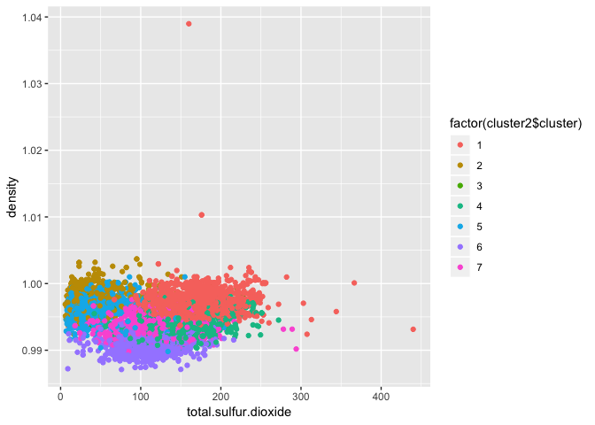
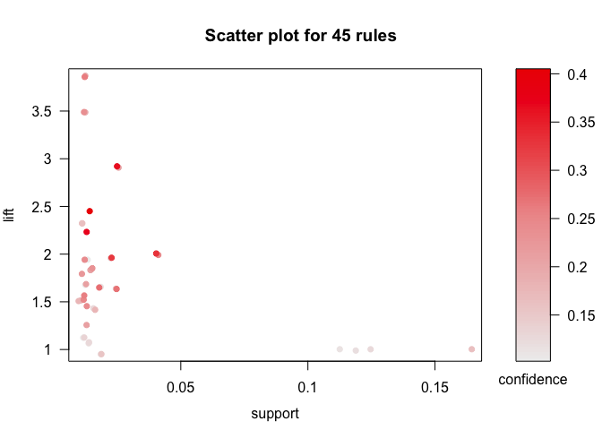
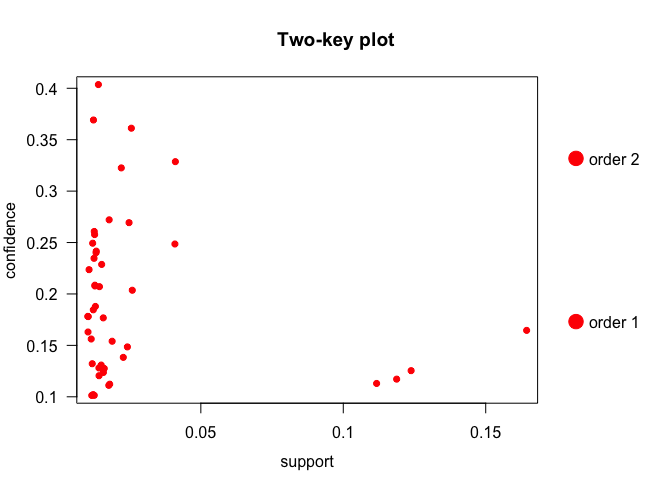
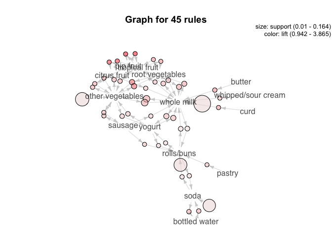

Exercise 4
================

By Hana Krijestorac, David Garrett, and Elliot Chau

# Problem 1

## Clustering and PCA of Wine

### Determining the color of the wine

*Principal component analysis*

We first approach this problem utilizing principal component analysis.
After scaling and centering the data, we arrive at 11 componenets with
the following characteristics.

    ## Importance of components:
    ##                           PC1    PC2    PC3     PC4     PC5     PC6
    ## Standard deviation     1.7407 1.5792 1.2475 0.98517 0.84845 0.77930
    ## Proportion of Variance 0.2754 0.2267 0.1415 0.08823 0.06544 0.05521
    ## Cumulative Proportion  0.2754 0.5021 0.6436 0.73187 0.79732 0.85253
    ##                            PC7     PC8     PC9   PC10    PC11
    ## Standard deviation     0.72330 0.70817 0.58054 0.4772 0.18119
    ## Proportion of Variance 0.04756 0.04559 0.03064 0.0207 0.00298
    ## Cumulative Proportion  0.90009 0.94568 0.97632 0.9970 1.00000

To illustrate this information, we use a biplot to plot each individual
wine (identified by a unique number). The vectors indicate the direction
of each chemical characteristic.

<!-- -->

Since the prior plot is somewhat difficult to interpret, we will remove
the vectors and replace wine identification numbers with dots.

<!-- -->

We can see two distinct groups which may indicate differences as a
result of the wine’s color.

<!-- -->

Indeed, when applying “supervised” information to add color, the plot is
separated into two groups based on color.

To further analyze the data, we create a correlation matrix of how
chemical characteristics relate to each other. This may allow us to test
various relationships in the next part.

<!-- -->

    ## $r
    ##                      free.sulfur.dioxide total.sulfur.dioxide
    ## free.sulfur.dioxide                    1                     
    ## total.sulfur.dioxide                0.72                    1
    ## residual.sugar                       0.4                  0.5
    ## density                            0.026                0.032
    ## chlorides                           -0.2                -0.28
    ## sulphates                          -0.19                -0.28
    ## volatile.acidity                   -0.35                -0.41
    ## pH                                 -0.15                -0.24
    ## alcohol                            -0.18                -0.27
    ## fixed.acidity                      -0.28                -0.33
    ## citric.acid                         0.13                  0.2
    ##                      residual.sugar density chlorides sulphates
    ## free.sulfur.dioxide                                            
    ## total.sulfur.dioxide                                           
    ## residual.sugar                    1                            
    ## density                        0.55       1                    
    ## chlorides                     -0.13    0.36         1          
    ## sulphates                     -0.19    0.26       0.4         1
    ## volatile.acidity               -0.2    0.27      0.38      0.23
    ## pH                            -0.27   0.012     0.045      0.19
    ## alcohol                       -0.36   -0.69     -0.26    -0.003
    ## fixed.acidity                 -0.11    0.46       0.3       0.3
    ## citric.acid                    0.14   0.096     0.039     0.056
    ##                      volatile.acidity    pH alcohol fixed.acidity
    ## free.sulfur.dioxide                                              
    ## total.sulfur.dioxide                                             
    ## residual.sugar                                                   
    ## density                                                          
    ## chlorides                                                        
    ## sulphates                                                        
    ## volatile.acidity                    1                            
    ## pH                               0.26     1                      
    ## alcohol                        -0.038  0.12       1              
    ## fixed.acidity                    0.22 -0.25  -0.095             1
    ## citric.acid                     -0.38 -0.33   -0.01          0.32
    ##                      citric.acid
    ## free.sulfur.dioxide             
    ## total.sulfur.dioxide            
    ## residual.sugar                  
    ## density                         
    ## chlorides                       
    ## sulphates                       
    ## volatile.acidity                
    ## pH                              
    ## alcohol                         
    ## fixed.acidity                   
    ## citric.acid                    1
    ## 
    ## $p
    ##                      free.sulfur.dioxide total.sulfur.dioxide
    ## free.sulfur.dioxide                    0                     
    ## total.sulfur.dioxide                   0                    0
    ## residual.sugar                  4.1e-252                    0
    ## density                            0.038                0.009
    ## chlorides                          1e-56             5.2e-117
    ## sulphates                        5.2e-53             1.1e-113
    ## volatile.acidity                1.8e-189             3.5e-268
    ## pH                               3.2e-32              1.2e-84
    ## alcohol                          2.3e-48             1.9e-105
    ## fixed.acidity                   1.1e-119             7.1e-164
    ## citric.acid                      4.4e-27              7.8e-57
    ##                      residual.sugar  density chlorides sulphates
    ## free.sulfur.dioxide                                             
    ## total.sulfur.dioxide                                            
    ## residual.sugar                    0                             
    ## density                           0        0                    
    ## chlorides                   1.7e-25 4.1e-201         0          
    ## sulphates                   1.3e-51 1.9e-100  2.3e-242         0
    ## volatile.acidity            2.8e-57 5.5e-110  1.1e-218   5.1e-76
    ## pH                           1e-106     0.35   0.00031   4.6e-55
    ## alcohol                    2.3e-197        0   1.9e-98      0.81
    ## fixed.acidity               1.4e-19        0  1.5e-133  8.1e-135
    ## citric.acid                 8.4e-31    8e-15    0.0017   5.8e-06
    ##                      volatile.acidity       pH alcohol fixed.acidity
    ## free.sulfur.dioxide                                                 
    ## total.sulfur.dioxide                                                
    ## residual.sugar                                                      
    ## density                                                             
    ## chlorides                                                           
    ## sulphates                                                           
    ## volatile.acidity                    0                               
    ## pH                           5.2e-102        0                      
    ## alcohol                        0.0024    1e-22       0              
    ## fixed.acidity                 2.1e-71  3.3e-95 1.3e-14             0
    ## citric.acid                  9.7e-220 1.2e-164     0.4      4.2e-159
    ##                      citric.acid
    ## free.sulfur.dioxide             
    ## total.sulfur.dioxide            
    ## residual.sugar                  
    ## density                         
    ## chlorides                       
    ## sulphates                       
    ## volatile.acidity                
    ## pH                              
    ## alcohol                         
    ## fixed.acidity                   
    ## citric.acid                    0
    ## 
    ## $sym
    ##                      free.sulfur.dioxide total.sulfur.dioxide
    ## free.sulfur.dioxide  1                                       
    ## total.sulfur.dioxide ,                   1                   
    ## residual.sugar       .                   .                   
    ## density                                                      
    ## chlorides                                                    
    ## sulphates                                                    
    ## volatile.acidity     .                   .                   
    ## pH                                                           
    ## alcohol                                                      
    ## fixed.acidity                            .                   
    ## citric.acid                                                  
    ##                      residual.sugar density chlorides sulphates
    ## free.sulfur.dioxide                                            
    ## total.sulfur.dioxide                                           
    ## residual.sugar       1                                         
    ## density              .              1                          
    ## chlorides                           .       1                  
    ## sulphates                                   .         1        
    ## volatile.acidity                            .                  
    ## pH                                                             
    ## alcohol              .              ,                          
    ## fixed.acidity                       .                          
    ## citric.acid                                                    
    ##                      volatile.acidity pH alcohol fixed.acidity citric.acid
    ## free.sulfur.dioxide                                                       
    ## total.sulfur.dioxide                                                      
    ## residual.sugar                                                            
    ## density                                                                   
    ## chlorides                                                                 
    ## sulphates                                                                 
    ## volatile.acidity     1                                                    
    ## pH                                    1                                   
    ## alcohol                                  1                                
    ## fixed.acidity                                    1                        
    ## citric.acid          .                .          .             1          
    ## attr(,"legend")
    ## [1] 0 ' ' 0.3 '.' 0.6 ',' 0.8 '+' 0.9 '*' 0.95 'B' 1

*k-means clustering*

We then run k-means clustering. The summary characteristics for the two
clusters is as follows:

    ##        fixed.acidity     volatile.acidity          citric.acid 
    ##           6.85167903           0.27458385           0.33524928 
    ##       residual.sugar            chlorides  free.sulfur.dioxide 
    ##           6.39402555           0.04510424          35.52152864 
    ## total.sulfur.dioxide              density                   pH 
    ##         138.45848785           0.99400486           3.18762464 
    ##            sulphates              alcohol 
    ##           0.48880511          10.52235888

    ##        fixed.acidity     volatile.acidity          citric.acid 
    ##            8.2895922            0.5319416            0.2695435 
    ##       residual.sugar            chlorides  free.sulfur.dioxide 
    ##            2.6342666            0.0883238           15.7647596 
    ## total.sulfur.dioxide              density                   pH 
    ##           48.6396835            0.9967404            3.3097200 
    ##            sulphates              alcohol 
    ##            0.6567194           10.4015216

Based on this information, we are able to see differences between the
two clusters. The second cluster has notably higher acidity levels,
lower sulfur levels, and less sugar. The following is an assortment of
plots separated by wine
color.

<!-- --><!-- --><!-- --><!-- --><!-- -->

We then determine the accuracy of k-means clustering. As we can see, it
seems to do an excellent job in clustering wines by their color.

    ##                 wine$color
    ## cluster1$cluster  red white
    ##                1   24  4830
    ##                2 1575    68

Based on the granularity of analysis available with k-means clustering,
we believe it is the technique that makes more sense. We are able to
compute accuracy with the use of supervised information, and we are also
able to break down comparisons by chemical component.

### Wine quality

We begin by taking a look at the summary statistics for the wine quality
column.

    ##    Min. 1st Qu.  Median    Mean 3rd Qu.    Max. 
    ##   3.000   5.000   6.000   5.818   6.000   9.000

As we can see, the category ranges from a low of 3 and a high of 9. This
means there are a total of 7 ratings.

*Principal component analysis*

We start with principal component analysis. The following plot shows a
general ability to create 7 somewhat distinct groups.

<!-- -->

However, when utilizing the supervised information to check our work,
the groups were not grouped by the quality score. Therefore, PCA is not
a technique that can complete this task.

<!-- -->

*k-means clustering*

We then move on to k-means clustering. Clustering by 7 score categories,
the following is a variety of
plots.

<!-- --><!-- --><!-- --><!-- -->

The visual evidence suggests that all the overlapping colors is not so
useful in clustering by score. Let’s take a look at the raw numbers.

    ##                 wine$quality
    ## cluster2$cluster   3   4   5   6   7   8   9
    ##                1   7  24 655 640 122  22   0
    ##                2   4  15 200 265 141  14   0
    ##                3   1   2  20   9   1   0   0
    ##                4   2  27 269 475 189  31   0
    ##                5   7  63 471 350  43   2   0
    ##                6   4  21  77 548 446  97   4
    ##                7   5  64 446 549 137  27   1

The table shows that each of the 7 clusters basically has a random
distribution of wines. The k-means technique is also not able to
determine wine quality. This is more than likely the result of
subjective scores assigned to each wine, with each wine snob assigning
different value to certain notes, flavors, and aromas.

# Problem 2

## Market segmentation

In order to determine what market segments that NutrientH20 should focus
on, we began by dropping all of the users that have been marked with
spam and then dropping the spam column altogether.

Next, we found which users had more than 25% of their tweets relates to
adult content so that any potential pornography bots that the original
human annotators of the data may not have captured and deleted.

    ## # A tibble: 8 x 3
    ## # Groups:   adult [4]
    ##   X         adult percent
    ##   <fct>     <int>   <dbl>
    ## 1 qbiy4shrl    21   100  
    ## 2 8prc7gshu    16    50  
    ## 3 sbo8lrgy2    16    50  
    ## 4 28ivdunry    15    50  
    ## 5 hze4j5pc3    15    50  
    ## 6 2l5m64iro    13    33.3
    ## 7 3b7h6lpqm    13    33.3
    ## 8 x7tevn5ym    13    33.3

The following a correlation plot of how each group relates to another.

<!-- -->

Due to the multiple dimensions amongst tweets from their followers, we
used principal component analysis to reduce the dimensionality of the
data. The following is the distribution of our cleaned data.

<!-- -->

We continue with principal component analysis.

<!-- -->

The following is table about each principal component and a matrix of
how they relate to each other.

    ## Importance of components:
    ##                           PC1     PC2     PC3     PC4     PC5     PC6
    ## Standard deviation     2.0430 1.65792 1.58023 1.52917 1.47728 1.37202
    ## Proportion of Variance 0.1228 0.08084 0.07344 0.06878 0.06419 0.05537
    ## Cumulative Proportion  0.1228 0.20361 0.27705 0.34582 0.41001 0.46538
    ##                            PC7     PC8     PC9    PC10    PC11    PC12
    ## Standard deviation     1.28469 1.18800 1.06631 1.01810 1.00620 0.96947
    ## Proportion of Variance 0.04854 0.04151 0.03344 0.03049 0.02978 0.02764
    ## Cumulative Proportion  0.51392 0.55543 0.58887 0.61936 0.64914 0.67678
    ##                           PC13    PC14    PC15    PC16    PC17    PC18
    ## Standard deviation     0.95749 0.94416 0.92652 0.91414 0.89685 0.84710
    ## Proportion of Variance 0.02696 0.02622 0.02525 0.02458 0.02366 0.02111
    ## Cumulative Proportion  0.70374 0.72996 0.75521 0.77979 0.80345 0.82455
    ##                           PC19    PC20    PC21    PC22    PC23    PC24
    ## Standard deviation     0.80194 0.75310 0.69105 0.68088 0.64877 0.64360
    ## Proportion of Variance 0.01891 0.01668 0.01405 0.01364 0.01238 0.01218
    ## Cumulative Proportion  0.84347 0.86015 0.87419 0.88783 0.90021 0.91239
    ##                           PC25    PC26    PC27    PC28    PC29    PC30
    ## Standard deviation     0.63677 0.61596 0.60061 0.59491 0.58675 0.55238
    ## Proportion of Variance 0.01193 0.01116 0.01061 0.01041 0.01013 0.00897
    ## Cumulative Proportion  0.92432 0.93547 0.94608 0.95649 0.96662 0.97559
    ##                           PC31    PC32    PC33    PC34
    ## Standard deviation     0.48386 0.47589 0.43768 0.42149
    ## Proportion of Variance 0.00689 0.00666 0.00563 0.00523
    ## Cumulative Proportion  0.98248 0.98914 0.99477 1.00000

<!-- -->

<!-- -->

We then used hierarchical clustering on these principal components to
find correlational clusters amongst their followers tweets in order to
segment the market into different groups.

<!-- -->

In doing so we found six main marketing groups based on correlated
interests. We believe that by focusing their attention on these six
groups, NutrientH20 can direct their content in order to relate to these
subgroups to further their sales.

# Problem 3

## Association rules for grocery purchases

We first start by finding a summary of grocery statistics. We see that
“whole milk” and “other vegetables” top the list of transactions.

    ## transactions as itemMatrix in sparse format with
    ##  15296 rows (elements/itemsets/transactions) and
    ##  169 columns (items) and a density of 0.01677625 
    ## 
    ## most frequent items:
    ##       whole milk other vegetables       rolls/buns             soda 
    ##             2513             1903             1809             1715 
    ##           yogurt          (Other) 
    ##             1372            34055 
    ## 
    ## element (itemset/transaction) length distribution:
    ## sizes
    ##    1    2    3    4 
    ## 3485 2630 2102 7079 
    ## 
    ##    Min. 1st Qu.  Median    Mean 3rd Qu.    Max. 
    ##   1.000   2.000   3.000   2.835   4.000   4.000 
    ## 
    ## includes extended item information - examples:
    ##             labels
    ## 1 abrasive cleaner
    ## 2 artif. sweetener
    ## 3   baby cosmetics
    ## 
    ## includes extended transaction information - examples:
    ##   transactionID
    ## 1             1
    ## 2             2
    ## 3             3

We computed 45 association rules. We will narrow down the rules into
relevant subsets based on confidence, lift, and support later.

    ## Apriori
    ## 
    ## Parameter specification:
    ##  confidence minval smax arem  aval originalSupport maxtime support minlen
    ##         0.1    0.1    1 none FALSE            TRUE       5    0.01      1
    ##  maxlen target   ext
    ##       5  rules FALSE
    ## 
    ## Algorithmic control:
    ##  filter tree heap memopt load sort verbose
    ##     0.1 TRUE TRUE  FALSE TRUE    2    TRUE
    ## 
    ## Absolute minimum support count: 152 
    ## 
    ## set item appearances ...[0 item(s)] done [0.00s].
    ## set transactions ...[169 item(s), 15296 transaction(s)] done [0.03s].
    ## sorting and recoding items ... [71 item(s)] done [0.00s].
    ## creating transaction tree ... done [0.01s].
    ## checking subsets of size 1 2 3 done [0.00s].
    ## writing ... [45 rule(s)] done [0.00s].
    ## creating S4 object  ... done [0.01s].

    ##      lhs                     rhs                support    confidence
    ## [1]  {}                   => {soda}             0.11212082 0.1121208 
    ## [2]  {}                   => {rolls/buns}       0.11826621 0.1182662 
    ## [3]  {}                   => {other vegetables} 0.12441161 0.1244116 
    ## [4]  {}                   => {whole milk}       0.16429132 0.1642913 
    ## [5]  {curd}               => {whole milk}       0.01261768 0.3683206 
    ## [6]  {butter}             => {whole milk}       0.01438285 0.4036697 
    ## [7]  {whipped/sour cream} => {whole milk}       0.01144090 0.2482270 
    ## [8]  {pip fruit}          => {tropical fruit}   0.01268305 0.2607527 
    ## [9]  {tropical fruit}     => {pip fruit}        0.01268305 0.1879845 
    ## [10] {pip fruit}          => {other vegetables} 0.01091789 0.2244624 
    ## [11] {pip fruit}          => {whole milk}       0.01255230 0.2580645 
    ## [12] {pastry}             => {rolls/buns}       0.01019874 0.1782857 
    ## [13] {citrus fruit}       => {tropical fruit}   0.01248692 0.2346437 
    ## [14] {tropical fruit}     => {citrus fruit}     0.01248692 0.1850775 
    ## [15] {citrus fruit}       => {other vegetables} 0.01281381 0.2407862 
    ## [16] {other vegetables}   => {citrus fruit}     0.01281381 0.1029953 
    ## [17] {citrus fruit}       => {whole milk}       0.01281381 0.2407862 
    ## [18] {sausage}            => {rolls/buns}       0.01078713 0.1785714 
    ## [19] {sausage}            => {other vegetables} 0.01261768 0.2088745 
    ## [20] {other vegetables}   => {sausage}          0.01261768 0.1014188 
    ## [21] {sausage}            => {whole milk}       0.01255230 0.2077922 
    ## [22] {bottled water}      => {soda}             0.01464435 0.2060718 
    ## [23] {soda}               => {bottled water}    0.01464435 0.1306122 
    ## [24] {tropical fruit}     => {root vegetables}  0.01098326 0.1627907 
    ## [25] {root vegetables}    => {tropical fruit}   0.01098326 0.1567164 
    ## [26] {tropical fruit}     => {other vegetables} 0.01549425 0.2296512 
    ## [27] {other vegetables}   => {tropical fruit}   0.01549425 0.1245402 
    ## [28] {tropical fruit}     => {whole milk}       0.01830544 0.2713178 
    ## [29] {whole milk}         => {tropical fruit}   0.01830544 0.1114206 
    ## [30] {root vegetables}    => {other vegetables} 0.02536611 0.3619403 
    ## [31] {other vegetables}   => {root vegetables}  0.02536611 0.2038886 
    ## [32] {root vegetables}    => {whole milk}       0.02262029 0.3227612 
    ## [33] {whole milk}         => {root vegetables}  0.02262029 0.1376840 
    ## [34] {yogurt}             => {rolls/buns}       0.01189854 0.1326531 
    ## [35] {rolls/buns}         => {yogurt}           0.01189854 0.1006081 
    ## [36] {yogurt}             => {other vegetables} 0.01588651 0.1771137 
    ## [37] {other vegetables}   => {yogurt}           0.01588651 0.1276931 
    ## [38] {yogurt}             => {whole milk}       0.02425471 0.2704082 
    ## [39] {whole milk}         => {yogurt}           0.02425471 0.1476323 
    ## [40] {soda}               => {rolls/buns}       0.01425209 0.1271137 
    ## [41] {rolls/buns}         => {soda}             0.01425209 0.1205086 
    ## [42] {rolls/buns}         => {whole milk}       0.01830544 0.1547816 
    ## [43] {whole milk}         => {rolls/buns}       0.01830544 0.1114206 
    ## [44] {other vegetables}   => {whole milk}       0.04086036 0.3284288 
    ## [45] {whole milk}         => {other vegetables} 0.04086036 0.2487067 
    ##      lift     count
    ## [1]  1.000000 1715 
    ## [2]  1.000000 1809 
    ## [3]  1.000000 1903 
    ## [4]  1.000000 2513 
    ## [5]  2.241875  193 
    ## [6]  2.457036  220 
    ## [7]  1.510895  175 
    ## [8]  3.864800  194 
    ## [9]  3.864800  194 
    ## [10] 1.804191  167 
    ## [11] 1.570774  192 
    ## [12] 1.507495  156 
    ## [13] 3.477820  191 
    ## [14] 3.477820  191 
    ## [15] 1.935400  196 
    ## [16] 1.935400  196 
    ## [17] 1.465605  196 
    ## [18] 1.509911  165 
    ## [19] 1.678898  193 
    ## [20] 1.678898  193 
    ## [21] 1.264779  192 
    ## [22] 1.837944  224 
    ## [23] 1.837944  224 
    ## [24] 2.322805  168 
    ## [25] 2.322805  168 
    ## [26] 1.845898  237 
    ## [27] 1.845898  237 
    ## [28] 1.651444  280 
    ## [29] 1.651444  280 
    ## [30] 2.909216  388 
    ## [31] 2.909216  388 
    ## [32] 1.964566  346 
    ## [33] 1.964566  346 
    ## [34] 1.121648  182 
    ## [35] 1.121648  182 
    ## [36] 1.423611  243 
    ## [37] 1.423611  243 
    ## [38] 1.645907  371 
    ## [39] 1.645907  371 
    ## [40] 1.074810  218 
    ## [41] 1.074810  218 
    ## [42] 0.942117  280 
    ## [43] 0.942117  280 
    ## [44] 1.999064  625 
    ## [45] 1.999064  625

The level of confidence was chosen based on interpretability since it
was difficult to find any rules for confidence greater than 4.
Confidence measures how often items in itemset Y appear in transactions
which contain itemset X. Some rules that were identified through this
method was associations like curd and whole milk (perhaps for dairy
lovers?), and both root vegetables and other vegetables and whole milk.
This could be useful to know in a retail context i.e. where and when to
give promotions or ideas for product placement for milk given that you
already are in the vegetable section. This is also reflected in the plot
of association rules where “whole milk” and “other vegetables” are the
two largest clusters.

This is the subset for confidence \>
    0.3.

    ##     lhs                   rhs                support    confidence
    ## [1] {curd}             => {whole milk}       0.01261768 0.3683206 
    ## [2] {butter}           => {whole milk}       0.01438285 0.4036697 
    ## [3] {root vegetables}  => {other vegetables} 0.02536611 0.3619403 
    ## [4] {root vegetables}  => {whole milk}       0.02262029 0.3227612 
    ## [5] {other vegetables} => {whole milk}       0.04086036 0.3284288 
    ##     lift     count
    ## [1] 2.241875 193  
    ## [2] 2.457036 220  
    ## [3] 2.909216 388  
    ## [4] 1.964566 346  
    ## [5] 1.999064 625

Support measures the frequency of an itemset within transactions. The
choice of a low level of support was driven by the fact that there
weren’t too many different grocery items within the dataset. Again, a
strong association between “whole milk” and “other vegetables,” perhaps
since these are generally staple items.

This is the subset for support \>
    0.035.

    ##     lhs                   rhs                support    confidence
    ## [1] {}                 => {soda}             0.11212082 0.1121208 
    ## [2] {}                 => {rolls/buns}       0.11826621 0.1182662 
    ## [3] {}                 => {other vegetables} 0.12441161 0.1244116 
    ## [4] {}                 => {whole milk}       0.16429132 0.1642913 
    ## [5] {other vegetables} => {whole milk}       0.04086036 0.3284288 
    ## [6] {whole milk}       => {other vegetables} 0.04086036 0.2487067 
    ##     lift     count
    ## [1] 1.000000 1715 
    ## [2] 1.000000 1809 
    ## [3] 1.000000 1903 
    ## [4] 1.000000 2513 
    ## [5] 1.999064  625 
    ## [6] 1.999064  625

When looking at lift, the rules that were generated were generally
intuitive. For example, if a consumer buys root vegetables, he or she is
likely to also purchase “other vegetables,” or has a conditional
probability of 2.909. Another intuitive rule that was generated was that
the conditional probability of purchasing citrus fruit given that you
already bought tropical fruit was 3.477. This make sense considering
that grocery stores tend to group these items together and offer
promotions for similar items. Again, this is reflected in the overall
plot of the 45 association rules where different types of fruits are
grouped together in the top right corner. Lift might be the most
informative measure since it measures the conditional probability of
purchasing itemset X given that you already purchased itemset Y and
therefore takes into account statistical dependence, whereas confidence
and support do not.

This is the subset for lift \>
    2.

    ##      lhs                   rhs                support    confidence
    ## [1]  {curd}             => {whole milk}       0.01261768 0.3683206 
    ## [2]  {butter}           => {whole milk}       0.01438285 0.4036697 
    ## [3]  {pip fruit}        => {tropical fruit}   0.01268305 0.2607527 
    ## [4]  {tropical fruit}   => {pip fruit}        0.01268305 0.1879845 
    ## [5]  {citrus fruit}     => {tropical fruit}   0.01248692 0.2346437 
    ## [6]  {tropical fruit}   => {citrus fruit}     0.01248692 0.1850775 
    ## [7]  {tropical fruit}   => {root vegetables}  0.01098326 0.1627907 
    ## [8]  {root vegetables}  => {tropical fruit}   0.01098326 0.1567164 
    ## [9]  {root vegetables}  => {other vegetables} 0.02536611 0.3619403 
    ## [10] {other vegetables} => {root vegetables}  0.02536611 0.2038886 
    ##      lift     count
    ## [1]  2.241875 193  
    ## [2]  2.457036 220  
    ## [3]  3.864800 194  
    ## [4]  3.864800 194  
    ## [5]  3.477820 191  
    ## [6]  3.477820 191  
    ## [7]  2.322805 168  
    ## [8]  2.322805 168  
    ## [9]  2.909216 388  
    ## [10] 2.909216 388

We then created a subset to only include a lift measure of greater than
2, a confidence measure greater than 0.3, and a subset with support
greater than 0.035. We combine these three measures to create a scatterplot and a two-key
plot.

<!-- -->

<!-- -->

We then find the following 10 “best”
    associations.

    ##      lhs                   rhs                support    confidence
    ## [1]  {curd}             => {whole milk}       0.01261768 0.3683206 
    ## [2]  {butter}           => {whole milk}       0.01438285 0.4036697 
    ## [3]  {pip fruit}        => {tropical fruit}   0.01268305 0.2607527 
    ## [4]  {tropical fruit}   => {pip fruit}        0.01268305 0.1879845 
    ## [5]  {citrus fruit}     => {tropical fruit}   0.01248692 0.2346437 
    ## [6]  {tropical fruit}   => {citrus fruit}     0.01248692 0.1850775 
    ## [7]  {tropical fruit}   => {root vegetables}  0.01098326 0.1627907 
    ## [8]  {root vegetables}  => {tropical fruit}   0.01098326 0.1567164 
    ## [9]  {root vegetables}  => {other vegetables} 0.02536611 0.3619403 
    ## [10] {other vegetables} => {root vegetables}  0.02536611 0.2038886 
    ##      lift     count
    ## [1]  2.241875 193  
    ## [2]  2.457036 220  
    ## [3]  3.864800 194  
    ## [4]  3.864800 194  
    ## [5]  3.477820 191  
    ## [6]  3.477820 191  
    ## [7]  2.322805 168  
    ## [8]  2.322805 168  
    ## [9]  2.909216 388  
    ## [10] 2.909216 388

    ## set of 45 rules
    ## 
    ## rule length distribution (lhs + rhs):sizes
    ##  1  2 
    ##  4 41 
    ## 
    ##    Min. 1st Qu.  Median    Mean 3rd Qu.    Max. 
    ##   1.000   2.000   2.000   1.911   2.000   2.000 
    ## 
    ## summary of quality measures:
    ##     support          confidence          lift            count     
    ##  Min.   :0.01020   Min.   :0.1006   Min.   :0.9421   Min.   : 156  
    ##  1st Qu.:0.01255   1st Qu.:0.1277   1st Qu.:1.4236   1st Qu.: 192  
    ##  Median :0.01438   Median :0.1786   Median :1.6789   Median : 220  
    ##  Mean   :0.02654   Mean   :0.1959   Mean   :1.8383   Mean   : 406  
    ##  3rd Qu.:0.02262   3rd Qu.:0.2408   3rd Qu.:1.9991   3rd Qu.: 346  
    ##  Max.   :0.16429   Max.   :0.4037   Max.   :3.8648   Max.   :2513  
    ## 
    ## mining info:
    ##         data ntransactions support confidence
    ##  grocertrans         15296    0.01        0.1

We visualize these associations through a network graph. The larger the
label, the more frequent the transaction. “Whole milk,” “other
vegetables,” “root vegetables,” and “soda” seem to tie together most
transctions.

<!-- -->
